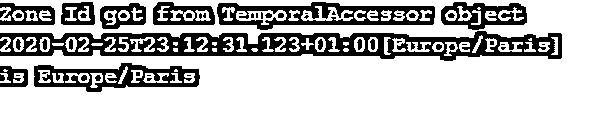
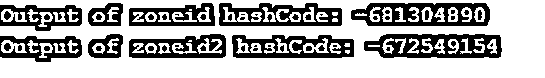

# Java ZoneId

> 原文：<https://www.educba.com/java-zoneid/>


## Java ZoneId 简介

ZoneId 是 Java 中的一个类。时间包，引入它是为了指定在 Instant 和 LocalDateTime 之间进行转换所需的规则。此类是 ZoneOffset 类的子类，也是可序列化的，因为它实现了一个可序列化的接口。该类使用一种特殊的格式，仅用于存储与 UTC/Greenwich 的偏移量。作为一个基于值的类，使用对标识敏感的操作可能会导致不可预知的结果。此类表示大多数固定偏移量 id，这些 id 对所有本地日期时间使用相同的偏移量。

### Java ZoneId 的语法

以下是 java zoneid 的语法:

<small>网页开发、编程语言、软件测试&其他</small>

**语法:**

```
public abstract class ZoneId
extends Object
implements Serializable
```

**字段:**公共静态最终映射<字符串，String>SHORT _ IDS——这是一个不可修改的映射，由符合 TZDB 2005r 及以后版本的 id 映射组成。

这张地图如下:

*   **东:** -05:00
*   **HST:** -10:00
*   MST: -07:00
*   **幕:**澳大利亚/达尔文
*   AET: 澳洲/悉尼
*   AGT: 美洲/阿根廷/布宜诺斯艾利斯
*   **艺术:**非洲/开罗
*   美洲/安克雷奇
*   **赌注:**美洲/圣保罗
*   **英国夏令时:**亚洲/达卡
*   **猫:**非洲/哈拉雷
*   美国/圣约翰
*   美国中部时间:美洲/芝加哥
*   亚洲/上海
*   **吃:**非洲/亚的斯亚贝巴
*   欧洲/巴黎
*   **IET:** 美洲/印第安纳/印第安纳波利斯
*   **是:**亚洲/加尔各答
*   **JST:** 亚洲/东京
*   麻省理工学院:太平洋/阿皮亚
*   **NET:** 亚洲/埃里温
*   **NST:** 太平洋/奥克兰
*   **PLT:** 亚洲/卡拉奇
*   PNT: 美洲/凤凰城
*   PRT: 美洲/波多黎各
*   **太平洋标准时间:**美洲/洛杉矶
*   太平洋/瓜达尔卡纳尔
*   VST: 亚洲/胡志明市

### Java ZoneId 的方法

下面给出了 java zoneid 的方法:

#### 1.公共静态区域标识系统默认()

该函数用于获取系统默认时区。这将调用 TimeZone.getDefault()函数来检索该系统的默认时区的值，这意味着对系统默认时区的任何更新都将反映在结果中。输出被转换为 ZoneID 格式。必须处理此函数引发的以下两个异常:-

*   **DateTimeException:** 这表示转换后的区域 ID 的格式无效
*   **ZoneRulesException:** 这表示找不到转换后的 zone 区域 ID

**代码:**

```
import java.time.ZoneId;
public class Main {
public static void main(String[] args) {
ZoneId zone = ZoneId.systemDefault();
System.out.println("Output of systemDefault()-" +zone);
}
}
```

**输出:**


#### 2.公共静态集 <string>getAvailableZoneIds()</string>

该函数用于返回所有可用的基于区域的 id。列表作为一组字符串返回。可以使用 Of(String)函数将返回的字符串转换为 Zone-Id 的格式。offset-id 不包括在一组字符串的结果中。

**代码:**

```
import java.time.ZoneId;
import java.util.*;
public class Main {
public static void main(String[] args) {
Set<String> zoneIds = ZoneId.getAvailableZoneIds();
List<String> zoneList = new ArrayList<String>(zoneIds);
Collections.sort(zoneList);
for (int i = 0; i < 5; i++) {
System.out.println("ZoneId in list:" +zoneList.get(i) );
}
}
}
```

**输出:**


#### 3.的公共静态 zoneId(字符串 ZoneId)

该函数返回作为字符串传递给函数的有效 ID 的 ZoneID 或 ZoneOffset。根据字符串的起始字符返回 ZoneOffset(如果是' Z '或'+'或'-')。返回的 ZoneID 总是遵循 ZoneRules。这种转换使用完整的解析算法进行。如果参数的格式无效，则抛出 DateTimeException，如果找不到区域 id，则抛出 ZoneRulesException。

**代码:**

```
import java.time.*;
import java.util.*;
import java.time.format.TextStyle;
public class Main {
public static void main(String[] args) {
ZoneId zoneId  = ZoneId.of("Asia/Calcutta");
System.out.println("Output of zoneid obtained using of function: "+ zoneId.normalized());
}
}
```

**输出:**


#### 4.Offset 的公共静态 ZoneId(字符串前缀，ZoneOffset 偏移量)

当前缀和偏移量作为参数传递时，此方法用于获取 ZoneID。返回带有前缀和非零偏移 ID 的区域 ID。在这种情况下，前缀是“ZoneOffset”。

前缀必须是“GMT”、“UTC”或“UT”或“”，否则，该方法将引发 IllegalArgumentException。

**代码:**

```
import java.time.*;
import java.util.*;
public class Main {
public static void main(String[] args) {
ZoneId zoneId = ZoneId.ofOffset("GMT", ZoneOffset.MAX);
System.out.println("OfOffset on ZoneId: " + zoneId);
}
}
```

**输出:**


#### 5.公共静态 ZoneId from(temporal accessor temporal)

此方法用于将一组任意日期和时间的 TemporalAccessor 对象转换为 ZoneId 的实例。此函数的工作方式与 TemporalQueries.zone()相似，后者提取偏移量基本区域 id。因此，该方法匹配通过 ZoneId::from()函数使用的时态查询的签名。

**代码:**

```
import java.time.*;
import java.util.*;
public class Main {
public static void main(String[] args) {
ZonedDateTime zoneddatetime
= ZonedDateTime.parse("2020-02-25T23:12:31.123+02:00[Europe/Paris]");
ZoneId result = ZoneId.from(zoneddatetime);
System.out.println("Zone Id got from "+ "TemporalAccessor object \n"
+ zoneddatetime + "\nis " + result);
}
}
```

**输出:**




#### 6.公共抽象字符串 getId()

该函数用于获取特定对象的唯一时区 ID。基于偏移量的 ID 的格式由 Timezone 类中的 getId()方法定义。作为输出给出的 ID 有助于唯一地定义对象。

**代码:**

```
import java.time.*;
import java.util.*;
public class Main {
public static void main(String[] args) {
ZoneId zoneId  = ZoneId.of("Asia/Calcutta");
System.out.println("Id using getID(): "+ zoneId.getId());
}
}
```

**输出:**


#### 7.公共字符串 getDisplayName(TextStyle 样式，区域设置)

此方法有助于提供区域的文本表示。所需的样式以及所需输出的区域设置作为参数给出。因此，时区 id 的适当文本表示作为输出给出。在没有文本表示的情况下，完整的 ID 作为输出返回。

**代码:**

```
import java.time.*;
import java.util.*;
import java.time.format.TextStyle;
public class Main {
public static void main(String[] args) {
ZoneId zoneId  = ZoneId.of("Asia/Calcutta");
String result = zoneId.getDisplayName(TextStyle.SHORT, Locale.ENGLISH);
System.out.println("Name of ID using getDisplayName(): "+ result);
}
}
```

**输出:**


#### 8.公共抽象区域规则 getRules()

该函数用于检索应用于给定 ID 的规则。这些规则给出了要执行的计算以及与时区相关联的功能的概念，例如查找某一瞬间的偏移量。ZoneRulesProvider 提供了这些规则。高级提供者也可以对这些规则进行动态更新，但是在这种情况下，结果可能会随时间而改变。如果没有可用的规则或者 JRE 的规则与 time-zone 的规则不同，调用此函数可能会导致 ZoneRulesException。

**代码:**

```
import java.time.*;
import java.util.*;
import java.time.format.TextStyle;
public class Main {
public static void main(String[] args) {
ZoneId zoneId  = ZoneId.of("Asia/Calcutta");
System.out.println("Rules are: "+ zoneId.getRules());
}
}
```

**输出:**


#### 9.公共 ZoneId 已规范化()

该方法用于检查给定的 zoneID 是否包含固定偏移量，如果是，则返回等于该固定偏移量的 ZOneOffset 否则，将返回。返回的 ID 也将具有类似于给定偏移量的 ZoneRules，但是我们从 getId()函数得到的结果与这里得到的不同。

**代码:**

```
import java.time.*;
import java.util.*;
import java.time.format.TextStyle;
public class Main {
public static void main(String[] args) {
ZoneId zoneId  = ZoneId.of("Asia/Calcutta");
System.out.println("Normalized Id: "+ zoneId.normalized());
}
}
```

**输出:**


#### 10.公共布尔等于(对象对象)

此方法有助于比较两个不同时间的 ZoneId 对象。此方法覆盖 Object 类中的 equals 方法，该方法用于比较存储在两个对象中的值。类似地，这里比较这些 ZoneID 的值，以查看两个对象是否相等。并相应地返回 true 和 false。

**代码:**

```
import java.time.*;
import java.util.*;
import java.time.format.TextStyle;
public class Main {
public static void main(String[] args) {
ZoneId zoneId  = ZoneId.of("Asia/Calcutta");
ZoneId zoneId2 = ZoneId.of("Europe/Paris");
System.out.println("Output of Equals: "+ zoneId.equals(zoneId2));
}
}
```

**输出:**


#### 11.public int hashCode()

这个函数用于获取特定 ZoneID 对象的哈希代码。这个 hashcode 以 int 格式返回。

**代码:**

```
import java.time.*;
import java.util.*;
import java.time.format.TextStyle;
public class Main {
public static void main(String[] args) {
ZoneId zoneId  = ZoneId.of("Asia/Calcutta");
ZoneId zoneId2 = ZoneId.of("Europe/Paris");
System.out.println("Output of zoneid hashCode: "+ zoneId.hashCode());
System.out.println("Output of zoneid2 hashCode: "+ zoneId2.hashCode());
}
}
```

**输出:**




#### 12.公共字符串 toString()

这个函数用于获取存储在特定偏移量 ID 中的时区 ID 的字符串表示。此函数覆盖 Object 类的方法 toString()。

**代码:**

```
import java.time.*;
import java.util.*;
import java.time.format.TextStyle;
public class Main {
public static void main(String[] args) {
ZoneId zoneId  = ZoneId.of("Asia/Calcutta");
ZoneId zoneId2 = ZoneId.of("Europe/Paris");
System.out.println("Output of zoneid toString: "+ zoneId.toString());
System.out.println("Output of zoneid2 toString: "+ zoneId2.toString());
}
}
```

**输出:**


### 结论

ZoneID 是一个序列化类，用于存储标识政府经常更新的不同区域规则的 ID。因此，在序列化时，使用规则，因为它们包含整个数据集。此外，对 ZoneId 调用 normalized()会返回 ZoneOffset 格式的固定偏移量 Id。

### 推荐文章

这是一个 Java ZoneId 的指南。这里我们分别讨论 Java zoneid 的介绍和方法以及它的代码实现。您也可以阅读以下文章，了解更多信息——

1.  [Java 文字](https://www.educba.com/java-literals/)
2.  [JavaScript 日期函数](https://www.educba.com/javascript-date-function/)
3.  [Java 流过滤器](https://www.educba.com/java-stream-filter/)
4.  [c#中的日期时间](https://www.educba.com/datetime-in-c-sharp/)


