# Java 区域偏移

> 原文：<https://www.educba.com/java-zoneoffset/>


## Java ZoneOffset 简介

ZoneOffset 是 Java 中的一个类，表示相对于时区 UTC 的固定时区偏移量。该类继承了类 ZoneId，并实现了 Comparable 接口。

该类声明三个字段:

<small>网页开发、编程语言、软件测试&其他</small>

*   **MAX:** 支持的最大偏移量，为常数
*   **MIN:** 支持的最小偏移量，为常数
*   **UTC:**UTC 时区的偏移常数(ID: 'Z ')

让我们在接下来的章节中看到更多关于这个类的内容。

**语法**

下面是 ZoneOffset 类的声明

```
public final class ZoneOffset extends ZoneId implements TemporalAccessor, TemporalAdjuster, Comparable<ZoneOffset>, Serializable
```

### Java 区域偏移量的方法

以下是执行不同功能的 ZoneOffset 类的不同方法:

#### 1.调整(临时温度)

提到的临时对象 temp 将被调整，以便具有与该对象相同的偏移量。

**代码:**

```
import java.time.ZoneOffset;
import java.time.ZonedDateTime;
import java.time.temporal.ChronoField;
import java.time.temporal.TemporalQueries;
public class OffsetZoneEx {
public static void main(String[] args) {
ZonedDateTime dt = ZonedDateTime.now();
System.out.println(dt);
ZoneOffset off = ZoneOffset.of("Z");
dt = (ZonedDateTime)off.adjustInto(dt);
System.out.println(dt);
}
}
```

**输出:**

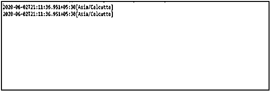


#### 2.compareTo(ZoneOffsetotheroff)

这个偏移量按降序与另一个偏移量进行比较。

**代码:**

```
import java.time.ZoneOffset;
import java.time.ZonedDateTime;
import java.time.temporal.ChronoField;
import java.time.temporal.TemporalQueries;
public class OffsetZoneEx {
public static void main(String[] args) {
ZoneOffset off1 = ZoneOffset.of("Z");
ZoneOffset off2 = ZoneOffset.of("+03:05");
System.out.println("First offset :"+ off1);
System.out.println("Second offset :"+ off2);
int cmp = off1.compareTo(off2);
System.out.println(cmp > 1 ? "Offset 1 is greater" : "Offset 2 is greater");
} }
```

**输出:**

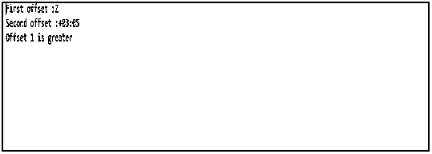


#### 3.等于(Objectobj)

用另一个偏移量来检查它们是否相等。

**代码:**

```
import java.time.ZoneOffset;
import java.time.ZonedDateTime;
import java.time.temporal.ChronoField;
import java.time.temporal.TemporalQueries;
public class OffsetZoneEx {
public static void main(String[] args) {
ZoneOffset off1 = ZoneOffset.of("Z");
ZoneOffset off2 = ZoneOffset.of("+03:05");
System.out.println("First offset :"+ off1);
System.out.println("Second offset :"+ off2);
boolean cmp = off1.equals(off2);
System.out.println(cmp);    } }
```

**输出:**

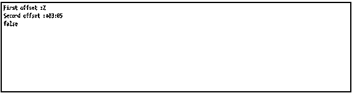


#### 4.来自(TemporalAccessortemp)

offset 的一个实例来自一个时态对象。

**代码:**

```
import java.time.ZoneOffset;
import java.time.ZonedDateTime;
import java.time.temporal.ChronoField;
import java.time.temporal.TemporalQueries;
public class OffsetZoneEx {
public static void main(String[] args) {
ZoneOffset off1 = ZoneOffset.from(ZonedDateTime.now());
System.out.println(off1);
}
}
```

**输出:**

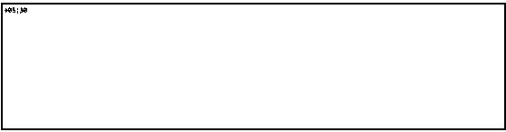


#### 5.get(TemporalFieldf)

字段 f 的值将作为 int 从偏移量中检索。

**代码:**

```
import java.time.ZoneOffset;
import java.time.ZonedDateTime;
import java.time.temporal.ChronoField;
import java.time.temporal.TemporalQueries;
public class OffsetZoneEx {
public static void main(String[] args) {
ZoneOffset off1 = ZoneOffset.from(ZonedDateTime.now());
System.out.println(off1);
System.out.println(off1.get(ChronoField.OFFSET_SECONDS));
} }
```

**输出:**


#### 6.getId()

将检索标准化区域的偏移 ID。

**代码:**

```
import java.time.ZoneOffset;
import java.time.ZonedDateTime;
import java.time.temporal.ChronoField;
import java.time.temporal.TemporalQueries;
public class OffsetZoneEx {
public static void main(String[] args) {
ZoneOffset off1 = ZoneOffset.of("+03:50");
System.out.println(off1);
System.out.println(off1.getId());
}
}
```

**输出:**


#### 7.getLong(临时字段)

字段 f 的值将从偏移量中检索。

**代码:**

```
import java.time.ZoneOffset;
import java.time.ZonedDateTime;
import java.time.temporal.ChronoField;
import java.time.temporal.TemporalQueries;
public class OffsetZoneEx {
public static void main(String[] args) {
ZoneOffset off1 = ZoneOffset.from(ZonedDateTime.now());
System.out.println(off1);
System.out.println(off1.getLong(ChronoField.OFFSET_SECONDS));
} }
```

**输出:**

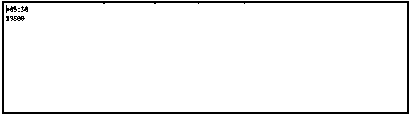


#### 8.getRules()

将检索相关时区的规则。

**代码:**

```
import java.time.ZoneOffset;
import java.time.ZonedDateTime;
import java.time.temporal.ChronoField;
import java.time.temporal.TemporalQueries;
public class OffsetZoneEx {
public static void main(String[] args) {
ZoneOffset off1 = ZoneOffset.from(ZonedDateTime.now());
System.out.println(off1);
System.out.println(off1.getRules());
} }
```

**输出:**

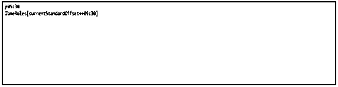


#### 9.getTotalSeconds()

将在几秒钟内检索总区域偏移量。

**代码:**

```
import java.time.ZoneOffset;
import java.time.ZonedDateTime;
import java.time.temporal.ChronoField;
import java.time.temporal.TemporalQueries;
public class OffsetZoneEx {
public static void main(String[] args) {
ZoneOffset off1 = ZoneOffset.from(ZonedDateTime.now());
System.out.println(off1);
System.out.println(off1.getTotalSeconds()); } }
```

**输出:**

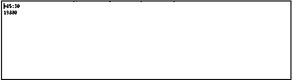


#### 10.小时数(整数小时)

zoneoffset 的一个实例将在小时内检索。

**代码:**

```
import java.time.ZoneOffset;
import java.time.ZonedDateTime;
import java.time.temporal.ChronoField;
import java.time.temporal.TemporalQueries;
public class OffsetZoneEx {
public static void main(String[] args) {
ZoneOffset off1 = ZoneOffset.ofHours(3);
System.out.println(off1);
} }
```

**输出:**

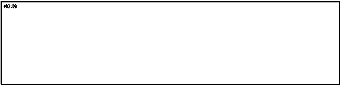


#### 11.小时分钟(小时，分钟)

将以小时和分钟为单位检索 zoneoffset 的实例。

**代码:**

```
import java.time.ZoneOffset;
import java.time.ZonedDateTime;
import java.time.temporal.ChronoField;
import java.time.temporal.TemporalQueries;
public class OffsetZoneEx {
public static void main(String[] args) {
ZoneOffset off1 = ZoneOffset.ofHoursMinutes(3, 5);
System.out.println(off1);   } }
```

**输出:**

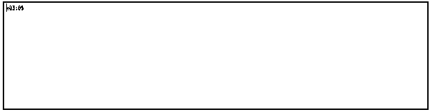


#### 12.ofHoursMinutesSeconds(整数小时，整数分钟，整数秒)

将以小时、分钟和秒检索 zoneoffset 的实例。

**代码:**

```
import java.time.ZoneOffset;
import java.time.ZonedDateTime;
import java.time.temporal.ChronoField;
import java.time.temporal.TemporalQueries;
public class OffsetZoneEx {
public static void main(String[] args) {
ZoneOffset off1 = ZoneOffset.ofHoursMinutesSeconds(3, 5, 7);
System.out.println(off1);
} }
```

**输出:**


#### 13.哈希码()

将检索 zoneoffset 的 hashcode。

**代码:**

```
import java.time.ZoneOffset;
import java.time.ZonedDateTime;
import java.time.temporal.ChronoField;
import java.time.temporal.TemporalQueries;
public class OffsetZoneEx {
public static void main(String[] args) {
ZoneOffset off1 = ZoneOffset.from(ZonedDateTime.now());
System.out.println(off1);
System.out.println(off1.hashCode());
} }
```

**输出:**

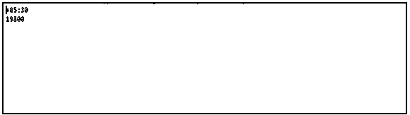


#### 14.ofTotalSeconds(int totalsecs)

将在几秒钟内检索 zoneoffset 的一个实例。

**代码:**

```
import java.time.ZoneOffset;
import java.time.ZonedDateTime;
import java.time.temporal.ChronoField;
import java.time.temporal.TemporalQueries;
public class OffsetZoneEx {
public static void main(String[] args) {
ZoneOffset off1 = ZoneOffset.ofTotalSeconds(2800);
System.out.println(off1);
} }
```

**输出:**

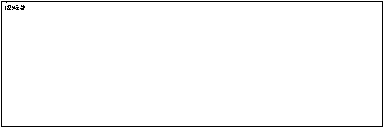


#### 15.受支持的(临时字段)

检查是否支持提到的字段。

**代码:**

```
import java.time.ZoneOffset;
import java.time.ZonedDateTime;
import java.time.temporal.ChronoField;
import java.time.temporal.TemporalQueries;
public class OffsetZoneEx {
public static void main(String[] args) {
ZoneOffset off1 = ZoneOffset.of("Z");
System.out.println(off1);
System.out.println(off1.isSupported(ChronoField.OFFSET_SECONDS));
} }
```

**输出:**

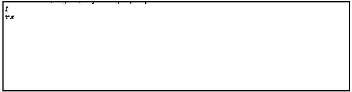


#### 16.of(Stringoffsetid)

将使用 ID 检索 zoneoffset 的实例。

**代码:**

```
import java.time.ZoneOffset;
import java.time.ZonedDateTime;
import java.time.temporal.ChronoField;
import java.time.temporal.TemporalQueries;
public class OffsetZoneEx {
public static void main(String[] args) {
ZoneOffset off1 = ZoneOffset.of("Z");
System.out.println(off1);
} }
```

**输出:**

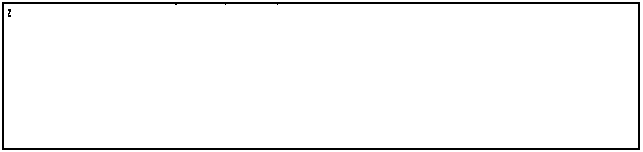


#### 17.toString()

zoneoffset 将使用规范化的 ID 检索字符串。

**代码:**

```
import java.time.ZoneOffset;
import java.time.ZonedDateTime;
import java.time.temporal.ChronoField;
import java.time.temporal.TemporalQueries;
public class OffsetZoneEx {
public static void main(String[] args) {
String off1 = ZoneOffset.of("Z").toString();
System.out.println(off1);
} }
```

**输出:**

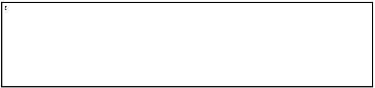


#### 18.查询(TemporalQuery <r>查询)</r>

将使用提到的查询来查询 zoneoffset。

**代码:**

```
import java.time.ZoneOffset;
import java.time.ZonedDateTime;
import java.time.temporal.ChronoField;
import java.time.temporal.TemporalQueries;
public class OffsetZoneEx {
public static void main(String[] args) {
ZoneOffset off1 = ZoneOffset.of("+08:00");
System.out.println(off1);
System.out.println(off1.query(TemporalQueries.zone()));  } }
```

**输出:**

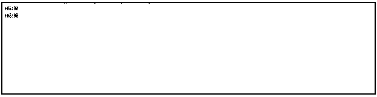


#### 19.范围(时间字段)

将为提到的字段检索有效值的范围。

**代码:**

```
import java.time.ZoneOffset;
import java.time.ZonedDateTime;
import java.time.temporal.ChronoField;
import java.time.temporal.TemporalQueries;
public class OffsetZoneEx {
public static void main(String[] args) {
ZoneOffset off1 = ZoneOffset.of("+08:00");
System.out.println(off1);
System.out.println(off1.range(ChronoField.OFFSET_SECONDS ));
} }
```

**输出:**

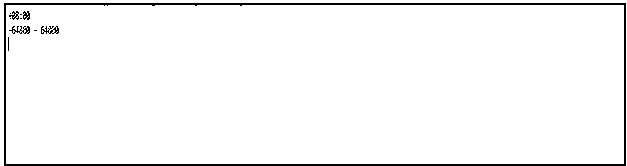


### 结论

在 Java 中，ZoneOffset 是一个表示相对于时区 UTC 的固定时区偏移量的类。MAX、MIN 和 UTC 是这个类的三个字段。在这篇文章中，不同的细节，如声明，方法，和 Java 区域偏移类的例子进行了详细解释。

### 推荐文章

这是一个 Java ZoneOffset 的指南。这里我们讨论 Java ZoneOffset 的语法介绍，不同的方法和编程实例。您也可以浏览我们的其他相关文章，了解更多信息——

1.  [Java ZoneId](https://www.educba.com/java-zoneid/)
2.  [什么是 Java 继承？](https://www.educba.com/what-is-java-inheritance/)
3.  [Java 8 收集器](https://www.educba.com/java-8-collectors/)
4.  [最佳 Java 编译器](https://www.educba.com/best-java-compilers/)


