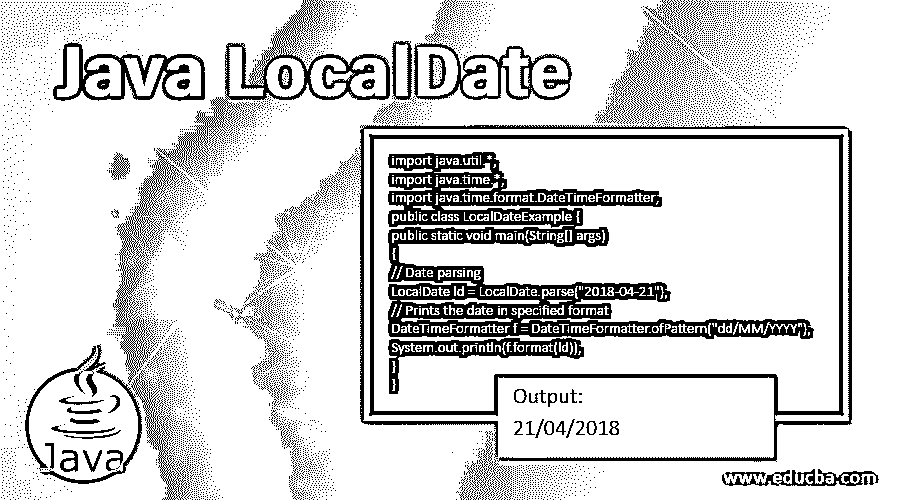

# Java LocalDate

> 原文：<https://www.educba.com/java-localdate/>




## Java LocalDate 简介

在 Java 中，LocalDate 类表示日期，格式为 yyyy–mm–DD default。它不显示时间、时区，但显示日期说明。

它具有某些特征:

<small>网页开发、编程语言、软件测试&其他</small>

*   Java LocalDate 是一个不可变的类。
*   由于不表示时区或时间，所以主要用于生日或节日等。
*   Java LocalDate 类不能扩展，因为它是最后一个类。
*   因为它是一个表示值的类，所以可以使用 equals()方法比较两个 LocalDate 实例。

**Java LocalDate 类声明:**

public final 类 Local Date 扩展对象实现 Temporal、TemporalAdjuster、ChronoLocalDate、Serializable

### Java LocalDate 的 18 大方法

以下是 Java LocalDate 中常用的方法:

#### 1\. getMonth()

月份字段将在月份枚举的帮助下返回。

**代码:**

```
import java.util.*;
import java.time.*;
public class LocalDateExample {
public static void main(String[] args)
{
// Date parsing
LocalDate ld = LocalDate.parse("2018-04-21");
// Prints the month
System.out.println(ld.getMonth());
}
}
```

**输出:**


#### 2.格式(DateTimeFormatter 格式化程序)

日期将使用提到的格式化程序进行格式化。

**代码:**

```
import java.util.*;
import java.time.*;
import java.time.format.DateTimeFormatter;
public class LocalDateExample {
public static void main(String[] args)
{
// Date parsing
LocalDate ld = LocalDate.parse("2018-04-21");
// Prints the date in specified format
DateTimeFormatter f = DateTimeFormatter.ofPattern("dd/MM/YYYY");
System.out.println(f.format(ld));
}
}
```

**输出:**


#### 3.调整(临时温度)

所提到的临时对象 temp 将随对象的日期而调整。

**代码:**

```
import java.util.*;
import java.time.*;
public class LocalDateExample {
public static void main(String[] args)
{
ZonedDateTime d = ZonedDateTime.now();
// Date parsing
LocalDate ld = LocalDate.parse("2018-04-21");
// adjusts the date
d = (ZonedDateTime)ld.adjustInto(d);
System.out.println(d);
}
}
```

**输出:**


#### 4.获取年表

将返回日历的年表，其中日历系统是 ISO。

**代码:**

```
import java.util.*;
import java.time.*;
public class LocalDateExample {
public static void main(String[] args)
{
// Date parsing
LocalDate ld = LocalDate.parse("2018-04-21");
// Prints the chronology in ISO system
System.out.println(ld.getChronology());
}
}
```

**输出:**


#### 5.getDayOfMonth()

将检索字段日。

**代码:**

```
import java.util.*;
import java.time.*;
public class LocalDateExample {
public static void main(String[] args)
{
// Date parsing
LocalDate ld = LocalDate.parse("2018-04-21");
// Prints the day of month
System.out.println(ld.getDayOfMonth());
}
}
```

**输出:**


#### 6.getDayOfWeek()

将检索字段星期几。

**代码:**

```
import java.util.*;
import java.time.*;
public class LocalDateExample {
public static void main(String[] args)
{
// Date parsing
LocalDate ld = LocalDate.parse("2018-04-21");
// Prints the day of week
System.out.println(ld.getDayOfWeek());
}
}
```

**输出:**


#### 7.getDayOfYear()

将检索字段日。

**代码:**

```
import java.util.*;
import java.time.*;
public class LocalDateExample {
public static void main(String[] args)
{
// Date parsing
LocalDate ld = LocalDate.parse("2018-04-21");
// Prints the day of year
System.out.println(ld.getDayOfYear());
}
}
```

**输出:**


#### 8.compareTo( ChronoLocalDated1)

将使用此方法将此日期与另一个日期进行比较。

**代码:**

```
import java.util.*;
import java.time.*;
public class LocalDateExample {
public static void main(String[] args)
{
// Date parsing
LocalDate ld = LocalDate.parse("2018-02-21");
// Date parsing
LocalDate ld1 = LocalDate.parse("2018-02-14");
// Prints the day of year
System.out.println(ld.compareTo(ld1));
}
}
```

**输出:**


#### 9.lengthOfMonth()

将根据日期返回月份的长度。

**代码:**

```
import java.util.*;
import java.time.*;
public class LocalDateExample {
public static void main(String[] args)
{
// Date parsing
LocalDate ld = LocalDate.parse("2018-02-21");
// Prints the LENGTH OF THE MONTH
System.out.println(ld.lengthOfMonth());
}
}
```

**输出:**


#### 10.lengthOfYear()

将根据日期返回年的长度。

**代码:**

```
import java.util.*;
import java.time.*;
public class LocalDateExample {
public static void main(String[] args)
{
// Date parsing
LocalDate ld = LocalDate.parse("2019-02-21");
// Prints the LENGTH OF THE MONTH
System.out.println(ld.lengthOfYear());
}
}
```

**输出:**


#### 11.withMonth( int month)

将返回日期副本，并按规定更改月份。

**代码:**

```
import java.util.*;
import java.time.*;
public class LocalDateExample {
public static void main(String[] args)
{
// Date parsing
LocalDate ld = LocalDate.parse("2018-02-21");
//month that want to be changed to
LocalDate r = ld.withMonth(10);
// Prints the new date
System.out.println(r);
}
}
```

**输出:**


#### 12.withYear(跨年度)

将返回日期副本，并按规定更改年份。

**代码:**

```
import java.util.*;
import java.time.*;
public class LocalDateExample {
public static void main(String[] args)
{
// Date parsing
LocalDate ld = LocalDate.parse("2018-02-21");
//year that want to be changed to
LocalDate r = ld.withYear(1992);
// Prints the new date
System.out.println(r);
}
}
```

**输出:**


#### 13.withDayOfYear( int doy)

将返回日期，并按指定方式更改日期。

**代码:**

```
import java.util.*;
import java.time.*;
public class LocalDateExample {
public static void main(String[] args)
{
// Date parsing
LocalDate ld = LocalDate.parse("2018-02-21");
LocalDate r = ld.withDayOfYear(44);
// Prints the new date
System.out.println(r);
}
}
```

**输出:**


#### 14.withDayOfMonth(整数)

将返回日期，并根据指定更改日期。

**代码:**

```
import java.util.*;
import java.time.*;
public class LocalDateExample {
public static void main(String[] args)
{
// Date parsing
LocalDate ld = LocalDate.parse("2018-02-21");
LocalDate r = ld.withDayOfMonth(23);
// Prints the new date
System.out.println(r);
}
}
```

**输出:**


#### 15.isLeapYear()

根据给出的年份是否是闰年，将分别返回 True 或 False。

**代码:**

```
import java.util.*;
import java.time.*;
public class LocalDateExample {
public static void main(String[] args)
{
// Date parsing
LocalDate ld = LocalDate.parse("2019-02-21");
// Prints the LENGTH OF THE MONTH
System.out.println(ld.isLeapYear());
}
}
```

**输出:**


#### 16.isafter(编年史)

检查该日期是否在上述日期之后。

**代码:**

```
import java.util.*;
import java.time.*;
public class LocalDateExample {
public static void main(String[] args)
{
// Date parsing
LocalDate ld = LocalDate.parse("2019-02-21");
// Date parsing
LocalDate ld1 = LocalDate.parse("2019-04-21");
// Prints the LENGTH OF THE MONTH
System.out.println(ld.isAfter(ld1));
}
}
```

**输出:**


#### 17.isBefore( ChronoLocalDatedate)

检查该日期是否在上述日期之前。

**代码:**

```
import java.util.*;
import java.time.*;
public class LocalDateExample {
public static void main(String[] args)
{
// Date parsing
LocalDate ld = LocalDate.parse("2019-04-21");
// Date parsing
LocalDate ld1 = LocalDate.parse("2019-02-21");
// Prints the LENGTH OF THE MONTH
System.out.println(ld.isBefore(ld1));
}
}
```

**输出:**


#### 18\. getYear()

将返回年份字段。

**代码:**

```
import java.util.*;
import java.time.*;
public class LocalDateExample {
public static void main(String[] args)
{
// Date parsing
LocalDate ld = LocalDate.parse("2018-04-21");
// Prints the month
System.out.println(ld.getYear());
}
}
```

**输出:**


### 推荐文章

这是 Java LocalDate 的指南。在这里，我们将讨论 java LocalDate 的基本概念和前 18 个方法，以及示例和代码实现。您也可以阅读以下文章，了解更多信息——

1.  [Java 本地时间](https://www.educba.com/java-localtime/)
2.  [Java 中的 JTextField](https://www.educba.com/jtextfield-in-java/)
3.  [Java 瞬态](https://www.educba.com/java-transient/)
4.  [Java 线程优先级](https://www.educba.com/java-thread-priority/)


