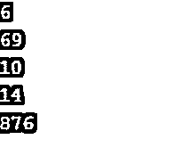

# Java LocalDateTime

> 原文:# t0]https://www . educba . com/Java-localdatetime/


## Java 本地日期时间简介

Java 中的 LocalDateTime 用于在输出屏幕上显示本地日期和时间。显示时间的默认格式是 YYYY-MM-DD-hh-mm-ss-zzz。显示日期和时间的不同因素是年、月、日、小时、分钟、秒，最后是纳秒。可以将日期和时间加到特定的天数上，减去特定的天数，最后可以非常平滑地产生输出。LocalDateTime 类是最终类；因此，不存在允许的类扩展。LocalDateTime 类是一个基于值的类，用于使用 equals()检查两个日期和时间是否相等。

### Java 本地日期时间的语法

Java LocalDateTime 类是 java.time 包的一部分。我们可以用下面的方式创建这个类的 java 实例。

<small>网页开发、编程语言、软件测试&其他</small>

下面是语法。

```
import java.time.LocalDateTime;
```

我们还可以将值传递给 LocalDateTime 类中的 of()。

下面给出了以下内容的语法:

```
LocalDateTime Idt= LocalDateTime.of(2011,15,6,6,30,50,100000);
```

我们还可以使用 parse()并以字符串表示形式传递时间值。

```
LocalDateTime Idt= LocalDateTime.parse("2011-11-10T22:11:03.46045");
```

此外，我们可以通过传递 ID 和区域 ID 信息来使用 ofInstant()。

```
LocalDateTime Idt= LocalDateTime.ofInstant(Instant.now(), ZoneId.SystemDefault());
```

### Java 中的 LocalDateTime 方法

Java LocalDateTime 类中有不同的方法。

*   **字符串格式(datetime formatter formatter):**用于使用指定的格式化程序格式化日期和时间。
*   **LocalDateTime minusDays(长天数):**用于使用特定的天数来格式化日期和时间，这些天数将从相应的日期中减去。
*   **LocalDateTime plusDays(长天数):**用于给当前日期加上一定的天数，然后以各自的方式打印输出。
*   **int get(TemporalField 字段):**用于获取整数格式的日期和时间值，即 int。
*   **static local datetime now():**这个方法用于从默认时区调用默认日期和时间，默认时区就是当前时区。

### Java 本地日期时间的示例

下面是提到的例子:

#### 示例#1

在第一个编码示例中，我们将见证 Java 中使用的 format()来格式化特定数量的代码。

**代码:**

```
import java.time.LocalDateTime;
import java.time.format.DateTimeFormatter;
public class LocalDateTimeExample
{
public static void main(String[] args)
{
LocalDateTime now = LocalDateTime.now();
System.out.println("Before doing Formatting: " + now);
DateTimeFormatter format = DateTimeFormatter.ofPattern("dd-MM-yyyy HH:mm:ss");
String fDTime = now.format(format);
System.out.println("After doing Formatting: " + fDTime);
}
}
```

**输出:**

如示例输出所示，我们可以看到格式化前后的日期和时间都已显示。


#### 实施例 2

在第二个程序中，我们将看到 minusDays()的工作原理，即某个日期从该日期中减去某个日期值，然后最终打印出特定的输出。

**代码:**

```
import java.time.LocalDateTime;
import java.time.format.DateTimeFormatter;
public class LocalDateTimeExample2
{
public static void main(String[] args)
{
LocalDateTime dt1 = LocalDateTime.of(2018, 2, 14, 15, 22);
LocalDateTime dt2 = dt1.minusDays(100);
System.out.println("Before Formatting: " + dt2);
DateTimeFormatter format = DateTimeFormatter.ofPattern("dd-MM-yyyy HH:mm");
String fDTime = dt2.format(format);
System.out.println("After Formatting: " + fDTime );
}
}
```

在上面的代码中，我们减去了一定的天数；在这种情况下，从代码中给出的日期 2018 年 2 月 14 日<sup>到</sup>为 100。我们在格式化前和格式化后都得到答案，如下所示。

**输出:**


#### 实施例 3

plusDays()与 minusdays()非常相似，唯一的区别是将天数添加到当前日期，而不是减去特定的天数。因此，在这个编码示例中，我们将看到在现有日期和时间的基础上增加了一定的天数。

**代码:**

```
import java.time.LocalDateTime;
import java.time.format.DateTimeFormatter;
public class LocalDateTimeExample3
{
public static void main(String[] args) {
LocalDateTime dt1 = LocalDateTime.of(2018, 1, 8, 12, 34);
LocalDateTime dt2 = dt1.plusDays(60);
System.out.println("Before Formatting: " + dt2);
DateTimeFormatter format = DateTimeFormatter.ofPattern("dd-MM-yyyy HH:mm");
String fDTime = dt2.format(format);
System.out.println("After Formatting: " + fDTime );
}
}
```

在此示例代码中，我们在提供的默认日期中将日期指定为 2018 年 1 月 8 日<sup>日</sup>。我们看到增加的天数，也就是 60 天。当我们将 60 天添加到代码中时，我们看到日期已经更改，现在是 2018 年 3 月 9 日<sup>。时间保持不变。只有天数发生了变化，将日期从 1 月 8 日<sup>改为 3 月 9 日<sup>。</sup></sup></sup>

**输出:**


#### 实施例 4

在这个代码示例中，我们将看到 get()的特性，其中我们将分别获得日期和时间的整数值。我们还将看到一个代码示例来恰当地说明这个程序。

**代码:**

```
import java.time.LocalDateTime;
import java.time.temporal.ChronoField;
public class LocalDateTimeExample4
{
public static void main(String[] args)
{
LocalDateTime b = LocalDateTime.of(2018, 3, 10, 14, 36);
System.out.println(b.get(ChronoField.DAY_OF_WEEK));
System.out.println(b.get(ChronoField.DAY_OF_YEAR));
System.out.println(b.get(ChronoField.DAY_OF_MONTH));
System.out.println(b.get(ChronoField.HOUR_OF_DAY));
System.out.println(b.get(ChronoField.MINUTE_OF_DAY));
}
}
```

示例代码按照时间顺序给出了一周中的某一天、一年中的某一天、一个月中的某一天、一天中的某一小时和一天中的某一分钟。程序中调用了 ChronoField 包，以确保程序运行并根据需要给出特定的输出。

**输出:**




#### 实施例 5

在这个编码示例中，我们将看到 Java 编程语言中 LocalDateTime 类中的 now()。这个程序将返回当前的日期和时间以及程序中的秒数。

**代码:**

```
import java.time.LocalDateTime;
import java.time.format.DateTimeFormatter;
public class LocalDateTimeExample5
{
public static void main(String[] args)
{
LocalDateTime dt1 = LocalDateTime.now();
DateTimeFormatter format = DateTimeFormatter.ofPattern("dd-MM-yyyy HH:mm:ss");
String fDTime = dt1.format(format);
System.out.println(fDTime);
}
}
```

**输出:**

正如我们在输出中看到的，给出了当前时区的日期和时间，并且以 hh-mm-ss 格式与时间一起清楚地打印出来。


### 结论

本文已经看到了几个程序演示了 LocalDateTime 类中的所有方法和函数。此外，我们还看到了 LocalDateTime 类的语法。除此之外，我们还注意到几个程序的输出。LocalDateTime 类在航空工程中经常使用，它维护飞机的当前日期和时间，并注意飞机是否到达了不同的时区，时区的影响会改变手表时间。

### 推荐文章

这是 Java LocalDateTime 的指南。这里我们讨论简介和 LocalDateTime 方法，以及不同的例子和它们的代码实现。您也可以阅读以下文章，了解更多信息——

1.  [Java 本地时间](https://www.educba.com/java-localtime/)
2.  [Java 持续时间](https://www.educba.com/java-duration/)
3.  [Java ZoneId](https://www.educba.com/java-zoneid/)
4.  [Java 流过滤器](https://www.educba.com/java-stream-filter/)


