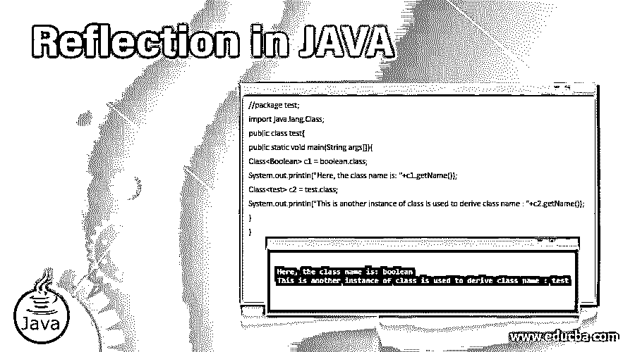

# JAVA 中的反射

> 原文：<https://www.educba.com/reflection-in-java/>




## JAVA 中的反射介绍

顾名思义，反射是 JAVA 中的一个 API(应用程序编程接口)功能，通过它可以全面检查类的运行时实例。它是 Java.lang.reflect 包的一部分。这个包必须在程序开始时导入，然后调用函数来理解“反射”的功能任何阶级的行为都可以研究；可以在运行时使用反射 API 提取或修改元数据。

### 句法

下面提供了反射 API 下提取类信息的常用函数的语法:

<small>网页开发、编程语言、软件测试&其他</small>

*   **公共字符串 getName(参数):**该函数返回类名。
*   **public boolean isInterface(参数):**该函数检查该类是否为接口，并返回一个布尔值(真或假)。
*   **public boolean isArray(参数):**此函数检查变量是否为数组，并返回布尔值(真或假)。
*   **public Constructor[]getDeclaredConstructors(parameter)抛出 SecurityException:** 该函数检查类中的构造函数，返回特定类中使用的构造函数个数。此外，它有一个安全异常和捕获，与使程序无中断工作相关联。
*   **公共方法[] getDeclaredMethods( parameter)抛出 SecurityException:** 该函数检查类中的方法，返回特定类中使用的方法数。此外，它有一个安全异常和相关的捕捉，使程序工作无中断。
*   **公共类 getSuperclass(参数):**该函数返回基类的超类。
*   **public boolean is primitive(参数):**这个函数检查给定的参数是否是本原的，并返回一个布尔值。

### JAVA 中反射是如何工作的？

反射类使用 Java.lang.reflect 包中定义的不同方法来提取类信息。可以使用 getClass()方法提取关于类的信息，使用 getConstructors()方法提取构造函数，使用 getMethods()方法提取方法。这些方法在反射 API 中定义，但是返回类的信息，包括方法、构造函数等等。反射 API 用于 JAVA 程序、ide(集成开发环境)如 eclipse、Netbeans。借助下一节中提供的示例，可以很好地理解这一点。

### JAVA 中反射的例子

下面提到了不同的例子:

#### 示例#1

**代码:**

```
//package test;
import java.lang.Class;
public class test{
public static void main(String args[]){
Class<Boolean> c1 = boolean.class;
System.out.println("Here, the class name is: "+c1.getName());
Class<test> c2 = test.class;
System.out.println("This is another instance of class is used to derive class name : "+c2.getName());
}
}
```

**输出:**


解释:请检查上面提供的例子。它有一个包含所有名为“test”的类的包测试包有一个类“test declared”这个类还包含 main 方法，程序将从这个方法开始执行。类“Class <boolean>是 jAVA 中的标识符反射类。这个类是在上面声明的库“java.lang.Class”的帮助下启用的。Boolean 本身就是 JAVA 中的一个类。Boolean 是一种原始数据类型，如 string、int 或 char。这个例子表明，我们可以提取原始数据类型(最终是 JAVA 中的类，这就是 JAVA 被称为纯面向对象语言的原因)的信息。“getName()”函数用于获取一个类的名称，该类在这里由一个名为“C1”的对象实例化。</boolean>

在下一行中，不使用原始数据类型，而是考虑使用名为“test”的用户定义的数据类型“class”来提取数据。“类<test>”是用名为“C2”的对象实例化的反射类。这里测试类名，对象用于通过函数“getName()”提取这个类名。最终输出包含这些函数的返回值，并显示在输出屏幕上。</test>

#### 实施例 2

**代码:**

```
//package test;
import java.lang.Class;
class Simple{}
public class test{
public static void main(String args[]){
try{
Class<?> c=Class.*forName*("Simple");
System.*out*.println("The result is: "+c.isInterface());
}catch(Exception e){System.*out*.println(e);}
}
}
```

**输出:**


**解释:**在上面的例子中，创建了一个名为“test”的包，就像在前面的例子 1 中创建的一样。这个包包含一个类名“Simple”，它不是主类。这里的主类是“test”类，它包含了开始执行程序的主方法。“班<？>"是反射类的标识符，这里通过名为“c”的对象实例化。然后，该对象用于提取名为“isInaterface”的函数的决策指示符(真或假)这个函数引入一个类作为参数；在这种情况下，作为参数引入的类是“简单”类。这个类不是一个接口，所以在输出屏幕中返回“false”作为结果。为了调用这个函数，使用了类对象“c”。

### 优势

下面列出了在 JAVA 中使用反射的一些优点:

1.  这是为任何类提取信息的最好方法之一。这些信息可以包括从构造函数到类和方法的信息。
2.  这个功能的最大优点之一是我们还可以提取关于私有方法和类的信息。因此，任何东西，如果不怀好意地隐藏在程序中，都可以用这个功能提取出来。
3.  这种功能为调试器提供了很大的灵活性，因为他们可以轻松地调试类，而不是分别去每个类。
4.  这也增加了一个扩展性特性，用户可以通过使用实例来添加外部定制类。
5.  这借助实例展示了 OOP 语言的真正威力。
6.  这用于在程序运行期间动态加载和重新加载类。

### 结论

JAVA 反射使得在完全不知道类名的情况下内省类、接口、方法等等成为可能。这些都是在编译时完成的。这被认为是 JAVA 最强大的属性之一，因为它可以用来创建类的实例，并且可以使用它来提取类的私有成员。开发人员可以在运行时使用它，也可以用于数据库-对象映射。

### 推荐文章

这是 JAVA 中的反射指南。在这里，我们讨论 JAVA 中的反射是如何工作的，并给出了代码和输出的例子。您也可以看看以下文章，了解更多信息–

1.  [Java 监控工具](https://www.educba.com/java-monitoring-tool/)
2.  [Java StringJoiner](https://www.educba.com/java-stringjoiner/)
3.  [Java InetAddress](https://www.educba.com/java-inetaddress/)
4.  [Java 瞬态](https://www.educba.com/java-transient/)


