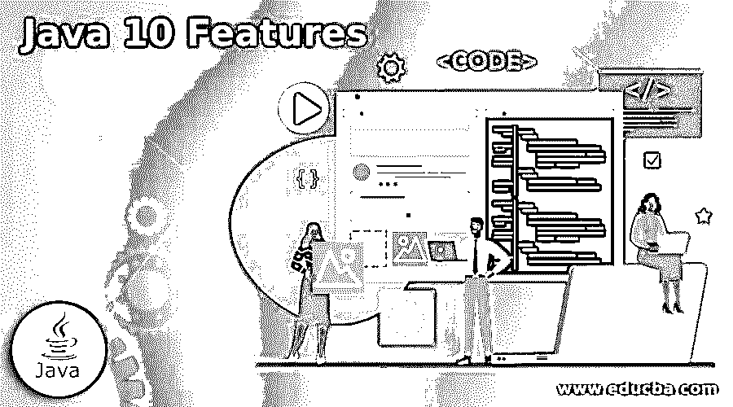

# Java 10 特性

> 原文：<https://www.educba.com/java-10-features/>

## Java 10 特性介绍

以下文章概述了 Java 10 的特性。一种面向对象的高级编程语言被称为 Java 编程语言，它具有基于类的差异，因此在集成中对应用程序和基于系统的功能的依赖性较小。我们可以在任何操作系统中运行 Java 代码，这样它就可以运行复杂的嵌入式应用程序。这主要用在后端编程语言中，在后端编程语言中，应用程序是用 android 开发的，或者开发人员使用数据。数值计算和游戏是 Java 被广泛使用的另一个领域，因此开发人员可以在他们的舒适区内工作，根据需求开发小的或大的应用程序。

### 各种 Java 10 特性

下面给出了 Java 10 的各种特性:

<small>网页开发、编程语言、软件测试&其他</small>

*   类型推断可以在局部变量中完成，局部变量只能在特定的场景中使用。这在其他 Java 版本中是没有的，因此开发人员很乐意使用局部变量类型推理。如果在 for 循环中声明了局部变量，并且在 for 循环中有索引，我们可以使用局部变量类型推断。此外，局部变量仅限于初始值设定项，因此只有当变量在循环内部初始化时，我们才能进行类型推断。应该为此功能添加保留关键字“var ”,以便编译将选取局部变量来推断类型。
*   在 Java 10 版本中，Java 中更新了一个新的版本号，这样开发者就可以知道他们使用的是哪个版本，哪个更新。就是这种形式，$FEATURE。临时费用。$更新。$补丁。$FEATURE 依赖于特性发布版本，$INTERIM 依赖于 6 个月内发生的非特性发布版本。当语言中有任何关于安全性或 bug 的更新时，它会在$UPDATE 上更新。当出现任何关键问题并且必须在紧急情况下进行更新时，会使用版本号更新$PATCH。所有这些计数器版本都是在语言中的 API 的帮助下更新的，因此开发人员不必担心同样的问题。
*   我们有一个不同的 Java 编译器叫做 Graal，它最初是在 Java 9 中引入的。支持多语言解释，并在 Graal 中引入了提前编译(AOT ),以便用户可以提前编译并知道结果。此外，实时代码优化有助于开发人员在修复 bug 和重新运行程序时节省时间。Graal 完全是用 Java 编写的，而以前的 Java 编译器是用 C++编写的。
*   我们在 Java 9 中有一个 G1 垃圾收集器，这使得垃圾收集变得容易，但是当有并发线程处理垃圾时会有延迟。这使得开发者要等很长时间才能重启应用。Java 10 通过引入并行收集简化了这项工作，在并行收集中，当 G1 收集器无法重新收集内存输出时，它的算法被并行化，从而简化了垃圾收集。此外，还有一个通用的垃圾收集器接口，有助于在不删除现有特性的情况下向 GC 添加新特性。例如，使用这个接口可以改进代码隔离，并且有助于在不改变数据库的情况下添加新特性。
*   Unicode 扩展在 Java 中使用，在版本 10 中，引入了额外的扩展。cu '，' fw '，' rg '和一些描述货币类型的扩展名，一周的第一天和区域覆盖。API 被修改以适应这些扩展，这样 Java 可以在使用扩展时编译而不会产生任何问题。Java 10 也支持 BCP 47 语言标签。
*   为了提高性能，Java 线程在其最安全的状态下会有一个回调。这是在语言配置中使用的握手方法，因此不需要全局安全点。这有助于同时管理所有 Java 线程，而不会对系统中的点和 VM 产生任何外部影响。因此，我们可以在任何需要的时候停止单个线程，没有必要像其他 Java 版本一样一次停止所有线程。
*   在新版本发布后，应用程序的存储和内存需求变得非常高。如果系统内存不足，要满足应用程序的需求并不容易。Java 10 有一个叫做内存架构的新选项。Hotspot VM 可用于根据用户需求将应用程序的内存替换到任何其他存储设备。这有助于用户在系统之外或不在系统附近时检查应用程序。根据应用程序的要求，备用设备应该具有类似原子操作和 DRAM 的语义特征。
*   Java 10 中删除了很少的 API，增加了很多 API。例如，我们可以在运行程序时对列表、地图和集合进行更改，但结果不会给出更改后的输出。此外，ElseThrow()是为原始程序添加的，比 get()有更多的应用程序，这有助于以更快的方式接收信息。更多的方法，如 add、out 或 is 被添加到收集器中，以获得所需格式的输出。
*   Java API 以各种方式帮助用户。我们有一个助手 API，通知用户关于索引和节点的升级，这样他们就不会错过时间线。API 中提供了密钥管理，但它仅限于用户，这样未经身份验证的登录就不会弄乱数据。提供了一个可以安全锁定的密钥库。我们在 Elasticsearch 中也有 ABAC(基于属性的访问控制),因此具有特定属性的用户可以根据他们的特定需求访问服务器。文档级安全性的存在，使得读取权限使用户能够锁定他们存储在云存储中的文档。可以进行审计来标记服务器中的错误，以便在以后的阶段可以避免这些错误。

### 结论

Java 10 已经让位给了更现代的变化，在更新的版本中进行了改编。Java 更快的发布使得该语言中的许多特性成为可能，因此其他版本能够探索更多相同的特性。此外，长期支持版本有助于开发人员以更快的方式进行编程，并提高性能。

### 推荐文章

这是 Java 10 特性的指南。为了更好地理解，我们在这里讨论 Java 10 的简介和各种特性。您也可以看看以下文章，了解更多信息–

1.  [Java URL 类](https://www.educba.com/java-url-class/)
2.  [Java 矢量类](https://www.educba.com/java-vector-class/)
3.  [Java 字符串等于](https://www.educba.com/java-string-equals/)
4.  [Java 关机挂钩](https://www.educba.com/java-shutdown-hook/)

