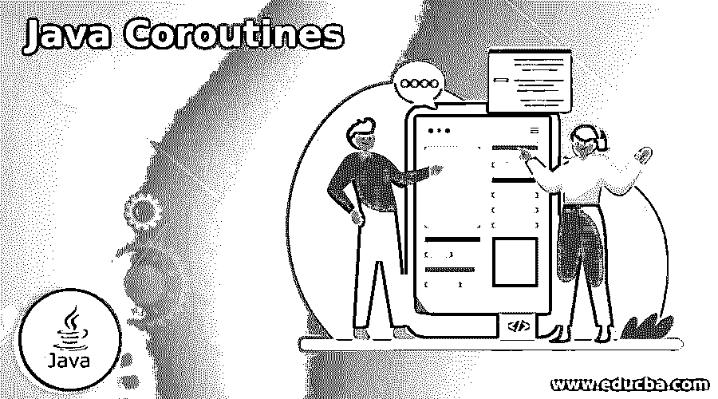
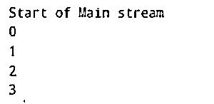
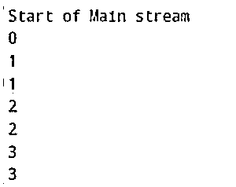

# java 协同程序

> 原文：<https://www.educba.com/java-coroutines/>




## Java 协程简介

Java 协同程序被定义为一组指令，这些指令通过将其打包为一个单元发送给计算机，用于概括由多任务处理风格执行的特定任务，其中没有从一个正在运行的进程到另一个进程的切换，而是作为协作多任务处理并发地运行它。这些指令通过允许它们被暂停和恢复来执行。我们非常熟悉通过协同例程、协作任务、事件循环、迭代器、管道等编写的程序类型。然而，人们通常会混淆协程的概念与其他概念，如子例程、线程、生成器、相互递归。

**Java 协同程序的语法**

<small>网页开发、编程语言、软件测试&其他</small>

下面给出了提到的语法:

**1。在 POM 中输入相关性。**

```
<dependency>
<groupId> {package name goes here} </groupId>
<artifactId> {artifact ID goes here} </artifactId>
<version> {version number goes here} </version>
</dependency>
```

**2。声明协程的类实例。**

```
public static final class < Class name goes here > implements Coroutine
```

**3。重写父类上的实现。**

```
@Override
```

**4。通过 com.offbynull.coroutines 声明协同程序**

```
CoroutineRunnerr = new CoroutineRunner(new <class name> ());
```

### Java 中的协程是如何工作的？

在我们了解 Java 中的协同程序之前，让我们先看看实现它们的不同方式，因为不同的方式将决定纯 Java 中协同程序的工作方式。事实上，Java 的抽象强加了一些限制，但是实现并没有停止。

被广泛接受的是，有 4 种方法负责协程的实现。

*   为了在本地支持协程，修改了 JVM，为协程的实现打了补丁。这种修改的 JVM 之一是达芬奇机器项目。
*   通过重写常规字节码，还可以实现协程功能。这些例程要么在运行中处理，要么在编译时处理。存在各种实施方式，即来自 offbynull、Google code archive 和/或 Apache commons。
*   还可以通过特定于平台的机制实现 Java 本地接口，并在 OS 或 C 库中实现，帮助提供 JVM 功能。
*   最后但同样重要的是，协程也可以使用线程来实现，尽管性能将极大地依赖于 JVM 的线程实现。

协程是轻量级线程，通过共享现有线程运行，而不是拥有自己的专用系统线程。这种协作式的运行方式通过共享并确保共享线程不会被不必要的占用。Java 7 中的 ForkJoinTask 和 Java 8 中的 CompletableFuture 提供了关于共享线程执行的明确支持。现在，如果协程被挂起一段不确定的时间，则不会利用任何计算资源，并且只有在等待的资源可用时才能恢复执行。

我们的第一个任务是声明协程。缺少声明任何包含挂起的对象的本机机制；唯一的方法是通过 API 实现它。它可以被声明为类协程的一个实例，esoco GmBH 提供了 Coroutine.first()方法来调用一个新的协程实例。或者，可以调用构造函数实例来执行相同的任务。使用 Coroutine.then()用户可以提供额外的补充功能。协程的另一个主要特点是它们是不可变的，定义的步骤顺序不能改变。

使用 CoroutineWriter 和 CoroutineReader，可以对 coroutine 进行序列化或反序列化。默认情况下使用 Java 的内置序列化函数，协程的状态就是用这个函数构成的。除此之外，还有自定义实现来进一步控制序列化或反序列化，并传递给 CoroutineWriter 和 CoroutineReader，以便添加不同的序列化格式，如 XML、JSON 或不同的序列化程序，如 XStream、Kryo、Jackson 等。

序列化是一项高级特性，强烈建议您熟悉 JVM 字节代码。序列化的概念允许协程在字节数组之间来回转换。

序列化的典型用例有:

*   使用序列化，可以对磁盘进行缓存或检查点操作，然后再写回来。
*   有线协同传输。
*   协程分叉。

序列化的另一个衍生物是版本控制，它使开发人员能够改变协程的逻辑，同时仍然能够使用早期版本的序列化加载数据。

### Java 协程的例子

下面是 Java 协程的例子:

#### 示例#1

一个“Hello World”类型的协程示例。

**语法:**

```
public static final class CoroutineDemo implements Coroutine {
@Override
public void run(Continuation c) {
System.out.println("Start of Main stream ");
for (int i = 0; i < 10; i++) {
echo(c, i);
}
}
private void echo(Continuation c, int x) {
System.out.println(x);
c.suspend();
}
}
CoroutineRunner runnerVar = new CoroutineRunner(new CoroutineDemo());
runnerVar.execute();
runnerVar.execute();
runnerVar.execute();
runnerVar.execute();
```

**输出:**




#### 实施例 2

对象的分叉。

**语法:**

```
public final class CoroutineDemo implements Coroutine {
@Override
public void run(Continuation c) {
System.out.println("Start of Main stream");
for (int i = 0; i < 10; i++) {
echo(c, i);
}
}
private void echo(Continuation c, int x) {
System.out.println(x);
c.suspend();
}
}
CoroutineRunner runner1 = new CoroutineRunner(new CoroutineDemo());
runner1.execute();
byte[] dumped = new CoroutineWriter().write(runner1);
CoroutineRunner runner2 = new CoroutineReader().read(dumped);
runner1.execute();
runner2.execute();
runner1.execute();
runner2.execute();
runner1.execute();
runner2.execute();
```

**输出:**




### 结论

通过这篇文章，我们了解了 Java 协程的工作原理。首先，需要确保正确实例化了 POM 和 maven 构建的细节，并且构建已经完成。通过简单变量和分叉的不同用例，我们能够理解 2 个变量如何携带信息，如果在根中有更新，同样的事情也会通过序列化反映到分叉中。

### 推荐文章

这是一个 Java 协程指南。这里我们讨论一下简介，Java 中的协程是如何工作的？和示例。您也可以看看以下文章，了解更多信息–

1.  [Java URL 类](https://www.educba.com/java-url-class/)
2.  [Java 矢量类](https://www.educba.com/java-vector-class/)
3.  [Java 字符串等于](https://www.educba.com/java-string-equals/)
4.  [Java 关机挂钩](https://www.educba.com/java-shutdown-hook/)


