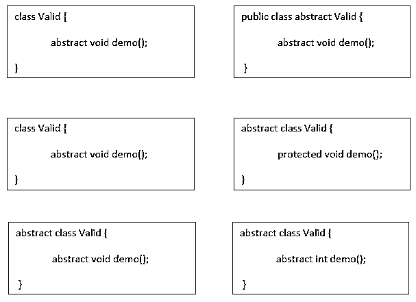
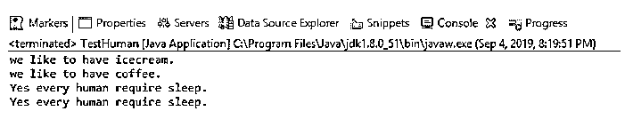

# Java 中的抽象类

> 原文：<https://www.educba.com/abstract-class-in-java/>


## Java 中的抽象类是什么？

下面的文章提供了 Java 中抽象类的概要。抽象类就像 java 中的其他普通类一样。抽象类和普通类的主要区别是创建抽象类；我们需要使用“抽象”关键字。它是类实现的分离。他们过去常常定义它的子类的非常普通的特征。这种类型的类被称为抽象类。最重要的是，我们不能创建一个抽象类的对象。

抽象类可以包含抽象和非抽象方法。然而，它们不能包含子类只能提供的抽象方法的主体。如果子类没有提供抽象方法的实现，那么我们必须显式地使它抽象。换句话说，如果一个类包含一个抽象方法，那么它必须将自己定义为抽象的。我们可以使用抽象类对几个 java 类进行分组，优化代码，使代码更具可读性，减少冗余。它还为将来的课程提供了一个模板。

<small>网页开发、编程语言、软件测试&其他</small>

### Java 中抽象类的语法

抽象类的语法如下:




### Java 中抽象类是如何工作的？

*   一个抽象类有一个抽象方法和一个非抽象方法，即没有主体的抽象方法，它们也可以有带实现的方法。
*   抽象类用于提供特定于不同类的最常见的特性。子类可以根据他们的需要或要求提供这些抽象方法的不同实现。
*   我们不能使用“new”操作符创建抽象类的对象，但是我们仍然可以定义它的构造函数，这个构造函数只能在它的子类的构造函数中调用。子类构造函数可以访问超类构造函数来初始化它的变量，这个变量可能会在子类中用于进一步的需求。

### Java 中抽象类的例子

以下是一些例子:

**Human.java**

```
package com.cont.article;
public abstract class Human
{
public abstract void whatTheylike();
public void doTheysleep()
{
System.out.println("Yes every human require sleep.");
}
}
```

**Human1.java**

```
package com.cont.article;
public class Human1 extends Human
{
@Override
public void whatTheylike()
{
System.out.println("we like to have icecream.");
}
}
```

**Human2.java**

```
package com.cont.article;
public class Human2 extends Human
{
@Override
public void whatTheylike()
{
System.out.println("we like to have coffee.");
}
}
```

**TestHuman.java**

```
package com.cont.article;
public class TestHuman
{
public static void main(String[] args)
{
Human human1 = new Human1();
human1.whatTheylike();
Human human2 = new Human2();
human2.whatTheylike();
human1.doTheysleep();
human2.doTheysleep();
}
}
```

**输出:**




在上面的例子中，我们将 HUMAN 作为一个抽象类，它定义了人类的共同需求、喜好和厌恶。不同类型的人有不同的好恶。所以每个人都可以提供他们喜欢的特定实现。那将只针对他们。

抽象类的主要优点是我们根据一个需求有一个具体的方法实现，减少冗余，增加代码的可读性，隐藏方法的实现，提供部分抽象。

我们可以再举一个例子来理解什么时候应该使用抽象类。

*   当我们想要在具有特定实现的不同类之间共享公共功能时，我们应该使用抽象类。
*   在抽象类中，字段不应该是静态的和最终的；我们也可以有具体的、私有的、公共的和受保护的方法。

假设我们有一门动物课。我们在地球上有各种各样的动物，它们在某些或主要的意义上都彼此不同。然而，它将包含所有的共同特点。

现在，这个动物类不能有特定于每种动物的方法。所以通过抽象类的概念，我们可以不用多余的代码来实现这个功能。

所有动物都有不同类型的声音、习惯等。例如狗、猫、大象和点心，它们都有不同的声音。为此，我们可以在父类中有一个泛型方法，通过它所有其他子类或子类可以提供它们自己的特定实现。

在父类中，也就是 Animal，我们有一个通用的抽象方法叫做它们的 Sound()。所以每个子类都需要覆盖这个方法，并提供它们自己的特定实现。

### 抽象类和接口

下面是抽象类和接口之间的区别:

*   抽象类和接口都是用来在 java 中实现抽象的。然而，抽象类提供部分抽象，而接口提供 100%或完全抽象。
*   默认情况下，接口中的变量是最终变量。但是抽象类也包含一个非最终变量。类似地，一个抽象类也可以有一个静态、非静态变量。但是接口将只包含一个最终的静态变量。
*   抽象类的成员变量可以是私有的、公共的和受保护的，但默认情况下它们在接口中是公共的。
*   一个抽象类可以扩展另一个 Java 类，实现多个接口，但是一个接口只能扩展另一个接口。同样，抽象类可以提供接口的实现，但是接口不能这样做。
*   我们使用 implements 和 extend 关键字分别实现和扩展接口和类。
*   通过方法，我们可以修改或访问抽象类的非静态和非最终变量。

### 结论

抽象类用于提供部分抽象。不能使用 NEW 关键字实例化抽象类。抽象方法没有主体，总是以分号(；).抽象类包含抽象和非抽象方法。抽象超类的子类需要实现所有抽象方法；如果它不提供，那么它必须将自己声明为一个抽象类。即使超类是具体的，子类也可以是抽象的。非抽象类不能包含抽象方法。此外，抽象方法是非静态的。因此，我们可以说抽象类也包含抽象和具体的方法，所以它们不能提供 100%的抽象。这是一个向最终用户隐藏复杂逻辑，只向他们显示服务的过程。另一方面，子类可以是抽象的，即使它的超类是具体的，它也可以用作数据类型。抽象类可能有静态字段和静态方法。您可以通过类引用来使用这些静态成员。

### 推荐文章

这是一个 Java 抽象类的指南。这里我们讨论它是如何工作的，java 中抽象类的例子以及抽象类和接口之间的区别。您也可以阅读以下文章，了解更多信息——

1.  [Java 接口 vs 抽象类](https://www.educba.com/java-interface-vs-abstract-class/)
2.  [什么是 Java SE？](https://www.educba.com/what-is-java-se/)
3.  [什么是 Java 继承？](https://www.educba.com/what-is-java-inheritance/)
4.  [PHP 中的抽象类](https://www.educba.com/abstract-class-in-php/)


