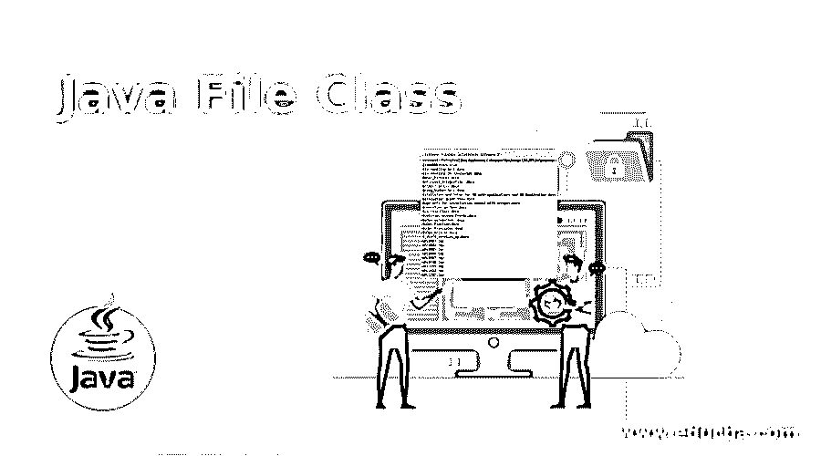
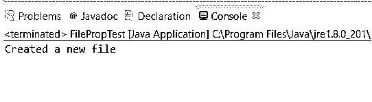
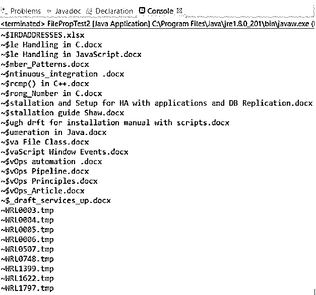

# Java 文件类

> 原文：<https://www.educba.com/java-file-class/>




## Java 文件类的定义

Java 中的 File 类在保存应用程序的路径和管理目录格式的各种文件方面起着非常重要的作用。此外，该方法还用于管理过于抽象的顺序或层次结构中的路径并对其进行版本控制。用任何字符串命名任何文件都不足以说明应用程序的路径。在不同的平台上运行应用程序，并尝试用一个或多个属性来绑定和编译它们自己。File 类由各种方法组成，这为 java 创建文件、重命名文件和删除文件提供了灵活性。

**语法和参数:**

<small>网页开发、编程语言、软件测试&其他</small>

```
File abslt = new File("https://cdn.educba.com/usr/local/bin/at.txt");
```

语法流的工作方式是从以下内容开始:

*   **文件:**表示执行操作时考虑该文件。
*   它代表文件名，可以是与文件相关的任何东西，即包含一些内容或值。
*   **new File():** 创建与文件相关的对象，也可以说是文件对象，可以包含文件值的相关信息，以后可以检索这些值。
*   **("/usr/local/bin/at . txt "):**传递的参数是推荐的绝对路径。不太推荐将相对路径作为参数来传递。

### Java 中的 File 类是如何工作的？

Java 中的文件类的工作方式是，类中的文件将包含一些以后可能需要的内容。它们可以在文件对象的帮助下被检索和修改。由于这些文件是用不同的名称和路径名在一个层次结构中维护的，所以只使用 string 作为名称是不够的，建议这样做。它是所维护的文件和目录路径名的抽象表示。

路径名可以是绝对的，也可以是相对的，具体取决于用户的指定。如果它是绝对的，那么它是一个非常推荐的方法，因为它将有助于在将来检索时获得绝对路径中提到的指定文件。因此，实际工作首先从创建一个文件类开始，然后创建相应的对象，使用该对象传递文件名和目录名。文件系统有时禁止可访问性或在对象可访问性时提供限制，这是由于实际文件系统对象上已经存在的约束而导致的。这给读、写和执行等操作造成了障碍。由于由 file 类创建的实例是不可变的，因此一旦创建，它们就不能改变路径名，并且 file 对象的表示也不会改变。

### 构造器

Java 的 File 类经常传递和使用一些构造函数:

*   **File(File parent，String child):**File parent 参数负责从创建的 File 对象中调用抽象 pathname，String child 参数负责从作为文件的新实例创建的 File 对象中调用子 pathname 字符串。
*   **文件(URI uri):** 当给定文件的 URI 被转换成抽象路径名时，文件的一个新实例被创建。
*   **File(String parent，String child):** 根据父路径名创建文件的新实例，并将子路径名字符串作为参数传递给文件。
*   **文件(字符串路径名):**一旦字符串路径名被转换成抽象路径名，文件的新实例就被创建。

### 方法

以下是方法:

*   **boolean createNewFile():** 作为参数传递给方法的抽象路径名负责创建一个新的空文件。
*   **int compareTo(文件路径名):**当任意两个路径名按词法顺序排列时，该方法用于比较两个文件，然后创建文件的新实例。
*   **boolean canExecute():** 作为实参传递的抽象 pathname 参数负责测试应用程序是否可以正常执行和运行。
*   **boolean canRead():** 作为实参传递的抽象 pathname 参数负责测试应用程序是否可以读取传递过来的文件。
*   **boolean canWrite():** 作为实参传递的抽象 pathname 参数负责测试应用程序是否可以在传递的文件上写一些内容。
*   ****String getAbsolutePath():**作为创建实例的参数传递的抽象路径名返回抽象路径名字符串。**
***   **boolean exists():** 该方法负责验证抽象路径名是否存在。*   **boolean delete():** 这个方法删除这个抽象路径名所指向的文件或目录。*   **静态文件 createTempFile(字符串前缀，字符串后缀):**该方法默认用于创建一个空的临时文件或目录。*   **布尔等于(对象 obj):** 作为抽象路径名的一部分创建的文件对象负责验证与给定对象的相等性。*   **String[] list():** 目录或文件系统中的文件以字符串的形式以数组的形式返回。*   **long length():**file 对象表示的抽象路径名负责获取文件的长度。*   **boolean isHidden():** 这个方法负责测试抽象路径名命名的文件是否是隐藏文件。*   **boolean isFile():** 该方法负责测试返回的文件是正常文件还是由抽象路径名对象表示。*   **boolean isDirectory():** 这个方法负责测试这个抽象路径名所表示的文件是否是一个目录。*   **boolean mkdir():** 这个方法负责创建通过传递抽象路径名命名的目录。*   **File[] listFiles():** 目录中的所有文件负责返回由对象表示的抽象路径名数组。*   **boolean set readable(boolean readable):**用于设置所有者或用户读取文件中内容的权限。*   **boolean rename to(File dest):**抽象路径名代表的文件负责文件的重命名。*   **boolean setExecutable(布尔可执行):**该方法用于设置所有者的执行权限。*   **boolean set readable(boolean readable，boolean ownerOnly):** 该方法负责设置约束所有者的可读性权限。*   **URI 旅游():**这个抽象路径名的表示是通过构造 URI 文件来完成的。*   **String toString():** 这个方法负责返回抽象路径名的字符串路径名。*   **boolean setReadOnly():** 该方法仅用于专门执行读操作。*   **boolean set writable(boolean writable):**该方法用于设置所有者的写权限，甚至在执行时。**

 **### 例子

现在我们将借助例子来学习 Java 文件及其各种操作。

#### 示例#1

这个程序用于演示一个新文件的创建，如果文件已经存在，返回文件已经存在。

**代码:**

```
import java.io.File;
import java.io.IOException;
public class FilePropTest {
public static void main(String[] args) {
try {
File file = new File("java_File.txt");
if (file.createNewFile()) {
System.out.println("Created a new file");
} else {
System.out.println("File is already present ");
}
} catch (IOException e) {
e.printStackTrace();
}
}
}
```

**输出:**




#### 实施例 2

这个程序用于演示文件名作为绝对路径名传递，并检索驱动器目录中的所有文件名。

**代码:**

```
import java.io.File;
public class FilePropTest2 {
public static void main(String[] args) {
File fil_nm=new File("C:/Users/adutta/documents");
String all_file_names[]=fil_nm.list();
for(String enlist_filename:all_file_names){
System.out.println(enlist_filename);
}
}
}
```

**输出:**




**Note:** All the methods explained and defined can be demonstrated in this way and can be performed by just calling the method name already present in Java’s file class.

### 结论–Java 文件类

Java 中的 File 类是一个非常有用的类，因为它不包括任何外部规范，但包括作为文件包的一部分存在的方法，并且可以无缝地用于执行任何与文件相关的活动，包括分别获取文件名和检索文件。因此，File 类为方法和所有其他文件提供了很大的灵活性。

### 推荐文章

这是一个 Java 文件类的指南。这里我们讨论 Java 文件类的介绍，Java 文件类的构造函数和方法，并给出相应的例子。您也可以看看以下文章，了解更多信息–

1.  [爪哇的 EJB](https://www.educba.com/ejb-in-java/)
2.  [Java min()](https://www.educba.com/java-min/)
3.  [终于在 Java 中](https://www.educba.com/finally-in-java/)
4.  [Java 中的 copy()](https://www.educba.com/copy-in-java/)


**