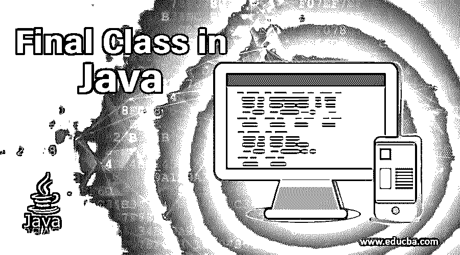

# Java 中的最终类

> 原文：<https://www.educba.com/final-class-in-java/>




## Java 最终类介绍

带有 word-final 的类声明称为最终类。Java 中的 Final 类不能被继承&不能被其他类扩展。final 类可以扩展其他类；它可以是子类，但不能是超类。简单地说，当我们需要创建一个不可变的类时，那么最终的类就是最佳答案。final 类本身是一个声明，表明它是 final，即这个类没有子类&不能进一步扩展。最后一个类除了不变性之外，还有一些更重要的东西。

有时，出于安全目的，最好使用最后一个类，因为有些类执行与安全相关的事情，如身份验证和授权。在这种情况下，类中的字符串、方法在应用程序的整个生命周期中都不应该被修改，那么将类作为最终类是一个更好的实践。

<small>网页开发、编程语言、软件测试&其他</small>

将类设为 Final 可以提高应用程序的效率。

**语法:**

```
final class Student {
private int age = 3;
}
/* // Trying to inherit the Student class
class Info extends Student{
public static void main(String[] args) {
//creating instance of the HeavyVehicle class
System.out.println(“I am unable to inherit the class with the final keyword”);
}
}
```

上面给出的带有最终单词的类是最终类。如果我们要用另一个类来扩展这个 final 类，那么它将产生错误，如“错误:不能从 final Student 继承”，如下面的截图所示。


### Java 中的 Final 类是如何工作的？

当用 final 关键字声明一个类时，它使 [JVM 能够进行假设](https://www.educba.com/what-is-jvm/) &优化。由于 final 是 java 的保留关键字，一旦添加到任何类中，就意味着该类的引用不允许更改。编译器将检查是否有引用再次发生，然后将产生一个错误。

如果我们声明任何一个 final 类，实例化任何一个 final 类，然后它在池中被创建，在池中创建的对象有一个特殊的不变性，会发生什么呢？不可变 java 类的一些最好的例子是 String、Integer、Double 等。

如果一个类被声明为 final，那么该类的所有方法都被隐式声明为 final。Final 在 java 中是修饰语；final 可以应用于变量、方法或类。一旦修饰符被添加到类中，该类的所有变量和方法都是隐式不可变的。使类不可变有几个好处，比如它是只读的&如果没有任何同步，就不能在多个线程中安全地共享。

### Java 中 Final 类的例子

下面是 java 中 Final 类的例子:

#### 示例#1

在下面给出的程序中，我们可以看到 HeavyVehicle 类不允许继承，因为它是一个 final 类。

**代码:**

```
//This class will not be extended
final class HeavyVehicle{
void messages(){
System.out.println("Your Vehicle Insurance is going to be expire in the next month");
}
}
// Inheriting HeavyVehicle class is not allowed as it is a final class
/*class Vehicle extends HeavyVehicle{
}
*/
//main class
class Car{
public static void main(String[] args) {
//creating instance of the HeavyVehicle class
HeavyVehicle hvObj = new HeavyVehicle();
hvObj.messages();
}
}
```

如果我们试图继承 HeavyVehicle 类，那么我们将得到下面的错误，如下面的屏幕截图所示。


现在我们将转移到下一个类，在这里我们创建最后一个类的实例来使用它的方法。下面给出了跳过继承过程后给定程序的输出。


#### 实施例 2

在这个程序中，HeavyVehicle 类被声明为 final 类，因此它不能在其他类中扩展，因此显式地将其引用传递给 Vehicle 类方法。

**代码:**

```
//This class will not be extended
final class HeavyVehicle{
public double getDistanceCanCover(int mileage, double fuelStatus) {
return mileage * fuelStatus;
}
}
class Vehicle{
private int mileage;
private double fuelStatus;
Vehicle(int mileage, double fuelStatus){
this.mileage = mileage;
this.fuelStatus = fuelStatus;
}
public void DisplayDistanceCanCover(HeavyVehicle hvObj) {
double distCanCover = hvObj.getDistanceCanCover(this.mileage, this.fuelStatus);
System.out.println("Distance Vehicle can cover in the available fuel: " + distCanCover);
}
}
//main class
class Car {
public static void main(String[] args) {
//creating instance of the HeavyVehicle class
HeavyVehicle hvObj = new HeavyVehicle();
//creating instance of the Vehicle class
Vehicle vehObj = new Vehicle(30, 3.5);
//calling the method of the
vehObj.DisplayDistanceCanCover(hvObj);
}
}
```

在上面给出的例子中，我们可以看到如何有效地使用 final 类。上面给出的程序的输出如下。

**输出** **:**


#### 实施例 3

在这个例子中，final 类继承了另一个类，即 Student，但是没有其他类可以扩展 Info 类，因为它是 final 类。

**代码:**

```
class Student{
public void showDetails(String name, String email, int age) {
System.out.println("\nStudent Name : "+ name);
System.out.println("\nStudent Email : "+ email);
System.out.println("\nStudent Age : "+ age);
}
}
// Trying to inherit the Student class
final class Info extends Student{
//main method of java to start program execution
public static void main(String[] args) {
//creating instance of this class
Info infoObj  = new Info();
//calling here method of the parent class
infoObj.showDetails("Alex Carry", "alexcarry1079@gmail.com", 40);
}
}
```

**输出:**


### 结论

在上面的文章中，我们讨论了 java 中 Final 类的重要性。我还回顾了最终类在 java 中是如何被称为不可变类的。我注意到了一些与声明最终类相关的要点。在给出的示例中，我们可以看到如何通过引用传递 final 类，从而在其他类中有效地使用它。

### 推荐文章

这是一个 Java 最终类的指南。这里我们讨论 Java 中 Final 类是如何工作的？以及相应的示例。您也可以浏览我们的其他相关文章，了解更多信息——

1.  [Java 中的实例变量](https://www.educba.com/instance-variable-in-java/)
2.  [Java 中的包装类](https://www.educba.com/wrapper-class-in-java/)
3.  [Java 包](https://www.educba.com/java-package-example/)
4.  [Java 时期](https://www.educba.com/java-period/)


