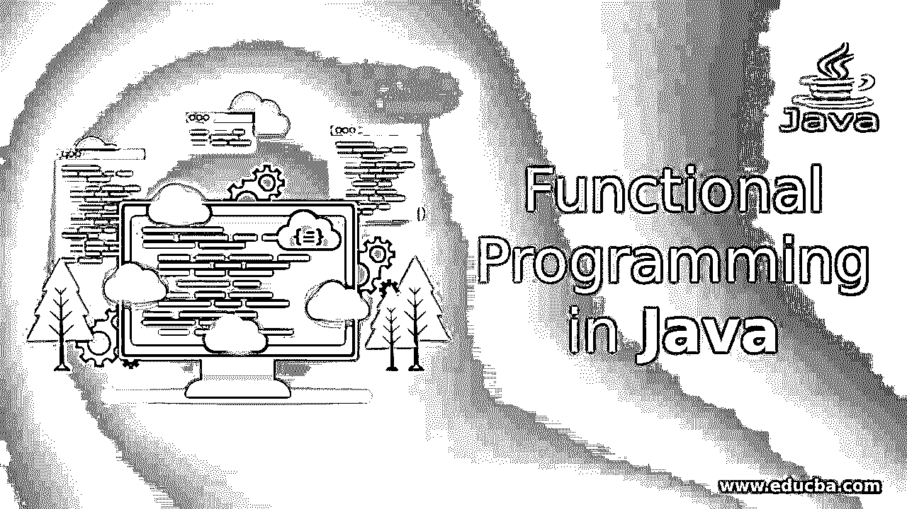
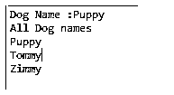
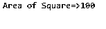
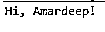
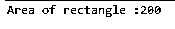

# Java 中的函数式编程

> 原文：<https://www.educba.com/functional-programming-in-java/>




## Java 函数式编程简介

Java 函数式编程是在 Java 8 <sup>th</sup> 版本之后出现的。函数式编程意味着解决问题方法的根本改变。函数式编程允许用表达式编程(声明函数)，传递函数作为参数，也使用函数作为语句。

**功能编程的类型**

<small>网页开发、编程语言、软件测试&其他</small>

*   流函数编程
*   λ表达式函数式编程
*   方法参考函数式编程

### Java 中的函数式编程是如何工作的？

在我们进入函数式编程概念之前，让我们看看函数式编程和结构化编程的区别。结构化编程重视逻辑结构或过程，而函数式编程主要关注数据。结构化编程遵循自顶向下的方法，而函数式编程遵循自底向上的方法。

结构化编程划分成小的单元或功能，而函数式编程划分成称为对象的小的运行时实体。结构化编程不太安全，而函数式编程非常安全。结构化编程不能处理复杂的问题，而函数式编程可以处理任何层次的复杂问题。

### Java 中函数式编程的例子

下面是提到的例子:

#### 示例 1:流函数式编程

**语法:**

```
objectName.stream();
```

**代码:**

Animal.java

```
package com.streams;
public class Animal {
String name;
String color;
public String getName() {
return name;
}
public void setName(String name) {
this.name = name;
}
public String getColor() {
return color;
}
public void setColor(String color) {
this.color = color;
}
public Animal(String name, String color) {
super();
this.name = name;
this.color = color;
}
}
```

AnimalNames.java

```
package com.streams;//creating package
//importing required packages to the code
import java.util.Arrays;
import java.util.List;
import java.util.stream.Collectors;
public class AnimalNames {
public static void main(String[] args) {
getMyDogNames();//calling the method
}
private static void getMyDogNames() {
Animal a1=new Animal("Puppy","black"); //creating a object for animal class
Animal a2=new Animal("Tommy","brown");//creating a object for animal class
Animal a3=new Animal("Zimmy","white");//creating a object for animal class
List<Animal> persons = Arrays.asList(a1,a2,a3); //passing object references to list
String dogName = persons.stream() //covert all elements into stream
.filter(name -> "Puppy".equals(name.getName()))//filtering given elements from persons class
.map(Animal::getName)     //persons elements iterate over map
.findAny()//find out the given element passed from filter
.orElse("");//
System.out.println("Dog Name :" + dogName); //print the dog name
List<String> collect = persons.stream()
.map(Animal::getName)
.collect(Collectors.toList());//collecting all names from list
System.out.println("All Dog names");
collect.forEach(System.out::println);//iterating collection with for each loop
}
}
```

**输出:**




**说明:**

*   在 Java 类中，我们生成 setters 和 getters。
*   在 Java 类中，我们正在编写打印狗名的主要代码。
*   在代码本身中，在注释中提到每一行的用途。
*   如果我们在结构化编程中编写相同的代码，我们需要为每个方法编写行，如 filter()、collector()、findAny()、map()等。因此，大多数函数式编程的开发都比结构化编程更受青睐。

#### 示例 2: Lambda 表达式

*   用于用表达式表示方法接口的 Lambda 表达式。
*   它有助于从集合中迭代、过滤和提取数据。
*   Lambda 表达式接口实现是一个[函数接口](https://www.educba.com/functional-interface-in-java/)。
*   它减少了大量代码。
*   Lambda 表达式被视为函数，因此 java 编译器无法创建。班级

**语法:**

```
(arguments) ->
{
//code for implementation
}
Arguments:  argument-list can be have values or no values
Example: arguments1, arguments2, arguments3,……
->: Joins code implementation and arguments.
```

##### a.带有单个参数的 Lambda 表达式

**语法:**

```
(argument1) ->
{
//code for implementation
}
```

###### 例如——AreaOfSquare.java

**代码:**

```
package com.lambda;//creating a package
interface Square{  //creating interface for quare
public int getArea(int side);  //create a method for get area
}
public class AreaOfSquare{  //As we are working with Lambda expression so no need to implement interface of square
public static void main(String[] args) {
Square area=(side)->{  // Lambda expression with only one argument.
Return side*side;  //returning area
};
System.out.println(“Area of Square=>”+area.getArea(10));   //printing area by calling interface getArea method
}
}
```

**输出:**




**说明:**

*   在上面创建了一个接口 Square，并在 AreaOfSquare 类内部编写了 lambda 表达式。
*   在 lambda 表达式中，为正方形的面积编写的逻辑。
*   在最后一行中，通过调用接口方法 getArea()打印了 100 平方的面积。

##### b.没有参数的 Lambda 表达式

**语法:**

```
() ->
{
//code for implementation
}
```

###### 例如——MyNameString.java

**代码:**

```
package com.lambda;//creating a package
interface Name{  //creating interface for Name
public String getMyName();  //create a method for get name
}
public class MyNameString{  //As we are working with Lambda expression so no need to implement interface of Name
public static void main(String[] args) {
Name name=()->{  // Lambda expression with out argument.
return "Hi, Amardeep!"; //returning name
};
System.out.println(name.getMyName());   //printing name by calling interface getMyName method
}
}
```

**输出:**




**说明:**

*   在上面创建了一个接口名并在 MyNameString 类内部编写了不带参数的 lambda 表达式。
*   在 lambda 表达式中，返回字符串的书面逻辑。
*   在打印的最后一行中，字符串是 Hi，Amardeep！通过调用接口方法 getMyName()。

#### 示例 3:方法参考

*   方法引用用于引用一个函数接口的方法。
*   这是 lambda 表达式的一种更简单的形式。
*   如果每次都用 lambda 表达式指向一个方法，我们可以用方法引用代替方法引用。

**语法:**

```
Class-Name:: static method name
```

###### 例如——StaticMethodReference.java

**代码:**

```
package method.reference;//creating package
interface RectangleArea{  //creating RectangleArea interface
public int getArea(int l,int b);  //creating method getArea in interface
}
public class StaticMethodReference {  //creating a classs
public static int showRectangleArea(int length, int breadth){  //creating method for getting rectangle area
return length*breadth;
}
public static void main(String[] args) {
// Referring static method
RectangleArea area = StaticMethodReference::showRectangleArea;  //calling class name with method name
// Calling interface method
int outArea=area.getArea(10,20);
System.out.println("Area of rectangle :"+outArea);//printing area
}
}
```

**输出:**




**说明:**

*   在上面创建了一个界面矩形并在 StaticMethodReference 类内部编写了静态方法引用代码。
*   在 showRectangleArea()方法内编写了一个矩形的面积逻辑。
*   下一行将静态方法引用传递给 RectangleArea 接口引用。
*   下一行通过调用 getArea(10，20)方法打印矩形区域。
*   输出为 200。

### 结论

用流、lambda 表达式和方法引用实现的函数式编程。它减少了代码行并提高了性能。

### 推荐文章

这是一个 Java 函数式编程的指南。在这里，我们讨论函数式编程在 Java 中是如何工作的，并给出适当的例子。您也可以看看以下文章，了解更多信息–

1.  [Java 适配器类](https://www.educba.com/java-adapter-classes/)
2.  [Java 包示例](https://www.educba.com/java-package-example/)
3.  [Java 时期](https://www.educba.com/java-period/)
4.  [Java 流过滤器](https://www.educba.com/java-stream-filter/)


