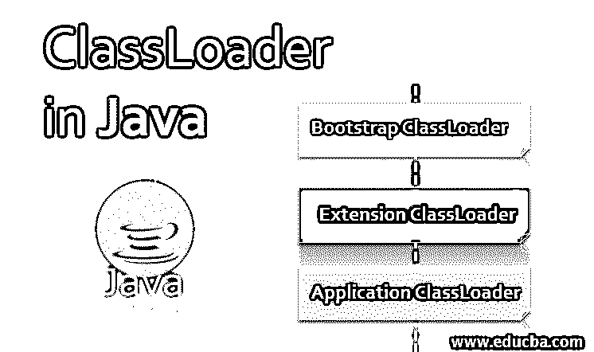
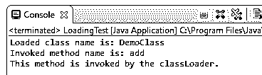

# Java 中的类加载器

> 原文：<https://www.educba.com/classloader-in-java/>




## Java 中的类加载器简介

类加载器是一个对象，负责在运行时动态加载 Java 类，以防止 JVM 意识到类加载器是 Java 运行时环境的一部分。它让 JVM 的生活变得更加容易。当应用程序需要时，JVM 将类加载到内存中，而不是一次加载所有的类。然后，ClassLoader 开始将类加载到内存中。

### 如何用 Java 实现 ClassLoader？

让我们看看 java.lang.ClassLoader 是如何在 java 库代码中实现的，它有哪些功能。

<small>网页开发、编程语言、软件测试&其他</small>

**java.lang.ClassLoader:**

```
public abstract class ClassLoader {
public class loadClass(String name);
protected class defineClass(byte[] b);
public URL getResource(String name);
public Enumeration getResources(String name);
public ClassLoader getParent()
};
```

让我们看看 java 中的类加载器有哪些功能:

*   **loadClass():** 这是一个重要的方法，它将类的名称作为一个字符串，并将返回一个类的实例，这将是类加载器在其类路径中找到的类，它将提供它，以便可以从它实例化一个对象。
*   **defineClass():** 这个方法的工作方式类似于 loadClass 方法，除了它接受一个字节数组作为参数，然后将从那个字节数组创建一个类，这意味着它将类本身作为一个字节数组。它与 loadClass 方法略有不同，因为类本身是以字节数组的形式给出的，而 loadClass 需要找到那个类来加载它。
*   **getResource()或 getResources():** 该方法是诊断与加载类相关的任何问题的关键，因为当您提供字符串名称和包名称时，它提供 URL 或 URL 后面的枚举。它会给你一个准确的路径，告诉你你的类从哪里开始加载，以及如何加载，而不需要你做任何假设。
*   **getparent():** 这是理解 classLoader 层次结构的一个关键方法。ClassLoader 不是一个平面结构，你有父和子层次结构，层次和层次结构。

### Java 中的 ClassLoader 是如何工作的？

演示类装入器如何工作的示例:

**代码:**

```
public class A() {
public void addOne() {
B b = new B();
b.addTwo();
}
}
```

在上面的场景中，类加载器将如何加载类:

*   我们可以看到，在上面的代码中，A 类调用了一个函数 addOne()。在该函数中，创建了类 B 的一个实例，并调用了类 B 的另一个方法 addTwo()。
*   所以类加载器会加载类 A，然后类加载器会加载类 b .所以调用会像 class.getClassLoader()一样引起。荷载等级(" B ")；
*   由于类装入器的这个特性，我们可以有一个类的层次结构，并解码它们的连接。

### 类加载器的类型

在本教程中，我们将讨论不同类型的类装入器及其内置功能，以及为什么使用它。

#### 1.引导类装入器

*   Java ClassLoader 也是 java.lang. ClassLoader 的一个实例，ClassLoader 是一个类，试想一下谁来加载 ClassLoader 类。我们将看到 Bootstrap ClassLoader 出现的场景。
*   它将从$JAVA_HOME/jre/lib 目录加载所有的 rt.jar 和其他核心库。
*   它充当所有其他类加载器实例的父类。
*   它是 JVM 的一部分，用本机代码编写；因此，这个特定的类加载器的实现可能会改变。

#### 2.扩展类加载器

扩展类加载器是 Bootstrap 的子级。它用于加载所有进入 JVM 的 Java 类的[扩展。](https://www.educba.com/what-is-java/)

#### 3.应用程序类加载器

*   它是扩展 ClassLoader 的子级。
*   它用于在类路径环境变量–class path 或–CP 中加载所有应用程序级别的类。

### 类加载器泄漏

每个类都有一个到它创建的所有类的链接。它实际上需要一个内存来存储静态字段。如果类加载器泄漏了任何单个类的任何静态字段，这仅仅意味着您正在泄漏一个类加载器。如果你这样做，你将会泄漏所有的类和一堆对象以及它们链接的所有对象。类加载器泄漏可能太危险了。

每次我们在应用程序运行时进行重新部署或添加增强功能时，ClassLoader 都会加载一个类，而不会重新加载或卸载一个类。所以当一个类装入器从零开始装入一个单独的类时，它会有一些对象为了重新创建或从零开始重新装入它。旧的类装入器把对象从旧的状态送到新的状态。所以在这个过渡中，可能会有漏洞。所以当你泄漏一个对象的时候，你就泄漏了一个类，这就是类装入器。

### Java 类加载器的原理

java 类加载器遵循 3 个原则:

*   委托模型:它将类加载请求委托给父类加载器，只有当父类无法找到或加载类时才加载类。
*   **可见性原则:**该原则规定了加载类的可见性范围。父类装入的类对父类装入器可见，但其子类装入的类对父类装入器不可见。
*   **唯一性属性:**保证类加载器中没有重复的类。如果一个父类加载了一个类，那么它对应的子类不会加载这个类。

### 自定义类加载器的示例

这是名为 ClassLoaderJava.java 的自定义类加载器示例:

**代号:ClassLoaderJava.java**

```
import java.lang.reflect.Constructor;
import java.lang.reflect.Method;
public class ClassLoaderJava extends ClassLoader{
// created to load class and invoke method.
public void classLoadingDemo(String classBinString, String methodName) {
try {
// will create an instance of class loader. ClassLoader classLoaderInstance =
this.getClass().getClassLoader();
// creating an instance of a class to store the loaded class. Class loadedClass =
classLoaderInstance.loadClass(classBinString);
System.out.println("Loaded class name is: " + loadedClass.getName());
// Fetching the constructor of loaded class. Constructor con = loadedClass.getConstructor();
// creating an instance to invoke the method. Object obj = con.newInstance();
// Will store the method fetched from loaded class.
Method invokingMethod = loadedClass.getMethod(methodName); System.out.println("Invoked method name is: " +
invokingMethod.getName());
invokingMethod.invoke(obj);
} catch (ClassNotFoundException e) { e.printStackTrace();
} catch (Exception e) { e.printStackTrace();
}
}
}
```

**代号:DemoClass.java**

```
public class DemoClass {
public void add() {
System.out.println("This method is invoked by the classLoader.");
}
}
```

**代号:LoadingTest.java**

```
public  class  LoadingTest  {
public  static  void  main(String[]  args)  {
ClassLoaderJava classLoader = new ClassLoaderJava();
classLoader.classLoadingDemo("DemoClass" , "add");
}
}
```

**输出:**




### 推荐文章

这是一个 Java 类加载器的指南。这里我们讨论 Java 中 ClassLoader 的工作、实现、类型和原理，以及它的代码实现。您也可以浏览我们的其他相关文章，了解更多信息——

1.  [Java Swing 布局](https://www.educba.com/java-swing-layout/)
2.  [Java 中的字符串初始化](https://www.educba.com/string-initialization-in-java/)
3.  [Java Swing 按钮](https://www.educba.com/java-swing-button/)
4.  [Java 流过滤器](https://www.educba.com/java-stream-filter/)


