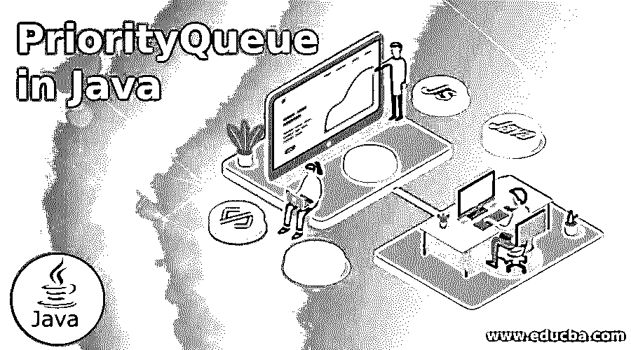
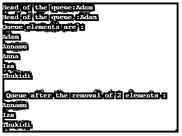

# Java 中的优先级队列

> 原文：<https://www.educba.com/priorityqueue-in-java/>




## Java 中优先级队列概述

通常，队列中的对象按 FIFO 顺序排列。即先进先出。在某些情况下，对象必须根据它们的优先级进行处理，这时，Java PriorityQueue 开始发挥作用。除此之外，PriorityQueue 还有一些特性，它们是:

*   这是一个无限的队列。
*   默认情况下，元素的顺序是自然的。
*   不允许空值。
*   不可比的对象不能用于创建 PriorityQueue。

**声明 Java 优先级队列**

<small>网页开发、编程语言、软件测试&其他</small>

可以使用下面的语法声明 Java PriorityQueue。

```
public class PriorityQueue<E> extends AbstractQueue<E> implements Serializable
```

### Java PriorityQueue 的构造函数

以下是 Java PriorityQueue 中常用的构造函数:

**1。优先级队列** **():** 优先级队列将被创建，其初始容量默认为 11。此外，元素基于自然排序进行排序。

**2。PriorityQueue** **(** **收藏** **<？extends****E****>c):**priority queue 将使用上述集合中的元素创建。

**3。优先级队列** **(int ic):** 优先级队列将使用提到的初始容量 ic 创建。此外，元素基于自然排序进行排序。

**4。PriorityQueue(int ic，Comparator <？超级 E >比较器:**优先级队列将使用提到的初始容量 ic 创建。此外，元素是基于上述比较器排序的。

**5。priority queue****(****priority queue****<？扩展****E****>c):**PriorityQueue 将使用上述 priority queue 中的元素创建。

**6。priority queue****(****sorted set****<？extends****E****>c):****将使用上述排序集合中的元素创建一个 PriorityQueue。**

 **### 方法

现在，让我们看看 Java PriorityQueue 中一些常用的方法:

**1。add(E e):** 调用该方法时，元素 E 将被添加到 PriorityQueue 中。

**2。size():** 将返回集合中元素的计数。

**3。清除****():**priority queue 中的所有元素都将被删除。

**4。比较器** **():** 返回用于队列排序的比较器。如果使用自然排序，将返回 null。

**5。包含** **(** **对象** **o):** 如果队列中包含提到的元素 o，将返回 true。

**6。迭代器** **():** 用于队列中元素的迭代器将被返回。

**7。提供****(****E****E):**提到的元素 E 将被插入队列中。

**8。peek****():**priority queue 的头将被检索，而不是删除。如果不存在任何元素，将返回 null。

**9。p** **oll():** 优先级队列的头将被检索并删除。如果不存在任何元素，将返回 null。

10。移除 **(** **对象** **o):** 提到的元素的单个实例将从队列中移除。

**11。toArray** **():** 返回队列中所有元素的数组。

**12。toArray** **(T[] a):** 将返回一个包含队列中所有元素的数组，其中的运行时间将与所述数组的运行时间相同。

### Java 优先级队列示例

下面给出了 Java 优先级队列的例子:

#### 示例#1

创建优先级队列的示例程序。

**代码:**

```
import java.util.Iterator;
import java.util.PriorityQueue;
class Main{
public static void main(String args[]){
//create a PriorityQueue
PriorityQueue<String> q=new PriorityQueue<String>();
//add elements to the queue
q.add("Anna");
q.add("Annamu");
q.add("Adam");
q.add("Iza");
q.add("Thukidi");
System.out.println("Head of the queue:"+q.element());
System.out.println("Head of the queue :"+q.peek());
//Retrieve elements in queue using iterator
System.out.println("Queue elements are :");
Iterator it=q.iterator();
while(it.hasNext())
{
System.out.println(it.next());
}
//remove the element from queue
q.remove();
//remove the head of the queue
q.poll();
System.out.println("\n Queue after the removal of 2 elements :");
//Retrieve elements in queue using iterator
Iterator<String> it2=q.iterator();
while(it2.hasNext())
{
System.out.println(it2.next());
}
}
}
```

**输出:**




**样本程序工作:**

*   创建优先级队列 q
*   向队列中添加元素。
*   打印队列的头。
*   使用迭代器打印队列中的所有元素。
*   删除两个元素。
*   删除两个元素后，打印队列中的所有元素。

#### 实施例 2

使用比较器创建优先级队列的示例程序。

**代码:**

```
import java.util.Comparator;
import java.util.Iterator;
import java.util.PriorityQueue;
class PriorityQueueExample{
public static void main(String[] args) {
//Create a custom comparator. In this, length of 2 strings are getting compared
Comparator<String> cmp = new Comparator<String>()
{
@Override
public int compare(String str1, String str2) {
return str1.length() - str2.length();
}
};
// PriorityQueue creation with Comparator
PriorityQueue<String> q = new PriorityQueue<>(cmp);
// Add elements to the Queue
q.add("Anna");
q.add("Annamu");
q.add("Adam");
q.add("Iza");
q.add("Thukidi");
q.add("Sam");
q.add("Elsa");
q.add("Kukku");
q.add("Mathu");
q.add("Radha");
// Remove elements from the Queue
while (!q.isEmpty()) {
System.ou*t*.println(q.remove());
}
}
}
```

**输出:**


**样本程序工作:**

*   创建一个定制的比较器，根据长度比较队列中的元素。
*   创建优先级队列 q
*   向队列中添加元素。
*   根据字符串的长度从队列中移除元素。
*   按照移除的顺序打印队列中的元素。

#### 实施例 3

通过使用不同的方法实现优先级队列的示例程序。

**代码:**

```
import java.util.*;
class Main{
public static void main(String args[]){
//create a PriorityQueue
PriorityQueue<String> q=new PriorityQueue<String>();
//add elements to the queue
q.add("Anna");
q.add("Annamu");
q.add("Adam");
q.add("Iza");
q.add("Thukidi");
System.out.println("Head of the queue:"+q.element());
System.out.println("Head of the queue :"+q.peek());
//Retrieve elements in queue using iterator
System.out.println("Queue elements are :");
Iterator it=q.iterator();
while(it.hasNext())
{
System.out.println(it.next());
}
//remove the element from queue
q.remove();
//remove the head of the queue
q.poll();
// Check whether the element Anna is present in queue using the method Contains()
boolean b = q.contains("Anna");
System.out.println("Is there any element Anna in the PriorityQueue ? " + b);
//Check whether the element Iza is present in queue using the method Contains()
boolean bl = q.contains("Iza");
System.out.println("Is there any element Anna in the PriorityQueue ? " + bl);
}
}
```

**输出:**


**样本程序工作:**

*   创建优先级队列 q
*   添加元素并打印队列头。
*   使用迭代器打印队列中的所有元素。
*   使用 Remove()和 poll()方法移除两个元素。
*   使用 Contains()方法检查两个元素 Anna 和 Iza 在队列中是否可用。

### 推荐文章

这是一个 Java 中 PriorityQueue 的指南。这里我们讨论 java PriorityQueue 的简介、构造函数、方法和例子。您也可以看看以下文章，了解更多信息–

1.  [Java 文字](https://www.educba.com/java-literals/)
2.  [Java 流过滤器](https://www.educba.com/java-stream-filter/)
3.  [Java 线程优先级](https://www.educba.com/java-thread-priority/)
4.  [Java bytearray output stream](https://www.educba.com/java-bytearrayoutputstream/)


**