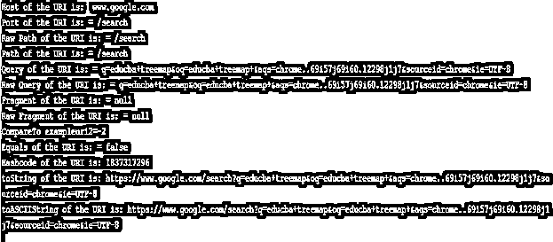

# Java.net URI

> 原文：<https://www.educba.com/java-dot-net-uri/>


## Java.net·URI 简介

Java.net 包提供了一个 URI 类，它包含从组件创建 URI 实例的方法，或解析这些组件的字符串形式，以访问和检索 URI 实例的几个组件。

### 什么是 URI？

统一资源标识符具有有助于特定资源识别的字符序列。此外，在某些协议的帮助下，它有助于资源表示在网络上的交互。关于这个特殊类的更多细节将在下面的章节中讨论。

<small>网页开发、编程语言、软件测试&其他</small>

**语法**

下面是 java.net·URI 类的语法。

```
scheme:[//[user:password@]host[:port]][/]path[?query][#fragment]
```

*   **scheme:** 该组件设计了与 URI 相关联的具体协议。尽管“//”在某些方案中是必需的，但在其他方案中并不使用。
*   **authority:** 该组件由不同的组件组成，如身份验证部分、主机和以冒号“:”开头的端口号。在第一部分中，身份验证部分由用户名和密码组成。同时，第二段主机可以是任何一个 ip 地址。第三段端口号是可选的。
*   **path:** 组件具有一个字符串，该字符串由服务器中特定资源的地址组成。
*   **查询:**该组件是无层次的数据，其中查询用于通过“？”找到特定的资源前面部分的问号。
*   **片段:**标识辅助资源的组件。它可以是标题，也可以是页面上的副标题。

### Java.net·URI 的课程是如何运作的？

正如已经讨论过的，URI 被称为统一资源定位器，它有助于识别 web 资源，如图像、级联样式表文件、视频等。，通过使用位置和名称。在这里，位置是访问或检索特定资源的机制。例如 HTTP://、FTP://等都是位置。除此之外，“名称”是特定资源的全局特定名称。让我们看一个例子，下面的网址:https://sample path/path/to/video . mkv 检索一个视频。在这里，这个特定地址的 sample-path/path/to/video.mkv 部分是 URN 或名称。

### 构造器

以下是 URI 的五个不同的构造函数。

*   **URI(字符串 st):** 通过解析字符串 st 将构建一个 URI
*   **URI( String scheme，String str，String frag):** 一个 URI 将由给定的组件构建而成。
*   **URI( String schm，String userinf，String host，int portnum，String path，String query，String frag):** 将从给定的组件中构建一个分层的 URI。
*   **URI( String schm，String host，String path，String frag):** 一个分层的 URI 将由给定的组件构成。
*   **URI( String schm，String suthorty，String path，String query，String frag):** 将根据给定的组件构建一个分层的 URI。

### Java.net URI 的方法

下面是执行几个操作的 URI 类的不同方法。

*   这个 URI 将会和另一个 URI 相提并论。
*   **create(String str):** 解析字符串 str 时将创建一个 URI
*   **equals(Object obj):** 将测试 URI 与对象 obj 是否相等
*   **getAuthority** ():返回 URI 的权限组件，该组件被解码。
*   **getFragment():** 返回解码后的 URI 片段分量。
*   **getHost():** 返回 URI 的主机组件，该组件被解码。
*   **getPath():** 返回解码后的 URI 路径分量。
*   **getPort():** 将返回 URI 端口号。
*   **getQuery():** 返回被解码的 URI 查询组件。
*   **getRawAuthority** ():返回 URI 的原始权限组件。
*   **getRawFragment():** 返回 URI 的原始片段组件。
*   **getRawPath():** 返回 URI 的原始路径组件。
*   **getRawQuery():** 返回 URI 的原始查询组件。
*   **getrawschespecificpart():**返回 URI 的原始方案特定部分。
*   **getRawUserInfo():** 返回 URI 的原始用户信息组件。
*   **getScheme():** 返回 URI 的方案组件。
*   **getSchemeSpecificPart():** 返回被解码的 URI 的方案特定部分。
*   **getUserInfo():** 返回被解码的 URI 的用户信息成分。
*   **hashCode():** 返回 URI 散列码值。
*   **isAbsolute():** 检查提供的 URI 是否是绝对的。
*   **isOpaque():** 检查提供的 URI 是否不透明。
*   **normalize():** URI 路径在调用这个方法时被规范化。
*   **parseServerAuthority():** 该方法将权限组件解析为用户信息、端口和主机组件。
*   **相对化(uri uri):** 给定 URI 相对化到指定的 URI。
*   **resolve(String str):** 通过解析提到的字符串并根据 URI 对其进行解析来构建新的 URI。
*   **resolve(uri uri):** 给定的 URI 针对 URI 被解析。
*   **toascistring():**提到的 URI 的内容作为 US-ASCII 字符串返回。
*   **toString():** 提到的 URI 的内容以字符串的形式返回。
*   **toURL():**URL 从提到的 URI 开始构建。

### 实现 Java.net URI 的示例

现在，让我们看一个 java.net uri 类的样本程序。

Java 程序演示 java.net.uri 类中的几个方法.//Java 程序演示 uri 类的方法

**代码:**

```
import java.net.*;
class URIexample
{
public static void main(String[] args) throws Exception
{
String str = "https://www.google.com/search?q=educba+treemap&oq=educba+treemap+&aqs=chrome..69i57j69i60.12298j1j7&sourceid=chrome&ie=UTF-8";
// Creation of new URI by parsing the string
URI exampleuri = new URI(str);
//different methods of <u>uri</u> class
System.out.println("Host of the URI is:  " + exampleuri.getHost());
System.out.println("Port of the URI is: = " + exampleuri.getPath());
System.out.println("Raw Path of the URI is: = " + exampleuri.getRawPath());
System.out.println("Path of the URI is: = " + exampleuri.getPath());
System.out.println("Query of the URI is: = " + exampleuri.getQuery());
System.out.println("Raw Query of the URI is: = " + exampleuri.getRawQuery());
System.out.println("Fragment of the URI is: = " + exampleuri.getFragment());
System.out.println("Raw Fragment of the URI is: = " + exampleuri.getRawFragment());
//another uri in order to demonstrate the method compareTo and equals
URI exampleuri2 = new URI(str + "fr");
System.out.println("CompareTo exampleuri2=" + exampleuri.compareTo(exampleuri2));
System.out.println("Equals of the URI is: = " + exampleuri.equals(exampleuri2));
System.out.println("Hashcode of the URI is: " + exampleuri.hashCode());
System.out.println("toString of the URI is: " + exampleuri.toString());
System.out.println("toASCIIString of the URI is: " + exampleuri.toASCIIString());
}
}
```

**Output:** 在这个程序中，使用了 java.net.uri 类的不同方法，并基于这些方法显示结果。




### 推荐文章

这是 Java.net·URI 的指南。这里我们讨论语法，构造函数，方法，工作方式，并举例对 java.net.uri 类进行详细解释。您也可以浏览我们的其他相关文章，了解更多信息——

1.  [Java 时间戳](https://www.educba.com/java-timestamp/)
2.  [Java 文件类](https://www.educba.com/java-file-class/)
3.  [在 Java 中完成](https://www.educba.com/finalize-in-java/)
4.  [Java 断言](https://www.educba.com/java-assertion/)


