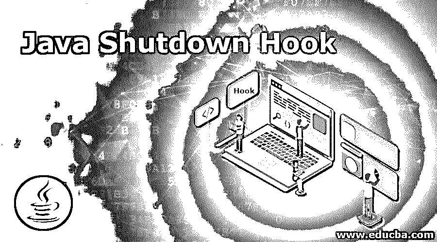

# Java 关机挂钩

> 原文：<https://www.educba.com/java-shutdown-hook/>




## Java 关机挂钩简介

java 中的一个特殊构造，它允许开发人员在 java 虚拟机关闭期间插入一段代码，这段代码将在 Java 虚拟机关闭期间执行，当我们必须在 Java 虚拟机关闭期间执行清理操作，并且虚拟机因操作系统取消请求或无法使用解决资源问题等原因而关闭时，这是非常必要的 一般构造，但可以通过使用 shutdown hook 提供的任意代码块来解决，它是 java.lang.Thread 类的扩展，在 java 虚拟机关闭期间，在公共 void run()方法内提供了必要的逻辑。

### Java 中关机钩子的工作原理

*   java 虚拟机有两种不同的关闭方式。它们是:
    *   一个被控制的过程。
    *   突然。
*   当发生以下任何情况时，受控制的进程都可能导致 java 虚拟机关闭:
    *   最后一个非守护线程的终止。例如，java 虚拟机随着主线程的退出而开始关闭。
    *   操作系统发出一个中断信号。例如，从操作系统注销或按 CTRL + C。
    *   exit()从 java 代码中调用。
*   当发生以下任何情况时，java 虚拟机可能会突然关闭:
    *   如果操作系统发出终止信号。
    *   getRuntime()。halt()是从 java 代码调用的。
    *   主机操作系统的意外死亡。例如，停电的情况。
*   java 虚拟机允许在完成关闭系统之前运行注册的功能。使用这些功能可以释放资源或执行某些内务处理活动。在 java 虚拟机术语中，这些函数被称为关闭挂钩。
*   这些关闭挂钩都已启动，但这些线程尚未启动。当 java 虚拟机开始关闭过程时，所有注册的钩子都按照一个未指定的顺序进行处理。java 虚拟机将在处理完所有钩子后停止。
*   考虑下面的程序来演示如何在 Java 中使用关闭挂钩:

**代码:**

<small>网页开发、编程语言、软件测试&其他</small>

```
//a class called mythr is defined and it extends a thread
class MyThr extends Thread
{
public void run()
{
System.out.println("The task of shut down hook is completed");
}
}
*//a class called shutdown is defined*
public class Shutdown
{
*//main method is called*
public static void main(String[] args)throws Exception
{
*//an instance of java runtime class is created*
Runtime roll=Runtime.getRuntime();
*//shutdown hook method is called using the instance of runtime class and the instance of mythr class is created*
roll.addShutdownHook(new MyThr());
System.out.println("The main starts to sleep. Press control and c to exit");
try
{
Thread.sleep(3000);
}
catch (Exception e)
{
}
}
}
```

上述程序的输出如下面的快照所示:


在上面的程序中，定义了一个名为 mthr 的类，它扩展了一个线程。然后定义了一个名为 shutdown 的类。然后调用 main 方法。然后创建一个 java 运行时类的实例。然后使用 runtime 类的实例调用 shutdown hook 方法，并创建 mythr 类的实例。方法 shutdown 钩子使得 shutdown 类中的 print 语句被打印出来，后跟 mythr 类的 run 方法中的语句。程序的输出如上面的快照所示。

### Java 关机挂钩示例

下面举几个例子:

#### 示例#1

Java 程序，演示在程序中使用关机挂钩:

**代码:**

```
//a class called shutdown is defined
public class ShutDown
{
//main method is called
public static void main(String[] args)
{
//an instance of java runtime class is created and a new thread constructor is passed as a parameter to shutdown hook method
Runtime.getRuntime().addShutdownHook(new Thread()
{
public void run()
{
System.out.println("the shut down hook is in progress !");
}
});
System.out.println("Termination of application ...");
}
}
```

上述程序的输出如下面的快照所示:


在上面的程序中，定义了一个名为 shut down 的类。然后调用 main 方法。然后创建一个 java 运行时类的实例，并将一个新的线程构造函数作为参数传递给 shutdown hook 方法。程序的输出显示在上面的快照中。

#### 实施例 2

Java 程序，演示在程序中使用关机挂钩:

**代码:**

```
//a class called demo is defined
public class Demo
{
// a class called mess is defined and it extends a thread and this function is called when the program is exiting
static class Mess extends Thread
{
public void run()
{
System.out.println("Good Bye.");
}
}
//main method is called
public static void main(String[] args)
{
try
{
//shutdown hook method is called to which the instance of the class mess is passed as a parameter
Runtime.getRuntime().addShutdownHook(new Mess());
// the beginning of the program is printed
System.out.println("Beginning of the program...");
// the wait time for the thread is printed
System.out.println("The wait time for the thread is three seconds...");
Thread.sleep(3000);
//Ending of the program is printed
System.out.println("Ending of the program...");
}
catch (Exception e)
{
e.printStackTrace();
}
}
}
```

上述程序的输出如下面的快照所示:


在上面的程序中，定义了一个类 mess，它扩展了一个线程，当程序退出时调用这个函数。然后调用 main 方法。然后调用 shutdown hook 方法，将类 mess 的实例作为参数传递给该方法。然后打印程序的开头。然后打印线程的等待时间。然后打印程序的结尾。程序的输出如上面的快照所示。

### Java 关机挂钩的优点

**Java 关机钩子有几个优点。他们是:**

*   java 虚拟机的重要特性是关闭挂钩，因为当 java 虚拟机关闭时，它们提供了清理资源或存储应用程序状态的能力。
*   当 java 虚拟机正常或突然关闭时，可以在运行时执行关闭挂钩。
*   在 java 虚拟机运行期间，可以通过运行时应用编程接口在任意时间点注册多个关闭挂钩。

### 结论

在本教程中，我们通过定义理解了 java 中的关闭钩子的概念，通过例子和它们的输出理解了 Java 中关闭钩子的工作原理。

### 推荐文章

这是一个 Java 关机钩子的指南。在这里，我们讨论了 Java 中的关闭钩子的工作原理和例子，以及程序和输出。您也可以阅读以下文章，了解更多信息——

1.  [java.net 套餐](https://www.educba.com/java-dot-net-package/)
2.  [Java 哈希码()](https://www.educba.com/java-hashcode/)
3.  [Java 8 中的可选类](https://www.educba.com/optional-class-in-java-8/)
4.  [爪哇的 EJB](https://www.educba.com/ejb-in-java/)


