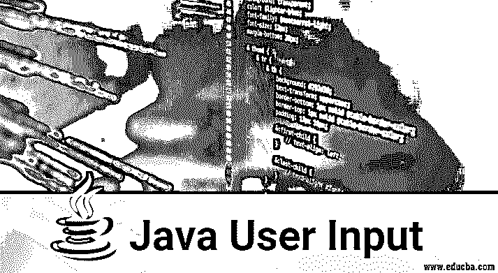
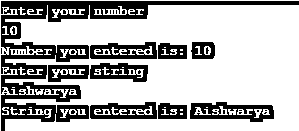
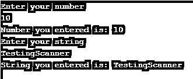
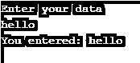

# Java 用户输入

> 原文：<https://www.educba.com/java-user-input/>




## Java 用户输入简介

在 Java 程序中，我们可以通过三种方式在命令行环境中读取用户的输入来获得用户输入，即 Java BufferedReader 类、Java Scanner 类和 Console 类。让我们详细讨论这些类。我们使用 Scanner 类来获取用户输入。这个程序要求用户输入一个整数、一个字符串和一个浮点数，它将被打印在显示器上。java.util 中的 scanner 类已经存在，因此我们可以将这个包添加到我们的软件中。首先，我们创建一个 Scanner 类对象并使用 Scanner 类方法。

### Java 用户输入的 3 种方式

有三种方法可以读取用户输入:

<small>网页开发、编程语言、软件测试&其他</small>

1.  Java BufferedReader 类
2.  Java 扫描器类
3.  使用控制台类

下面提到了这三个类别；让我们详细讨论一下:

#### 1.Java BufferedReader 类

它扩展了 reader 类。BufferedReader 从字符输入流中读取输入并缓冲字符，以便提供对所有输入的有效读取。对于缓冲来说，默认大小很大。当用户发出任何读取请求时，相应的请求会发送到阅读器，阅读器会发出字符或字节流的读取请求；因此，BufferedReader 类包装在另一个[输入流中，比如 FileReader](https://www.educba.com/javascript-filereader/) 或 InputStreamReaders。

**例如:**

```
BufferedReader reader = new BufferedReader(new FileReader("foo.in"));
```

BufferedReader 可以使用 readLine()方法逐行读取数据。

BufferedReader 可以让代码的执行速度更快。

##### 构造器

BufferedReader 有两个构造函数，如下所示:

**1。buffered Reader(Reader Reader):**用于创建一个缓冲的输入字符流，它使用输入缓冲区的默认大小。

**2。BufferedReader(Reader reader，input size):** 用于创建一个缓冲的输入字符流，它使用为输入缓冲区提供的大小。

###### 功能

*   **int read:** 用于读取单个字符。
*   **int read(char[] cbuffer，int offset，int length):** 用于读取数组中指定部分的字符。
*   **String readLine ():** 用于逐行读取输入。
*   **布尔就绪():**用于测试输入缓冲区是否准备好读取。
*   **长跳:**用于跳过字符。
*   **void close():** 关闭输入流缓冲区和与流相关的系统资源。

当用户从键盘输入字符时，它被设备缓冲区读取，然后从 System.in 读取，传递到缓冲区读取器或输入流读取器，并存储在输入缓冲区中。

**代码:**

```
import java.util.*;
import java.lang.*;
import java.io.*;
import java.io.BufferedReader;
import java.io.IOException;
import java.io.InputStreamReader;
/*package whatever //do not write package name here */
class BufferedReaderDemo {
public static void main (String[] args) throws NumberFormatException, IOException {
System.out.println("Enter your number");
BufferedReader br = new BufferedReader(new InputStreamReader(System.in));
int t = Integer.parseInt(br.readLine());
System.out.println("Number you entered is: " + t);
System.out.println("Enter your string");
String s  = br.readLine();
System.out.println("String you entered is: " + s);
}
}
```

**输出:**




**从 InputStreamReader 和 BufferedReader 读取的程序:**

```
import java.io.BufferedReader;
import java.io.IOException;
import java.io.InputStreamReader;
public class BufferedReaderDemo {
public static void main(String args[]) throws IOException{
InputStreamReader reader = new InputStreamReader(System.in);
BufferedReader br = new BufferedReader(reader);
System.out.println("What is your name?");
String name=br.readLine();
System.out.println("Welcome "+name);
}
}
```

**输出:**


#### 2.Java 扫描器类

scanner 类是用于从键盘读取用户输入的类之一。它可以在 util 包中获得。默认情况下，Scanner 类使用主要是空格的分隔符来分隔用户输入。扫描仪有许多方法来读取控制台输入的许多原始类型，如双精度，整数，浮点，长，布尔，短，字节等。这是在 java 中获得输入的最简单的方法。Scanner 类[实现迭代器](https://www.educba.com/iterators-in-python/)和可关闭接口。扫描器提供了 nextInt()和许多基本类型方法来读取基本类型的输入。next()方法用于字符串输入。

##### 构造器

*   **Scanner(文件源):**它构造一个扫描器来读取指定的文件。
*   **Scanner(文件源，字符串 charsetName):** 它构造一个扫描器来读取指定的文件。
*   **Scanner(InputStream source)，Scanner(InputStream source，String charsetName):** 它构造一个扫描器，从指定的输入流中读取。
*   **Scanner(0 readable source):**它构造一个扫描器来读取指定的可读源。
*   **Scanner(String source):** 构造一个扫描器，从指定的字符串源读取。
*   **Scanner(readable bytechannel source):**它构造了一个扫描器来读取指定的通道源。
*   **Scanner(readable bytechannel source，String charsetName):** 它构造一个扫描器，从指定的通道源读取。

##### 功能

下面是通过 Scanner 类从控制台输入中扫描原语类型的方法。

*   nextInt(),
*   nextFloat()，
*   nectDouble()，
*   nextLong()，
*   nextShort()，
*   nextBoolean()，
*   nextDouble()，
*   nextByte()，

**从扫描仪类读取的程序:**

```
Using scanner class.
import java.util.Scanner;
/*package whatever //do not write package name here */
class ScannerDemo {
public static void main (String[] args) {
Scanner sc = new Scanner(System.in);
System.out.println("Enter your number");
int t = sc.nextInt();
System.out.println("Number you entered is: " + t);
System.out.println("Enter your string");
String s  = sc.next();
System.out.println("String you entered is: " + s);
}
}
```

**输出:**




#### 3.使用控制台类

使用 console 类从命令行界面读取输入。它在 IDE 上不工作。

**代码:**

```
public class Main
{
public static void main(String[] args)
{
// Using Console to input data from user
System.out.println("Enter your data");
String name = System.console().readLine();
System.out.println("You entered: "+name);
}
}
```

**输出:**




### 推荐文章

这是一个 Java 用户输入指南。这里我们讨论在命令行环境中从用户那里读取 Java 用户输入的 3 种方法。本文向您介绍了使用 Java 可以探索的所有输入的基本概念。你也可以看看下面这篇文章。

1.  [在 Java 中覆盖](https://www.educba.com/overriding-in-java/)
2.  [Java 中的 spring layout](https://www.educba.com/springlayout-in-java/)
3.  [Java 中的 JFrame](https://www.educba.com/jframe-in-java/)
4.  [Java 中的包装类](https://www.educba.com/wrapper-class-in-java/)


