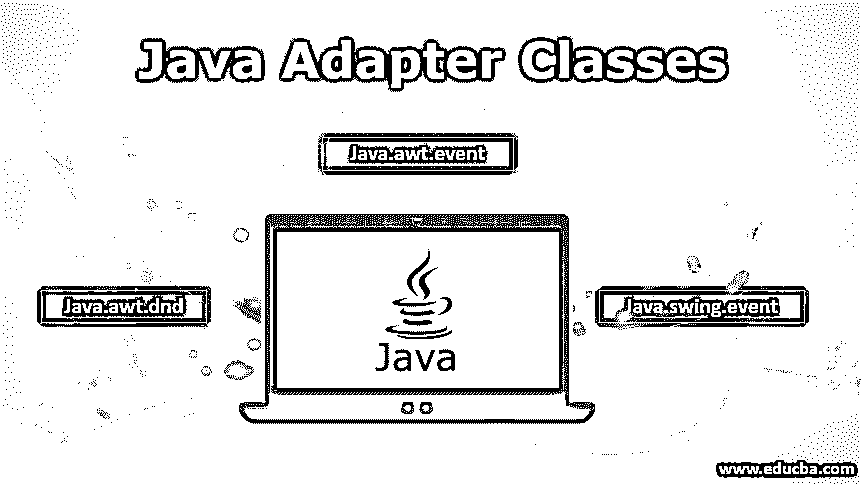

# Java 适配器类

> 原文：<https://www.educba.com/java-adapter-classes/>




## Java 适配器类简介

Java 中的适配器类并不新鲜。它们用于提供侦听器接口的实现。适配器类的优点是它节省了代码。如果我们使用适配器接口继承适配器类，我们将不会被迫实现所有的侦听器接口方法。也就是说，在三个包中可以找到 Java 适配器类。这三个软件包是:

*   java.awt .事件
*   java.awt. dnd
*   java.swing .事件

此外，Adapter 类的另一个优点是，当我们想要处理一些由特定事件侦听器接口处理的事件时，它们非常有用。

<small>网页开发、编程语言、软件测试&其他</small>

### 使用语法在 Java 中使用适配器类

正如我们在介绍中注意到的，我们在三个包中找到了适配器类。我们现在将看到所有三个包中各自适配器类的相应侦听器接口。

*   java.awt .事件适配器类
*   java.awt.dnd 适配器类
*   java **。**摇摆。事件适配器类

#### 1.java.awt .事件适配器类

下面是一些适配器类及其相应的侦听器接口。这些都存在于 Java 包的抽象窗口工具包中。

| **适配器类别** | **监听器接口** |
| 窗口适配器 | 窗口监听器 |
| 键盘适配器 | 键盘监听器 |
| 鼠标适配器 | 鼠标监听器 |
| 鼠标移动适配器 | MouseMotionListener |
| 焦点适配器 | 焦点听众 |
| 组件适配器 | 组件监听器 |
| 集装箱适配器 | 集装箱监听器 |
| HierarchyBoundsAdapter | HierarchyBoundsListener |

##### WindowAdapter 类

下面的代码给出了 Adapter 类的语法，它让我们了解了 WindowAdapter 类的外观和语法。

**语法:**

```
AdapterExample()
{
f=new Frame("Hello World");
f.addWindowListener(new WindowAdapter()
public void windowClosing(WindowEvent e)
{
f.close();
}
}
```

##### KeyAdapter 类

下面的代码给出了 KeyAdapter 类的语法。

**语法:**

```
public abstract keyAdapter Class
extends Object
Implements KeyListener
```

##### MouseAdapter 类

下面的代码给出了 MouseAdapter 类的语法。

**语法:**

```
MouseAdapterExample()
{
f=new Frame("Mouse Adapter");
f.addMouseListener(this);
f.setSize(100,100);
f.setLayout(null);
f.setVisible(false);
}
```

##### MouseMotionAdapter 类

下面的代码给出了 MouseMotionAdapter 类的语法。

**语法:**

```
MouseMotionAdapterExample()
{
f=new Frame("Adapter for Mouse Motion");
f.addMouseMotionListener(this);
f.setSize(100,100);
f.setLayout(null);
f.setVisible(false);
}
public void mouseDragged(MouseEvent e)
{
Graphics g=f.getGraphics();
g.setColor(Color.ORANGE);
g.fillOval(e.getX(),e.getY(),20,20);
}
```

##### 焦点适配器类

下面的代码给出了 FocusAdapter 类的语法。

**语法:**

```
public abstract class FocusAdapter
extends Object
Implements FocusListener
```

##### 组件适配器类

下面的代码给出了 ComponentAdapter 类的语法。

**语法:**

```
class MyAdapter extends ComponentAdapter
{
public void componentMoved(ComponentEvent e)
{
int a = e.getComponent().getX();
int b = e.getComponent().getY();
System.out.println("Value of X " + a);
System.out.println("Value of Y: " + b);
}
}
```

##### 容器适配器类

下面的代码给出了 ContainerAdapter 类的语法。

**语法:**

```
public abstract class ContainerAdapter
extends Object
implements ContainerListener
```

##### HierarchyBoundsAdapter 类

下面的代码给出了 HierarchyBoundsAdapter 类的语法。

**语法:**

```
public abstract class HierarchyBoundsAdapter
extends Object
implements HierarchyBoundsListener 
```

#### 2.java.awt.dnd 适配器类

下面是 awt.dnd 包中使用的一些适配器类。它们被列在一个表格里。

| **适配器类别** | **监听器接口** |
| DragSourceAdapter | DragSourceListener |
| DragTargetAdapter | DragTargetListener |

在这种情况下，在各自的包下有两个适配器类，称为。我们将看到两个适配器类的语法，并研究各自包下的代码。

##### DragSourceAdapter 类

下面的代码给出了 DragSourceAdapter 类的语法。

**语法:**

```
public abstract class DragSourceAdapter
extends Object
implements DragSourceAdapterListener
```

##### DragTargetAdapter 类

下面的代码给出了 DragTargetAdapter 类的语法。

**语法:**

```
public abstract class DragTargetAdapter
extends Object
implements DragTargetAdapterListener
```

#### 3.java.swing .事件适配器类

下面是 swing 中使用的一些类。事件包。它们被列在一个表格里。

| **适配器类别** | **监听器接口** |
| MouseInputAdapter | MouseInputListener |
| InternalFrameAdapter | InternalFrameListener |

在这种情况下，我们注意到两个适配器类及其侦听器接口。javax 包。挥棒。事件有两个适配器类，分别在下表中列出。

##### MouseInputAdapter 类

下面是提供 MouseInputAdapter 类语法的代码。

**语法:**

```
public abstract class MouseInputAdapter
extends MouseAdapter
implements MouseInputListener
```

##### InternalFrameAdapter 类

下面是提供 InternalFrameAdapter 类语法的代码。

**语法:**

```
public abstract class InternalFrameAdapter
extends Object
implements InternalFrameListener
```

### 说明

适配器类基本上用于将类声明为抽象类的情况。只是工作基于不同的功能，包括 Java 类的工作，它们是不同 Java 包的一部分。Java 中有三个包，它们有不同的适配器类和监听器接口。适配器类被用在许多使用服务器的情况下，并且有与 SQL 数据库的[连接。](https://www.educba.com/database-in-sql/)

有不同的功能，而且大部分都在 Android 编程中使用。适配器类是 [Java 编程中众所周知的功能，这有助于](https://www.educba.com/what-is-java/)编码人员了解许多可以通过 Swing 方法使用的应用程序。有许多想法可以用来开发 Java 中的适配器类方法。还可以合并循环来开发一些其他类型的功能。

### 结论

在本文中，我们看到了工作，我们看到有三个包含适配器类的主要包。我们看到了所有适配器类的语法，也提供了一些工作代码。适配器类在 Java 中基本上是唯一的，它们是 Java 中 Swing 功能的一部分。

### 推荐文章

这是 Java 适配器类的指南。在这里，我们讨论基本概念、适配器类及其相应的侦听器接口，以及适配器类的语法工作。您也可以阅读以下文章，了解更多信息——

1.  [如何用 Java 创建 Webservice？](https://www.educba.com/how-to-create-webservice-in-java/)
2.  [Java 中的转换](https://www.educba.com/conversion-in-java/)
3.  [Java WindowListener](https://www.educba.com/java-windowlistener/)
4.  [Java KeyListener](https://www.educba.com/java-keylistener/)


