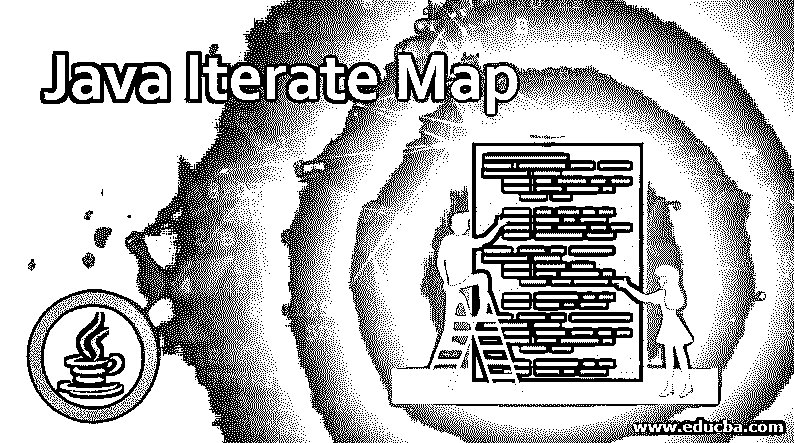
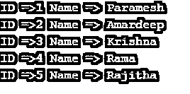
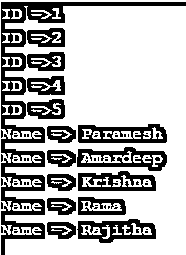
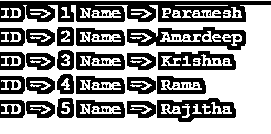
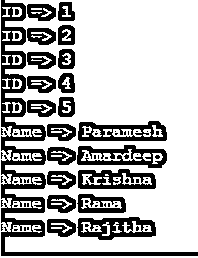
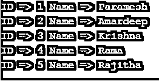

# Java 迭代图

> 原文：<https://www.educba.com/java-iterate-map/>




## Java 迭代映射简介

迭代地图定义为从地图集合中提取一组数据。在大多数实时情况下，我们在地图上存储了大量数据。开发人员想要获取这些数据；他必须迭代整个地图。地图存储在 util 中。地图包。在这个主题中，我们将学习 Java 迭代映射。地图中的迭代可以通过三种方式完成。

*   为每一个
*   正常 for 循环
*   带有迭代器的 While 循环

### 什么是地图？

1.Map 是一个键和值对的结构化集合。地图是一个界面。所以，映射实现成

<small>网页开发、编程语言、软件测试&其他</small>

*   散列表
*   LinkedHashMap
*   树图

2.入口是地图的子界面。因此，可以通过条目名称访问它。它返回地图的集合视图。地图。该条目提供了获取键和值对的方法。

### 重要方法

*   **put(Object keyValue，Object objectValue):** 用于在地图中插入一些值。
*   **keySet():** 用于获取一个密钥对集合。
*   **entrySet():** 用于设置映射的键和值。
*   **size():** 用于获取地图尺寸。
*   **getKey():** 用于获取一个键值。
*   **getValue():** 用于获取一个键映射值。

### 迭代在 Map 中是如何工作的？

如上所述，Map 可以用 forEach、normal for 和 while 循环进行迭代。我们会通过句法来理解。

#### 1.为每一个

**语法:**

```
Map<DataType, DataType>map = new HashMap<DataType, DataType>();
map.forEach((key, value) -> //logic
```

#### 2.for with entrySet()

**语法:**

```
Map<DataType,DataType> map= new HashMap<DataType,DataType>();
for (Map.Entry<DataType,DataType> set: map.entrySet())
//logic
}
```

#### 3.带有迭代器的 While 循环

**语法:**

```
Map<String, String> mapObj = new HashMap<>();
Iterator iterator= mapObj .entrySet().iterator();
while (iterator.hasNext()) {
//logic
}
```

根据需求，我们可以用上述任何一种方法迭代地图。

### Java 迭代图示例

下面举几个例子

#### 1.使用 forEach 示例映射迭代

**代码:**

```
import java.util.HashMap;
import java.util.Map;
public class ForEachMapIteration {
public static void main(String[] args) {
// creating a hashmap object
Map<Integer, String> names = new HashMap<>();
// adding key and values to hash map
names.put(1, "Paramesh");
names.put(2, "Amardeep");
names.put(3, "Venkatesh");
names.put(4, "Ramesh");
names.put(5, "Suresh");
names.put(3, "Krishna");
names.put(4, "Rama");
names.put(5, "Rajitha");
// iterating key and value with forEach loop
names.forEach((key, value) -> {
System.out.println("ID =>" + key + " Name => " + value);
});
}
}
```

**输出:**




**说明:**

正如您在上面的代码中看到的，我们已经用 forEach 迭代了 map

#### 2.使用 forEach 循环示例分别映射键和值迭代

**代码:**

```
package com.map;
import java.util.HashMap;
import java.util.Map;
public class ForEachKeyValueMapIteration {
public static void main(String[] args) {
// creating a hashmap object
Map<Integer, String> names = new HashMap<>();
// adding key and values to hash map
names.put(1, "Paramesh");
names.put(2, "Amardeep");
names.put(3, "Venkatesh");
names.put(4, "Ramesh");
names.put(5, "Suresh");
names.put(3, "Krishna");
names.put(4, "Rama");
names.put(5, "Rajitha");
// iterating ids with forEach loop
names.forEach((key, value) -> {
System.out.println("ID =>" + key);
});
// iterating names with forEach loop
names.forEach((key, value) -> {
System.out.println("Name => " + value);
});
}
}
```

**输出**:




**说明:**

正如您在上面的输出中看到的，我们还可以使用 forEach 循环分别获取键和值。

#### 3.使用 for 循环的映射迭代示例:

**代码:**

```
import java.util.HashMap;
import java.util.Map;
import java.util.Map.Entry;
public class ForMapIteration {
public static void main(String[] args) {
// creating a hashmap object
Map<Integer, String> names = new HashMap<>();
// adding key and values to hash map
names.put(1, "Paramesh");
names.put(2, "Amardeep");
names.put(3, "Venkatesh");
names.put(4, "Ramesh");
names.put(5, "Suresh");
names.put(3, "Krishna");
names.put(4, "Rama");
names.put(5, "Rajitha");
// iterating key and value with for loop
for (Entry<Integer, String> entry : names.entrySet())
System.out.println("ID => " + entry.getKey() + " Name => " + entry.getValue());
}
}
```

**输出:**




**说明:**

正如你在上面的代码中看到的，我们已经用 for 循环迭代了 map。

#### 4.使用 for 循环分别映射键和值迭代示例:

**代码:**

```
import java.util.HashMap;
import java.util.Map;
public class ForKeyAndValueMapIteration {
public static void main(String[] args) {
// creating a hashmap object
Map<Integer, String> names = new HashMap<>();
// adding key and values to hash map
names.put(1, "Paramesh");
names.put(2, "Amardeep");
names.put(3, "Venkatesh");
names.put(4, "Ramesh");
names.put(5, "Suresh");
names.put(3, "Krishna");
names.put(4, "Rama");
names.put(5, "Rajitha");
//fetching ids
for (Integer id : names.keySet())
System.out.println("ID => " + id);
// fetching names
for (String name : names.values())
System.out.println("Name => " + name);
}
}
```

**输出:**




**说明:**

正如您在上面的输出中看到的，我们也可以用 for 循环分别获取键和值。

#### 5.使用 while 循环和迭代器的映射迭代示例:

**代码:**

```
import java.util.HashMap;
import java.util.Iterator;
import java.util.Map;
import java.util.Set;
public class WhileIteratorLoopMap {
public static void main(String[] args) {
// creating a hashmap object
Map<Integer, String> names = new HashMap<>();
// adding key and values to hash map
names.put(1, "Paramesh");
names.put(2, "Amardeep");
names.put(3, "Venkatesh");
names.put(4, "Ramesh");
names.put(5, "Suresh");
names.put(3, "Krishna");
names.put(4, "Rama");
names.put(5, "Rajitha");
//get entry set from map
Set set = names.entrySet();
//get iterator from set
Iterator iterator = set.iterator();
//fetching id and names with while loop
while (iterator.hasNext()) {
Map.Entry entry = (Map.Entry) iterator.next();
System.out.println("ID =>"+entry.getKey() + " Name => " + entry.getValue());
}
}
}
```

**输出:**




**说明:**

正如你在上面的代码中看到的，我们已经用迭代器和 while 循环迭代了 map。

**Note:** All the cases output would be the same, but the forEach loop is recommended for development because it has less run time.

### 结论–Java 迭代图

可以通过入口接口的 for、forEach 和 while 循环来迭代映射。我们还可以分别迭代键和值，不会有任何错误。

### 推荐文章

这是一个 Java 迭代映射指南。在这里，我们将讨论迭代在 Map 中是如何工作的，以及方法和例子。您也可以看看以下文章，了解更多信息–

1.  [Java 中的 HashMap](https://www.educba.com/hashmap-in-java/)
2.  [Java 中的堆栈类](https://www.educba.com/stack-class-in-java/)
3.  [Java 中的最终类](https://www.educba.com/final-class-in-java/)
4.  [Java 中的嵌套类](https://www.educba.com/nested-class-in-java/)


