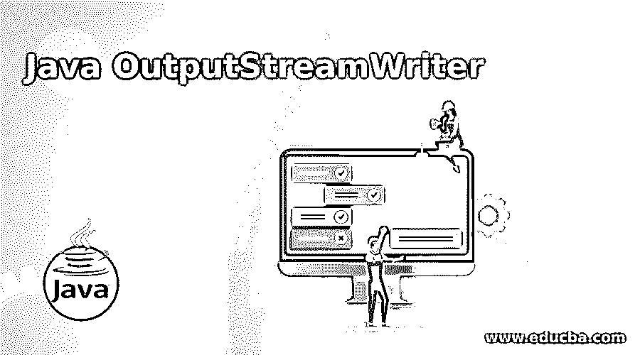
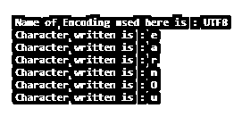
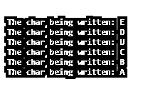
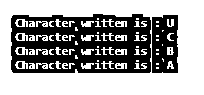

# Java OutputStreamWriter

> 原文：<https://www.educba.com/java-outputstreamwriter/>




## Java OutputStreamWriter 的定义

OutputStreamWriter 是 java.io 类中的一个类，用于将字符流转换为字节流。这种字符到字节的转换是使用指定的字符集编码完成的。它包含一个 write()方法，该方法调用编码转换器将一个字符转换成字节流，由此产生的字节被发送到缓冲区，在缓冲区中累积并发送到 outputstream。字符被传递给 write()方法而没有被缓冲，因此导致频繁的转换器调用，从而与 BufferedWriter 一起使用。

**语法**:

<small>网页开发、编程语言、软件测试&其他</small>

```
public class OutputStreamWriter extends Writer
```

该语法描述了这是一个公共类，这意味着它可以从项目中的任何地方实例化。这个类是抽象类 Writer 类的直接子类，处理字符流的写入。

### OutputStreamWriter 在 Java 中是如何工作的？

*   OutputStreamWriter 类是 Writer 类的直接子类，有助于写入输出流。这个类将字符流中的每个字符转换成字节流，从而充当字符流和字节流之间的桥梁。
*   对于这种转换，它使用编码器的指定字符集，如 UTF-8 等。，作为参数传递给它的 write 方法。因为传递给 write 方法的字符没有被缓冲，所以输出字节流在写入输出流之前被缓冲。
*   为了优化应用程序的性能以及避免频繁调用转换器，建议将它与 BufferedWriter 一起使用。

### 构造器

为了创建 OutputStreamWriter 类的实例，我们有以下 4 种类型的构造函数:

#### 1.OutputStreamWriter(输出流输出)

此构造函数使用默认字符编码返回 OutputStreamWriter 的实例。这是创建实例最简单的方法。

**举例:**

```
FileOutputStream fileObj = new FileOutputStream (String path); //
```

这是 OutputStream 的一个实例。

```
OutputStreamWriter output = new OutputStreamWriter (fileObj);//
```

上述实例作为一个参数传递，以指定需要写入输出的文件。

#### 2.output streamwriter(output stream out，CharsetcsObj)

此构造函数返回使用指定字符集的 OutputStreamWriter 实例。这里指定的 Charset 可以像 Charset.forName ( "UTF8 ")，创建 charset 的一个实例作为方法的参数。

**举例:**

```
OutputStreamWriter output = new OutputStreamWriter (fileObj,Charset.forName ( "UTF8"));
```

#### 3.output streamwriter(output stream out，CharsetEncoder enc)

此构造函数返回使用指定字符集编码器的 OutputStreamWriter 的实例。

**举例:**

```
CharsetEncoderencoder = B2CConverter.UTF_8.newEncoder ()
OutputStreamWriter output = new OutputStreamWriter (fileObj, encoder);
```

#### 4\. OutputStreamWriter (OutputStream out, StringcsName)

此构造函数返回使用指定字符集名称的 OutputStreamWriter 实例。

**举例:**

```
OutputStreamWriter output = new OutputStreamWriter (fileObj,"UTF-8");
```

这里，用于将字符流转换成字节流的字符集名称是“UTF-8”。

### 方法

**1。close** ():-这个方法有助于在刷新流之后关闭它。不需要任何参数，此方法不返回任何内容。

**语法**

```
public void close ()
```

**2。flush** ():-这个方法有助于刷新流。不需要任何参数，此方法不返回任何内容。

**语法**

```
public void flush ()
```

**3。getEncoding** ():-这个方法有助于检索给定的 OutputStreamWriter 实例正在使用的 charset 编码的名称。调用方法时不需要传递任何参数。

**语法**

```
public String getEncoding ()
```

返回实例使用的编码名称的字符串表示形式。

**4。write (char[] charbuf，int off，int len)** :-这个方法有助于写入一个字符数组的特定部分，该数组从偏移量位置开始，长度为' len '。如果给定任何输入不正确或为空，此方法将引发一个异常。

**语法**

```
public void write (char[] charbuf, int off, int len)
```

这个方法只是将转换后的字节流写入输出文件。它不返回任何内容。

**5。write (int ch)** :-这个方法用于将单个字符写入流中，指定它的 ASCII 字符。如果给定任何输入不正确或为空，此方法将引发一个异常。

**语法**

```
public void write (int ch)
```

这个方法只是将转换后的字节流写入输出文件。它不返回任何内容。

**6。write(String str，int off，int len)** :这个方法用于将一个字符串的一部分从给定的偏移量和给定的长度开始写到流中。

**语法**

```
public void write (String strObj, int offset, int lgth)
```

这个方法只是将转换后的字节流写入输出文件。它不返回任何内容。

### 例子

下面是 Java OutputStreamWriter 的例子:

#### 示例 1

```
import java.io.*;
public class StreamDemo
{
public static void main (String[] args)
{
String data = "LetsLearnOuptputStreamClass";
try
{
OutputStream file = new FileOutputStream ("abc.txt");
OutputStreamWriter outObj = new OutputStreamWriter (file);
FileInputStream inFileObj = new FileInputStream ("abc.txt");
outObj.write (data, 5, 6);
outObj.flush ();
System.out.println ( "Name of Encoding used here is : " + outObj.getEncoding ());
for (int i = 0; i<6; i++)
{
System.out.println ( "Character written is : " + (char) inFileObj.read());
}
outObj.close ();
}
catch (Exception ex)
{
System.out.println ( "Error Occurred");
ex.printStackTrace ();
}
}
}
```

**输出:**




#### 示例 2

```
import java.io.*;
public class StreamDemo
{
public static void main (String[] args)
{
try
{
OutputStream g = new FileOutputStream ( "C:/Users/savij/Desktop/abc.txt");
OutputStreamWriter outObj = new OutputStreamWriter (g);
FileInputStream in = new FileInputStream ( "C:/Users/savij/Desktop/abc.txt");
outObj.write (69);
outObj.write (68);
outObj.write (85);
outObj.write (67);
outObj.write (66);
outObj.write (65);
outObj.flush ();
for (int i = 0; i< 6; i++)
{
System.out.println ( "The char being written: " + (char) in.read());
}
outObj.close ();
}
catch (Exception ex)
{
System.out.println ( "Error");
ex.printStackTrace ();
}
}
}
```

**输出:**




#### 示例 3

```
//package Proc;
import java.io.*;
public class StreamDemo
{
public static void main (String[] args)
{
char[] data = {'E','D','U','C','B','A'};
try
{
OutputStream file = new FileOutputStream ( "abc.txt");
OutputStreamWriter outObj = new OutputStreamWriter (file);
FileInputStream inFileObj = new FileInputStream ( "abc.txt");
outObj.write (data,2, 4);
outObj.flush ();
for (int i = 0; i<4; i++)
{
System.out.println ( "Character written is : " + (char) inFileObj.read());
}
outObj.close ();
}
catch (Exception ex)
{
System.out.println ( "Error Occurred");
ex.printStackTrace ();
}
}
}
```

**输出:**




### 结论–Java output streamwriter

OutputStreamWriter 是一个实用程序，充当从字符流到字节流的桥梁。它包含一个 write 方法，该方法采用字符形式的输入，并使用指定的字符集或字符集编码器(例如 UTF-8)将它们转换为字节。如果使用 BufferredWriter 而不是 Writer 将结果字节流写入输出流，则可以提高该类的效率和性能。

### 推荐文章

这是一个 Java OutputStreamWriter 的指南。在这里，我们还将讨论 Java OutputStreamWriter 的定义和工作方式，以及 Java OutputStreamWriter 的各种类。您也可以看看以下文章，了解更多信息–

1.  [java.net 套餐](https://www.educba.com/java-dot-net-package/)
2.  [JavaScript 枚举](https://www.educba.com/javascript-enum/)
3.  [Java 8 中的可选类](https://www.educba.com/optional-class-in-java-8/)
4.  [JavaScript 键盘事件](https://www.educba.com/javascript-keyboard-events/)


