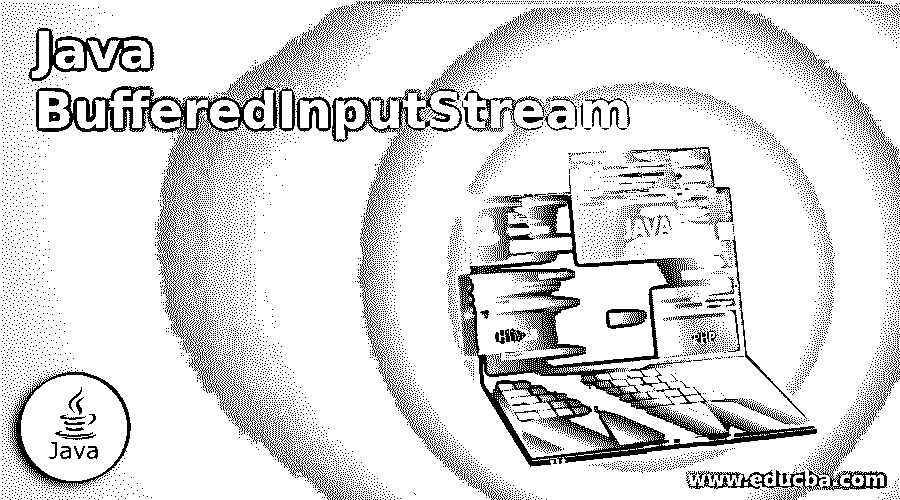
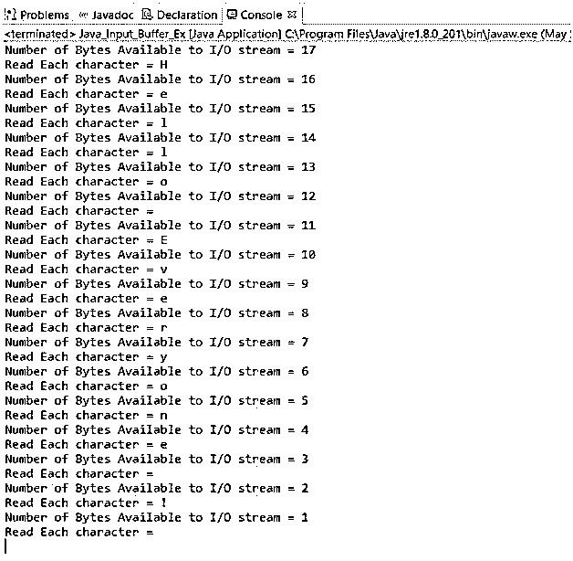
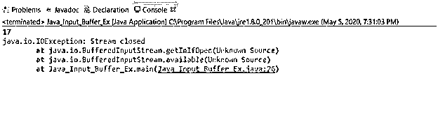
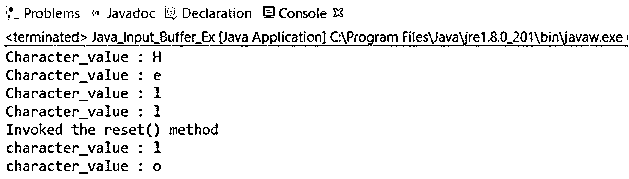
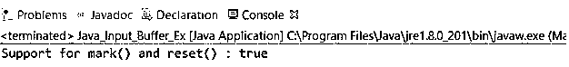
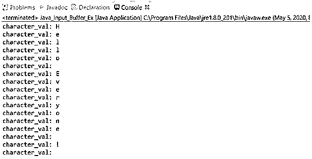
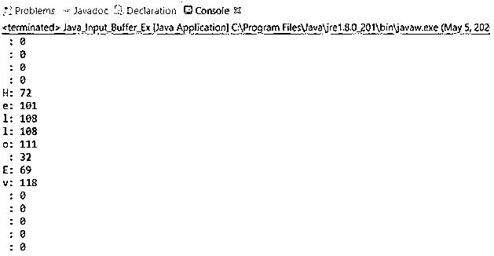
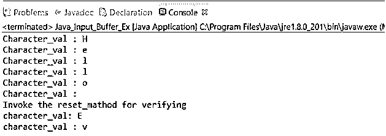
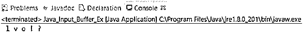

# Java BufferedInputStream

> 原文：<https://www.educba.com/java-bufferedinputstream/>




## Java BufferedInputStream 简介

Java BufferedInputStream 是一种机制，其中输入缓冲区能够在内部为缓冲区分配一些字节作为流的一部分。每当 BufferedInputStream 被调用或创建时，都会创建一个内部数组，然后它会执行任何类型的进一步功能，将字节添加到流中。BufferedInputStream 类中的缓冲机制提供了灵活性，并增强了缓冲区的整体性能。如果流中丢失了一些信息，它会通过分配这些信息来填充被清空的位置。

### 句法

```
public class BufferedInputStream extends FilterInputStream
```

语法流程如下:

<small>网页开发、编程语言、软件测试&其他</small>

一个名为 BufferedInputStream 的类将用于获取所有方法及其与要使用 FilterInputStream 扩展的类相关的输入参数。

#### 构造器

Java BufferedInputStream 类支持两种类型的构造函数，即:

```
BufferedInputStream(InputStream in)
```

这有助于创建 BufferedInputStream，并将其参数作为输入流保存到该缓冲区中，此外，该参数在以后的某个时间点用于输入流流。

```
BufferedInputStream(input stream in, int size)
```

此构造函数创建一个具有特定缓冲区大小的 bufferedInputStream，并保存其参数，以便稍后在某个时间点根据时间和大小插入到流中。

#### 方法

这些是 Java BufferedInputStream 类支持的方法。

```
int available()
void close()
void mark(int readlimit)
boolean markSupported()
int read()
int read(byte[] b, int off, int len)
void reset()
long skip(long n)
int available()
```

它只是提供了对提供给输入流的字节数的估计，调用下一个输入流方法也不应该妨碍前一个方法向输入流插入字节。也可以说，它的返回类型是作为输入流传递时可以读取或跳过的估计字节数。

### 实现 Java BufferedInputStream 的示例

下面是提到的一些例子:

#### 示例#1

这个程序演示了 BufferedInputStream 类的 int 可用方法:

**代码:**

```
import java.io.BufferedInputStream;
import java.io.FileInputStream;
import java.io.IOException;
import java.io.InputStream;
public class Java_Input_Buffer_Ex {
public static void main(String[] args) throws Exception{
BufferedInputStream inpt_smpl = null;
FileInputStream sample_input_stream = null;
try {
sample_input_stream = new FileInputStream("C:\\Users\\adutta\\anu_test.txt");
inpt_smpl = new BufferedInputStream(sample_input_stream);
while( inpt_smpl.available() > 0 ) {
Integer No_of_bytes = inpt_smpl.available();
System.out.println("Number of Bytes Available to I/O stream = " + No_of_bytes );
char ch =  (char)inpt_smpl.read();
System.out.println("Read Each character = " + ch );
}
} catch(Exception e) {
e.printStackTrace();
}
finally {
if(sample_input_stream!=null)
sample_input_stream.close();
if(inpt_smpl!=null)
inpt_smpl.close();
}
}
}
```

**输出:**




**Note:** Make sure before performing the programs, it is a must to save the text file with some data that the inputBufferStream will invoke later.

```
void close()
```

**解释:**顾名思义，作为 Java BufferedInputStream 方法一部分的 void close()方法用于在流及其相关缓冲区工作完成后关闭输入流。一旦流被请求关闭，它将用于释放资源。该方法将在关闭后抛出异常，稍后再次尝试恢复剩余的方法，如 reading、available、reset、skip。

#### 实施例 2

这个程序演示了 Java BufferedInputStream 类的 void close()方法。

**代码:**

```
import java.io.BufferedInputStream;
import java.io.FileInputStream;
import java.io.IOException;
import java.io.InputStream;
public class Java_Input_Buffer_Ex {
public static void main(String[] args) throws Exception{
BufferedInputStream inpt_smpl = null;
FileInputStream sample_input_stream = null;
try {
sample_input_stream = new FileInputStream("C:\\Users\\adutta\\anu_test.txt");
inpt_smpl = new BufferedInputStream(sample_input_stream);
int byte_num = inpt_smpl.available();
System.out.println(byte_num);
inpt_smpl.close();
byte_num = inpt_smpl.available();
System.out.println(byte_num);
} catch(Exception e) {
e.printStackTrace();
}
finally {
if(sample_input_stream!=null)
sample_input_stream.close();
if(inpt_smpl!=null)
inpt_smpl.close();
}
}
}
```

**输出:**




```
void mark(int readlimit)
```

**说明:**该方法作为 BufferedInputStream 的一部分，用于设置带有某些约束的缓冲区和带有某些 int 值的字节限制，这些字节将用于在设置了限制的标记位置失效之前读取该值。

#### 实施例 3

这个程序演示了 Java BufferedInputStream 类的 void mark(int readlimit)方法。

**代码:**

```
import java.io.BufferedInputStream;
import java.io.FileInputStream;
import java.io.IOException;
import java.io.InputStream;
public class Java_Input_Buffer_Ex {
public static void main(String[] args) throws Exception{
BufferedInputStream inpt_smpl = null;
FileInputStream sample_input_stream = null;
try {
sample_input_stream = new FileInputStream("C:\\Users\\adutta\\anu_test.txt");
inpt_smpl = new BufferedInputStream(sample_input_stream);
System.out.println("Character_value : "+(char)inpt_smpl.read());
System.out.println("Character_value : "+(char)inpt_smpl.read());
System.out.println("Character_value : "+(char)inpt_smpl.read());
inpt_smpl.mark(0);
System.out.println("Character_value : "+(char)inpt_smpl.read());
System.out.println("Invoked the reset() method");
inpt_smpl.reset();
System.out.println("character_value : "+(char)inpt_smpl.read());
System.out.println("character_value : "+(char)inpt_smpl.read());
} catch(Exception e) {
e.printStackTrace();
}
finally {
if(sample_input_stream!=null)
sample_input_stream.close();
if(inpt_smpl!=null)
inpt_smpl.close();
}
}
}
```

**输出:**




```
boolean markSupported()
```

**解释:**该方法作为 Java BufferedInputStream 类的一部分，用于验证 reset()和 mark()方法是否支持该类，并为布尔值 markSupported 返回一些值 true 或 false。

#### 实施例 4

这个程序演示了 Java BufferedInputStream 类的 boolean markSupported 方法。

**代码:**

```
import java.io.BufferedInputStream;
import java.io.FileInputStream;
import java.io.IOException;
import java.io.InputStream;
public class Java_Input_Buffer_Ex {
public static void main(String[] args) throws Exception{
BufferedInputStream inpt_smpl = null;
FileInputStream sample_input_stream = null;
boolean bool_val = false;
try {
sample_input_stream = new FileInputStream("C:\\Users\\adutta\\anu_test.txt");
inpt_smpl = new BufferedInputStream(sample_input_stream);
bool_val = inpt_smpl.markSupported();
System.out.println("Support for mark() and reset() : "+bool_val);
} catch(Exception e) {
e.printStackTrace();
}
finally {
if(sample_input_stream!=null)
sample_input_stream.close();
if(inpt_smpl!=null)
inpt_smpl.close();
}
}
}
```

**输出:**




```
int read()
```

**说明:**这是 java BufferedInputStream 中定义的方法，用于从输入流中读取已经存在的数据的下一个字节，没有任何返回类型。

#### 实施例 5

这个程序演示了 BufferedInputStream 类的 int read()方法。

**代码:**

```
import java.io.BufferedInputStream;
import java.io.FileInputStream;
import java.io.IOException;
import java.io.InputStream;
public class Java_Input_Buffer_Ex {
public static void main(String[] args) throws Exception{
BufferedInputStream inpt_smpl = null;
FileInputStream sample_input_stream = null;
try {
sample_input_stream = new FileInputStream("C:\\Users\\adutta\\anu_test.txt");
inpt_smpl = new BufferedInputStream(sample_input_stream);
while(inpt_smpl.available()>0)
{
char chr_a = (char)inpt_smpl.read();
System.out.println("character_val: "+chr_a);
}
} catch(Exception e) {
e.printStackTrace();
}
finally {
if(sample_input_stream!=null)
sample_input_stream.close();
if(inpt_smpl!=null)
inpt_smpl.close();
}
}
}
```

**输出:**




```
int read(byte[] b, int off, int len)
```

**解释:**给定的是一个偏移量，基于该偏移量将创建一个输入缓冲区，然后该输入流将作为当前流的 read()方法的输入。继续读取，直到最终值变为真。

#### 实施例 6

这个程序演示了 BufferedInputStream 类的 int read (byte[]b，int off，int len)方法。

**代码:**

```
import java.io.BufferedInputStream;
import java.io.FileInputStream;
import java.io.IOException;
import java.io.InputStream;
public class Java_Input_Buffer_Ex {
public static void main(String[] args) throws Exception{
BufferedInputStream inpt_smpl = null;
FileInputStream sample_input_stream = null;
try {
sample_input_stream = new FileInputStream("C:\\Users\\adutta\\anu_test.txt");
inpt_smpl = new BufferedInputStream(sample_input_stream);
int byte_num = inpt_smpl.available();
byte[] bufr = new byte[byte_num];
inpt_smpl.read(bufr, 4, 8);
for (byte z : bufr) {
System.out.println((char)z+": " + z);
}
} catch(Exception e) {
e.printStackTrace();
}
finally {
if(sample_input_stream!=null)
sample_input_stream.close();
if(inpt_smpl!=null)
inpt_smpl.close();
}
}
}
```

**输出:**




```
void reset()
```

**解释:**这个方法将流重置到最后一个带有限制或标记的输入流在输入流上被最后调用的位置。

#### 实施例 7

这个程序演示了 BufferedInputStream 类的 void reset()方法。

**代码:**

```
import java.io.FileInputStream;
import java.io.IOException;
import java.io.BufferedInputStream;
public class Java_Input_Buffer_Ex {
public static void main(String[] args) throws Exception{
BufferedInputStream inpt_smpl = null;
FileInputStream sample_input_stream = null;
try {
sample_input_stream = new FileInputStream("C:\\Users\\adutta\\anu_test.txt");
inpt_smpl = new BufferedInputStream(sample_input_stream);
System.out.println("Character_val : "+(char)inpt_smpl.read());
System.out.println("Character_val : "+(char)inpt_smpl.read());
System.out.println("Character_val : "+(char)inpt_smpl.read());
System.out.println("Character_val : "+(char)inpt_smpl.read());
System.out.println("Character_val : "+(char)inpt_smpl.read());
inpt_smpl.mark(0);
System.out.println("Character_val : "+(char)inpt_smpl.read());
System.out.println("Invoke the reset_mathod for verifying");
System.out.println("character_val: "+(char)inpt_smpl.read());
System.out.println("character_val : "+(char)inpt_smpl.read());
} catch(Exception e) {
e.printStackTrace();
}
finally {
if(sample_input_stream!=null)
sample_input_stream.close();
if(inpt_smpl!=null)
inpt_smpl.close();
}
}
}
```

**输出:**




```
long skip(long n)
```

**解释:**这是一种方法，用于从 BufferedInputStream 中跳过一些想要的值，然后公式化整个字符串及其值。

#### 实施例 8

这个程序演示了 BufferedInputStream 类的 long skip(long n)方法。

**代码:**

```
import java.io.BufferedInputStream;
import java.io.FileInputStream;
import java.io.IOException;
import java.io.InputStream;
public class Java_Input_Buffer_Ex {
public static void main(String[] args) throws Exception{
BufferedInputStream inpt_smpl = null;
FileInputStream sample_input_stream = null;
try {
sample_input_stream = new FileInputStream("C:\\Users\\adutta\\anu_test.txt");
inpt_smpl = new BufferedInputStream(sample_input_stream);
while(inpt_smpl.available()>0) {
inpt_smpl.skip(3);
char p = (char)inpt_smpl.read();
System.out.print(" " + p);
}
} catch(Exception e) {
e.printStackTrace();
}
finally {
if(sample_input_stream!=null)
sample_input_stream.close();
if(inpt_smpl!=null)
inpt_smpl.close();
}
}
}
```

**输出:**




### 结论

Java BufferedInputStream 是一个包含许多构造函数和方法的类，这些构造函数和方法将用于保存一些有用的信息，而不会丢失太多的数据，只需在执行和编译时调用所需的函数和方法，这些函数和方法将用于保存和修改值。

### 推荐文章

这是一个 Java BufferedInputStream 的指南。这里我们讨论 Java BufferedInputStream 的介绍，使用适当的语法和相应的例子来更好地理解。您也可以浏览我们的其他相关文章，了解更多信息——

1.  [Java 服务器套接字](https://www.educba.com/java-serversocket/)
2.  [Java 中的非访问修饰符](https://www.educba.com/non-access-modifiers-in-java/)
3.  [Java 中的条件运算符](https://www.educba.com/conditional-operator-in-java/)
4.  [Java 用户输入](https://www.educba.com/java-user-input/)


