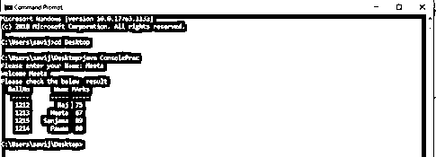
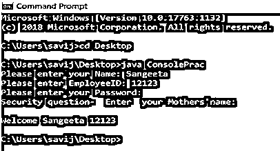
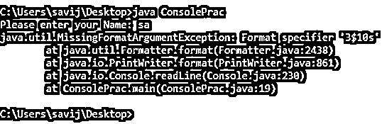

# Java 控制台

> 原文：<https://www.educba.com/java-console/>


## Java 控制台简介

Java Console 是 JDK 1.6 引入的 java.io 包中的一个类，用于启动读取基于字符的条目的控制台设备。这个类用于读取用户的输入，并将其写回控制台。这优于缓冲读取器和写入器，因为以下两个原因:-

1.  它很容易访问，因为它使用 System 类来调用新的控制台实例，并且控制台类没有自己的构造函数。
2.  它有助于输入屏幕上未显示的安全凭证，如密码。

**语法:**

<small>网页开发、编程语言、软件测试&其他</small>

```
public final class Console extends Object implements Flushable
```

### Java 中控制台类是如何工作的？

Console 类用于从控制台读取输入或将输出写入控制台。由于控制台类没有构造函数，并且是使用 System 类实例化的，这使得它更容易使用。此外，Console 类以更安全的方式从控制台读取输入，因为它帮助用户获取输入，如安全凭证，这样它就不会显示在屏幕上。因此，在需要使用安全凭证的情况下，控制台类非常有用。

### Java 控制台的方法

下面是 Java 控制台的方法:

**1。public PrintWriterwriter():** 该方法用于检索与正在运行的控制台对象相关联的 PrintWriter 的唯一实例。此方法中不需要任何参数。

**2。public void flush():Console 类提供这个方法**来刷新控制台实例。如果输出存在于缓冲区中，它还会立即打印输出。调用这个函数不需要参数。

**3。public Reader reader():** 这个方法给出了与当前控制台关联的 Reader 类的唯一实例。Reader 类的一个实例作为输入从控制台读取字符。

**4。公共控制台格式(StringformatVar，Object … ages):** 该方法使用指定的格式字符串和参数帮助在控制台输出流上发送给定的格式化字符串。

**参数:**

*   **formatVar:** 格式字符串需要使用指定的字符串和参数打印在控制台输出上。
*   **args:** 这些参数由 formatVar 中传递的字符串中的格式说明符引用。

控制台实例由该函数作为输出发送，并打印格式化字符串。如果指定的格式没有正确的语法，此方法将引发 IllegalFormatException。

**5。公共控制台 printf( StringformatVar，Object … agrs):** 这个方法帮助打印带有控制台屏幕上传递的指定格式参数的格式化字符串。

*   **format var**–需要使用指定的字符串和参数将格式字符串打印在控制台输出上。
*   **args**–这些参数由 formatVar 中传递的字符串中的格式说明符引用。

控制台实例由该函数作为输出发送，并打印格式化字符串。如果指定的格式没有正确的语法，此方法将引发 IllegalFormatException。

**6。public String readLine(String format var，Object … ages):** 该方法用于向屏幕显示格式化的提示，并读取用户输入的单行内容。

方法返回由控制台的提示读取的单行，不包括任何行尾字符。如果未输入任何内容，则此方法将返回 null。如果指定的格式没有正确的语法，此方法将引发 IllegalFormatException。此外，任何 I/O 错误都会发生 IOError。

**7。public String readLine():** 这个方法用于从控制台读取用户输入的一行内容，如果传递，则排除任何转义字符。

该字符串由方法返回，或者在到达行尾时返回 null。这个方法不需要参数，因为不显示任何提示。使用此方法时，任何 I/O 错误都会发生 IOERROR。

**8。public char[]read password(String format var，Object … ages):** 该方法用于在屏幕上显示一个格式化的提示，该提示使用安全模式读取一个字符，这样它就不会在我们键入时显示在屏幕上。

*   **formatVar:** 格式字符串需要使用指定的字符串和参数打印在控制台输出上。
*   **args:** 这些参数由 formatVar 中传递的字符串中的格式说明符引用。

包含密码的字符数组作为该函数的输出发送，或者在到达行尾时为 null。返回的字符数组不包括行终止字符。如果指定的格式没有正确的语法，此方法将引发 IllegalFormatException。任何 I/O 错误都会发生此方法 IOERROR。

**9。public char[] readPassword():** 该方法用于在不显示任何提示的情况下，以安全模式从控制台读取密码字符串。没有需要传递的参数。返回包含密码的字符串，不包括行尾字符，如果到达行尾，则返回 null。

### Java 控制台的实现示例

Below are the examples of Java Console:

#### 示例#1

**代码:**

```
import java.io.Console;
public class ConsolePrac {
public static void main(String[] args) {
Console consoleObj = null;
try {
consoleObj = System.console();
if (consoleObj != null) {
String person = consoleObj.readLine("Please enter your Name: ");
System.out.println("Welcome " + person);
System.out.println("Please check the below  result");
String fmt = "%2$8s %1$10s %3$3s%n";
consoleObj.format(fmt, "Name", "RollNo", "MArks");
consoleObj.format(fmt, "-----", "-----", "-----");
consoleObj.format(fmt, "Raj", "1212", "75");
consoleObj.printf(fmt, "Meeta", "1213", "67");
consoleObj.printf(fmt, "Sanjana", "1215", "89");
consoleObj.printf(fmt, "Pawan", "1214", "80");
}
consoleObj.flush();
} catch(Exception ex) {
ex.printStackTrace();
}
}
}
```

**输出:**

**

** 

#### 实施例 2

**代码:**

```
import java.io.Console
import java.util.Scanner;
import java.io.PrintWriter;
public class ConsolePrac {
public static void main(String[] args) {
Console consoleObj = null;
PrintWriter PWObj = null;
String fmt1 = "%1$6s %2$5s %3$10s%n";
String fmt2 = "%1$8s %2$10s %3$5s %4$5s %5$10s%n";
Scanner scanObj = null;
try {
consoleObj = System.console();
if (consoleObj != null) {
System.out.print("Please enter your Name: ");
scanObj = new Scanner(consoleObj.reader());
String person = scanObj.next();
String empID = consoleObj.readLine(fmt1, "Please","enter","EmployeeID: ");
char[] pwd = consoleObj.readPassword("Please enter your Password: ");
char[] ans1 = consoleObj.readPassword(fmt2,"Security","question- ","Enter","your","Mothers'name: ");
PWObj = consoleObj.writer();
PWObj.println("Welcome "+person +" "+empID);
}
} catch(Exception ex) {
ex.printStackTrace();
}
}
}
```

**输出:**




**Note:** The format string’s arguments must be the same as the String to be displayed. Please see below 2 scenarios:

**情况 1:** 参数比格式字符串中指定的多。

```
String fmt= "%1$30s %2$10s"
String empID = consoleObj.readLine(fmt1, "Please","enter","your","EmployeeID: ");
```

在上面的例子中，只打印前两个字符串，其他的都被忽略。

**情况 2:** 如果指定的参数小于缺少的参数，则会抛出异常。

```
String fmt= "%1$30s %2$10s" ,"%3$10s%n"
String empID = consoleObj.readLine(fmt1, "Please","enter”);
```




**Note:** Console program must be run using command line since eclipse gives exception while running this program.

### 结论

控制台类是 JDK 1.6 中引入的一个很棒的工具，它帮助以安全的方式从控制台实例中读取输入。它还提供了将输出写入控制台屏幕的方法。

### 推荐文章

这是一个 Java 控制台指南。这里我们讨论 Java 中控制台类的介绍和工作原理，以及它的各种方法和例子。您也可以浏览我们推荐的其他文章，了解更多信息——

1.  [Java varargs](https://www.educba.com/java-varargs/)
2.  [Java 编译器](https://www.educba.com/java-compilers/)
3.  [Java 中的合并排序](https://www.educba.com/merge-sort-in-java/)
4.  [Java 8 中的可选类](https://www.educba.com/optional-class-in-java-8/)


