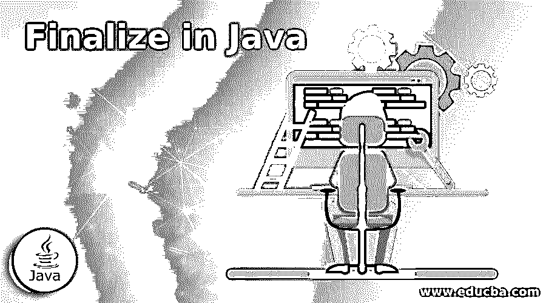
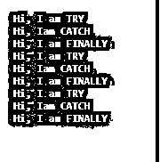

# 在 Java 中完成

> 原文：<https://www.educba.com/finalize-in-java/>




## Java 中的 Finalize 简介

Finalize 是 Java 中的一个方法。这个 finalizes()方法类似于 main 方法。这个 finalizes()方法在对象被垃圾回收之前被调用。这意味着原始对象执行清理活动的最后机会，如释放系统资源、关闭数据库等连接、打开文件连接等。finalize 方法的主要问题是，Java 语言规范(JLS)不能保证垃圾收集器将调用它，也不能保证何时调用它。让我们考虑一个例子，一个对象在符合垃圾收集条件后可能会等待一段不确定的时间。这意味着在其 finalize()方法被调用之前。同样的，在最终确定了名为“这是没有保证的”的方法后，它将立即被收集。所以在 finalize()方法中执行关键活动是没有意义的。在开发时，它可能在一个 JVM 中工作，也可能在另一个 JVM 中不工作。finalize()方法在 java.lang.Object 中可用，因此它可自动用于所有类的重写，因为 Object 是这些类的基类。

### finalize()方法在 Java 中是如何工作的？

这个 finalizes()方法是在对象被垃圾回收之前调用的，所以这意味着我们不能像其他 Java 方法一样手动调用 finalize()方法。垃圾收集器(GC)线程只调用了一次 finalize()方法。

<small>网页开发、编程语言、软件测试&其他</small>

**代码:**

```
protected void finalize throws Throwable
{
//write some code
}
```

finalize()方法有一个空的实现，并且在我们的类中存在清理活动，那么我们必须覆盖这个 finalize()方法来定义我们的清理活动。

### 用 Java 实现 Finalize 的示例

下面是提到的一些例子:

#### 示例#1

Finalize 方法用户重写方法示例

**代号:**Main.java

```
//creating class
public class Main {
//main method for run the Java application
public static void main(String[] args)
{
//Creating String object with some content
String string = new String("I am Amardeep");
//make the string reference to null for allow it for Garbage Collection
string = null;
// Calling gc method for Garbage Collection
System.gc();
//displaying some message to the user
System.out.println("\tI am in Main method");
}
//We are Overriding finalize method.
public void finalize()
{
//displaying some message to the user
System.out.println("\tI am feeling that I am Overriding finalize method");
}
}
```

**输出:**


**解释:**如果您观察上面的输出，您可能会惊讶于您没有完成覆盖方法。如果您仔细观察不是实际的 Java 给定重写方法的代码，它就像一个用户创建的方法，因为我们知道实际的 finalize 方法签名保护 void finalize()。所以我们在输出中没有得到这个。

#### 实施例 2

Finalize 方法重写实际方法示例

**代号:**Main.java

```
//creating class
public class Main {
//main method for run the Java application
public static void main(String[] args)
{
//Creating Main object
Main main = new Main();
//make the main reference to null for allow it for Garbage Collection
main = null;
// Calling gc method for Garbage Collection
System.gc();
//displaying some message to the user
System.out.println("\tI am Amardeep from main method");
}
//We are Overriding finalize method.
@Override
protected void finalize()
{
//displaying some message to the user
System.out.println("\tI am actaully Overriding now.");
}
}
```

**输出:**


**解释:**正如我们在上面的输出中看到的，我们 finalize()方法输出是因为覆盖了实际的 finalize()方法。

#### 实施例 3

finally 块示例中的 Finalize 方法

**代号:**Main.java

```
//creating class
public class Main {
//main method for run the Java application
public static void main(String[] args)
{
//Creating Main object
Main main = new Main();
//make the main reference to null for allow it for Garbage Collection
main = null;
// Calling gc method for Garbage Collection
System.gc();
//displaying some message to the user
System.out.println("\tI am Amardeep from main method");
}
//We are Overriding finalize method.
@Override
protected void finalize() throws Throwable {
try{
//displaying some message to the user
System.out.println("\tFinalize of Paramesh");
}catch(Throwable t){
throw t;
}finally{
//displaying some message to the user
System.out.println("\tCalling finalize from finally block");
super.finalize();
}
}
}
```

**输出:**


#### 实施例 4

Finalize 方法不保证示例

**代号:**FinalizeNotGuarantee.java

```
//package com.finalize;
public class FinalizeNotGuranteed implements Runnable {
//user defined method
private void getMyMethod() throws InterruptedException {
//try block
try {
System.out.println("Hi, I am TRY");
throw new NullPointerException();
//catch block
} catch (NullPointerExceptionnpe) {
System.out.println("Hi, Iam CATCH");
//finally block
} finally {
System.out.println("Hi, I am FINALLY");
}
}
//overriding finalize method
@Override
protected void finalize() throws Throwable {
System.out.println("I am kinside finalize block");
super.finalize();
}
//overriding Thread run method
@Override
public void run() {
try {
getMyMethod();
} catch (InterruptedException e) {
e.printStackTrace();
}
}
public static void main(String[] args) {
for (int i = 1; i<= 3; i++) {
//start the thread method run by using start method
new Thread(new FinalizeNotGuranteed()).start();
}
}
}
```

**输出:**




**解释:**上面的例子清楚地说明了 finalize 方法并不总是保证执行。

### 结论

Java finalizes()方法用于收集垃圾收集对象。这个方法在调用 GC()方法之前被调用。此方法并不总是保证能够执行。

### 推荐文章

这是一个用 Java 完成的指南。在这里，我们讨论 Java 中 Finalize 的介绍，它是如何工作的，以及更好理解的例子。您也可以浏览我们的其他相关文章，了解更多信息——

1.  [Java 引用](https://www.educba.com/java-references/)
2.  [什么是 Java 垃圾收集器？](https://www.educba.com/what-is-java-garbage-collector/)
3.  [Java 中的对象类](https://www.educba.com/object-class-in-java/)
4.  [Java 中的私有构造函数](https://www.educba.com/private-constructor-in-java/)


