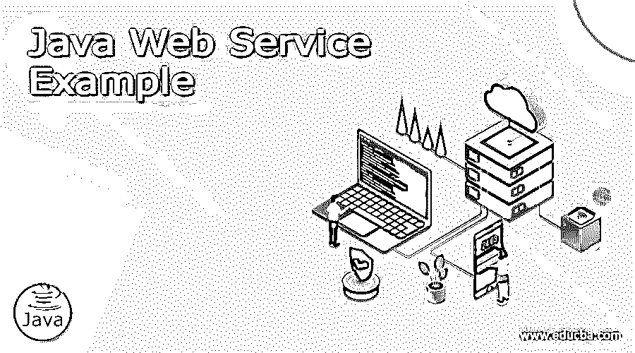
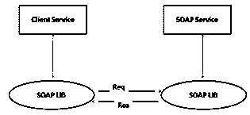
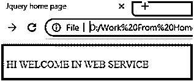

# Java Web 服务示例

> 原文：<https://www.educba.com/java-web-service-example/>




## Java Web 服务简介示例

如今，java web 服务到处都在使用。当我们需要与任何网页交互时，网页响应和请求体。当您与站点页面关联时，程序发送一个请求，然后传递一个响应，并以 HTML 的形式显示出来。从本质上讲，web 的好处同样包括请求和反应，但仍然是 XML、JSON 或普通消息。它主要用于不同的应用程序或项目来烧穿和利用数据。Web 服务通常可以分为两类，基于 SOAP 的和 REST 风格的。区别并不明显，因为正如后来的代码模型所表示的那样，通过 HTTP 传递的基于 SOAP 的帮助是 REST 风格管理的一个不同寻常的实例。

### Java Web 服务示例

但是在举例之前，我们需要了解什么是 java web 服务。

<small>网页开发、编程语言、软件测试&其他</small>

基本上，Web 服务有两种类型，SOAP 和 REST。它们之间的区别是不一样的，有一些基本的区别。HTTP 协议用于 SOAP web 服务，通常 SOAP 服务使用简单协议来交付不同的服务，或者我们可以说，根据用户需求，我们可以使用任何服务。SOAP 服务在软件设计开发中起着至关重要的作用，SOAP web 服务只使用 XML 语言。SOAP 库用于服务请求，也用于 SOAP 消息的底层。客户和 web 服务源代码可能不会给出太多关于基本 SOAP 的线索，如下图所示。




在 REST web 服务中，没有原则、工具包或库。REST web 服务的主要优点是避免了 SOAP web 服务的复杂性。

现在让我们来看看 java web 服务的不同特性，如下所示。

#### 1.开放式基金会

Web 服务是利用行业标准的、无商家的约定(如 HTTP 和 XML)来传递的，这些约定无处不在并且广为人知。Web 服务可以依赖于系统管理、信息安排、安全和当前建立的不同框架，这降低了部门成本并提高了管理部门之间的互操作性。

#### 2.语言直白

Web 服务和它们的客户可以互操作，不管它们是否用不同的编程语言编写。我们可以使用不同的编程语言，如 C，C#，Java 和 Ruby 等。

#### 3.基于 XML 的 web 服务

Java web 服务使用 XML 数据描述和数据传输层。借助 XML 语言，我们可以连接任何网络层和操作系统等。

#### 4.松散耦合

web 管理的客户并不是直接固定在 web 管理上的。web 管理界面可以长期支持开发，而不需要安排客户在帮助下说话的能力。一个紧密耦合的框架意味着客户和工作人员的基本原理是紧密联系在一起的，表明假设一个接口发生了变化，另一个应该被刷新。容忍近似耦合的设计通常会使编程框架更合理，并允许不同框架之间更清晰的结合。

#### 5.粗糙支撑的

Java 通过单独的策略揭示了它的能力。一个特定的周期是一个过于精细的活动，不能给任何合理的能力。在没有任何准备的情况下构建一个 Java 程序需要生产不同的细粒度功能，然后将这些功能收集到一个粗粒度的作业中，由客户或助手来完成。

组织和他们展示的接口应该是粗粒度的。Web administrations innovation 执行了一个特有的策略来描述接近业务基本原理的完美度量的粗粒度管理。

#### 6.支持同步和异步

同步性决定了客户对能力执行的限制。在同时传票，客户广场和推迟完成其管理之前进行。另类活动奖励客户召唤一个任务，然后执行不同的能力。

非并发客户在计划的较晚时间点获得他们的结果，而协调客户在帮助完成时接受他们的影响。非并发能力是支持近似耦合框架的基本技术。

#### 7.标准设计

Web 服务应该在计划中进行度量，以便可以通过现有服务的协调和分层来产生新的服务。例如，设想与因特网结合的股票跟踪帮助，请求服务以产生帮助，从而根据股票水平安排合适的商品。

现在让我们看看 java web 服务的不同例子，以便更好地理解。

现在，使用 JAX-WS 创建一个简单的应用程序，球衣是 JAX-RS API 的参考执行，它不是标准 JDK 的一部分，你需要合并每一个必要的容器。最理想的方法是利用 Maven 构造，因此创建一个基本的动态 web 任务，然后在 Eclipse 中将其转换为 Maven。

在第一步中，我们需要将依赖项添加到 pom.xml 文件中，无论我们需要什么，只需将以下代码复制并粘贴到 pom.xml 文件中，如下所示。

```
<project 
xmlns:xsi="http://www.w3.org/2001/XMLSchema-instance" xsi:schemaLocation="http://maven.apache.org/POM/4.0.0 https://maven.apache.org/xsd/maven-4.0.0.xsd">
<modelVersion>4.0.0</modelVersion>
<groupId>SimpleWebServices</groupId>
<artifactId>WebServices</artifactId>
<version>0.0.1-SNAPSHOT</version>
<dependencies>
<dependency>
<groupId>com.sun.jersey</groupId>
<artifactId>jersey-server</artifactId>
<version>1.19</version>
</dependency>
<dependency>
<groupId>com.sun.jersey</groupId>
<artifactId>jersey-servlet</artifactId>
<version>1.19</version>
</dependency>
</dependencies>
<build>
<sourceDirectory>src</sourceDirectory>
<plugins>
<plugin>
<artifactId>maven-war-plugin</artifactId>
<version>2.6</version>
<configuration>
<warSourceDirectory>WebContent</warSourceDirectory>
<failOnMissingWebXml>false</failOnMissingWebXml>
</configuration>
</plugin>
<plugin>
<artifactId>maven-compiler-plugin</artifactId>
<version>3.3</version>
<configuration>
<source>1.7</source>
<target>1.7</target>
</configuration>
</plugin>
</plugins>
</build>
</project>
```

之后，我们需要创建。xml 文件，并编写如下代码。

```
<?xml version="1.0" encoding="UTF-8"?>
<web-app xmlns:xsi="http://www.w3.org/2001/XMLSchema-instance"
 xsi:schemaLocation="http://xmlns.jcp.org/xml/ns/javaee http://xmlns.jcp.org/xml/ns/javaee/web-app_3_1.xsd" id="WebApp_ID"
version="3.1">
<display-name>JAX-RS-WelcomeInWebServices</display-name>
<servlet>
<servlet-name>Jersey REST Web Service</servlet-name>
<servlet-class>com.sun.jersey.spi.container.servlet.ServletContainer</servlet-class>
<init-param>
<param-name>com.sun.jersey.config.property.packages</param-name>
<param-value>com.sample.jser.service</param-value>
</init-param>
<load-on-startup>1</load-on-startup>
</servlet>
<servlet-mapping>
<servlet-name>Jersey REST Service</servlet-name>
<url-pattern>/*</url-pattern>
</servlet-mapping>
</web-app>
```

现在在第三步中，我们需要创建 java 类文件并编写如下代码。

```
package demo;
import javax.ws.rs.GET;
import javax.ws.rs.Path;
import javax.ws.rs.PathParam;
@Path("/sample")
public class sample_demo {
@GET
@Path("/w_mssg/{w_msg}")
public String wel_msg(@PathParam(value="w_msg") String msg){
return "HI "+msg;
}
}
```

**解释**

上面程序的最终结果我们用下面的截图来说明。




### 结论

我们希望通过这篇文章，您能够了解更多关于 java web 服务的例子。从上面的文章中，我们已经理解了 java web 服务示例的基本思想，我们还看到了 java web 服务示例的表示和示例。从本文中，我们了解了如何以及何时使用 java web 服务示例。

### 推荐文章

这是一个 Java Web 服务指南的例子。这里我们讨论定义，代码实现的例子。您也可以看看以下文章，了解更多信息–

1.  [c#中的 Web 服务](https://www.educba.com/web-services-in-c-sharp/)
2.  [网络服务测试](https://www.educba.com/web-services-testing/)
3.  [网络服务的类型](https://www.educba.com/types-of-web-services/)
4.  [网络服务的架构](https://www.educba.com/architecture-of-web-services/)


