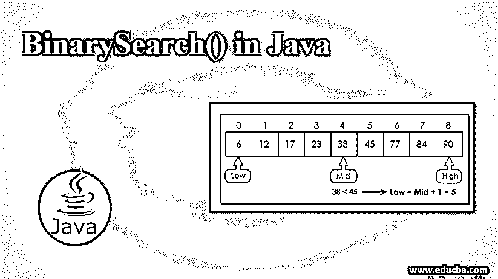
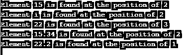
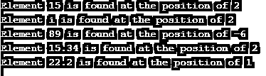

# Java 中的 BinarySearch()

> 原文：<https://www.educba.com/binarysearch-in-java/>




## Java 中的 BinarySearch()简介

在 Java 中，binarySearch()是一种帮助使用二分搜索法算法从几个元素中搜索特定关键元素的方法。为了执行这个操作，元素必须按升序排序。如果没有排序，可以使用 Arrays.sort(arr)方法进行排序。否则，结果是不确定的。与线性搜索相比，二分搜索法被认为更快。由于这个原因，二分搜索法的时间复杂度据说是 O(log n)。此外，binarySearch()方法可以从 java.util.Arrays 包中实例化。

**语法:**

<small>网页开发、编程语言、软件测试&其他</small>

```
public static int binarySearch(Object[] a, Object key)
```

这里，参数 a 和 key 分别是要搜索的数组和要查找的值。

binarySearch()方法返回正在搜索的关键元素的索引。在没有找到关键元素的情况下，将返回本应插入关键元素的插入点。如果搜索的 key 元素与数组中的其他元素不可比，将引发一个称为 ClassCastException 的异常。

### BinarySearch()方法在 Java 中是如何工作的？

让我们看看这个方法在 Java 中是如何工作的:

1.  假设 k 是需要搜索的关键元素。将 k 与数组的中间元素进行比较。
2.  如果 k 与中间位置的元素匹配，则必须返回中间索引。
3.  否则，如果 k 高于中间位置的元素，则 k 只能在中间元素的右侧找到。
4.  否则，可以在中间元素的左侧找到它。

### 用 Java 实现 BinarySearch()的例子

下面是一些关于 BinarySearch()方法的程序示例。

#### 示例#1

**代码:**

```
import java.util.Arrays;
public class BinarySearchExample
{
public static void main(String[] args)
{
//create a byte array
byte ba[] = {05, 10, 15, 20, 25, 30};
//create a character array
char ca[] = {'a', 'n', 's', 'p', 'v', 'i', 'd'};
//create an integer array
int ia[] = { 10, 20, 15, 22, 35};
//create a double array
double da[] = {10.1 , 15.34 , 22.25, 13.5};
//create a float array
float fa[] = {13.2f, 25.1f , 22.2f , 43.5f };
//sort all the arrays that created above
Arrays.sort(ba);
Arrays.sort(ca);
Arrays.sort(ia);
Arrays.sort(da);
Arrays.sort(fa);
//enter the key elements that has to be searched in the array
byte bKey = 15;
char cKey = 'i';
int iKey = 22;
double dKey = 15.34;
float fKey = 22.2f;
System.out.println("Element "+ bKey + " is found at the position of " + Arrays.binarySearch(ba,bKey) );
System.out.println("Element "+ cKey + " is found at the position of " + Arrays.binarySearch(ca,cKey) );
System.out.println("Element "+ iKey + " is found at the position of " + Arrays.binarySearch(ia,iKey) );
System.out.println("Element "+ dKey + " is found at the position of " + Arrays.binarySearch(da,dKey) );
System.out.println("Element "+ fKey + " is found at the position of " + Arrays.binarySearch(fa,fKey) );
}
}
```

**输出:**




在使用上述程序中的数组对数组进行排序后，会创建某些不同类型的数组，如字符型、整型、浮点型、双精度型和字节型。Sort()方法中，声明了必须在数组中搜索的元素。然后使用 Arrays.binarySearch()方法打印搜索元素的索引。

**假设给定了一个数组中不存在的关键元素；输出会是什么？?**

为了找到这一点，让我们更改关键元素的代码，如下所示。

字节 bKey = 15
char cKey = ' I '；
int 杨英鹏= 89；
双 dKey = 15.34
float fKey = 22.2 f；

也就是说，杨英鹏=89 不在数组中，那么输出将显示如下。




正如我们所看到的，位置被打印为-6。这是因为如果搜索了一个元素而没有找到，那么如果该元素存在的话，索引将返回负值。也就是说，int ia[] = { 10，20，15，22，35}是给定的数组。如果有 89，数组应该是 int ia[] = { 10，20，15，22，35，89 }；

可以清楚地看到，指数应该是 6。因为它不在原始数组中，所以在上面的输出中返回了该特定索引的负值。

#### 实施例 2

二分搜索法也可以在递归的帮助下完成，如下所示。

**代码:**

```
//sample class
class BinarySearchExample{
public static int binarySearch(int a[], int f, int l, int k){
//if last element is greater than or equal to first element
if (l>=f)
{
//find the mid
int m = f + (l - f)/2;
//if the key element that is searching is found in middle position, return mid position
if (a[m] == k)
{
return m;
}
//if key element is less than element in middle position, search the left <u>subarray</u>
if (a[m] > k){
return binarySearch(a, f, m-1, k);
}
//if key element is greater than the element in middle position, search the right <u>subarray</u>
else{
return binarySearch(a, m+1, l, k);
}
}
return -1;
}
public static void main(String args[]){
//initialise the array
int a[] = {34,45,54,68,79};
int k = 68;
int l = a.length-1;
//store the position in variable res
int res = binarySearch(a,0,l,k);
if (res == -1)
System.out.println("Sorry!! Can't find the element....!");
else
System.out.println("Element is found at the position: "+res);
}
}
```

**输出:**


在上面的程序中，首先创建一个数组，并声明要查找的元素。使用 binarySearch()方法，将找出关键元素的位置。假设没有找到元素，将会显示一条消息“对不起！!!找不到元素”。

### 结论

binarySearch()是一个 Java 方法，它使用二分搜索法算法帮助在数组中的几个可用元素中找到一个特定的关键元素。该方法的工作和例子在本文件中详细解释。

### 推荐文章

这是 Java 中 BinarySearch()的指南。这里我们讨论 BinarySearch()方法在 Java 中是如何工作的，以及代码实现的例子。您也可以浏览我们推荐的其他文章，了解更多信息——

1.  [JavaScript 数学函数](https://www.educba.com/javascript-math-functions/)
2.  [Java 中的布局](https://www.educba.com/layout-in-java/)
3.  [Java 编译器](https://www.educba.com/java-compilers/)
4.  [Java 中的合并排序](https://www.educba.com/merge-sort-in-java/)


