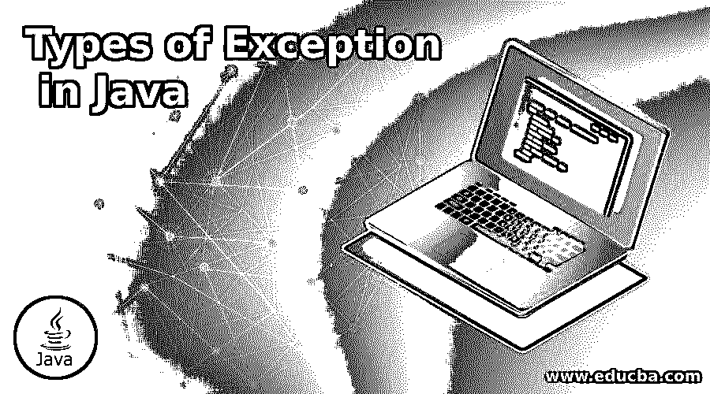
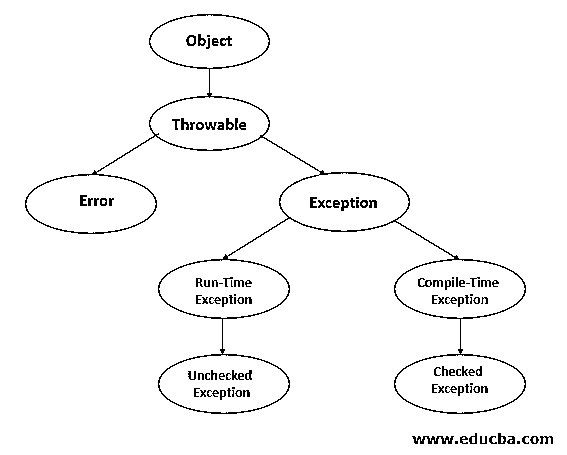
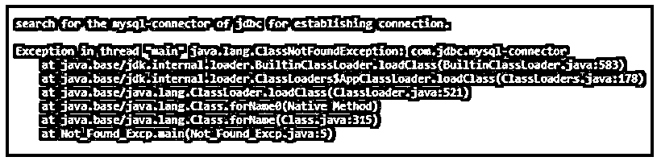
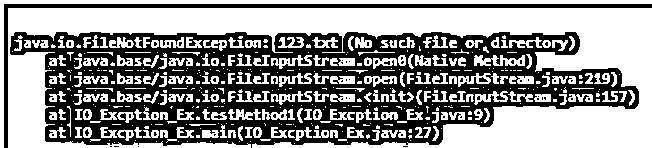
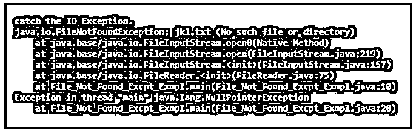
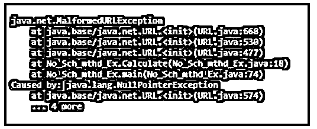
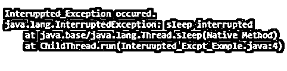

# Java 中异常的类型

> 原文：<https://www.educba.com/types-of-exception-in-java/>




## Java 中异常类型介绍

下面的文章提供了 Java 中异常类型的概要。Java 异常在程序执行时起着非常关键的作用。一般来说，任何程序在执行时异常终止或中断都会导致异常。java 异常发生在对象创建时，无论何时发生异常，或者在运行时引起任何错误，异常都与 Java 中的对象有关，因为它是一种面向对象的编程语言。因此，throwable、try 和 catch 块的异常和错误有一个层次结构，用于捕获和识别导致的异常。

### Java 中不同类型的异常

负责异常类型的 java 程序中的对象创建遵循如下所示的层次结构:

<small>网页开发、编程语言、软件测试&其他</small>




编程时 java 中的异常基本上分为两类，例如:

*   **内置异常:**这些是可以使用现有 java 库捕获的异常类型。它也被称为未检查异常或运行时异常。
*   **用户定义的异常:**这些类型的异常可以使用用户创建的一些定制异常来捕获，用户应该有能力处理这些异常。这些异常也可以称为检查异常或编译时异常。

#### 1.内置异常的类型

*   算术异常
*   ClassNotFoundException
*   IOException
*   ArrayIndexOutOfBoundsException
*   FileNotFoundException
*   NullPointerException
*   NoSuchFieldException
*   NoSuchMethodException
*   StringIndexOutOfBoundsException
*   RuntimeException
*   NumberFormatException
*   中断异常

##### 形容词（adjective 的缩写）算术异常

每当算术计算时出现不匹配时，就会调用该异常。

**举例:**

这个程序演示了算术异常。

**代码:**

```
public class Arithmtic_excpn {
public static void main(String[] args) {
{
try {
int first_no = 0;
int scnd_no = 20;
int third_no = 0;
int fourth_no = (first_no-scnd_no)/third_no;
System.out.println ("output after the operation " + fourth_no );
}
catch(ArithmeticException arithmetic_ex) {
System.out.println ("The third number cannot store the value of first number multiplied by second number.");
}
}
}
}
```

**输出:**


##### b.ClassNotFoundException

如果任何类没有正确定义，那么它将导致 ClassNotFoundException。

**举例:**

这个程序演示了 ClassNotFoundException。

**代码:**

```
public class Not_Found_Excp {
private static final String mysql_connector = "com.jdbc.mysql-connector";
public static void main(String[] args) throws Exception {
System.out.println("search for the mysql-connector of jdbc for establishing connection.");
Class.forName(mysql_connector);
}
}
```

**输出:**




##### 碳（carbon 的缩写）IO 异常

当任何输入或输出异常终止，操作失败时，就会导致 IO 异常。

**举例:**

这个程序演示了 IO 异常。

**代码:**

```
import java.io.File;
import java.io.FileInputStream;
import java.io.IOException;
public class IO_Excption_Ex {
public FileInputStream testMethod1(){
File file_a = new File("123.txt");
FileInputStream fileInptstrm = null;
try{
fileInptstrm = new FileInputStream(file_a);
fileInptstrm.read();
}catch (IOException excpn){
excpn.printStackTrace();
}
finally{
try{
if (fileInptstrm != null){
fileInptstrm.close();
}
}catch (IOException excpn){
excpn.printStackTrace();
}
}
return fileInptstrm;
}
public static void main(String[] args){
IO_Excption_Ex inst_1 = new IO_Excption_Ex();
inst_1.testMethod1();
}
}
```

**输出:**




##### d. ArrayIndexOutOfBoundsException

无论何时访问任何错误的索引，并且该索引的范围是不可及的并且不能被访问，那么它就会出现 ArrayIndexOutOfBoundsException

**举例:**

这个程序演示了 ArrayIndexOutOfBoundsException。

**代码:**

```
public class Arr_Indx_Out_Of_BOnd {
public static void main(String[] args) {
try{
int ar_0[] = new int[6];
ar_0[8] = 11;
}
catch(ArrayIndexOutOfBoundsException excp){
System.out.println ("Index of the array has crossed the range.");
}
}
}
```

**输出:**


##### e.FileNotFoundException

如果路径中没有正确提到任何文件，或者没有正确打开任何文件，那么它将抛出 FileNotFoundException

**举例:**

这个程序演示了 FileNotFoundException。

**代码:**

```
import java.io.BufferedReader;
import java.io.File;
import java.io.FileReader;
import java.io.IOException;
public class File_Not_Found_Excpt_Exmpl {
private static final String file_nm = "jkl.txt";
public static void main(String[] args) {
BufferedReader rder = null;
try {
rder = new BufferedReader(new FileReader(new File(file_nm)));
String inpt_ln = null;
while ((inpt_ln = rder.readLine()) != null)
System.out.println(inpt_ln);
} catch (IOException excpn) {
System.err.println("catch the IO Exception.");
excpn.printStackTrace();
} finally {
try {
rder.close();
} catch (IOException excpn) {
System.err.println("catch the IO Exception.");
excpn.printStackTrace();
}
}
}
}
```

**输出:**




##### 氟（fluorine 的缩写）空指针异常

每当对象的成员指向或引用任何空值时，就会发生这种类型的异常。

**举例:**

这个程序演示了空指针异常。

**代码:**

```
public class Null_Pointer_Excp {
public static void main(String[] args) {
try {
String art_1 = null;
String art_3= "abc";
System.out.println(art_1.charAt(0));
} catch(NullPointerException excpn) {
System.out.println("This will give a null pointer exception.");
}
}
}
```

**输出:**


##### g.NoSuchFieldException

每当不存在字段或任何变量时，都会发生此异常。

**举例:**

这个程序演示了 NoSuchFieldException。

**代码:**

```
import java.text.DateFormat.Field;
import java.lang.reflect.*;
public class No_suc_field_excpn_Ex {
public static void main(String[] args) {
No_suc_field_excpn_Ex excp = new No_suc_field_excpn_Ex();
Class any_cls = excp.getClass();
System.out.println("value_of_field=");
try {
java.lang.reflect.Field strng_fld = any_cls.getField("One_strng");
System.out.println("field for the public superclass is found: " + strng_fld.toString());
} catch(NoSuchFieldException excpn) {
System.out.println(excpn.toString());
}
}
public No_suc_field_excpn_Ex() {
}
public No_suc_field_excpn_Ex(String One_strng) {
this.val_OneStrng = One_strng;
}
public String val_OneStrng = "Everything appears to be Exception.";
}
```

**输出:**


##### h.NoSuchMethodException

当试图访问一个类中的任何方法，而该方法没有明确定义或丢失，将导致 NoSuchMethodException。

**举例:**

这个程序演示了 NoSuchMethodException。

**代码:**

```
import java.io.BufferedReader;
import java.io.BufferedWriter;
import java.io.File;
import java.io.FileWriter;
import java.io.IOException;
import java.io.InputStreamReader;
import java.net.MalformedURLException;
import java.net.URL;
import java.net.URLConnection;
public class No_Sch_mthd_Ex {
public static String add_rss;
public static String somefiletext;
public static String initial_page_src;
public static void Calculate() throws MalformedURLException {
URL url_a = new URL(add_rss) ;
URLConnection connect_2 = null;
try {
connect_2 = url_a.openConnection();
} catch (IOException excp) {
excp.printStackTrace();
}
BufferedReader buffrr = null;
try {
buffrr = new BufferedReader(
new InputStreamReader(connect_2.getInputStream()));
} catch (IOException excpn) {
excpn.printStackTrace();
}
String filnm_z = "C:\\Users\\adutta\\Documents\\"+"page_src"+"123.txt";
File file_o = new File(filnm_z);
if (!file_o.exists()) {
try {
file_o.createNewFile();
} catch (IOException excpn) {
excpn.printStackTrace();
}
}
FileWriter flwrtr = null;
try {
flwrtr = new FileWriter(filnm_z);
} catch (IOException exc) {
exc.printStackTrace();
}
BufferedWriter bw = new BufferedWriter(flwrtr);
String textreader;
try {
while ((textreader = buffrr.readLine()) != null) {
bw.write(textreader);
}
} catch (IOException excn) {
excn.printStackTrace();
}
}
public static void set_page_src(String page_src){
page_src = initial_page_src;
}
public static void set_url(String addressname){
addressname = add_rss;
}
public static void set_text_file_name(String celeb_filename_p){
celeb_filename_p = celeb_name_i;
}
public static String celeb_name_i = "type_the_text" ;
public static  String url_add_ress = "http//ooo.com";
public static void main(String[] args) {
No_Sch_mthd_Ex.set_page_src(celeb_name_i);
No_Sch_mthd_Ex.set_url(url_add_ress);
try {
No_Sch_mthd_Ex.Calculate();
} catch (IOException excpn) {
excpn.printStackTrace();
}
}
}
```

**输出:**




##### I . StringIndexOutOfBoundsException

如果索引范围为负或者大于 string 类中定义的索引范围，那么将导致 StringIndexOutOfBoundsException 异常。

**举例:**

这个程序演示了 StringIndexOutOfBoundsException。

**代码:**

```
public class String_Inx_Out_Of_Bound_Ex {
public static void main(String[] args) {
try {
String ant = "ant crawls very slowly.";
char chrct = ant.charAt(50);
System.out.println(chrct);
}
catch(StringIndexOutOfBoundsException excepn) {
System.out.println("String_Out_Of_Bound_Exception occured.");
}
}
}
```

**输出:**


##### j.RuntimeException

在运行时，如果出现任何类型的异常，那么这些类型的异常称为 RuntimeException。

**举例:**

这个程序演示了 RuntimeException。

**代码:**

```
public class Runtime_Excp_Ex {
public void Demo_Runtime_Exception () {
throw new Running_Exception();
}
public static void main(String[] args) {
try {
new Running_Exception().Demo_Runtime_Exception();
} catch(Exception excpn) {
System.out.println(excpn.getClass().getName());
}
}
}
class Running_Exception extends RuntimeException {
public Running_Exception() {
super();
}
public void Demo_Runtime_Exception() {
throw new Running_Exception();
}
}
```

**输出:**


##### k.NumberFormatException

任何不能从定义的字符串转换成数字格式的异常都会导致 NumberFormatException。

**举例:**

这个程序演示了 NumberFormatException。

**代码:**

```
public class No_Format_Ex {
public static void main(String[] args) {
try {
int value1 = Integer.parseInt ("parasite1") ;
System.out.println(value1);
} catch(NumberFormatException excepn) {
System.out.println("This gives Number Format Exception");
}
}
}
```

**输出:**


##### 长度中断异常

如果线程在等待、睡眠或执行某些处理时受到干扰，就会导致中断异常。

**举例:**

这个程序演示了中断异常。

**代码:**

```
class ChildThread extends Thread {
public void run() {
try {
Thread.sleep(500);
} catch (InterruptedException excpn) {
System.err.println("Interuppted_Exception occured.");
excpn.printStackTrace();
}
}
}
public class Interuupted_Excpt_Exmple {
public static void main(String[] args) throws InterruptedException {
ChildThread chldth1 = new ChildThread();
chldth1.start();
chldth1.interrupt();
}
}
```

**输出:**




#### 2.用户定义的异常

每当用户在程序的实现和执行过程中犯了一些可定制的或错误时，就会出现这种异常。

**举例:**

这个程序演示了用户定义的异常。

**代码:**

```
public class My_Excpn extends Exception {
private static int roll_no[] = {10, 15, 23, 30};
private static String student_Nm[] = {"ani", "viky", "nidhi", "ash"};
private static double marks[] = {20.5, 44.6, 30, 17};
My_Excpn() {    }
My_Excpn(String str)
{
super(str);
}
public static void main(String[] args) {
try  {
System.out.println("roll_no" + "\t" + "student_Nm" +
"\t" + "marks");
for (int i = 0; i < 4 ; i++)
{
System.out.println(roll_no[i] + "\t" + student_Nm[i] +
"\t" + marks[i]);
if (marks[i] < 60)
{
My_Excpn mrk1 =
new My_Excpn("Student will fail if marks is less than 60");
throw mrk1;
}
}
}
catch (My_Excpn excpn) {
excpn.printStackTrace();
}
}
}
```

**输出:**


### 结论

java 中的异常起着非常关键的作用，因为它有助于捕捉并同时抛出程序异常终止的根本原因。它经常导致并消耗程序员运行和执行程序的大量时间，因此这种致命的异常在生产甚至实现时不应该频繁发生。

### 推荐文章

这是 Java 中异常类型的指南。这里我们分别讨论 java 中不同类型的异常。您也可以看看以下文章，了解更多信息–

1.  [Java 运行时类](https://www.educba.com/java-runtime-class/)
2.  [Java DatagramSocket](https://www.educba.com/java-datagramsocket/)
3.  [Java 模式类](https://www.educba.com/java-pattern-class/)
4.  [Java BufferedWriter](https://www.educba.com/java-bufferedwriter/)


