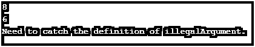

# Java NullPointerException

> 原文：<https://www.educba.com/java-nullpointerexception/>


## java nullpointexception 简介

NullPointer 异常是 java 中的一个异常，程序员经常遇到。这是一个运行时异常，发生在对象实例化不正确的时候。该对象被声明为包含空值。空指针异常只是表明它试图调用一个引用中有空值的对象。要记住的最重要的事情是，空指针异常与指针无关，因为 java 语言不支持指针概念；相反，它与对象引用相关联。

**语法:**

<small>网页开发、编程语言、软件测试&其他</small>

没有特定的语法将空指针异常指定为运行时错误；它会自动升起并变得可以使用。

可以声明一个 catch 异常，然后抛出指向并调试 NullPointer 异常。调试 NullPointerException 是一件非常乏味的事情。需要确保对象实例化和引用声明在执行时是正确的。

```
try {
Object obj1 = new Object(); // Instantiate a new object for the class as reference
Obj1=null; //Provide null value to the object created
Logging.log(String.format(“get the object value”, obj1.object1for reference));
}
catch(java.lang.NullPointerException exception)
{
Logging.log(exception);
}
catch(Throwable exception)
{
Logging.log(exception,false);
}
```

### NullPointerException 在 Java 中如何工作？

Java 中的 NullPointerException 是一个异常，这对于开发人员来说根本不是一个好的错误。很难找到异常，因为它每次在运行时都会发生。因此，查找这样的异常是一项繁琐的任务。程序员需要花费数小时来找出 NullPointerException。

当一个对象被其他事物所需要时，当一个不寻常的尝试将一个用 null 定义的对象分配到任何地方时，就会出现这个问题。所有 java 错误，包括 NullPointerException，都是由于某些原因而发生的，例如:

*   每当 java.lang.the throwable 接口被声明时，它将抛出所有可能的 java 错误，并被继承的类进一步扩展。
*   郎。异常然后从 java.lang.throwable 获得继承。
*   lang.throwable 类扩展了 java.lang.exception
*   甚至 Java.lang.RuntimeException 也会因为这个继承的类而发生。
*   最终，java.lang.NullPointerException 从 java.lang.RuntimeException 类继承而来。

正如所清楚提到和看到的，NullPointerException 是从 java.lang.RuntimeException 继承而来的，每当在编译和执行应用程序时执行应用程序，就会出现这个问题。此外，每当试图在实例化时直接访问字段、方法或对象的错误引用时，就非常需要抛出 java.lang.NullPointerException。添加记录器，然后创建另一个虚拟对象，然后调用空赋值对象的方法的实例，这也有助于正确调试代码，并找到 NullPointerException 的根本原因以及指向错误和异常的行。因此，这是一种非常常规的故障排除和[调试方法，用于了解](https://www.educba.com/what-is-debugging/)特定行上发生的 java 错误。

#### Java NullPointerException 的构造函数

使用 NullPointerException 的方法定义和声明了某些特定的构造函数，如下所示:

**1。NullPointerException()**

此构造函数用于构造一个没有详细消息或解释的 NullPointerException。它可以被认为是一个空的或者 null 异常，不像每个需求那样被推荐。

**2。NullPointerException(字符串 s)**

此构造函数的行为与 NullPointerException()相矛盾，因为它包括在指定位置引起的一点详细消息，并且它将涉及可在构造空指针异常时使用的参数。参数字符串 s 负责创建带有详细消息的空指针异常。

### java nullpointexception 的实现示例

以下是 Java NullPointerException 的示例:

#### 示例#1

此程序用于演示在执行时无效方法的调用，这会导致 NullPointerException，这是不需要的。

**代码:**

```
public class Null_Pointer_Excptn {
public static void main(String[] args) {
String strng = null;
try
{
if (strng.equals("monkey"))
System.out.println("Let us take a value which needs to be similar");
else
System.out.println("Otherwise it will not take a similar and equal value.");
}
catch(NullPointerException e)
{
System.out.println("It is a need to catch the null pointer exception.");
}
}
}
```

**输出:**


#### 实施例 2

这个程序演示了 java 程序，它避免了创建 NullPointerException，因为它不是一个传统的方法。

**代码:**

```
public class Null_Pointer_Excptn_Avoid {
public static void main(String[] args) {
String strng2 = null;
try
{
if ("avoid_null".equals(strng2))
System.out.println("Coming out to be equal");
else
System.out.println("It is not at all coming out to be equal");
}
catch(NullPointerException e)
{
System.out.println("Catch the null pointer Exception to get a clarification.");
}
}
}
```

**输出:**


#### 实施例 3

这个程序演示了在初始化之前使用正确的对象验证可以避免 NullPointerException。

**代码:**

```
public class Good_Null_Pntr_Excpn {
public static void main(String[] args) {
String store = "Learning";
try
{
System.out.println(getLength(store));
}
catch(IllegalArgumentException e)
{
System.out.println("Need to catch the definition of illegalArgument.");
}
store = "Educba";
try
{
System.out.println(getLength(store));
}
catch(IllegalArgumentException e)
{
System.out.println("Need to catch the definition of illegalArgument.");
}
store = null;
try
{
System.out.println(getLength(store));
}
catch(IllegalArgumentException e)
{
System.out.println("Need to catch the definition of illegalArgument.");
}
}
public static int getLength(String store)
{
if (store == null)
throw new IllegalArgumentException("Need to catch the definition of illegalArgument.");
return store.length();
}
}
```

**输出:**




### 如何避免 NullPointerException？

因为获取 NullPointerException 并不是一个好的做法，因为它会使整个代码库变得繁琐，并耗费程序员的时间来找出 NullPointerException 的根本原因。

因此，非常需要避免这些异常，这可以通过以下方式来确保:

*   通过比较字符串和文字。
*   通过检查从方法传递的参数或参数。
*   通过使用三元运算符。

### 结论

Java NullPointerException 是一个异常，这不是一个好的选择，建议不要发生，因为它会消耗大量时间。调试和故障排除变得困难；因此，必须记住，在初始化对象之前，对象的引用必须是正确的。所以对象空值的引用要恰当，然后才能避免。

### 推荐文章

这是一个 Java NullPointerException 的指南。这里我们讨论 Java NullPointerException 的介绍，以及如何避免 NullPointerException，并附有例子。您也可以浏览我们推荐的其他文章，了解更多信息——

1.  [Java IOException](https://www.educba.com/java-ioexception/)
2.  [Java OutputStreamWriter](https://www.educba.com/java-outputstreamwriter/)
3.  [Java ByteArrayInputStream](https://www.educba.com/java-bytearrayinputstream/)
4.  [Java 算术异常](https://www.educba.com/java-arithmeticexception/)


