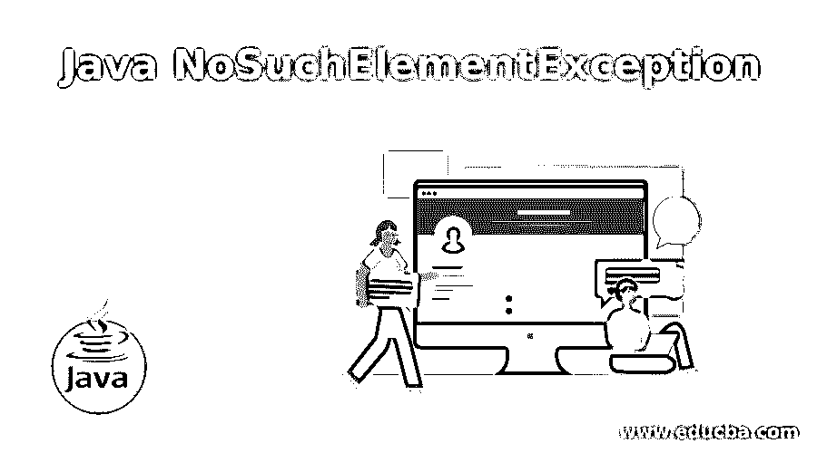
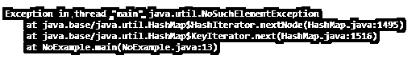
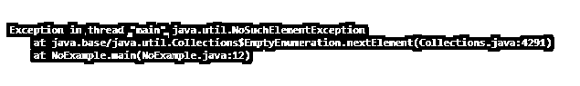
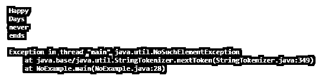

# Java nosuche element exception(Java nosuche element 异常)

> 原文：<https://www.educba.com/java-nosuchelementexception/>




## Java NoSuchElementException 的定义

nextElement 方法在 Enumeration 中抛出 Java 的 NoSuchElementExceptionin，在 NamingEnumeration 中抛出 next 方法等。它表示枚举中没有其他元素。此异常是 RuntimeException 异常的子类，实现 Serializable 接口。除了枚举之外，还有其他一些类会抛出这个异常。下面是不同的类及其方法。

*   StringTokenizer::nextElement()
*   枚举::nextElement()
*   迭代器::next()
*   NamingEnumeration::next()

NoSuchElementException 的语法、工作、构造函数和示例将在下面的部分中解释。

<small>网页开发、编程语言、软件测试&其他</small>

**声明:**

下面是 NoSuchElementException 的声明。

```
public class NoSuchElementExceptionextends RuntimeException
```

### NoSuchElementException 在 Java 中是如何工作的？

我们知道，异常是程序执行过程中出现的错误。程序被终止，当抛出异常时，导致异常的代码行之后的代码行不会被执行。引发 NosuchElementException 的情况有多种。它们是:

*   在运行时抛出 NosuchElementException，调用 anull 枚举对象上的类枚举的方法 nextElement()，或者当前位置是枚举结束。
*   NosuchElementException 是在运行时调用 StringTokenizeron anull 枚举对象类的 nextElement()或 nextToken()方法时引发的，当前位置是 StringTokenizerend。
*   NosuchElementException 在运行时调用类迭代器的 next()方法时抛出，当前位置是迭代器结束。
*   NosuchElementException 是在运行时调用类 ListIteratoron 的 next()方法时引发的。
*   在运行时调用类 ListIteratoron 的 previous()方法时会引发 NosuchElementException。

### 构造器

下面是 NoSuchElementException 的两个构造函数

*   **NoSuchElementException():**NoSuchElementException 将在不提供任何错误消息或字符串通知的情况下构建。
*   **no SuchElementException(Stringst):**no SuchElementException 将以字符串 st 的形式提供错误消息或通知。这将在 getMessage 方法的帮助下用于以后的检索。包含错误的类名将出现在字符串 st 中。

### Java NoSuchElementException 的示例

让我们看一些在 Java 中抛出 NoSuchElementException 的示例程序。

#### 示例#1

Java 程序抛出 NoSuchElementExceptionas，因为 HashSet 中没有元素。

**代码:**

```
import java.util.HashSet;
import java.util.Set;
//class
public class NoExample {
//main method
public static void main(String[] args) {
//create an object for set s
Set s = new HashSet();
//select the next element
s.iterator().next();
}  }
```

**输出:**




在这个程序中，首先创建一个 hashset，然后使用 next()方法选择集合中的下一个元素。由于集合中没有元素，因此会引发 NoSuchElementException。为了避免这种情况，可以在迭代集合之前进行检查，如下所示。

```
import java.util.HashSet;
import java.util.Iterator;
import java.util.Set;
//class
public class NoExample {
//main method
public static void main(String[] args) {
Set e = new HashSet();
Iterator it = e.iterator();
//checks whether any element is present
while(it.hasNext()) {
System.out.println(it.next());
}
}
}
```

为了检查元素的存在，在现有程序中添加了一个 while 循环和一个迭代器。如果执行这段代码，可以看到没有抛出异常。

#### 实施例 2

Java 程序抛出 NoSuchElementException，因为 HashTable 中没有元素

**代码:**

```
import java.util.Hashtable;
//class
public class NoExample {
//main method
public static void main(String[] args) {
//create an object for hashtable s
Hashtable s = new Hashtable();
//select the next element
s.elements().nextElement();
}  }
```

**输出:**




在这个程序中，首先创建一个哈希表，然后使用 next element()方法选择表中的下一个元素。因为表中没有元素，所以抛出 NoSuchElementException。为了避免这种情况，可以在迭代表之前进行检查，如下所示。

```
import java.util.Hashtable;
import java.util.Iterator;
import java.util.Set;
//class
public class NoExample {
//main method
public static void main(String[] args) {
//create an object for hashtable s
Hashtable s = new Hashtable();
Set<String>k = s.keySet();
Iterator<String>i = k.iterator();
while (i.hasNext()) {
System.out.println(i.next());
}
}  }
```

为了检查元素的存在，在现有程序中添加了一个 while 循环、一个集合和一个迭代器。如果执行这段代码，可以看到没有抛出异常。

#### 实施例 3

Java 程序抛出 NoSuchElementException，因为 StringTokenizer 和 Enumeration 中没有元素。

**代码:**

```
import java.util.Enumeration;
import java.util.Hashtable;
import java.util.StringTokenizer;
//class
public class NoExample {
private final static int el = 2;
//main method
public static void main(String[] args) {
//declare a string
String sn= "Happy Days never ends";
Hashtable s= new Hashtable(el);
Enumeration t = s.elements();
//create an object for StringTokenizer
StringTokenizer st = new StringTokenizer(sn, " ");
//Print the tokens
System.out.println(st.nextToken());
System.out.println(st.nextToken());
System.out.println(st.nextToken());
System.out.println(st.nextToken());
System.out.println(st.nextToken());
st.nextToken();
st.nextElement();
System.out.println(t.nextElement());
System.out.println(t.nextElement());
}
}
```

**输出:**




在这个程序中，首先创建一个 StringTokenizer，然后选择标记五次。因为只有四个标记，所以抛出 NoSuchElementException。为了避免这种情况，可以在迭代如下所示的 Tokenizeras 之前进行检查。

```
import java.util.Enumeration;
import java.util.Hashtable;
import java.util.StringTokenizer;
//class
public class NoExample {
private final static int el = 2;
//main method
public static void main(String[] args) {
//declare a string
String sn= "Happy Days never ends";
Hashtable s= new Hashtable(el);
Enumeration t = s.elements();
//create an object for StringTokenizer
StringTokenizer st = new StringTokenizer(sn, " ");
while(st.hasMoreTokens()) {
System.out.println(st.nextToken());
}
}
}
```

为了检查元素的存在，在现有程序中添加了一个 while 循环。如果执行这段代码，可以看到没有抛出异常。


### 结论

NoSuchElementException 是在类 Iterator、StringTokenizer、Enumeration 和 NamingEnumeration 中调用方法 next()和 nextElement()时没有检索到元素时引发的异常。在这篇文章中，不同的方面，如声明，工作，构造函数，和 NoSuchElementException 的例子进行了详细的解释。

### 推荐文章

这是一个 Java NoSuchElementException 的指南。在这里，我们还讨论了定义以及它在 java 和不同示例中的工作方式，以及它的代码实现。您也可以看看以下文章，了解更多信息–

1.  [JavaScript 中的 push()](https://www.educba.com/push-in-javascript/)
2.  [Java 中的 copy()](https://www.educba.com/copy-in-java/)
3.  [爪哇的 EJB](https://www.educba.com/ejb-in-java/)
4.  [Java 中的可比](https://www.educba.com/comparable-in-java/)


