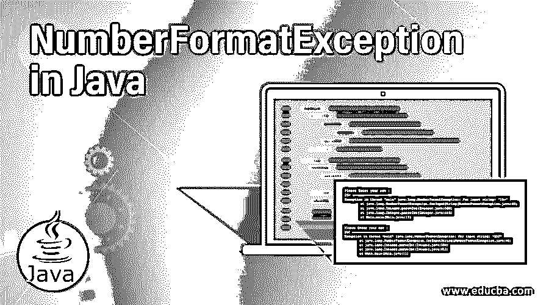
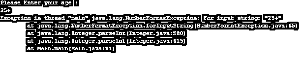
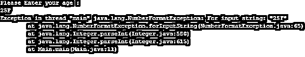
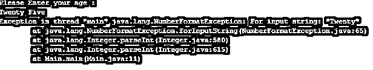
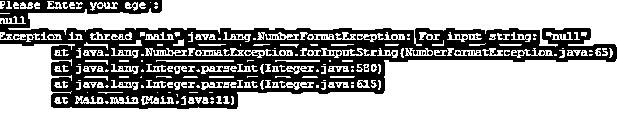
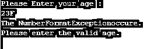
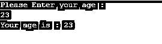

# Java 中的 NumberFormatException

> 原文：<https://www.educba.com/numberformatexception-in-java/>




## Java 中的 NumberFormatException 简介

NumberFormatException 是 java 中的一个未经检查的异常，当用户试图将字符串转换为数值时会发生该异常。NumberFormatException 是 java 中的内置类，在 Java . lang . NumberFormatException 包中定义。IllegalArgumentException 类是 NumberFormatException 的超类，因为它是一个未检查的异常，所以不强制处理和声明它。NumberFormatException 实际上是由 parseXXX()函数在函数不能将字符串转换或格式化(转换)为整数、浮点、双精度等数值时抛出的。，因为输入字符串的格式是非法和不适当的。例如，在 Java 程序中，有时用户输入通过命令行参数作为字符串形式的文本字段被接受。为了在一些算术运算中使用这个字符串，应该首先使用包装类的 parseXXX()函数解析或转换成数据类型(特定的数字类型)。

**NumberFormatException 类的层次结构为:**

<small>网页开发、编程语言、软件测试&其他</small>

对象 **- >** 可抛出 **- >** 异常 **- >** 运行时异常 **- >** 数字格式异常。

**语法**

以下是 java.io. PrintWriter 类的声明。

```
public class NumberFormatException extends IllegalArgumentException implements Serializable
{
// Constructors of the NumberFormatException class
}
```

以上是 NumberFormatException 的语法，它被扩展到:

```
IllegalArgumentException class and implements Serializable
```

### NumberFormatException 在 Java 中是如何工作的？

当试图将字符串转换为数字时，会发生 NumberFormatException。这种转换是通过使用 Integer.parseInt()、Float.parseFloat()和 all 等函数来执行的。假设我们调用 Integer.parseInt(s)函数，其中 s 是 string 的一种类型，它的值是 String“30”，因此该函数将 String 值正确地转换为 int 30。但是发生了什么？如果 s 的值假定为“三十”，这是非法的，那么函数将失败并抛出一个异常:NumberFormatException。为了处理这个异常，我们可以为它编写 catch 块；如果异常没有被处理，那么程序将会崩溃。

抛出 NumberFormatException 有不同的原因，如下所示

*   提供的要转换的字符串可能为空。ex:integer . parse int(null)；
*   提供的字符串长度可以为零。ex:integer . parse int(" ")；
*   提供的字符串可能没有数字字符。Ex:Integer.parseInt("三十")；
*   提供的字符串可能不代表整数值。ex:integer . parse int(" FG67 ")；
*   t 提供的字符串可能为空。ex:integer . parse int(" ")；
*   提供的字符串可以是尾随空格。ex:integer . parse int(" 785 ")；
*   提供的字符串可能是前导空格。ex:integer . parse int(" 785 ")；
*   所提供的字符串可以包含字母数字。ex:long . parse long(" F5 ")；
*   提供的字符串可能是超出支持范围的数据类型。ex:integer . parse int(" 139 ")；
*   提供的字符串和用于转换的函数可能属于不同的数据类型。ex:integer . parse int(" 3.56 ")；

#### 构造器

*   **NumberFormatException():** 此构造函数创建 NumberFormatException，但不包含详细的具体消息。
*   **NumberFormatException(String s):**该构造函数创建 NumberFormatException，并带有具体的详细消息。

### 在 Java 中实现 NumberFormatException 的示例

以下是要实施的示例:

#### 示例#1

接下来，我们编写 java 代码来更清楚地理解 NumberFormatException，在下面的示例中，我们使用 PrintWriter 类构造函数创建一个 PrintWriter 对象，并传递要写入其中的文件名，如下所示

**代码:**

```
//package p1;
import java.util.Scanner;
public class Demo
{
public static void main( String[] arg) {
int age;
Scanner sc = new Scanner(System.in);
System.out.println("Please Enter your age : ");
//throws Exception as if the input string is of illegal format for parsing as it as null or alphanumeric.
age = Integer.parseInt(sc.next());
System.out.println("Your age is : " +age);
}
}
```

**输出:**

当用户输入“25+”时，上述代码的输出是:




当用户输入格式不正确的字符串“25F”时，输出是:




当用户输入字符串“Twenty Five”时，输出是:




当用户输入字符串“null”时，输出是:




当用户输入浮点值“40.78”时，输出为:


当用户输入有效字符串“25”时。输出是:


**解释:**和上面的代码一样，年龄值以字符串格式从用户处接受，通过使用 Integer.parseInt(sc.next())函数进一步转换为整数格式。当用户输入非法字符串或格式不正确的字符串时，NumberFormatException 发生，它抛出，程序不成功地终止。因此，为了提供有效的字符串，应该注意输入字符串不能为空，检查参数字符串是否与所使用的转换函数的类型相匹配，还要检查是否有不必要的空格；如果是的话，那么修剪它，所以一切都要小心。

#### 实施例 2

接下来，我们编写 java 代码来理解 NumberFormatException，其中我们生成 NumberFormatException 并通过使用程序中的 try-catch 块来处理它，如下所示

**代码:**

```
//package p1;
import java.util.Scanner;
public class Demo
{
public static void main( String[] arg) {
int age;
Scanner sc = new Scanner(System.in);
try
{
System.out.println("Please Enter your age : ");
//throws Exception as if the input string is of illegal format for parsing as it as null or alphanumeric.
age = Integer.parseInt(sc.next());
System.out.println("Your age is : " +age);
} catch(NumberFormatException e)
{
System.out.println("The NumberFormatExceptionoccure.");
System.out.println("Please enter the valid age.");
}
}
}
```

当用户输入字符串“23F”时，输出是:




当用户输入字符串“23”时，输出是:




**解释:**在上面的代码中使用了 try-catch 块。将可能引发异常的代码行包含在 try-catch 块中始终是一种好的做法，通过该块可以处理 NumberFormatException 并防止它生成异常。

### 结论

java 中的 NumberFormatException 是一个未检查的异常，当格式不正确的字符串试图使用 parseXXX()函数转换为数值时，会出现该异常。NumberFormatException 是 Java . lang . NumberFormatException 包中定义的内置类。

### 推荐文章

这是一个 Java 中 NumberFormatException 的指南。在这里，我们讨论了 NumberFormatException 的适当语法介绍，它是如何工作的，以及例子。您也可以浏览我们的其他相关文章，了解更多信息——

1.  [Java 中的关联](https://www.educba.com/association-in-java/)
2.  [爪哇的 EJB](https://www.educba.com/ejb-in-java/)
3.  [Java min()](https://www.educba.com/java-min/)
4.  [Java 中的 copy()](https://www.educba.com/copy-in-java/)


