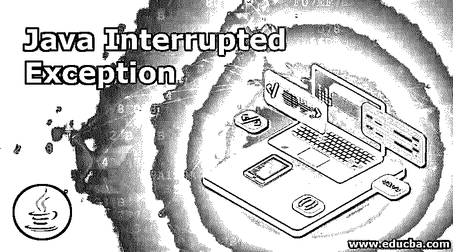

# Java 中断异常

> 原文：<https://www.educba.com/java-interruptedexception/>




## Java 中断异常简介

当线程可能正在休眠、等待，或者在执行某个活动之前或之时被占用和中断时，就会发生 InterruptedException。有时一个方法可能想要测试一个当前线程是否已经被中断。如果它已经被中断，那么它将立即抛出一个异常。否则，它将按照以前的方式工作。在这个主题中，我们将学习 Java 中断异常。

### 句法

为了使用异常，您必须使用以下语法:

<small>网页开发、编程语言、软件测试&其他</small>

```
if (Thread.interrupted ())  // Clears interrupted status!
throw new InterruptedException ();
```

这里，方法 InterruptedException()创建了一个 InterruptedException，其中没有详细的消息作为参数。

但是如果像 InterruptedException (String s)那样抛出，它会创建一个带有某些特定细节的 InterruptedException。在这种方法中，s 是详细的消息。

### Java 中 InterruptedException 是如何工作的？

这里我们将讨论 InterruptedException 的工作流程。在多线程代码中，线程经常会阻塞；线程暂停执行，直到满足某些外部条件，例如:

*   当锁被释放时
*   或者另一个线程完成了一个操作
*   而且，一些输入/输出操作也完成了

在这里，线程可以被中断。当中断发生时，它会停止线程正在做的常规工作。但是对指定中断的确切响应取决于线程的状态，以及线程将如何实现，如下所示:

我们将会有一个线程，可以用来阻塞已经存在的线程或更早的线程。当这个被捕获时，它抛出 InterruptedException。如果没有问题并且没有更早的线程，那么该线程继续其工作。当线程遇到异常时，它将线程的中断状态设置为 true。线程将定期轮询 checkInterrupted()方法。这是期望线程工作的首选方式。一旦该过程完成，就会发生清理活动。在清理之后，执行就停止了。它抛出 InterruptedException，如果有，如果没有，它继续正常的执行流程。

如果在上面的进程中有一个中断，该进程不应该立即关闭线程。这是因为它将处于某些计算的中间，而这些计算总是在发生，因此它必须等待。

### 构造器

构造函数是 Java 对象，帮助初始化新创建的对象或方法。它是一个没有任何返回类型的 Java 实例。因为它应该初始化对象，所以它与它所属的类同名。因此，每当调用对象时，都会自动调用构造函数并进行初始化。下面是一个构造函数方法。

```
InterruptedException ()
```

这里，这个方法创建了一个没有消息的异常。这里正在创建 InterruptedException 类的一个实例。在此构造函数中，message 参数被设置为 null。

**举例:**

```
public InterruptedException () InterruptedException (String s)
```

在 InterruptedException 类的这个方法中，参数被用作字符串格式的指定消息。这里的字符串参数解释了抛出错误的类的名称。

### 中断异常的例子

现在我们来看一个线程被中断的例子:

```
// Java Program to check how
// interrupt () method  works
// simultaneously while a thread stops working
class CheckInterruption extends Thread {
public void run ()
{
try {
Thread.sleep (2000);
System.out.println ( "We are checking Interrupted Exception");
}
catch (InterruptedException e) {
throw new RuntimeException ( "Thread is" + "interrupted");
}
}
public static void main (String args[])
{
CheckInterruption t1 = new CheckInterruption ();
t1.start ();
try {
t1.interrupt ();
}
catch (Exception e) {
System.out.println ("Exception handled");
}
}
}
```

**输出:**


上面的代码有助于我们理解中断异常的概念。我们有一个类， *CheckInterruption，*，它扩展了 Java 的 Thread 类。然后，它在 try 块中查找异常。如果有异常，它会在 catch 块中被捕获，输出显示为 catch 块。在我们的例子中就是这种情况，中断被捕获，必要的输出被显示。但是程序并没有完成，因为 catch 块调用了 Java 中的 Exception()方法。现在让我们检查一个例子，在这个例子中，异常被捕获，然后下一个线程开始。

```
class CheckInterruptingThread2 extends Thread{
public void run (){
try{  Thread.sleep (1000);
System.out.println ("task");
}catch (InterruptedException e){
System.out.println ("Exception is handled "+e);  }
System.out.println ("thread is now in running state...");
}
public static void main (String args[]){
CheckInterruptingThread2 t1=new CheckInterruptingThread2 ();
t1.start ();
t1.interrupt ();
}
}
```

**输出:**


上面的程序使用了一个类，它再次扩展了 Java 中的 Thread 类。在 try()块中，我们让线程休眠一段时间，然后 catch 块在遇到异常时捕获它。一旦处理完毕，就打印出消息，然后调用 interrupt()方法，之后下一个线程进入运行状态。在方法调用完成并且线程开始工作之后，也会显示相同的内容。

### 如何避免 InterruptedException？

这个异常的解决方案是您可以停止使用 thread.sleep()方法。代替这个方法，更高效的方法将是 SystemClock.sleep()方法。上述方法的另一种替代方法是使用 TimeCOunter，这取决于使用它的逻辑和代码。这也可以是最佳解决方案。

如果你仍然想使用 thread.sleep()，那么应该像下面这样使用它。

```
try {
Thread.sleep ();
} catch (InterruptedException e) {
Thread.currentThread ().interrupt (); /* this line will see to it that Thread.interrupted () always returns true */
throw new RuntimeException (e);
}
```

### 结论–Java 中断异常

正如 exception 这个词所暗示的，在某些情况下，这是一种可以检查并允许通过的状态。当一个线程等待或休眠时，就会发生 InterruptedException，其他线程被中断，无法继续执行。我们可以通过使用适当的 try-catch 块或者避免使用 sleep()方法来处理这个异常。

### 推荐文章

这是 Java InterruptedException 的指南。这里我们讨论中断异常在 Java 中是如何工作的，并给出代码和输出的例子。您也可以看看以下文章，了解更多信息–

1.  [爪哇的 EJB](https://www.educba.com/ejb-in-java/)
2.  [Java max ()](https://www.educba.com/java-max/)
3.  [终于在 Java 中](https://www.educba.com/finally-in-java/)
4.  [Java 中的 copy()](https://www.educba.com/copy-in-java/)


