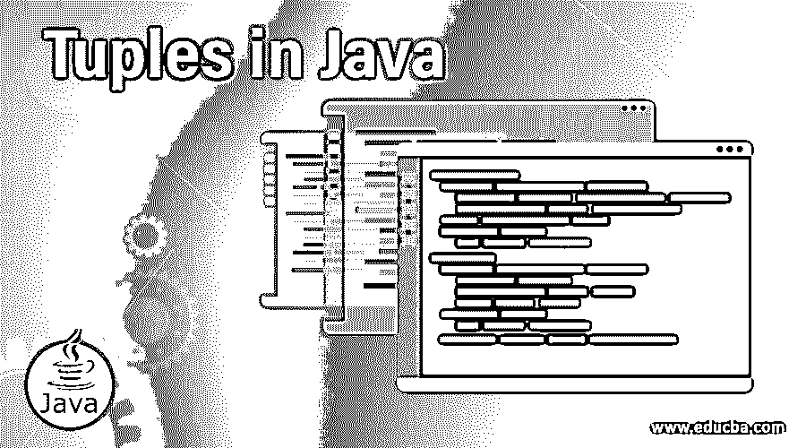

# Java 中的元组

> 原文：<https://www.educba.com/tuples-in-java/>




## Java 中的元组介绍

元组被认为是有序的不同类型的对象的集合。即使这些对象可能彼此相关，也可能不相关，但它们共同具有特定的含义。在 Java 中，没有元组支持的内置数据结构。因此，每当出现任何需求时，就会创建一个类。除此之外，这个功能可以用在列表和数组中。但是，不同数据类型的数据不能坚持这一点。

### 句法

下面是元组的语法。

<small>网页开发、编程语言、软件测试&其他</small>

**来自构造函数的元组:**

```
Nthtuple<t1,t2,. .  tn> nthtuple= new Nthtuple<t1,t2,. . . . . . . tn>(v1, v2, . . . . , vn)
```

**Tuple from with()方法:**

```
Nthtuple<t1,t2,. .  tn> nthtuple= new Nthtuple.with(v1, v2, . . . . , vn)
```

**来自其他集合的元组:**

```
Nthtuple<t1,t2,.  tn> nthtuple=new Nthtuple.fromCollection(collectionWith nvalues);
```

这里，

*   t1，t2，… tn 是 1 型，2 型，…，类型 n
*   v1，v2，...，vn 是值 1，值 2，...，值 n
*   n 是参数的数量和值的数量

### Java 中元组的特征

以下是 Java 中元组的主要特征

*   类型安全
*   可迭代的
*   实现 toString()
*   可比(元组实现可比<tuple>)</tuple>
*   不变的
*   可序列化
*   实现 equals()方法和 hashCode()。

### Java 中元组是如何工作的？

让我们以元组为例。

```
["Anna", "Computer Science", 23]
```

在这里，您可以看到这个元组的每个对象都是不同的数据类型。但是，当我们共同考虑时，可以确定这是计算机科学系的一名 23 岁学生安娜的一个细节。

**Note:** Tuples in Java supports size up to 10, and there is a particular way of implementation for each tuple size, as shown below.

| **元组的大小** | **名称** | **样品** |
| 一个元素 | 单位 | 单位<1> |
| 两个元素 | 一副 | 配对<1,2> |
| 三要素 | 三个一组 | 三联体<1,2,3> |
| 四种元素 | 四重奏 | 四重奏<1,2,3,4> |
| 五种元素 | 五重奏 | 五重奏<1,2,3,4,5> |
| 六种元素 | 曲棍球队 | 六重奏<1,2,3,4,5,6> |
| 七种元素 | 七重奏 | 七重奏<1,2,3,4,5,6,7> |
| 八种元素 | 八位字节 | octet |
| 九种元素 | 恩尼德 | Ennead <1,2,3,4,5,6,7,8,9> |
| 十种元素 | 十年 | 十年<1,2,3,4,5,6,7,8,9,10> |

### 用 Java 实现元组的例子

下面是提到的例子:

现在，让我们看一些元组的实际例子。

#### 示例#1

创建字符串类型对元组的 Java 程序

**代码:**

```
import org.javatuples.Pair;
public class TupExample {
public static void main(String[] args) {
//create a pair tuple from constructor
Pair<String,String>pobj = new Pair<String,String>("Happy", "Sad");
//print the tuples
System.out.println("Emotions are: " + pobj);
}
}
```

**输出:**


**说明:**在这个程序中，创建了一个字符串类型的 pair tuple。为此，必须首先导入包 org . javatules . pair。一旦创建了元组，就可以打印元组的对象。

#### 实施例 2

创建一对不同数据类型的元组的 Java 程序

**代码:**

```
import org.javatuples.Pair;
public class TupExample {
public static void main(String[] args) {
//create a pair tuple from constructor
Pair<String,Integer>pobj = new Pair<String,Integer>("Anna", 23);
//print the tuples
System.out.println("Student is: " + pobj);
}
}
```

**输出:**


**解释:**在这个程序中，一个 pair tuple 是由两种不同的数据类型创建的，string 和 integer。这里也必须首先导入包 org . javatules . pair。一旦创建了元组，就可以打印元组的对象。

#### 实施例 3

使用 with()方法打印对元组的 Java 程序。

**代码:**

```
import org.javatuples.Pair;
public class TupExample {
public static void main(String[] args) {
//create a pair tuple from constructor
Pair<String,Integer>pobj = Pair.with("Anna", 23);
//print the tuples
System.out.println("Student is: " + pobj);
}
}
```

**输出:**


**说明:**与上述程序不同，本程序中使用 with()方法创建一个 pair tuple。这里也必须首先导入包 org . javatules . pair。一旦创建了元组，就可以打印元组的对象。

#### 实施例 4

创建整数类型的八位字节元组的 Java 程序

**代码:**

```
import org.javatuples.Octet;
public class TupExample {
public static void main(String[] args) {
//create an octet tuple from constructor
Octet<Integer,Integer,Integer,Integer,Integer,Integer,Integer,Integer>pobj = Octet.with(12, 23, 34, 45, 56, 67, 78, 89);
//print the tuples
System.out.println("Numbers are: " + pobj);
}
}
```

**输出:**


**说明:**在这个程序中，使用 with()方法创建一个 octet 元组。这里，必须首先导入包 org . javatules . octet。一旦创建了元组，就可以打印元组的对象。

#### 实施例 5

使用 fromCollection()创建整数类型的十进制元组的 Java 程序

**代码:**

```
import java.util.ArrayList;
import java.util.List;
import org.javatuples.Decade;
public class TupExample {
public static void main(String[] args) {
// Create a li of 10 elements
List<Integer>li = new ArrayList<Integer>();
li.add(12);
li.add(23);
li.add(34);
li.add(45);
li.add(56);
li.add(67);
li.add(78);
li.add(89);
li.add(90);
li.add(101);
Decade<Integer, Integer, Integer, Integer, Integer, Integer, Integer, Integer, Integer, Integer>dobj
= Decade.fromCollection(li);
Integer[] a = { 12, 23, 34, 45, 56, 67, 78, 89, 90, 101 };
Decade<Integer, Integer, Integer, Integer, Integer, Integer, Integer,
Integer, Integer, Integer>dnew = Decade.fromArray(a);
System.out.println("Numbers are: " +dobj);
System.out.println("Numbers are: " +dnew);
}
}
```

**输出:**


**说明:**在这个程序中，使用 fromCollection()方法创建一个十进制元组。为此，首先，必须创建一个包含 10 个元素的列表。稍后将使用 fromCollection()方法打印这 10 个元素。在这里，首先要导入包 org . javatules . decade。只有在导入之后，才能打印元组的对象。

#### 实施例 6

使用 with()和 fromCollection()方法创建八位字节元组的 Java 程序。

**代码:**

```
import java.util.ArrayList;
import java.util.List;
import org.javatuples.Octet;
public class TupExample {
public static void main(String[] args) {
//create an octet tuple from constructor
Octet<Integer,Integer,Integer,Integer,Integer,Integer,Integer,Integer>pobj = Octet.with(12, 23, 34, 45, 56, 67, 78, 89);
//print the tuples
System.out.println("Numbers using with() method are: " + pobj);
// Create a list of 8 elements
List<Integer>li = new ArrayList<Integer>();
li.add(12);
li.add(23);
li.add(34);
li.add(45);
li.add(56);
li.add(67);
li.add(78);
li.add(89);
Octet<Integer, Integer, Integer, Integer, Integer, Integer, Integer, Integer>dobj
= Octet.fromCollection(li);
System.out.println("Numbers using the fromCollection() method are: " +dobj);
}
}
```

**输出:**


**说明:**在这个程序中，使用 fromCollection()和 with()方法创建一个 octet 元组。

### 结论

元组被认为是不同类型的有序对象的集合。在本文中，将详细解释 Java 元组的语法、特征、工作方式和示例。

### 推荐文章

这是 Java 中的元组指南。为了更好地理解，我们在这里讨论 Java 中元组的主要特征、工作原理和例子。您也可以浏览我们的其他相关文章，了解更多信息——

1.  [Java 中的可比](https://www.educba.com/comparable-in-java/)
2.  [Java 中的 box layout](https://www.educba.com/boxlayout-in-java/)
3.  [最佳 Java 编译器](https://www.educba.com/best-java-compilers/)
4.  [Python 中的元组](https://www.educba.com/tuples-in-python/)


