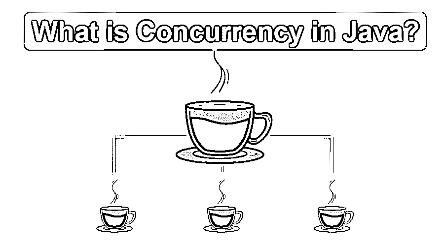

# Java 中的并发是什么？

> 原文：<https://www.educba.com/what-is-concurrency-in-java/>

## Java 中的并发是什么？

当今世界，一切都在飞速发展。任何事情都有改进的余地。我们的编程语言也是如此。今天，随着我们的现代技术，我们希望事情能够容易和快速地完成。为了同时做多件事情或者同时做几件事情，并发的概念出现了。那么实际上并发是什么，它的用途是什么，为什么真的需要它，等等。我们将尝试触及此类问题，并在本文中一一解答。因此，让我们将讨论引向一个非常基本的常见部分，即并发性的定义。在这个主题中，我们将学习什么是 Java 中的并发性。

### 并发的定义？

那么什么是并发呢？为了回答这个问题，让我们来看一个常见的场景。假设在阅读这篇文章时，你正试图同时做多件事情；也许你也在试着做笔记，也许你在试着理解它或者思考一些事情。因此，简单地说，你正在尝试并行地做多件事情。这就是并发的含义。并发性就是相互并行地执行多个任务。在本文中，我们将在 Java 作为编程语言的范围内讨论并发性。

<small>网页开发、编程语言、软件测试&其他</small>

实际上，在 Java 或一般的任何编程语言中，负责执行并发的是线程。这些线程的基本作用是促进任务的并行执行。同时，让我们对线程有一个基本的定义。

### 那么什么是线程呢？

线程是一个轻量级的进程，有自己的调用堆栈。然而，一个线程拥有从在同一进程下执行的其他线程访问共享数据的特权。在 Java 应用程序中，我们可以使用许多线程来实现并行处理或并发。

现在让我们进入下一个话题，那就是，

### Java 定义中的并发？

所以，在 Java 或者其他任何类似 C# 的[编程语言中，所有 OOP 的语言都有一个线程概念。在 Java 中，我们有不同的进程，它们通过创建不同的线程来实现并发性。](https://www.educba.com/uses-of-c-sharp/)

那么在这个简单的定义之后，让我们来讨论我们的新话题，那就是:

### 是什么让 java 应用并发？

第一个类是 java.lang.Thread 类，这是使 java 应用程序并发所需的。java.lang.Thread 类负责 java 编程语言中的所有并发概念。在这之后，我们有 java.lang.Runnable 接口将线程行为从线程类中抽象出来。

构建高级应用程序所需的其他类将从 Java 1.5 中添加的 java.util.concurrent 包中使用。

现在，我们有了一个新的问题:

### Java 并发真的那么简单吗？

看起来用 Java 实现并发很简单。然而，事实并非如此。让我们负责这件事。

我们上面的讨论总的来说给人一种印象，并发确实是一个简单、好的概念，并且很容易实现。如果我们以一种更好的方式进行监控，并试图理解它，我们会发现这需要对基本概念有大量的理解，以及对我们需要实现的目标有透彻的理解。

如果我们比较并发应用程序和单线程应用程序，我们通常会发现并发应用程序在设计和理解[方面很复杂。多线程执行的代码需要特别注意和资源来访问共享数据。由于不正确的线程](https://www.educba.com/career-in-designing/)[同步](https://www.educba.com/what-is-synchronization-in-java/)导致的错误弹出很难调试和修复。此外，在大多数场景中，这些错误在初始阶段没有被发现，事实上，它是在生产模式中被检测到的，这甚至更难重现。

除了错误和常见缺陷，并发线程需要更多的资源来运行应用程序。

### 并发性的问题和改进——举例说明

所以基本上，有两种类型的问题是由于并发而分配的。这些问题可以大致分为两类

*   螺纹干涉误差
*   内存一致性错误

让我们逐一了解

**螺纹干涉误差**–让我们用一个简单的例子来理解。

假设我们有一个计数器函数，它的基本作用是增加一个数的计数器或计数。现在假设我们有两个线程，线程 A 和线程 b，假设线程 A 读取的初始值为 0。现在，以下步骤按顺序运行。

1.  线程 A 读取初始值为 0
2.  线程 B 读取初始值为 0
3.  线程 A 的值增加 1。新值现在是 1
4.  线程 B 也并行地将值增加到 1。
5.  线程 A 将更新值 1 写入存储单元
6.  线程 B 也重复相同的步骤，即在存储单元中写入更新值 1

所以问题就出现了。两个线程 A & B，执行代码两次，预期值是 2，但反映的是 1。这是多线程可能导致的主要问题

如何解决这个问题？

线程干扰错误可以通过同步访问共享变量来解决。我们需要在共享数据之间保持更新值的同步。

至此，让我们来看看第二种错误

**内存一致性错误**

内存不一致错误通常发生在不同的线程试图读取同一数据或对同一数据有不一致的视图时。这种情况通常发生在第一个线程更新一些共享数据，并且这个更新的值没有传播到第二个或不同的线程，并且它们读取旧数据的时候。

让我们看看为什么会这样？

嗯，这可能有很多原因。通常，编译器通常会对应用程序进行大量的优化以提高性能。它还可以更新指令序列，以优化性能。甚至一般来说，处理器也试图优化代码；例如，CPU 可能从高速缓冲存储器或临时寄存器而不是主存储器中读取变量的当前值。

### 结论——什么是 Java 中的并发性？

并发性是任何面向对象的语言的一个非常重要的特征。线程为我们提供了并行执行多个进程的功能。它帮助我们更快地执行复杂的任务。然而，从优点来看，并发也有一些缺点。使用线程会导致资源的大量使用。

### 推荐文章

这是 Java 中并发性的指南。例如，这里我们已经讨论了并发性方面的问题和改进。您也可以浏览我们推荐的其他文章，了解更多信息——

1.  [什么是 java 中的多线程？](https://www.educba.com/what-is-multithreading-in-java/)
2.  [如何用 Java 连接数据库？](https://www.educba.com/how-to-connect-database-in-java/)
3.  [什么是 java 中的多线程？](https://www.educba.com/what-is-multithreading-in-java/)
4.  什么是 J2EE？

