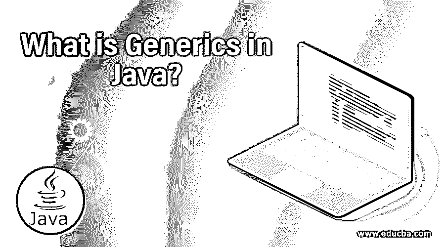
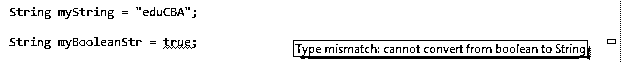
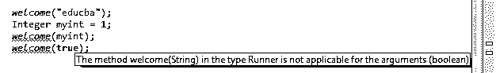
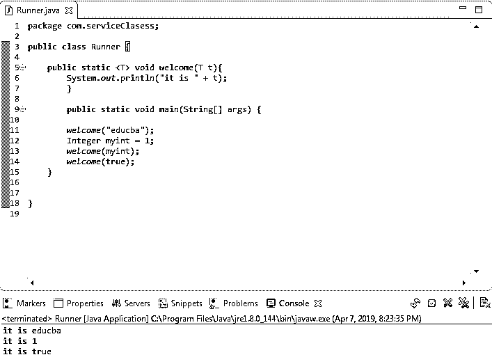
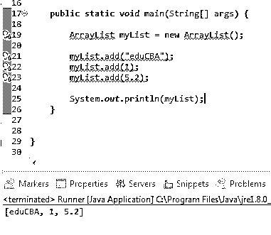
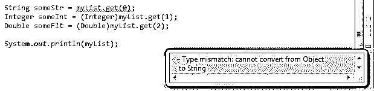
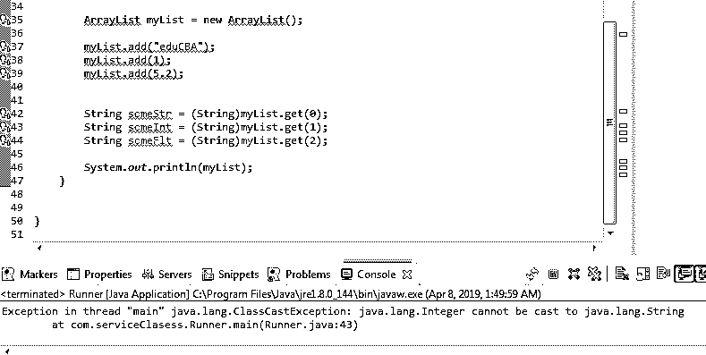
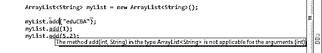
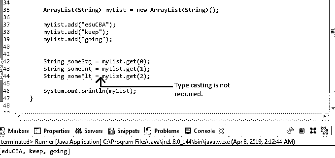
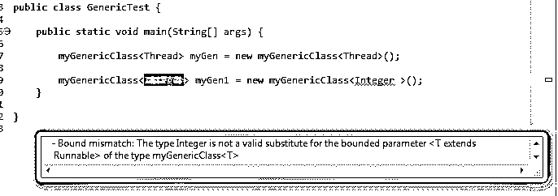

# Java 中的泛型是什么？

> 原文：<https://www.educba.com/what-is-generics-in-java/>




## Java 中的泛型介绍

Java 中的泛型是帮助实现代码可重用性和类型安全性的高级特性。java 中的代码重用功能是通过定义泛型类、接口、构造函数和方法来管理的。泛型将数据类型声明用于类型安全功能，这有助于消除运行时错误。java 中的泛型是用尖括号'<>'符号实现的，括号中定义了类型参数。类型参数包括“T”表示类型，“E”表示元素，“N”表示数字，“K”表示键，“V”表示值。带有类型 T 参数的泛型类的一个例子是“public class demogenic class<t>{…}”</t>

### Java 中的泛型是什么？

泛型可以定义为一种实现代码可重用性的方法，方法是定义可用于不同数据类型的泛型类、接口、构造函数和方法，并通过预先声明实现中使用的数据类型来实现类型安全，从而消除运行时错误的可能性。

<small>网页开发、编程语言、软件测试&其他</small>

### Java 中泛型是如何实现的？

泛型是用尖括号“<>”实现的括号将类型参数“T”括在其中。比如<t>。类型参数“T”是一个占位符，表示将在运行时分配数据类型。</t>

例如，泛型类将被定义为:

**代码:**

```
public class MyGenericClass<T> {…}
```

以下是标准类型参数:

*   **T:** 类型
*   **E:** 元素
*   **N:** 号
*   **K:** 键
*   **V:** 值

在多参数的情况下，s、U、V 等分别用于定义第二、第三和第四参数。

### 理解 Java 中的泛型

到现在为止，你可能想知道什么是安全类型，它是如何工作的？或者泛型类、接口、构造函数和方法与我们的常规类和方法有什么不同，使它们可以重用？

Java 是一种静态类型语言，它要求您在使用变量之前声明“类型”，即变量所包含的值的数据类型。

**举例:**

**代码:**

```
String myString ="eduCBA";
```

这里的“String”是数据类型，“myString”是保存类型为 String 的值的变量。

现在，如果您尝试传递一个布尔值来代替字符串，例如:

**代码:**

```
String myBooleanStr = true;
```

您将立即得到一个编译时错误，指出“类型不匹配:无法从布尔值转换为字符串。”

**输出:**




### 我们如何用泛型实现代码的可重用性？

现在，让我们定义一个常规方法:

**代码:**

```
public static void welcome(String name){
System.out.println("welcome to " + name);
}
```

只能通过传递字符串参数来调用此方法。

**代码:**

```
welcome("eduCBA");
```

它的输出将是“欢迎来到 eduCBA”

但是，您不能绕过其他数据类型(如 integer 或 boolean)调用此方法。如果您尝试这样做，将会出现一个编译时错误提示，“类型运行器中的方法 welcome(String)不适用于参数(boolean)。”这意味着您不能将任何其他数据类型传递给只接受字符串作为参数的方法。

**输出:**




如果您希望为不同的数据类型调用类似的方法，您必须编写一个新的方法，该方法接受所需的数据类型作为参数。这种用不同数据类型的参数重写方法的特性也称为方法重载。这样做的主要缺点是增加了代码的大小。

然而，我们也可以使用泛型重写上述方法，并将其用于我们需要的任何数据类型。

定义泛型方法:

**代码:**

```
public static <T> void welcome(T t){
System.out.println("it is " + t);
}
```

**Note:** Here, “t” is an object of type T. T will be assigned the data type used to invoke the method.

现在，您可以通过在需要时为字符串、布尔值、整数或任何其他数据类型调用该方法来重用该方法。

**代码:**

```
welcome("educate");
Integer Myint = 1;
welcome(Myint)
welcome(true);
```

上述语句将提供以下输出:

**输出:**

这是真的

因此，在这里使用泛型，我们可以针对不同的数据类型重用我们的方法。




### 我们如何使用泛型实现类型安全？

数组和集合的主要区别之一是数组只能存储同类数据，而集合可以存储异类数据。也就是说，集合可以存储任何用户定义的数据类型/对象。

**Note:** Collections can only hold objects (user-defined data type) and not a primitive data type. To work with primitive data, type collections [make use of wrapper classes](https://www.educba.com/wrapper-class-in-java/).

现在，让我们考虑一个数组列表。

**代码:**

```
ArrayList myList = new ArrayList();
```

让我们将字符串、整数和双精度类型的数据添加到 ArrayList 对象中。

**代码:**

```
myList.add("eduCBA");
myList.add(1);
myList.add(5.2);
```

在打印 ArrayList 对象时，我们可以看到它保存了以下值:[eduCBA，1，5.2]。

**输出:**




如果您希望将这些值检索到变量中，您将需要对它们进行类型转换。

**代码:**

```
String someStr = (String)myList.get(0);
Integer someInt = (Integer)myList.get(1);
Double someFlt = (Double)myList.get(2);
```

如果不进行类型转换，将会出现编译时错误提示:“类型不匹配:无法从对象转换为字符串。”

**输出:**




从 ArrayList 中检索对象时，必须将它们转换为各自的类型。你怎么知道用哪种数据类型对它进行类型转换呢？实时地，你的数组列表将包含成千上万的记录，并且为每个单独的对象将它强制转换成不同的数据类型将不是一个选项。您可能最终会将其类型转换为错误的数据类型。接下来会发生什么？

这一次，您将不会得到编译时错误，但会抛出一个运行时错误，说明“线程 main 中的异常”Java . lang . classcastexception:Java . lang . integer 不能在 com . serviceclasess . runner . main(runner . Java:43)处转换为 java.lang.String。




因为我们不能保证集合中存在的数据类型(在本例中是 ArrayList)，所以就类型而言，使用它们是不安全的。这就是泛型发挥作用提供类型安全的地方。

对泛型使用 ArrayList:

**代码:**

```
ArrayList<String> myList = new ArrayList<String>();
```

请注意，在尖括号“<>”中指定了字符串类型，这意味着 ArrayList 的这个特定实现只能保存字符串类型的数据。如果您试图添加任何其他数据类型，它只会抛出一个编译时错误。这里，通过消除添加除“String”之外的不同数据类型的可能性，您已经使数组列表成为类型安全的

**输出:**




现在，您已经在泛型的帮助下指定了允许添加到集合中的数据类型，您不再需要在检索数据时对其进行类型转换。也就是说，您可以简单地通过编写来检索您的数据。

**代码:**

```
String someStr = myList.get(0);
```

**输出:**




### Java 中的泛型是如何让工作变得如此简单的？

*   它有助于使您的集合类型安全，从而确保您的代码不会在以后由于运行时异常而失败。
*   这也使编码者不必对集合中的每个对象进行类型转换，从而使代码开发更快更容易。
*   通过使用泛型类和方法，人们还可以在实现过程中重用每种所需数据类型的代码。

### Java 中的泛型还能做什么？

到目前为止，我们已经看到了如何使用泛型实现类型安全和代码可重用性。

现在让我们看看泛型提供的其他特性。

*   有界和多重有界类型
*   键入通配符

#### 1.有界类型

在有界类型的情况下，参数的数据类型被限定在特定的范围内。这是借助“extends”关键字实现的。

例如，让我们考虑一个具有有界类型参数的泛型类，它扩展了 Runnable 接口:

**代码:**

```
class myGenericClass<T extends Runnable>{}
```

现在，在另一个类中创建它的对象时:

**代码:**

```
myGenericClass<Thread> myGen = new myGenericClass<Thread>();
```

上面的语句将完美地执行，没有任何错误。对于有界类型，可以传递相同的类类型或其子类类型。此外，您可以将参数类型绑定到一个接口，并在调用它时传递它的实现，就像上面的例子一样。

如果你尝试使用任何其他类型的参数会发生什么？

**代码:**

```
myGenericClass<Integer> myGen = new myGenericClass<Integer >();
```

在上面的例子中，您将得到一个编译时错误，说明“绑定不匹配:整数类型不是 myGenericClass <t>类型的类型转换<t extends="" runnable="">的有效替代。”</t></t>

**输出:**




*   **多有界类型**:在多有界类型的情况下，我们可以将参数数据类型绑定到多个类型。

**举例:**

**代码:**

```
class myGeneric<T extends Number & Runnable>{}
```

在这种情况下，您可以传递任何扩展 Number 类并实现 Runnable 接口的类型。

然而，当使用多个有界类型时，应该注意一些事情:

*   我们不能一次扩展一个以上的类。
*   我们可以同时扩展任意数量的接口；也就是说，对接口没有限制。
*   类名应该总是在前面，后面是接口名；否则，将导致编译时错误。

#### 2.键入通配符

它们由“？”表示–问号符号。它使用了两个主要关键字:

extends(定义上限)和 super(定义下限)。

**举例:**

**代码:**

```
ArrayList<? extends T> al
```

这个 ArrayList 对象“al”将保存 T 类型及其所有子类的任何数据。

**代码:**

```
ArrayList<? super T> al
```

这个数组列表对象“al”将保存 T 类型的任何数据及其所有超类。

### Java 中泛型的优势

以下是提到的优点:

*   灵活性:泛型允许我们的代码在泛型类和方法的帮助下适应不同的数据类型。
*   **代码维护和重用:**由于类和方法是通用的，如果以后需求发生变化，不需要重新编写代码，使得代码更容易维护和重用。
*   **类型安全:**通过预先定义集合可以保存的数据类型，并消除运行时由于 ClassCastException 导致失败的可能性，为集合框架提供类型安全。
*   **消除类型转换的需要:**由于集合中保存的数据类型已经确定，因此在检索时不需要对其进行类型转换。这减少了代码的长度和编码人员的工作量。

### Java 技能中的泛型

*   要使用泛型，您应该精通 Java 的基础知识。
*   你应该了解类型检查和类型转换是如何工作的。彻底了解其他概念是必要的，比如方法重载、父类和子类之间的关系、接口以及它们的实现。
*   此外，在使用集合框架时，理解原始数据类型(系统定义的数据类型)和对象(用户定义的数据类型)之间的区别是至关重要的。

### 为什么要在 Java 中使用泛型？

*   使用泛型使我们的代码更易于维护，因为它减少了每次需求发生变化时重写特定于数据类型的代码的需要。
*   通过使用泛型有界类型，您可以限制数据类型，同时通过定义其范围为代码提供灵活性。
*   您的代码不太可能在以后失败，因为它提供了类型安全，使您的代码不容易出错。

### Java 中泛型的作用域

泛型的范围仅限于编译时。这意味着泛型概念只适用于编译时，而不适用于运行时。

**举例:**

**代码:**

```
ArrayList myList = new ArrayList<Integer>();
ArrayList myList = new ArrayList<Float>();
ArrayList myList = new ArrayList<Double>();
ArrayList myList = new ArrayList<Boolean>();
```

在这里，上述四种说法都是一样的。它们允许向列表对象添加任何类型的数据。

### 结论

泛型使得编码者很容易编码。通过提供强类型检查，它减少了在运行时遇到 ClassCastException 的机会。它消除了对类型转换的需要，这意味着需要编写更少的代码。它允许我们[开发独立于数据类型的通用算法](https://www.educba.com/what-is-an-algorithm/)。

### 推荐文章

这是一本关于什么是 Java 中的泛型的指南？这里我们分别讨论了技能、范围、工作、理解和优点。您也可以浏览我们推荐的其他文章，了解更多信息——

1.  [Java 电子邮件](https://www.educba.com/java-email/)
2.  [Java 集合类](https://www.educba.com/java-collections-class/)
3.  [Java 列表迭代器](https://www.educba.com/java-listiterator/)
4.  [Java 异步](https://www.educba.com/java-async/)


