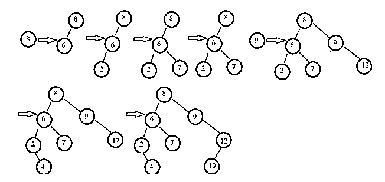
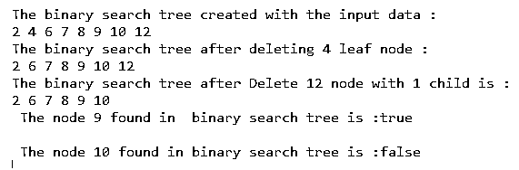

# 爪哇的二叉查找树

> 原文：<https://www.educba.com/binary-search-tree-in-java/>


## 二叉查找树的定义

二叉查找树是一种数据结构，它允许我们在短时间内保存一个有序的数字列表。它也被称为二叉树，因为每个树节点只能有两个兄弟。二叉查找树可以用于搜索一个号码的存在；它被称为搜索树。运行时间复杂度为 O(log(n))时间；区分二叉查找树和基本二叉树的特征如下

1.左子树的节点都比根节点小。

<small>网页开发、编程语言、软件测试&其他</small>

2.右边子树的节点都大于根节点。

3.子树的每个节点同样是 BST，这意味着它们具有与节点本身相同的两个性质。

### 在 Java 的二叉查找树上工作

1.让指定的数组为:

给定数组:[8，6，2，7，9，12，4，10]

2.让我们从顶部元素 43 开始。插入 43 作为树根。

3.如果下一个元素小于根节点元素，它应该作为左子树的根插入。

4.如果不是，它应该作为右子树的根插入。

下图描述了使用所提供的元素构建二叉查找树的过程。




**二叉查找树运营:**

Java 中二叉查找树支持的操作如下所示

1.在 BST 中搜索–在二叉查找树中，查找某个元素的位置。

2.BST 中的插入–在二叉查找树的适当位置添加新元素，确保不会破坏二叉查找树属性。

3.BST 中的删除–删除二叉查找树中的特定节点。但是，根据一个节点拥有的子节点的数量，可以有多种删除方案。

### 例子

Java 中的二叉查找树在二叉查找树上执行操作的示例

#### 示例#1

//程序可以在 Eclipse IDE，JAVA 11 中测试

```
package jex;
import java.util.Scanner;
class binarySearchTree {
//node class that defines BST node
class Node {
int key;
Node left, right;
public Node(int data){
key = data;
left = right = null;
}
}
// binary search tree root node
Node root;
// Constructor for binary search tree, first empty tree
binarySearchTree(){
root = null;
}
//delete a node from binary search tree
void deleteKey(int key) {
root = delete(root, key);
}
//recursive delete function
Node delete(Node root, int key) {
// if tree is empty
if (root == null) return root;
//traverse the tree
if (key < root.key)
//traverse left subtree
root.left = delete(root.left, key);
else if (key > root.key)
//traverse right subtree
root.right = delete(root.right, key);
else {
// if node having only one child
if (root.left == null)
return root.right;
else if (root.right == null)
return root.left;
// if node has two children;
root.key = minKey(root.right);
// removing the inorder sibling
root.right = delete(root.right, root.key);
}
return root;
}
int minKey(Node root) {
// initially min is root
int min = root.key;
// find minimum value
while (root.left != null) {
min = root.left.key;
root = root.left;
}
return min;
}
// insert a node in binary search tree
void insertKey(int key) {
root = insert(root, key);
}
// recursively insert a node
Node insert(Node root, int key) {
// initially, tree is empty
if (root == null) {
root = new Node(key);
return root;
}
// traverse the tree
if (key<root.key)
//insert in the left subtree
root.left = insert(root.left, key);
else if (key > root.key)
//insert in the right subtree
root.right = insert(root.right, key);
// return
return root;
}
// function to travel inorder of binary search tree
void inorder() {
inorder(root);
}
// recursively traverse the binary search tree
void inorder(Node root) {
if (root != null) {
inorder(root.left);
System.out.print(root.key + " ");
inorder(root.right);
}
}
boolean searchKey(int key) {
root = search(root, key);
if (root!= null)
return true;
else
return false;
}
//recursive insert function
Node search(Node root, int key) {
// If root is null or key is present at root
if (root==null || root.key==key)
return root;
// when val is greater than root's key
if (root.key > key)
return search(root.left, key);
// when val is lesser than root's key
return search(root.right, key);
}
}
public class client{
public static void main(String[] args) {
binarySearchTree t = new binarySearchTree();
// inserting 8, 6, 2, 7, 9, 12, 4, 10 data into the binary search tree
t.insertKey(8);
t.insertKey(6);
t.insertKey(2);
t.insertKey(7);
t.insertKey(9);
t.insertKey(12);
t.insertKey(4);
t.insertKey(10);
//print the binary search tree
System.out.println( "The binary search tree created with the input data :");
t.inorder();
//delete the leaf node
System.out.println( "\nThe binary search tree after deleting 4 leaf node :");
t.deleteKey(4);
t.inorder();
//delete the node with one child
System.out.println( "\nThe binary search tree after Delete 12 node with 1 child is :");
t.deleteKey(12);
t.inorder();
//search a key in the binary search tree
boolean res = t.searchKey (9);
System.out.println( "\n The node 9 found in binary search tree is :" + res );
res = t.searchKey (12);
System.out.println( "\n The node 10 found in binary search tree is :" + res );
}
}
```

**输出:**




与上面的程序一样，创建了 binarySearchTree 类，它包含另一个内部类节点，还包含构造函数和方法。类中定义的方法有 deleteKey()、delete()、minKey()、insertKey()、insert()、inorder()、searchKey()和 search()来执行特定的操作。在 main 函数中，创建了 binarySearchTree 类对象，向其中插入一些元素，然后调用其对象上的二叉查找树类的方法，如上面的输出所示。

### 结论

二叉查找树也称为二叉树，因为每个树节点只能有两个兄弟节点。二叉查找树是一种数据结构，它允许在很短的时间内保存一个有序的数字列表。可以在二叉查找树上执行的操作:遍历、插入、删除和搜索。

### 推荐文章

这是一本爪哇二叉查找树指南。这里我们讨论 Java 中二叉查找树的定义、工作原理以及代码实现的例子。您也可以看看以下文章，了解更多信息–

1.  [数据结构的二叉树](https://www.educba.com/binary-tree-in-data-structure/)
2.  [Java 中的桶排序](https://www.educba.com/bucket-sort-in-java/)
3.  [Java 中的 Shell 排序](https://www.educba.com/shell-sort-in-java/)
4.  [在 Java 中排序字符串数组](https://www.educba.com/sort-string-array-in-java/)


