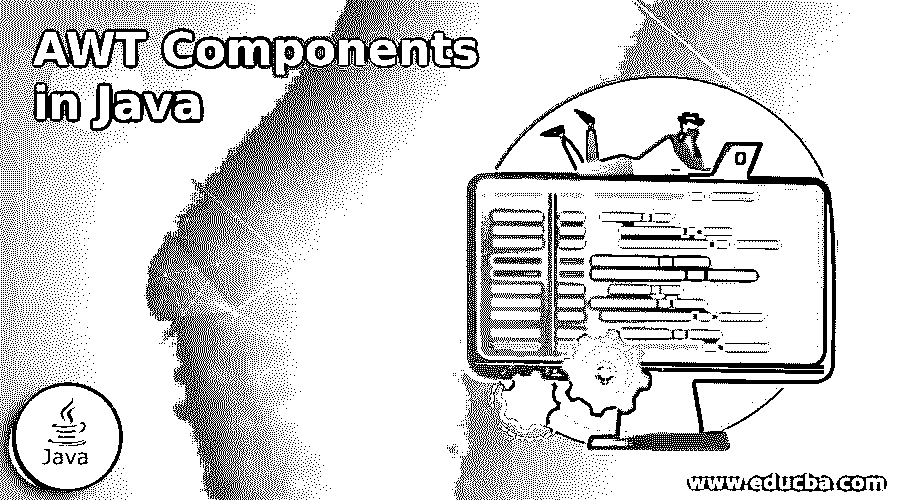
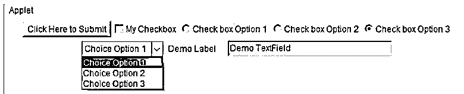

# Java 中的 AWT 组件

> 原文：<https://www.educba.com/awt-components-in-java/>




## Java 中的 AWT 组件简介

Java AWT，缩写为 Abstract Window Toolkit，是一组用于开发基于 windows 的图形用户界面或应用程序的 API。java 中的 AWT 组件是依赖于平台的组件，这意味着组件在图形用户界面上的显示取决于底层操作系统；AWT 组件通常是大量使用操作系统资源的组件。

**语法:**

<small>网页开发、编程语言、软件测试&其他</small>

下面给出了如何使用 AWT 组件的语法:

```
// importing awt package
import java.awt.*;
// create a class extending Frame component
class <className> extends Frame{
<className>(){
Button button=new Button("<Text_To_Display_On_Button>");  // create instance of component
button.setBounds(40,90,80,30);// call method to set button position
add(button);//    adding component to the container
setSize(400,400);//set size of container
setVisible(true);//set visibility of container to true
}
public static void main(String args[]){
<className> clsobj=new <className>();
}}
```

上面的语法显示了如何使用 AWT 包的按钮组件。

在上面的语法中，<classname>表示 java 类的名称。<text_to_display_on_button>可以根据我们的功能设置。</text_to_display_on_button></classname>

### 不同的 AWT 组件

AWT 组件可以被认为是可以在图形界面屏幕上可见的对象，通过它可以执行交互。

在 java.awt 包中，可以使用以下组件:

**1。容器:**顾名思义，这个 awt 组件是用来容纳其他组件的。

基本上，java.awt 包中有以下不同类型的容器:

**a. Window:** 这是一个顶级容器，是一个不包含边框和标题的 Window 类的实例。

**b. Frame:** Frame 是窗口类的子类，由标题栏、边框和菜单栏组成。因此，frame 提供了一个可调整大小的画布，是开发基于 AWT 的应用程序时使用最广泛的容器。各种组件，如按钮，文本字段，滚动条等。，可以容纳在框架容器内。

Java 框架可以通过两种方式创建:

*   通过创建一个框架类的对象。
*   通过使 Frame 类成为我们类的父类。
    *   **Dialog:** Dialog 也是 window 类的子类，它提供了对边框以及标题栏的支持。为了将对话框用作容器，它总是需要一个与之相关联的 frame 类实例。
    *   **Panel:** 用于保存图形用户界面组件，不提供对标题栏、边框或菜单的支持。

**2。按钮:**用于在用户界面上创建一个带有指定标签的按钮。我们可以设计代码来使用监听器在按钮的点击事件上执行一些逻辑。

**3。文本字段:**Java AWT 的这个组件创建一个单行文本框来输入文本数据。

**4。标签:**Java AWT 的这个组件创建一个多行描述性字符串，显示在图形用户界面上。

**5。Canvas:** 这通常表示允许您在图形用户界面上绘制形状的区域。

**6。Choice:** 这个 AWT 组件表示一个包含多个选项的弹出菜单。用户选择的选项显示在菜单的顶部。

**7。滚动条:**用于在 GUI 上提供水平或垂直滚动功能。

**8。List:** 这个组件可以保存一个文本项列表。该组件允许用户从列表中的所有可用选项中选择一个或多个选项。

**9。Checkbox:** 该组件用于创建 GUI 的复选框，其状态可以是选中的，也可以是未选中的。

### Java 中 AWT 组件的示例

下面的例子展示了 java 中不同 AWT 组件的使用。

**代码:**

```
package com.edubca.awtdemo;
package com.edubca.awtdemo;
import java.applet.Applet;
// import awt and its subclasses
import java.awt.*;
// class extending applet
public class AWTDemo extends Applet {
// this method gets automatically called
public void init() {
Button button = new Button("Click Here to Submit");  // creating a button
this.add(button); // adding button to container
Checkbox checkbox = new Checkbox("My Checkbox"); // creating a checkbox
this.add(checkbox); //adding checkbox to container
CheckboxGroup checkboxgrp = new CheckboxGroup();  // creating checkbox group
this.add(new Checkbox("Check box Option 1", checkboxgrp, false));
this.add(new Checkbox("Check box Option 2", checkboxgrp, false));
this.add(new Checkbox("Check box Option 3", checkboxgrp, true));
// adding to container
Choice choice = new Choice();     // creating a choice
choice.addItem("Choice Option 1");
choice.addItem("Choice Option 2");
choice.addItem("Choice Option 3");
this.add(choice);     //adding choice to container
Label label = new Label("Demo Label");  // creating a label
this.add(label); //adding label to container
TextField textfield = new TextField("Demo TextField", 30);    // creating a Textfield
this.add(textfield);        // adding Textfield to container
}
}
```

上面的程序展示了如何在 java 代码中使用 AWT 组件，如按钮、复选框、复选框组、标签、选项和文本字段。

**输出:**




### 推荐文章

这是 Java 中 AWT 组件的指南。这里我们分别讨论简介、java 中的不同 AWT 组件和示例。您也可以看看以下文章，了解更多信息–

1.  [Java 布尔到字符串](https://www.educba.com/java-boolean-to-string/)
2.  [Java 格式化程序](https://www.educba.com/java-formatter/)
3.  [Java 字典](https://www.educba.com/java-dictionary/)
4.  [Java 引用调用](https://www.educba.com/java-call-by-reference/)


