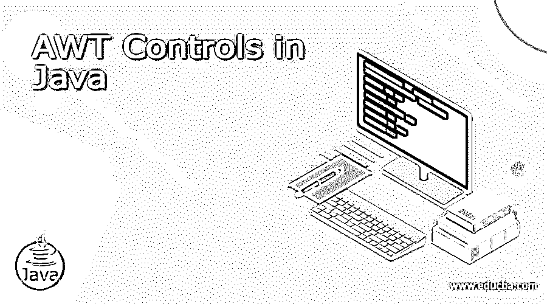
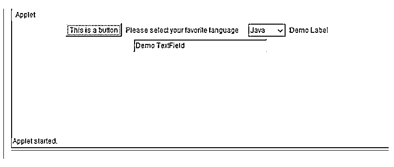

# Java 中的 AWT 控件

> 原文：<https://www.educba.com/awt-controls-in-java/>




## Java 中的 AWT 控件简介

Java AWT(缩写为 Abstract Window Toolkit)只不过是一组用于开发基于 windows 的图形用户界面或应用程序的 API，Java 中的 AWT 控件是 AWT 组件，便于用户以不同的方式与图形用户界面进行交互。要在 Java 中使用 AWT，需要使用 java.awt 包。这个包提供了 AWT API 的类，比如 TextField，Label，TextArea，RadioButton，CheckBox，Choice，List 等等。它包含了创建用户界面和绘制图形和图像的所有类。每个 AWT 控件都被设计为创建一个 GUI 界面。例如，TextField 用于创建矩形框，使用户能够输入字母字符，如姓名。TextArea 与 TextField 相同，唯一的区别是它的字数限制大于 TextField，大多用于地址。RadioButton 用于创建一个单选按钮，使用户只能从给定的选项中选择一个。复选框使用户能够从给定的。列表用于创建列表。滚动条使用户能够以垂直和水平方式滚动页面。

### 句法

以下是如何使用 AWT 控件的语法:

<small>网页开发、编程语言、软件测试&其他</small>

```
// importing awt package
import java.awt.*;
// create a class extending Frame component
class extends Frame{
(){
Button button=new Button(""); // create instance of component
button.setBounds(40,90,80,30);// call method to set button position
add(button);// adding component to the container
setSize(400,400);//set size of container
setVisible(true);//set visibility of container to true
}
public static void main(String args[]){
clsobj=new ();
}}
```

上面的语法显示了如何使用 AWT 包的按钮控件。上面的语法表示 java 类的名称。可以根据我们的功能进行设置。

### AWT 控件

众所周知，每个用户界面都包含以下基本内容:

#### 1.UI 元素

这些包括对用户可见的基本用户界面元素，并通过用户与用户界面进行交互。

➔集装箱
1。窗口
2。框架
●对话框
●面板
➔按钮
➔文本字段
➔标签
➔画布
➔选择
➔滚动条
➔列表
➔复选框

##### 布局

布局的功能是决定图形用户界面上元素的对齐方式。布局管理器负责图形用户界面上组件的方向。以下是 java.awt 包中可用的不同布局管理器类:

*   边框布局:这将组件排列成在屏幕的东、西、北、南、中五个方向对齐。
*   流动布局:这将组件排列成定向流动，是默认布局。
*   卡片布局:Ever 组件被视为一张卡片，一次只能看到一张卡片。
*   网格布局:组件排列在一个矩形网格中。

##### 行为

这定义了当用户与用户界面元素交互时所采取的动作。不同的听众参与进来。

### Java 中 AWT 控件的示例

以下示例显示了 java 中不同可用 awtcontrols 的用法:

**代码:**

```
package com.edubca.awtdemo;
import java.applet.Applet;
// import awt and its subclasses
import java.awt.*;
// class extending applet
public class AWTDemo extends Applet {
// this method gets automatically called
public void init() {
Button button = new Button("This is a button"); // creating a button
this.add(button); // adding button to container
// adding to container
Label labelcources = new Label("Please select your favorite language");
this.add(labelcources);
Choice choice = new Choice(); // creating a choice
choice.addItem("Java");
choice.addItem("C++");
choice.addItem("Python");
choice.addItem("Ruby");
this.add(choice); //adding choice to container
Label label = new Label("Demo Label"); // creating a label
this.add(label); //adding label to container
TextFieldtextfield = new TextField("Demo TextField", 30); // creating a Textfield
this.add(textfield); // adding Textfield to container
}
}
```

**输出:**




上面的程序展示了如何在 java 代码中使用 awt 控件，比如按钮、标签、选项和文本字段。
以上代码将产生以下输出:

### 推荐文章

这是 Java 中 AWT 控件的指南。在这里，我们还将讨论如何使用 awt 控件的介绍和语法，以及示例和代码实现。您也可以看看以下文章，了解更多信息–

1.  [JavaScript 中的选择排序](https://www.educba.com/selection-sort-in-javascript/)
2.  [Dart vs JavaScript](https://www.educba.com/dart-vs-javascript/)
3.  [Java 中的排序字符串](https://www.educba.com/sort-string-in-java/)
4.  [JavaScript 表单](https://www.educba.com/javascript-modulo/)


