# 什么是 Java 继承？

> 原文：<https://www.educba.com/what-is-java-inheritance/>

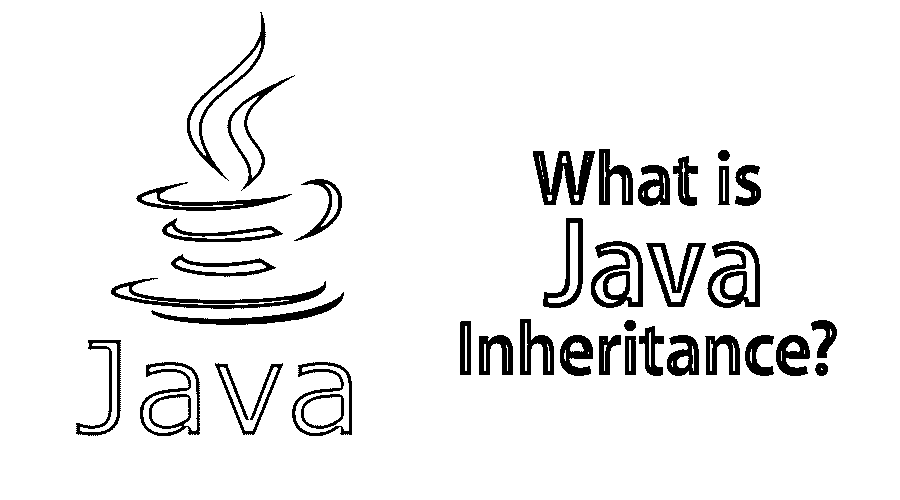


子类是来自另一个类的类。子类遵循其所有祖先的条件和行为。超类的概念标识了一个类的直接祖先及其所有的上级类。

## 什么是 Java 继承？

对于 Java，当一个类希望继承另一个现有类的特征时，可以使用继承。通常旨在利用另一个类的特性的类被称为子类，而必须使用其特性的类被称为超类。

<small>网页开发、编程语言、软件测试&其他</small>

这导致了一个问题，“这一切将从哪里开始？”最顶层的类，即派生类，是 java.lang 中描述的对象类。对象是类的根结构。

下图显示了这两种类型的类:

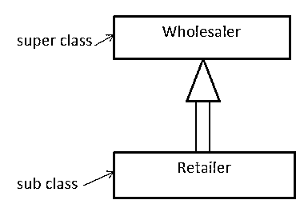


子类遵循来自超类的条件和行为，例如变量和方法。子类可以只使用从超类继承的项目，子类可以改变或覆盖这些项目。因此，随着您进入层级，类别变得越来越具体:

### 从对象继承

每个类都直接继承自 Object 类

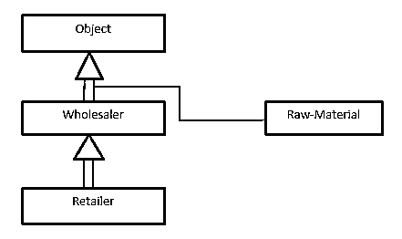


在上图中

公共类批发商扩展对象{ ……..}

公共类零售商扩展批发商{ ……..}

公共类原材料

extended 关键字显示子类通常被继承的父类，不能作为标识符应用。

在公共类中，原材料不需要扩展关键字；它直接访问对象类。

### 用一个例子理解 Java 继承

继承描述了超类和子类之间的关系。扩展和实现关键术语更喜欢用 Java 来表达继承。

不同类型如下所示。

1.  [单一继承](https://www.educba.com/single-inheritance-in-python/)
2.  [多级继承](https://www.educba.com/multilevel-inheritance-in-c-plus-plus/)
3.  [层次继承](https://www.educba.com/hierarchical-inheritance-in-java/)
4.  [多重继承](https://www.educba.com/multiple-inheritance-in-python/)
5.  [混合遗传](https://www.educba.com/hybrid-inheritance-in-c-plus-plus/)

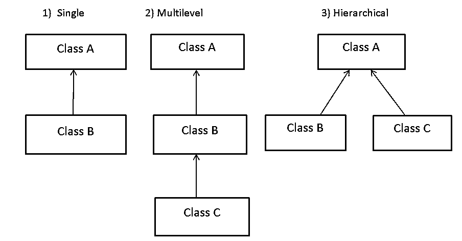


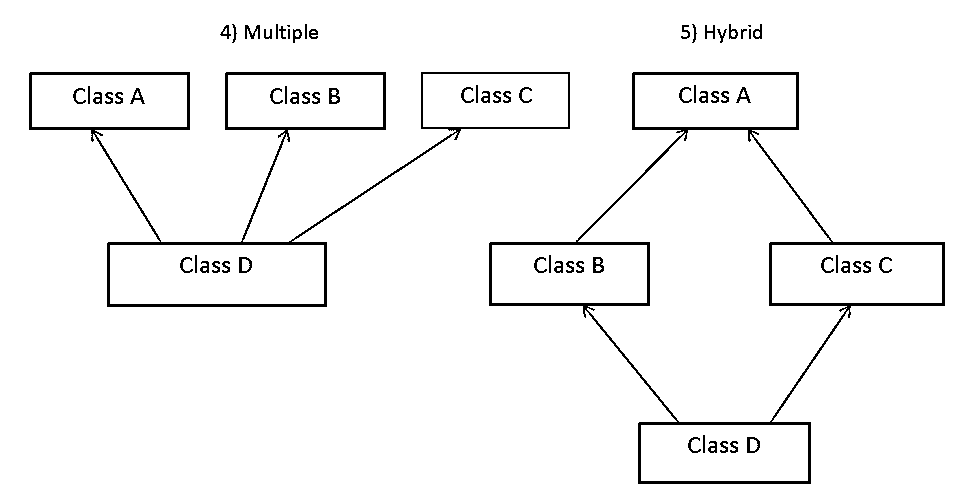


#### 1.单一遗传

如果一个类扩展了另一个类，这种形式的继承称为单级继承。

```
public class A {
………..
}
public class B extends A {
………..
}
```

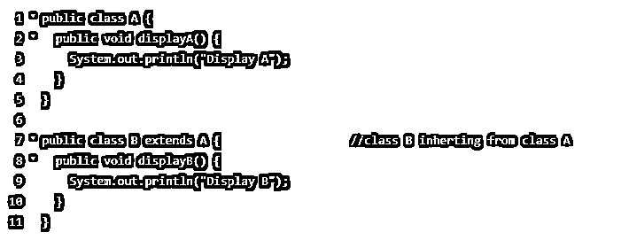


B 类扩展了 A 类，所以 B 类使用 A 类的 displayA()方法，因为它是自己的方法。

#### 2.多层次继承

如果一个类扩展了一个附加类，而这个附加类本身又可以简单地被一个附加类扩展，这种形式的继承被称为多级继承。

```
public class A { ……………… }
public class B extends A { ……………… }
public class C extends B { ……………… }
```

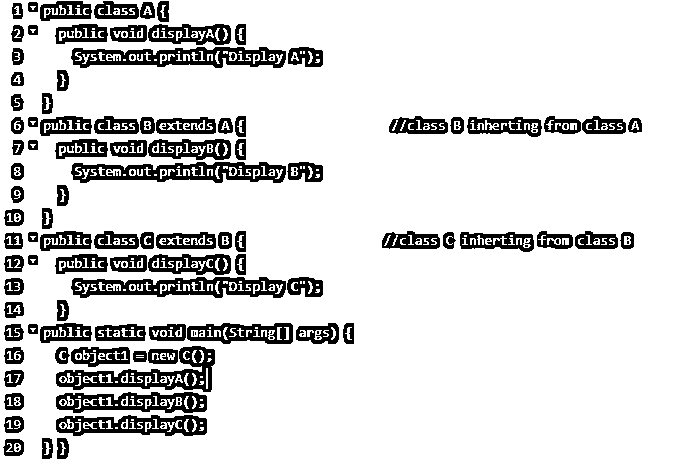


**输出:**


类 A 简单地由类 B 扩展。然后类 B 本身由类 C 扩展，这为类 C 提供了对类 A 的方法 displayA()和 displayB()的直接访问，以及通过简单地获得这些类 C 的对象(不必生成类 A 和 B 的对象)对 B 的直接访问。

#### 3.分层继承

当几个类继承同一个类时，这就是所谓的层次继承。例如，B 类和 C 类扩展了同一个 a 类。

```
public class A { ……………… }
public class B extends A { ……………… }
public class C extends A { ……………… }
```

如果一个类有不止一个子类，并且不止一个子类有一个相似的父类，那么这样的继承称为层次继承。

我们正在编写一个代码，其中类 B 和 C 扩展了类 A

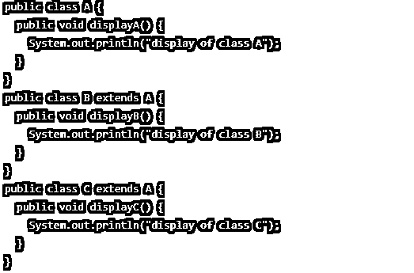


#### 4.多重遗传

多重继承的语法

```
public class A { ……………… }
public class B extends A { ……………… }
public class D extends A, B, C { ……………….. }
```

**Note:** Multiple Inheritance is not supported in java.

Java 不支持多重继承。这是因为多重继承会导致歧义，因此 Java 不使用它。钻石问题有助于理解这种情况。

然而，Java 中的多重继承可以通过使用接口来实现。不管一个类中有多少具有精确方法的接口，都没有歧义的迹象，因为一个接口中的方法通常是抽象的。

另一种方法是使用接口。界面将开始变得重要。

接口指定其方法的形式，但不给出任何实现细节；因此，你可以把它想象成一个类的声明。

您可以使用 interface 关键字创建接口:

```
interface C
{
…………………………
}
interface b
{
…………………….
}
class a implements b, c
{
………………………
}
```

我们可以将这两个接口与 implements 关键字一起使用:

#### 5.混合遗传

混合遗传通常是一种以上遗传类型的混合。当 A 类和 B 类扩展 C 类，加上另一个类，D 扩展 A 类；这可以是一个[混合继承](https://www.educba.com/hybrid-inheritance-in-java/)，因为它是各种单一和层次继承。

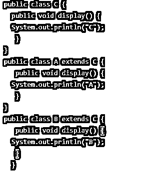


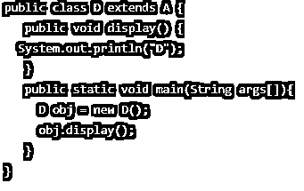


**输出:**


### 用 final 关键字停止继承

您可以通过在下面声明整个类 final 来防止该类成为子类。

```
final class animal
{
public void breathe()
{
System.out.println("Breathing...");
}
}
class dog extends animal
{
public void breathe()
{
System.out.println("Barking...");
}
}
public class history
{
public static void main(String[] args)
{
System.out.println("Creating an animal...");
animal a = new animal();
a.breathe();
System.out.println();
System.out.println("Creating an bulldog...");
dog d = new dog();
d.breathe();
}
}
```

如果您尝试执行此代码:

不能子类化 final 类:类 animal 类 dog 扩展 animal 1 产生错误。

### 使用 final 关键字创建常数

防止方法重写和防止子类化。Java 中 final 还有另一种用法；可以用它来声明常数。

根据以下代码:

```
public class history
{
public static void main(String[] args)
{
final int a = 4;
a = 5;
}
}
```

如果您尝试执行此代码:

无法给最终变量赋值:产生了 1 错误

### 顶级 Java 继承公司

顶尖的 java 继承公司包括:

1.  美国英特尔公司(财富 500 强公司之一ˌ以生产 CPU 芯片著称)
2.  VM ware
3.  砖坯黏土
4.  英伟达
5.  亚马孙
6.  加拿大白鲑
7.  阿卡迈
8.  飞利浦电子。
9.  国际商用机器公司
10.  精力

### 优势

继承的主要特性之一是通过在许多子类之间共享普通代码来减少应用程序表单中重复代码的数量。如果在两个相关的类中可以获得相同的代码，那么通常可以重构层次结构，将普通代码转移到一个共同的超类中。这将导致更好的代码组织和更小、更容易的编译单元。

*   继承:它可以使应用程序代码更容易修改，因为从标准超类继承的类可以互换使用。当过程的返回类型是超类时。
*   **可重用性:**管理基类的公共方法而无需重写类似方法的能力。
*   **扩展性:**根据派生类的业务逻辑扩展基类逻辑。
*   **数据隐藏:**基类想保留几个私有数据，所以派生类从不修改。
*   有了继承，我们可以覆盖基类的方法，所以基类方法的重要实现可以在派生类中完成。

### 为什么要用？

继承是一个实用的编程概念，但如果使用不当，它可能很简单。通常情况下，界面是有效的，效率更高。

在以下情况下，继承是最佳选择:

*   您的继承层次结构表示“是-a”关系，而不是“有-a”关系。
*   您可以重用基类中的代码。
*   您可能需要对不同的数据类型应用类似的类和方法。
*   类的层次结构相对较浅，其他开发人员也没有贡献更多的阶段。
*   您希望通过修改基类来创建派生类的全局变体。

### 我们为什么需要它？

它是 OOP ( [面向对象编程](https://www.educba.com/object-oriented-programming-in-java/))的概念。继承的主要目的是创建项目代码可重用的新部分，可能添加或删除功能。子类可以继承或重写从父类中选择的方法；它是来自没有交换父类的方法。这可以包括它自己的新方法，这通常在子类中是找不到的。

*   **封装:**当我们涉及一些公共属性时，我们将它们封装在一个父类中，并简单地向子类提供特定的属性。
*   多态性:我们可以在 Java 中利用多态性和继承。同一个班级，根据孩子的班级形式，采取不同的方式来保证。
*   **代码重用:**应用继承可以帮助重用代码。
*   **效率:**在编写代码的同时应用继承可能是有效的。这可以提高任务的速度。

就像在现实生活中一样，一个孩子可以从他的父母那里继承选定的特征，并通过选定的环境变化，发展新的特征或放弃他从父母那里获得的特征。

### 谁是学习 Java 继承技术的合适受众？

当考虑应该用它做什么时，一些开发人员会想到构建:

#### 


#### Android 开发者

Android 是当今竞争激烈的市场中最有效的移动操作系统，每天有超过 150 万台新设备被激活。Android 培训为您提供了创建和构建从简单到复杂的 Android 应用程序的实践经验，确保您能够熟练获得理想的 IT 工作。你可以有一个优秀的编程历史，但 Android 培训将使你受益并增强你的能力。

Android 正在成长，所以当你学习基本原理和特性时，你的技能组合也会随之成长。开发者可以为 Android 用户制作游戏和应用，并通过开放的世界传播。Android 培训是开发人员可以完成的最聪明的事情之一，因此它有很多好处。

#### 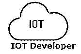


#### 物联网开发者

可以听到很多关于物联网( [IoT](https://www.educba.com/iot-applications/) )的说法。物联网无处不在，从大型工业机械中的传感器到数字安全摄像头等智能家居设备。你知道流行的 Nest 恒温器将依赖于 Java 和人工智能的非凡结合吗？一些智能自动售货机依赖于 Java，使用软件来跟踪库存、温度、湿度和地区。此外，在 Java 继承中设计了几个可穿戴技术应用。

#### 


#### 大数据分析

如今，大数据分析是技术最令人兴奋的用途之一的核心。几个关键行业的研究正在应用创新的[数据分析技术](https://www.educba.com/data-analysis-techniques/)来学习大量数据中的新模式，并更好地找出复杂的过程。

#### 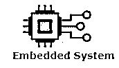


#### 嵌入式系统

嵌入式系统，从小芯片到专用计算机，都是执行特定任务的大型机电设备的组成部分。像 SIM 卡一样，许多设备、蓝光光盘播放器、电表和电视机都使用嵌入式 Java 解决方案。据甲骨文公司称，100%的蓝光光盘播放器和 1.25 亿台电视设备都使用 Java。

### 这项技术将如何帮助你的职业发展？

Java 是全球信息技术中最重要和最常用的编程语言之一。此外，Java 是一门基础编程语言，新生可以很快学会。根据 Oracle 的报告，Java 在超过 30 亿台设备上运行..!

Java 是一种常青树编程语言。几乎所有已知的公司，包括 IBM、Infosys、CTS 和 TCS，都将 Java 作为他们理想的编程语言。

今天，Java 开发人员可以尝试的现有趋势如下

1.  带有 Selenium 自动化测试器的 Java
2.  使用 DevOps 的 Java
3.  Java 与 Hadoop 开发

### 结论——什么是 Java 继承

它是 Java 的有力武器，可以帮助最合适的语言取得成功。它可以最大限度地减少代码重复，减少 bug。有了父类中的代码集，您就不能再喜欢为许多具有特征的子类编写类似的代码了。Java 中的继承[执行代码复用。](https://www.educba.com/inheritance-in-java/)

### 推荐文章

这是一本关于什么是 Java 继承的指南？这里我们讨论了 Java 继承的基本概念、用途、需求、职业发展和优势。您也可以浏览我们推荐的其他文章，了解更多信息——

1.  [什么是人工智能](https://www.educba.com/what-is-artificial-intelligence/)
2.  [JavaScript 是什么？](https://www.educba.com/what-is-javascript/)
3.  [什么是 HTML？](https://www.educba.com/what-is-html/)
4.  [什么是 Azure](https://www.educba.com/what-is-azure/)


