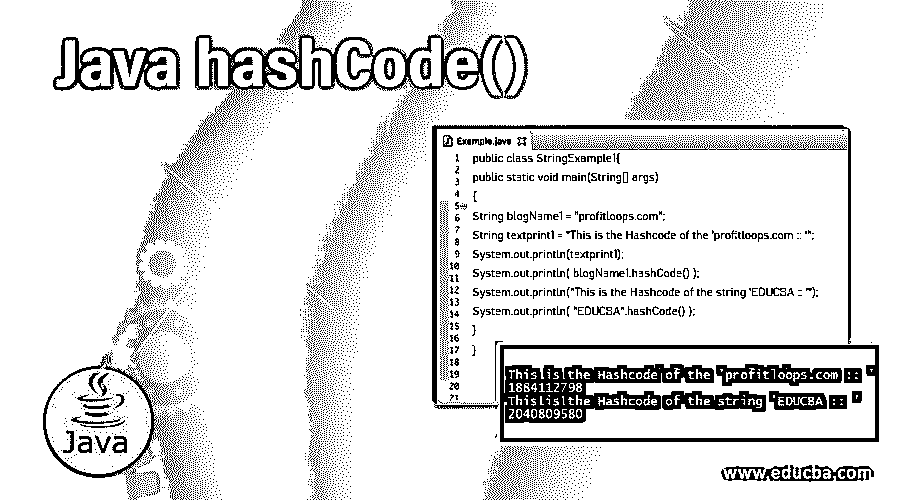
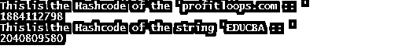
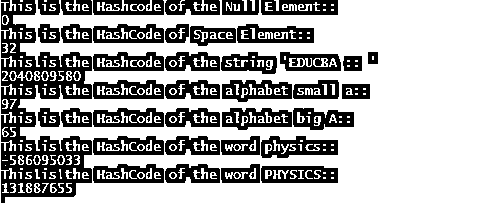

# Java hashCode()

> 原文：<https://www.educba.com/java-hashcode/>




## Java hashCode()简介

Java 编程语言的 hashcode()方法总是出现在 Object 类中。所以对于每个 Java 编程类都会得到 hashcode()方法的默认实现。这个 hashcode()方法是对象的一个整数 hashcode 值，并且是一个本机方法。hashcode()方法的多次调用必须返回相同的整数值，但是只有当对象被修改时才会这样做，equals()方法中也使用了这个方法。hashcode()对象值可以改变同一个应用程序的多次执行。散列码只不过是一个与 Java 中的每个对象相关联的整数值。

**语法:**

<small>网页开发、编程语言、软件测试&其他</small>

```
public int hashcode()
```

### hashCode()方法在 Java 中是如何工作的？

hashcode()方法在 java 中的工作方式是返回一个整数形式的 hashcode 值。这个 hashcode 整数值在一些基于散列的集合中被广泛使用，比如 HashMap、HashTable、HashSet 等。Java 的 hashcode()方法需要在每个类中被覆盖，这有助于覆盖 equal()之类的方法。

在执行应用程序期间，如果 hashcode()方法在特定的同一对象上被调用多次，那么 hashcode()将始终返回相同的整数值。从特定应用的仅一次执行到同一 app/应用的一些其他执行，整数值将保持相同。如果这两个对象相等，那么 Java 编码语言的 hashcode()方法将在这两个对象的每一个上产生相同的整数，如果这两个对象不相等/不相等，那么产生将由 hashcode()方法在这两个不同的对象之一上产生的整数值。这将是相似的，但是在所有两个对象上产生不同的整数值对于改进基于散列性能的集合来说是更好/最好的，这类似于 HashTable、HashMap..等等。

当对象在最终范围内相等时，相等/相似的对象将产生相同的散列码。hashcode()的不等对象不会产生一些截然不同/不同的哈希码。

### 实现 Java hashCode()的示例

下面是提到的例子:

#### 示例#1

这是一个将博客链接和一些文本转换成哈希代码转换的例子。首先，创建一个公共类“StringExample1”。在此之前，以 StringExample1.java 的名字为这个程序保存程序文件。然后创建 main()函数来输入 java 程序代码。然后创建一个名为“blogName1”的字符串变量，其值为“profitloops.com”。然后，使用一些字符串文本创建一个 textprint1 变量。

然后使用 hashcode()函数将 profitloops.com 转换成 hashcode。同样，对于其他字符串文本，该字符串也将被转换为哈希代码。要打印这些字符串文本的散列码，可以使用“System.out.println()”函数。然后为了正确的语法目的关闭括号。查看下面的输出，这样您就可以了解哈希代码是如何转换的。

**代码:**

```
public class StringExample1{
public static void main(String[] args)
{
String blogName1 = "profitloops.com";
String textprint1 = "This is the Hashcode of the 'profitloops.com :: '";
System.out.println(textprint1);
System.out.println( blogName1.hashCode() );
System.out.println("This is the Hashcode of the string 'EDUCBA :: '");
System.out.println( "EDUCBA".hashCode() );
}
}
```

**输出:**




#### 实施例 2

这是 hashcode()在各种类型的字符、文本、空值等上的例子..要知道 hashcode()是如何变化的，以及使用 hashcode()时特定输入的结果是什么。首先创建一个公共类“StringExample1”，还创建了 public main 来输入程序代码。然后 hashcode()用于知道空元素、空间元素的散列码是什么。这里的字符串称为“EDUCBA”、“physics”和“PHYSICS”，字符小写字母“a”，大写字母“b”在 hashcode()函数的帮助下被转换成散列码。System.out.println()函数用于显示终端或命令提示符的输出或任何其他显示不同类型的字符串值或任何其他值的散列码值。

**代码:**

```
public class StringExample1{
public static void main(String[] args)
{
String blogName1 = "";
System.out.println("This is the Hashcode of the Null Element::");
System.out.println( "".hashCode() );
System.out.println("This is the HashCode of Space Element::");
System.out.println( " ".hashCode() );
System.out.println("This is the Hashcode of the string 'EDUCBA :: '");
System.out.println( "EDUCBA".hashCode() );
System.out.println("This is the HashCode of the alphabet small a::");
System.out.println( "a".hashCode() );
System.out.println("This is the HashCode of the alphabet big A::");
System.out.println( "A".hashCode() );
System.out.println("This is the HashCode of the word physics::");
System.out.println( "physics".hashCode() );
System.out.println("This is the HashCode of the word PHYSICS::");
System.out.println( "PHYSICS".hashCode() );
}
}
```

**输出:**




#### 实施例 3

这是为不同的变量值实现散列码的一个例子。如果两个变量相等，这些变量将提供相等变量的输出，然后对这些变量进行哈希编码。同样，如果两个变量值不相等，那么在不相等的变量下，这些变量的散列码也将被打印。

首先，创建公共类“hash1”，并创建公共 main。然后用相同的值创建两个变量 a1 和 b1。然后检查这两个变量值。如果相同，则打印 a1 和 b1 hashcode 值。这里 a1 和 b1 是相同的。然后，使用不同的字符串值(如 10 和 50)创建字符串值 c1 和 d1。检查字符串值 c1 和 d1，以了解它们是否相等。这里不相等，所以打印“不相等变量:”文本，然后打印这些变量值的散列码。查看这个 hashcode()示例的输出，以便更好地理解 hashcode()的概念。

**代码:**

```
public class hash1{
public static void main(String[] args){
String a1 = "200";
String b1 = "200";
if(a1.equals(b1)){
System.out.println("Equal variables: \n");
System.out.println("A1 variable 200's hashcode :: "+a1.hashCode() + "\n B1 variable value 200's hashcode :: " + b1.hashCode()+"\n");
}
String c1 = "10";
String d1 = "50";
if(!c1.equals(d1)){
System.out.println("\nUn-equal variables: \n");
System.out.println("C1 variable value 10's hash code :: "+c1.hashCode() + "\nD1 variable value 50's hashcode :: " + d1.hashCode()+"\n");
}
}
}
```

**输出:**


### 结论

我们希望您了解了 Java hashcode()方法的定义及其语法和解释，以及 Java 编程语言的 hashcode()方法如何与各种示例一起工作，从而更好、更容易地理解这个概念。

### 推荐文章

这是 Java hashCode()的指南。这里我们讨论 Java hashCode()的语法介绍，它是如何工作的，以及实现的例子。您也可以浏览我们的其他相关文章，了解更多信息——

1.  [Java 队列接口](https://www.educba.com/java-queue-interface/)
2.  [Java ActionListener](https://www.educba.com/java-actionlistener/)
3.  [Java IOException](https://www.educba.com/java-ioexception/)
4.  [Java 扫描器类](https://www.educba.com/java-scanner-class/)


