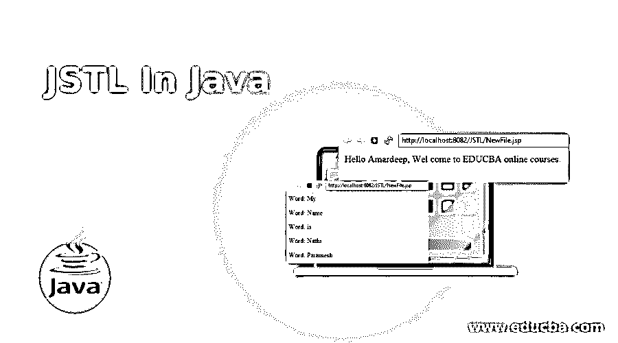
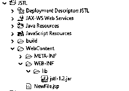
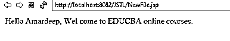
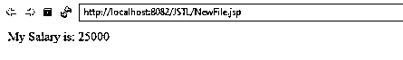
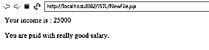
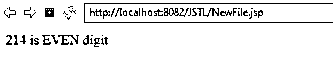
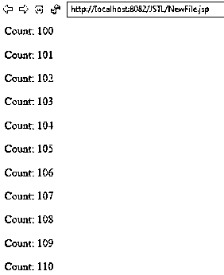
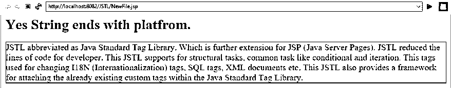

# 爪哇的 JSTL

> 原文：<https://www.educba.com/jstl-in-java/>




## 爪哇 JSTL 简介

JSTL 缩写为 Java 标准标记库，是对 JSP (Java 服务器页面)的进一步扩展。JSTL 减少了开发人员的代码行数。这种 JSTL 支持结构化任务，一种常见的任务，如条件和迭代。这些标签用于改变 I18N(国际化)标签、SQL 标签、XML 文档等。这也提供了一个框架，用于附加 Java 标准标记库中已经存在的定制标记。

**JSTL 的优势:**

<small>网页开发、编程语言、软件测试&其他</small>

*   快速发展。
*   代码可重用性。
*   不需要使用 scriptlet 标签。

### JSTL 在 Java 中是如何工作的？

JSTL 的工作基于我们在应用程序中使用的标签类型。它由大约 5 种类型的标签组成。他们是

1.  核心标签
2.  功能标签
3.  格式化标签
4.  XML 标签
5.  SQL 标记

**JSTL 标签描述:**

| **标签类型** | **描述** | **URI 将包括** | **前缀** |
| **核心标签** | JSTL 核心标签提供流量控制、变量支持、URL 管理等。 | http://java.sun.com/jsp/jstl/core | 英语字母表中第三个字母 |
| **功能标签** | 该功能标签用于字符串操作和
字符串长度 | http://java.sun.com/jsp/jstl/
功能 | 【数学】函数 |
| **格式化标签** | 该格式化标签用于数字、日期和消息格式化 | http://java.sun.com/jsp/jstl/fmt | fmt |
| **XML 标签** | 这个 XML 标签用于转换和流控制等。 | http://java.sun.com/jsp/jstl/xml | 英语字母表的第 24 个字母 |
| **SQL 标签** | 这个 SQL 标记用于提供对 SQL 支持的支持。 |  http://java.sun.com/jsp/jstl/sql | 结构化查询语言 |

每个 JSTL 标签又由不同的子标签组成。现在，我们将看看核心标签和函数标签的例子。

**Note:** Make use of these functionalities; we must use the jstl.1.X.jar file. X indicates the version.

### 例子

下面是一些例子:

eclipse 中的项目结构:




#### 示例 1–核心标签 c:out

**代号:NewFile.jsp**

```
<%@ taglib uri="http://java.sun.com/jsp/jstl/core" prefix="c"%>
<html>
<head>
<title>JSTL Tags</title>
</head>
<body>
<!--THis c:out tag is used for displaying output-->
<c:out value="${'Hello Amardeep, Wel come to EDUCBA online courses.'}" />
</body>
</html>
```

**输出:**




#### 示例 2–核心标签集和 c:if 标签

代码:setif . JSP

```
<%@ taglib uri="http://java.sun.com/jsp/jstl/core" prefix="c" %>
<html>
<head>
<title>JSTL Tags</title>
</head>
<body>
<c:set var="money" scope="session" value="${5000*5}"/>
<c:if test="${money > 8000}">
<p>My Salary is: <c:out value="${money}"/><p>
</c:if>
</body>
</html>
```

**输出:**




#### 示例 3–带 c 的核心标签:选择标签

**代号:CChoose.jsp**

```
<%@ taglib uri="http://java.sun.com/jsp/jstl/core" prefix="c" %>
<html>
<head>
<title>JSTL Tags</title>
</head>
<body>
<c:set var="money" scope="session" value="${5000*5}"/>
<p>Your income is : <c:out value="${money}"/></p>
<c:choose>
<c:when test="${money <= 1000}">
You are paid with good salary.
</c:when>
<c:when test="${money > 10000}">
You are paid with really good salary.
</c:when>
<c:otherwise>
You are paid with low salary .
</c:otherwise>
</c:choose>
</body>
</html>
```

**输出:**




#### 示例 4–带有 c:when 标签的核心标签

**代号:CWhen.jsp**

```
<%@ taglib uri="http://java.sun.com/jsp/jstl/core" prefix="c"%>
<html>
<head>
<title>JSTL Tags</title>
</head>
<body>
<c:set value="214" var="digit"></c:set>
<c:choose>
<c:when test="${digit%2==0}">
<c:out value="${digit} is EVEN digit"></c:out>
</c:when>
<c:otherwise>
<c:out value="${digit} is ODD digit"></c:out>
</c:otherwise>
</c:choose>
</body>
</html>
```

**输出:**




#### 示例 5–带有 c:foreach 标记的核心标记

**代号:CForeach.jsp**

```
<%@ taglib uri="http://java.sun.com/jsp/jstl/core" prefix="c"%>
<html>
<head>
<title>JSTL Tags</title>
</head>
<body>
<c:forEach var="iterator" begin="100" end="110">
Count: <c:out value="${iterator}" />
<p>
</c:forEach>
</body>
</html>
```

**输出:**

**

** 

#### 示例 6–带有 c:forTokens 标签的核心标签

**代号:CForTokens.jsp**

```
<%@ taglib uri="http://java.sun.com/jsp/jstl/core" prefix="c"%>
<html>
<head>
<title>JSTL Tags</title>
</head>
<body>
<c:forTokens items="My-Name-is-Nathi-Paramesh" delims="-" var="del">
Word: <c:out value="${del}" />
<p>
</c:forTokens>
</body>
</html>
```

**输出:**

**T2】**


 **#### 示例 7–带有 c:redirect 标签的核心标签

**代号:CRedirect.jsp**

```
<%@ taglib uri="http://java.sun.com/jsp/jstl/core" prefix="c"%>
<html>
<head>
<title>JSTL Tags</title>
</head>
<body>
<c:set var="urlName" value="2" scope="request"/>
<c:if test="${urlName<1}">
<c:redirect url="http:/educba.com"/>
</c:if>
<!-- Page directly redirect to gmail because value is greater than 1 -->
<c:if test="${urlName>1}">
<c:redirect url="http://gmail.com"/>
</c:if>
</body>
</html>
```

**输出:**

**T2】**


 **#### 示例 8–带有 c:contains 标签的函数标签

**代号:FunctionContains.jsp**

```
<%@ taglib uri="http://java.sun.com/jsp/jstl/core" prefix="c"%>
<%@ taglib uri="http://java.sun.com/jsp/jstl/functions" prefix="fn"%>
<html>
<head>
<title>JSTL Tags</title>
</head>
<body>
<c:set var="StringType"
value="We are learning online course from EDUCBA platform" />
<c:if test="${fn:contains(StringType, 'EDUCBA')}">
<h1 style="color: green">Yes Given String found in the value
</h1>
<p style="color:blue;border: 1px solid red;font-size:20px">JSTL abbreviated as Java Standard Tag Library. Which is
further extension for JSP (Java Server Pages). JSTL reduced the lines
of code for developer. This JSTL supports for structural tasks,
common task like conditional and iteration. This tags used for
changing I18N (Internationalization) tags, SQL tags, XML documents
etc. This JSTL also provides a framework for attaching the already
existing custom tags within the Java Standard Tag Library.</p>
</c:if>
<c:if test="${fn:contains(StringType, 'courses')}">
<p>No Given String is not found in the value
<p>
</c:if>
</body>
</html>
```

**输出:**

**T2】**


 **#### 示例 9–带有 c:endsWith 标签的函数标签

**代码:CEndsWith.jsp**

```
<%@ taglib uri="http://java.sun.com/jsp/jstl/core" prefix="c"%>
<%@ taglib uri="http://java.sun.com/jsp/jstl/functions" prefix="fn"%>
<html>
<head>
<title>JSTL Tags</title>
</head>
<body>
<c:set var="StringType"
value="We are learning online course from EDUCBA platform" />
<c:if test="${fn:endsWith(StringType, 'platform')}">
<h1 style="color: red">Yes String ends with platfrom.</h1>
<p style="color: fuchsia; border: 1px solid red; font-size: 20px">JSTL
abbreviated as Java Standard Tag Library. Which is further extension
for JSP (Java Server Pages). JSTL reduced the lines of code for
developer. This JSTL supports for structural tasks, common task like
conditional and iteration. This tags used for changing I18N
(Internationalization) tags, SQL tags, XML documents etc. This JSTL
also provides a framework for attaching the already existing custom
tags within the Java Standard Tag Library.</p>
</c:if>
<c:if test="${fn:endsWith(String, 'are')}">
<p>String ends with are.
<p>
</c:if>
</body>
</html>
```

**输出:**




### 推荐文章

这是一本爪哇 JSTL 指南。在这里，我们还将讨论 java 中的简介及其工作原理，以及不同的示例和代码实现。您也可以看看以下文章，了解更多信息–

1.  [Java 中的 JSP](https://www.educba.com/jsp-in-java/)
2.  JavaScript 中的 light box
3.  [终于在 Java 中](https://www.educba.com/finally-in-java/)
4.  [Java 中的聚合](https://www.educba.com/aggregation-in-java/)


******