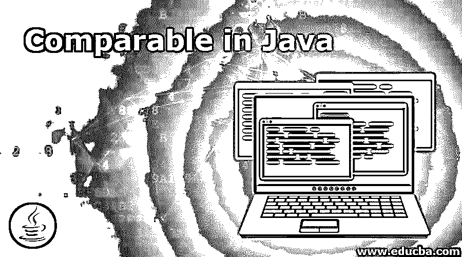
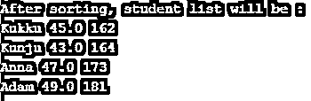
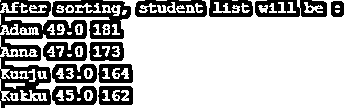

# Java 中的可比性

> 原文：<https://www.educba.com/comparable-in-java/>




## Java 中的 Comparable 简介

在 Java 中，可比较的接口是帮助根据自然顺序对数组或列表中的对象进行排序的接口。使用这个接口，可以对字符串对象、用户定义的对象和包装类对象等对象的元素进行排序。这个接口存在于 java.lang 包中，只包含一个方法 compareTo()，这将在下一节中解释。更多细节，如语法、工作原理和类似接口的例子将在接下来的章节中详细讨论。

### Java 可比的方法

正如已经讨论过的，下面是 comparable 接口的唯一方法 compareTo(obj)。

<small>网页开发、编程语言、软件测试&其他</small>

```
compareTo(obj)
```

此方法按照对象中指定的顺序将对象与对象 obj 进行比较。在实际情况下，这个方法将被覆盖以便返回值。此方法的返回值可以是:

*   **+ve :** 当前物大于所述物的情况下。
*   **-ve** :当前物体小于所述物体的情况。
*   **0:** 在当前对象等于所述对象的情况下。

**语法:**

下面是可比接口的语法。

```
class Employee implements Comparable<Employee>
{
. . .
}
//compareTo method that has to be overridden
public int compareTo(Employee em)
{
. .
}
```

### Java 中的 Comparable 是如何工作的？

假设有一组 S1、S2、S3、S4 的学生，他们的身高分别是 145、187、166、172，年龄分别是 23、24、21、26。我们可以用什么方式对它们进行分类？身高，体重，年龄等。，对吧？

*   即使我们根据一个标准(年龄)对他们进行比较，我们也必须重复地对两个学生进行比较和排序，直到考虑到所有学生的年龄。也就是说，学生 1 的年龄是否大于学生 2 的年龄，学生 2 的年龄是否大于学生 3 的年龄，等等。为了实现这一目标，一个类似的界面开始发挥作用。
*   comparable 接口中的 compareTo()方法有助于实现这一点。正如已经讨论过的，这个方法返回一个正值、负值或零值。因此，在调用这个方法时，这个对象将与参数对象进行比较。如果年龄较小，则将返回负值。同样，如果年龄更大，将返回正值。

### 用 Java 实现 Comparable 的示例

以下是借助程序理解可比接口的例子。

#### 示例#1

Java 程序创建一个学生列表，并根据身高的自然顺序对元素进行排序。

**代码:**

```
//Driver class
import java.util.ArrayList;
import java.util.Collections;
// Driver class
class Main
{
//main method
public static void main(String[] args)
{
//create an array list
ArrayList<Student>li = new ArrayList<Student>();
//add elements to the array list
li.add(new Student("Kukku", 45 , 162));
li.add(new Student("Kunju", 43 , 164));
li.add(new Student("Anna" , 47 , 173));
li.add(new Student("Adam" , 49 , 181));
//sort the list
Collections.sort(li);
System.out.println("After sorting, student list will be : ");
//print elements in the list one by one
for (Student st: li)
{
System.out.println(st.getName() + " " + st.getMark() + " " + st.getHeight());
}
}
}
//Student class
// Student is a class that implements Comparable
class Student implements Comparable<Student>
{
private int mark;
private String name;
private int height;
// sort students based on mark
public int compareTo(Student s)
{
return this.height - s.height;
}
// Constructor of the class
public Student(String nam, int ag, int hght)
{
this.name = nam;
this.mark = ag;
this.height = hght;
}
// To access private methods, create get methods
public double getMark()
{
return mark;
}
public String getName()
{
return name;
}
public int getHeight()
{
return height;
}
}
```

**输出:**




**说明:**

在上面的程序中首先创建一个学生列表，并根据元素的高度对其进行排序。compareTo()方法中提到了需要比较的参数。如果要比较学生的分数，只需改变方法中的参数。

#### 实施例 2

Java 程序创建一个学生列表，并根据身高的逆序对元素进行排序。

**代码:**

```
//Driver class
import java.util.ArrayList;
import java.util.Collections;
// Driver class
class Main
{
//main method
public static void main(String[] args)
{
//create an array list
ArrayList<Student>li = new ArrayList<Student>();
//add elements to the array list
li.add(new Student("Kukku", 45 , 162));
li.add(new Student("Kunju", 43 , 164));
li.add(new Student("Anna" , 47 , 173));
li.add(new Student("Adam" , 49 , 181));
//sort the list
Collections.*sort*(li, Collections.*reverseOrder*());
System.*out*.println("After sorting, student list will be : ");
//print elements in the list one by one
for (Student st: li)
{
System.*out*.println(st.getName() + " " + st.getMark() + " " + st.getHeight());
}
}
}
//Student class
// Student is a class that implements Comparable
class Student implements Comparable<Student>
{
private int mark;
private String name;
private int height;
// sort students based on mark
public int compareTo(Student s)
{
return this.height - s.height;
}
// Constructor of the class
public Student(String nam, int ag, int hght)
{
this.name = nam;
this.mark = ag;
this.height = hght;
}
// To access private methods, create get methods
public double getMark()
{
return mark;
}
public String getName()
{
return name;
}
public int getHeight()
{
return height;
}
}
```

**输出:**




**说明:**

在这个程序中，与第一个程序类似，首先创建一个学生列表，并根据元素的高度对其进行排序。第一个例子和这个程序的区别在于元素的顺序。在这个程序中，使用 reverseOrder()方法完成反向排序，并基于它打印元素。

### 结论

Java 中的可比接口是基于自然顺序对数组或列表中的对象进行排序的接口。这是在 compareTo()方法的帮助下完成的，该方法根据用户的要求进行重写。在这篇文章中，不同的方面，如语法，工作和可比接口的例子进行了详细讨论。

### 推荐文章

这是一本关于 Java 中可比性的指南。在这里，我们讨论 Java 中的 Comparable 和 top 方法的介绍，以及示例和代码实现。您也可以浏览我们推荐的其他文章，了解更多信息——

1.  [JavaScript 数学函数(示例)](https://www.educba.com/javascript-math-functions/)
2.  [Java 布局介绍](https://www.educba.com/layout-in-java/)
3.  [9 大类 Java 编译器](https://www.educba.com/java-compilers/)
4.  [Java 中的合并排序指南](https://www.educba.com/merge-sort-in-java/)


