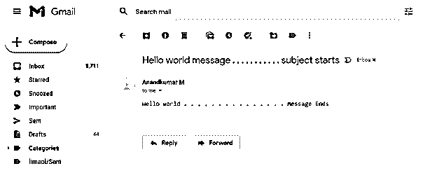
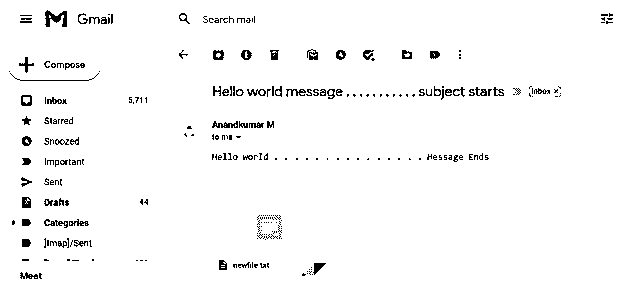

# java 邮件

> 原文：<https://www.educba.com/java-email/>


## Java 电子邮件简介

通过 java 程序发送电子邮件是一个简单且容易实现的程序。该流程是一个即时流程，基于 java 的电子邮件流程的两个必备项目是 JavamailAPI 和 JAF 框架。这是用 java 写电子邮件的两个主要部分。这些部分使得基于 java 的应用程序中的电子邮件发送过程更加简单。java 邮件 API 和 JAF 都可以从 Java 标准网站下载。smtp 服务器也可以用来发送电子邮件。使用 SMTP 服务器是生成电子邮件的另一种方法。安装和使用 SMTP 服务器，如 podcast server 和 apache James server，也是一种替代方法。

### Java 发送电子邮件的步骤

发送电子邮件的关键步骤如下:

<small>网页开发、编程语言、软件测试&其他</small>

1)会话对象的检索。撰写要发送的信息。
3)发送消息。

让我们详细讨论其中的每一个步骤，检索会话对象的第一步是负责拉基于会话的对象。创建的每个会话都可能有一个相关联的对象。这些对象将与会话相关的信息紧密耦合。为了检索对应于一个会话的对象。邮件。需要使用会话类。这个类有两种不同的方法来检索对象实例细节。因此，两个内置方法用于检索对象实例细节。getdefaultinstance()方法和会话。getinstance()方法。这是提取相关对象细节的两个关键方法。为了检索会话对象本身，以下方法中的任何一种都可以用于这种情况，

| **序列号** | **方法详情** | **描述** |
| One | 公共静态会话 getDefaultInstance(属性 p) | 将返回默认会话值 |
| Two | 公共静态会话 getDefaultInstance(属性 p，验证者 a) | 将返回默认会话值 |
| Three | 公共静态会话 getInstance(属性属性) | 将返回与新会话关联的值 |
| Four | 公共静态会话 getInstance(属性 prop，验证者 a) | 将返回与新会话关联的值 |

撰写信息:这是这个过程中要考虑的非常关键的一步。这一步包括从源头形成原始信息的过程。因此，由于这一部分处理的是原始消息，所以这是一个需要考虑的非常关键的部分。为了使合成过程发生，使用 javax.mail.message。这个类允许复杂地构造消息。这个类在操作的抽象层次上，所以它的子类被称为 javax . mail . internet . mime message 更具体地用于这个过程。会话和相关的消息将使用下面的代码段堆积起来。所以这段代码用于组合消息和会话细节 mime message message = new mime message(session)；
发送消息:这一部分的最后一个过程是发送消息。javax 号。邮件。传输类用于此目的。这个类的目的是触发发送消息的过程。具体来说，发送消息的过程可以通过 javax 非常明确地实现。特定的 mail.transport 消息。从编码的角度来看，传输的代码片段。发送(消息)；正是用于这一过程。

| **号** | **方法** | **描述** |
| One | 公共静态 void 发送(消息 m) | 给定的方法用于发送消息。因此消息的传输可以通过这种方法来实现。 |
| Two | 公共静态 void send(消息 m，地址[]地址) | 为了将消息发送到一个特定的地址，使用这种方法。 |

### Javax 邮件程序步骤

**代码:**

```
import java.util.*;
import javax.mail.*;
import javax.mail.internet.*;
import javax.activation.*;
public class Initiateemail {
public static void main(String [] args) {
// email id of the recipient has to be mentioned in this field
String to = "anandkumar0710@gmail.com";
// email id of the sender needs to be mentioned here
String from = "anandkumarmurugesan@yahoo.com";
// Assuming you are sending email from localhost
String host = "localhost";
// All details associated to the property are mentioned here
Properties prop = System.getProperties();
// this is the step were the property setup can be eastablished
prop.setProperty("mail.smtp.host", host);
Session ses = Session.getDefaultInstance(prop);
try {
// onject associated to the message is initiated here
MimeMessage mess = new MimeMessage(ses);
// header details are decided and set here.
mes.setFrom(new InternetAddress(from));
// header field details are created here
mes.addRecipient(Mes.RecipientType.TO, new InternetAddress(to));
// subject details of the message are given here
mes.setSubject("Hello world message . . . . . . . . . . . subject starts ");
// Actual message of the email is given here
message.setText("Hello world . . . . . . . . . . . . . . . Message Ends");
// transport object is used for initiating the message
Transport.send(mes);
System.out.println("message has been sent successfully . . . . . ");
} catch (MessagingException mex) {
mex.printStackTrace();
}
}
}
```

**输出:**





### JavaMail 在电子邮件中发送附件

**代码:**

```
import java.util.*;
import javax.mail.*;
import javax.mail.internet.*;
import javax.activation.*;
public class SendEmail {
public static void main(String [] args) {
String to = "anandkumar0710@gmail.com";
String from = "anandkumarmurugesan@yahoo.com";
String host = "localhost";
Properties prop = System.getProperties();
prop.setProperty("mail.smtp.host", host);
Session ses = Session.getDefaultInstance(prop);
try {
MimeMessage mess = new MimeMessage(ses);
mes.setFrom(new InternetAddress(from));
mes.addRecipient(Mes.RecipientType.TO, new InternetAddress(to));
mes.setSubject("Hello world message . . . . . . . . . . . subject starts ");
message.setText("Hello world . . . . . . . . . . . . . . . Message Ends");
mp.addBodyPart(mbp);
mbp = new MimeBodyPart();
String fl = "newfile.txt";
DataSource src= new FileDataSource(fl);
mbp.setDataHandler(new DataHandler(src));
mbp.setFileName(filename);
mp.addBodyPart(mbp);
messetContent(mp );
Transport.send(mes);
System.out.println("message has been sent successfully . . . . . ");
} catch (MessagingException mex) {
mex.printStackTrace();
}
}
}
```

**输出:**





### 结论

本文解释了如何设置 java 电子邮件信息，以及设置电子邮件信息所涉及的类，还描述了发送电子邮件以及发送带有附件的电子邮件的程序。

### 推荐文章

这是一个 Java 电子邮件指南。这里我们讨论概述，Java 发送的步骤，方法，代码实现的例子。您也可以看看以下文章，了解更多信息–

1.  [Java XML 解析器](https://www.educba.com/java-xml-parser/)
2.  [settimeout Java](https://www.educba.com/settimeout-java/)
3.  [Java 中的国际化](https://www.educba.com/internationalization-in-java/)
4.  [Java 测试私有方法](https://www.educba.com/java-testing-private-methods/)


