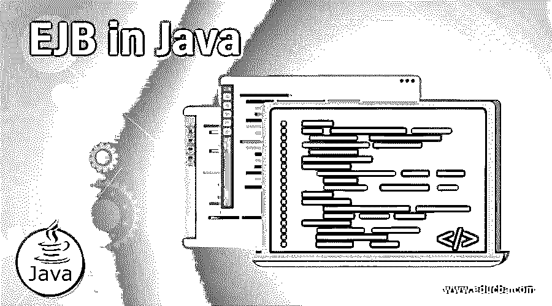
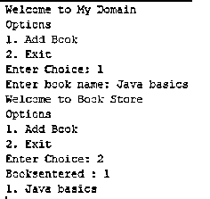

# 爪哇的 EJB

> 原文：<https://www.educba.com/ejb-in-java/>




## 爪哇 EJB 简介

Ejb 表示为企业 Java Bean 组件，也称为服务器端软件组件；它将主要用作应用程序的业务逻辑。用于运行时环境的 web 容器包括软件组件、计算机安全、servlet 生命周期管理、事务处理和 web 服务。EJb 是用运行在计算机网络服务器端的 Java 编程语言编写的体系结构风格，因此它在应用程序中遵循客户机-服务器模型。另外，ejb 是在客户端分发 web 组件的 java bean 技术，它具有在多个 web 应用程序中可重用组件的特性。

**语法:**

<small>网页开发、编程语言、软件测试&其他</small>

java 编程中 EJB 模型的基本语法如下。

```
import javax.ejb.*;
import java packages;
class classname
{
Main  method()
{
-----Some programming logics----
}
}
```

以上代码是使用 ejb 包开发应用程序的基本步骤。

### 如何在 Java Works 中使用 EJB？

*   在 ejb，java bean 类将为 EJB 规范使用多个注释，这将有助于满足基于业务目的的用户需求。EJB 有一套不同的版本，并遵循了类似 JNDI(java 命名目录接口)的特性。服务器 jndi 中的资源之一是目录服务，用于定位或分配资源，如 ejb、数据源和 JMS 队列服务。对于 jndi 资源，服务器有一个默认的方案名，但是如果我们更改了配置部分的名称，它应该被覆盖。
*   EJB 将研究爪哇豆；它有两种不同的类型。会话 beans 和 2。消息驱动的会话 beans。会话 beans 将用于客户端-服务器交互；它封装了应用程序的业务逻辑，通过编程由客户端调用将由本地机器或远程机器完成，客户端将在 web 服务的帮助下使用 bean。会话 beans 将分为三个不同的类别 1。无国籍，2。有状态和 3。当客户端使用这些类型的 bean 时，web 容器中没有永久的状态，所以与有状态 bean 相比，它们在线程安全性能方面非常快。这些 beans 同时与多个客户机共享。
*   有状态 beans 可以将状态存储在容器中；一旦客户端终止会话，这些状态也会在服务器中被销毁。Singelton beans 在该应用程序的整个生命周期中只有一个实例会话；这些 beans 还与多个客户机共享状态。这些 bean 是线程安全的，因此开发人员将更容易使用它们，并且与有状态 bean 相比，性能也更快。
*   消息驱动 bean(MDB)是一种用作消息异步类型的 bean，类似于 JMS 消息侦听器，但是它将接收作为 JMS 消息而不是事件的消息响应。每当消息收到时，我们可以使用 jndi 服务映射消息，容器使用 onMessage()方法调用 MDB beans 进行进一步处理。使用 onMessage()方法的 MDB 的整个过程将是一个单独的事务。如果假设消息流程是回滚，则接收方消息再次重新传递。

### 用 Java 实现 EJB 的例子

下面是提到的例子:

#### 示例#1

**接口:**

```
package JPAEJB;
import java.util.List;
import javax.ejb.Remote;
@Remote
public interface CustomerInterface {
void addBooks(String name);
List getBooks();
}
```

**实施:**

```
import java.util.ArrayList;
import java.util.List;
import javax.ejb.Stateless;
import JPAEJB.CustomerInterface;
@Stateless
public class CustomerClass implements CustomerInterface {
List<String>books;
public CustomerClass() {
books = new ArrayList<String>();
}
public void addBooks(String name) {
books.add(name);
}
public List<String> getBooks() {
return books;
}
}
```

**客户界面:**

```
import JPAEJB.CustomerInterface;
import java.io.BufferedReader;
import java.io.FileInputStream;
import java.io.IOException;
import java.io.InputStreamReader;
import java.util.List;
import java.util.Properties;
import javax.naming.InitialContext;
import javax.naming.NamingException;
public class CustomerInterfaceImplem {
BufferedReader brConsoleReader = null;
Properties p;
InitialContext c;
{
p = new Properties();
try {
p.load(new FileInputStream("jndi.properties"));
} catch (IOException ex) {
ex.printStackTrace();
}
try {
c = new InitialContext(p);
} catch (NamingException ex) {
ex.printStackTrace();
}
brConsoleReader =
new BufferedReader(new InputStreamReader(System.in));
}
public static void main(String[] args) {
CustomerInterfaceImplem cust = new CustomerInterfaceImplem();
cust.testStatelessEjb();
}
private void show() {
System.out.println("Welcome to my domain");
System.out.print("Options \n1\. Add the Books\n2\. Exit \nEnter your Choice: ");
}
private void StatelessEjb() {
try {
intc = 1;
CustomerInterface cust =
(CustomerInterface)ctx.lookup("CustomerInterface/remote");
while (c != 2) {
String books;
show();
String str = brConsoleReader.readLine();
c = Integer.parseInt(str);
if (c == 1) {
books = brConsoleReader.readLine();
cust.addBooks(books);
}elseif (c == 2) {
break;
}
}
List<String>books1 = cust.getBooks();
System.out.println(books1.size());
for (inti = 0; i<books1.size(); ++i) {
System.out.println((i+1)+". " + books1.get(i));
}
CustomerInterface cust1 =
(CustomerInterface)ctx.lookup("cust/remote");
List<String>books2 = cust.getBooks();
System.out.println(books2.size());
for (inti = 0; i<books2.size(); ++i) {
System.out.println((i+1)+". " + books2.get(i));
}
} catch (Exception e) {
System.out.println(e.getMessage());
e.printStackTrace();
} finally {
try {
if(brConsoleReader !=null) {
brConsoleReader.close();
}
} catch (IOException ex) {
System.out.println(ex.getMessage());
}
}
}
}
```

**样本输出:**




#### 实施例 2

Web 服务中的 EJB:

```
package JPAEJB;
import java.util.List;
import Customers.CustomerInterfaceImplem;
public class Ejbclients{
public static void main(String[] args) {
for(CustomerInterface cust:getBooks()) {
System.out.println(cust.getBooks());
}
}
private static List
<CustomerInterface> getBooks() {
CustomerInterfaceImplem s =
new CustomerInterfaceImplem();
CustomerInterface c =
s.getCustomerInterfacePort();
return c.getBooks();
}
}
```

#### 实施例 3

**EJB 安全:**

```
import javax.ejb.*
@Stateless
@DeclareRoles({"customer""books"})
public class CustSecurity implements CustomerInterface {
@RolesAllowed({"books"})
public void delete(CustomerInterface cust) {
System.out.println("customer delete the books");
}
@PermitAll
public void showBooks(CustomerInterface cust) {
System.out.println("customer viewed the books");
}
@DenyAll
public void deleteAll() {
System.out.println("customer delete all the books in libraries");
}
}
```

**安全 XML:**

```
<?xml version="1.0"encoding="UTF-8"?>
<!DOCTYPE sun-ejb-jar PUBLIC "-//Sun Microsystems, Inc.//DTD Application Server 9.0 EJB 3.0//EN""http://www.sun.com/software/appserver/dtds/sun-ejb-jar_3_0-0.dtd">
<ejb-jar>
<security-role-mapping>
<role-name>customer</role-name>
<group-name>customer-groups</group-name>
</security-role-mapping>
<security-role-mapping>
<role-name>Books</role-name>
<group-name>Books-group</group-name>
</security-role-mapping>
<enterprise-beans/>
</ejb-jar>
```

**解释:**以上三个例子是相同的输出我们使用了 ejb 的不同特性第一个例子我们使用客户将使用 jndi(java 命名目录接口)添加和删除书籍第二个例子我们使用 web 服务为客户通过 web 完成操作最后一个例子我们使用了额外的安全性。

### 结论

通常，EJB 充当业务逻辑应用程序外部接口；与其他业务逻辑框架相比，它具有更安全的浏览器兼容性特性。它还维护系统级事务。

### 推荐文章

这是一本爪哇 EJB 指南。在这里，我们讨论 Java 中的 EJB 的介绍，以及用适当的代码和输出实现的相应示例。您也可以浏览我们的其他相关文章，了解更多信息——

1.  [Java 版本](https://www.educba.com/versions-of-java/)
2.  爪哇的 JNDI 是什么？
3.  什么是 EJB？
4.  [EJB 面试问题](https://www.educba.com/ejb-interview-questions/)


