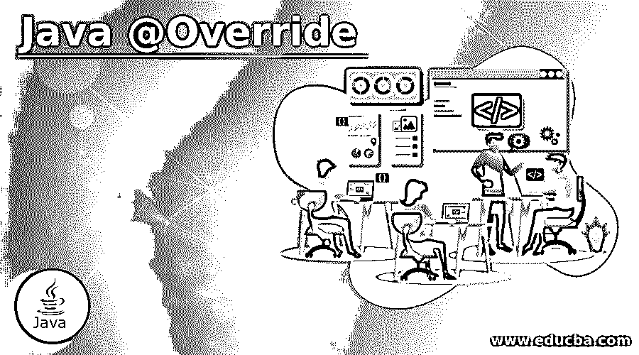

# Java @覆盖

> 原文：<https://www.educba.com/java-override/>




## Java @Override 简介

当开发人员在 Java 中重写一个函数以使用相同的函数名，但为这些函数分配不同的属性时，使用@Override 批注。如果您知道 Java 中的 over rise 函数，但是没有使用过@override 注释，因为您不想将它作为显式编写它的强制选项。自 Java 1.5 推出以来，它默认处于激活状态。它促进了运行时多态性。这是因为我们可以在不使用注释的情况下覆盖任何函数。尽管如此，它还是有一个主要的优势:如果编译器偶然错过了重写(就像开发人员在重写函数名中犯了拼写错误)。在覆盖注释的帮助下，编译器将理解并用子函数覆盖基函数。它还提高了代码的可读性，减少了维护时间和工作量。

**语法:**

<small>网页开发、编程语言、软件测试&其他</small>

```
public @interface Override
```

符号“@”应该出现在覆盖关键字之前，以便编译器理解这是否是注释。重写函数应该有相同的定义，以及基类和继承类中的返回类型和许多参数。如果其中任何一项存在差异，则在将此功能理解为新功能时，不会将其视为覆盖功能。

### @Override 注释在 Java 中是如何工作的？

*   Override 注释正好用在继承类中定义的 override 函数之前，以确保编译器理解该函数是有意用两个不同类中的相同参数和返回类型定义的。
*   为了让系统知道调用哪个函数，因为这个函数在基类和继承类中都有相同的参数，我们必须使用实例来调用这个函数。
*   如果使用父类的对象调用函数，则调用带有局部函数定义的父类函数，而如果使用继承类的对象，则调用继承类的函数。

**举例:**

```
Base class {}
Child class{}
Base object1= new Base();// Here Base class is instantiated so the function definition will be called from base class.
Base object2= new Child(); /// Here Child class is instantiated so the
function definition will be called from child class
```

*   现在，上面定义的名为“对象 1”和“对象 2”的对象与点运算符一起用于调出函数定义。
*   所有这些函数只有在 main 类下维护时才能工作，代码的实际执行就是从 main 类开始的。
*   控件将命中主类，然后搜索主类之上预定义的类的对象实例。
*   然后，该对象将调用被调用的函数。
*   如果已经在类定义中定义为原型，也可以在函数中传递所需的参数。
*   一个基类可以由多个类继承；唯一的区别是对象创建和使用该对象的函数调用。

### Java @Override 的示例

下面是一些例子:

#### 示例#1

演示覆盖注释工作的示例。

**说明:**

下面的程序中定义了两个类:一个是基类，也称为父类“Pclass”，而另一个类“Cclass”继承了基类的属性和成员函数，称为继承类或子类。该函数首先在父类中声明。在这个例子中，函数名是 printfunction()，它被分配了打印作为参数传递的字符串的任务。

同名函数是在名为“Cclass”的继承类中声明和定义的，前面带有@override 注释。其他字符串作为参数传递给它。在主类中，上面定义的类通过创建它们的对象来实例化。“对象 1”标识 Pclass 的对象，“对象 2”标识 Cclass 的对象。使用这些不同的对象调用相同的函数。在第一种情况下，object1 从父类 Pclass 获取字符串。稍后，当 object2 被调用时，那么@override 注释开始起作用并改变内容字符串。这是 Java 提供的一个覆盖工具，用于可理解的代码和更好的功能。

**代码:**

```
// This is Base class
class Pclass {
void printfunction()
{
System.out.println("This is the output of function present in parent class \"Pclass\". ");
}
}
// This is Child class
class Cclass extends Pclass {
// The below function is override function along with override annotation
@Override
void printfunction()
{
System.out.println("This is the output of function present in child class \"Cclass\".");
}
}
// Thi is Main class from here the contro; execution starts. JAVA compiler searches for main class to start executing any code.
public class Main {
public static void main(String[] args)
{
Pclass object1 = new Pclass();
object1.printfunction();
Pclass object2 = new Cclass();
object2.printfunction();
}
}
```

**输出:**

这是带有两行字符串的输出屏幕。第一个字符串行来自基类函数，而第二个字符串行来自继承类中定义的重写函数。


#### 实施例 2

这里我们有一个基类，两个子类继承了它。第二个继承的类被实例化，输出字符串从第 2 个<sup>和第 1 个</sup>继承的类触发。

**代码:**

```
class Pclass {
void printfunction()
{
System.out.println("This is the output of function present in parent class \"Pclass\". ");
}
}
// This is Child class
class Cclass extends Pclass {
// The below function is override function along with override annotation
@Override
void printfunction()
{
System.out.println("This is the output of function present in child class \"Cclass\".");
}
}
// This is Child class
class Cclass2 extends Pclass {
// The below function is override function along with override annotation
@Override
void printfunction()
{
System.out.println("This is the output of function present in child class number 2 \"Cclass\".");
}
}
// This is Main class from here the contro; execution starts. JAVA compiler searches for main class to start executing any code.
public class Main {
public static void main(String[] args)
{
Pclass object1 = new Pclass();
object1.printfunction();
Pclass object2 = new Cclass2();
object2.printfunction();
}
}
```

**输出:**


### 结论

因此 Java override 函数带来了很多好处，比如提供运行时多态性、容易的代码访问、干净的代码等等。添加覆盖注释可以确保编译器通过类中的函数声明理解函数定义的意图。这是 oops 概念的重要属性之一，称为多态性。

### 推荐文章

这是 Java @Override 的指南。这里我们讨论 Java @Override 的介绍，以及@Override 注释的工作原理和例子。您也可以看看以下文章，了解更多信息–

1.  [Java 中的对象类](https://www.educba.com/object-class-in-java/)
2.  [终于在 Java 中](https://www.educba.com/finally-in-java/)
3.  [Java max()](https://www.educba.com/java-max/)
4.  [Java min()](https://www.educba.com/java-min/)


