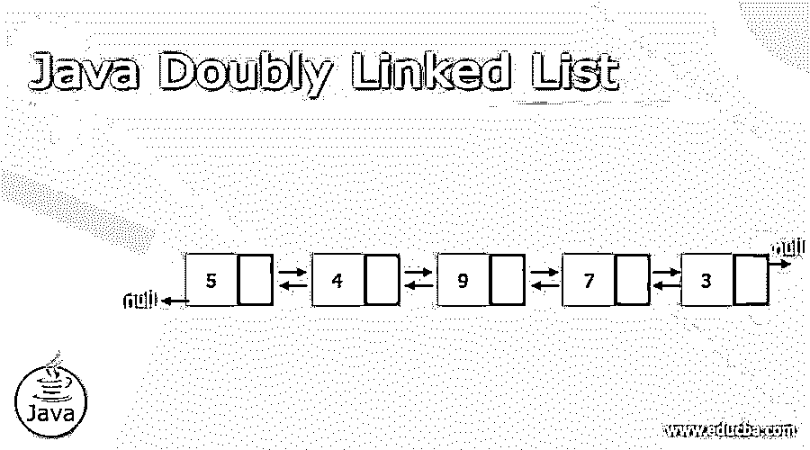
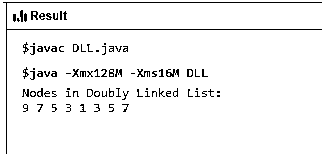
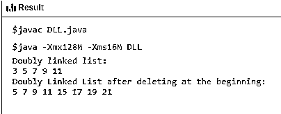

# Java 双向链表

> 原文：<https://www.educba.com/java-doubly-linked-list/>




## Java 双向链表简介

Java 双向链表是一种链表，其中每个节点除了存储数据之外还有两个链接。第一个链接指向列表的前一个节点，另一个链接指向列表的下一个节点。双向链表，也缩写为 DLL，非常类似于单链表。两个链表都包含一个指向下一个节点的指针和一个表示要存储在节点中的实际值的数据字段。主要区别在于 DLL 包含一个指向列表中前一个节点的指针，即 DLL 中的节点知道前一个和下一个节点。在本文中，我们将看看 Java 中的双向链表，探索几个例子，并了解它的实现。

### 句法

Java 中的双向链表没有特定的语法，但是我们将会看到如何在 Java 中声明双向链表。在研究双向链表的声明之前，让我们看看双向链表实现背后的概念。

<small>网页开发、编程语言、软件测试&其他</small>

**双向链表中的节点:**

| 预测节点 | **数据** | **下一个节点** |

这里，前一个节点和下一个节点分别是指向节点的前一个和下一个元素的指针。“数据”是存储数据的实际元素。

下面是一些我们需要理解的重要术语，

*   **Prev** :链表的每个链接都有一个到前一个节点的链接，叫做 Prev。
*   **Next** :链表的每个链接都有一个到下一个叫做 Next 的节点的链接
*   **链接**:链表的每个链接都可以存储数据，称为元素。
*   **链接** **列表**:包含第一个链接和最后一个链接的连接链接。

### 算法

*   定义一个表示链表中节点的节点类。它应该有 3 个属性，即前一个节点、数据和下一个节点
*   定义另一个类来创建一个有两个节点的双向链表，即头和尾。最初，这些值将为空。
*   创建一个在链表中添加节点的函数，
*   它将首先检查头是否为空，然后插入节点作为头。
*   头部和尾部都将指向新节点。
*   如果 tail 不为空，新节点将被插入到列表末尾，新节点的指针将指向尾部。
*   因此，新的节点将成为新的尾巴。

**Java 中双向链表的节点声明:**

```
class Node {
public int data;
public Node prev;
public Node next;
public void displayData() {
//content of the function}
}
```

正如我们所看到的，在双向链表中有一个额外的声明或引用(Node prev)。

### 双向链表的基本操作

下面是双向链表可用的基本操作，

*   **插入:**在链表的开头添加一个元素
*   **删除:**删除链表开头的元素
*   **Insert After:** 在链表的一项后添加一个元素
*   **最后插入:**在链表的末尾添加一个元素
*   **删除最后一个:**删除链表末尾的元素
*   **删除:**使用键从链表中删除一个元素。
*   **向前显示:**向前显示完整列表
*   **向后显示:**向后显示完整列表

### Java 双向链表的例子

下面是 Java 双向链表的不同例子:

#### 示例#1:节点声明和添加要显示的节点

**代码:**

```
public class DLL {
class Node{
public int data;
public Node prevNode;
public Node nextNode;
public Node(int data) {
this.data = data;
}
}
Node headNode, tailNode = null;
public void addDLLNode(int data) {
Node newDLLNode = new Node(data);
if(headNode == null) {
headNode = tailNode = newDLLNode;
headNode.prevNode = null;
tailNode.nextNode = null;
}
else {
tailNode.nextNode = newDLLNode;
newDLLNode.prevNode = tailNode;
tailNode = newDLLNode;
tailNode.nextNode = null;
}
}
public void displayNode() {
Node currentNode = headNode;
if(headNode == null) {
System.out.println("Doubly Linked List is empty");
return;
}
System.out.println("Nodes in Doubly Linked List: ");
while(currentNode != null) {
System.out.print(currentNode.data + " ");
currentNode = currentNode.nextNode;
}
}
public static void main(String[] args) {
DLL dLinkedList = new DLL();
dLinkedList.addDLLNode(9);
dLinkedList.addDLLNode(7);
dLinkedList.addDLLNode(5);
dLinkedList.addDLLNode(3);
dLinkedList.addDLLNode(1);
dLinkedList.addDLLNode(3);
dLinkedList.addDLLNode(5);
dLinkedList.addDLLNode(7);
dLinkedList.displayNode();
}
}
```

**输出:**




所以我们在这里创建一个节点类来声明一个双向链表并显示 DLL 的值。

#### 例 2:删除链表的开头并显示

**代码:**

```
public class DLL {
class Node{
public int data;
public Node prevNode;
public Node nextNode;
public Node(int data) {
this.data = data;
}
}
public void displayNode() {
Node tempNode = headNode;
while (tempNode != null) {
System.out.print(tempNode.data + "–>");
tempNode = tempNode.nextNode;
}
System.out.println("END");
}
Node headNode, tailNode = null;
public void addNode(int data) {
Node newNode = new Node(data);
if(headNode == null) {
headNode = tailNode = newNode;
headNode.prevNode = null;
tailNode.nextNode = null;
}
else {
tailNode.nextNode = newNode;
newNode.prevNode = tailNode;
tailNode = newNode;
tailNode.nextNode = null;
}
}
public void deleteInitialNode() {
if(headNode == null) {
System.out.println("Doubly Linked List is empty");
return;
}
else {
if(headNode != tailNode) {
headNode = headNode.nextNode;
}
else {
headNode = tailNode = null;
}
}
}
void printNode() {
Node currNode = headNode;
if(headNode == null) {
System.out.println("Doubly Linked List is empty");
return;
}
while(currNode != null)
{
System.out.print(currNode.data + " ");
currNode = currNode.nextNode;
}
System.out.println();
}
public static void main(String[] args) {
DLL doublyLL = new DLL();
doublyLL.addNode(3);
doublyLL.addNode(5);
doublyLL.addNode(7);
doublyLL.addNode(9);
doublyLL.addNode(11);
System.out.println("Doubly linked list: ");
doublyLL.printNode();
doublyLL.addNode(15);
doublyLL.addNode(17);
doublyLL.addNode(19);
doublyLL.deleteInitialNode();
doublyLL.addNode(21);
System.out.println("Doubly Linked List after deleting at the beginning: ");
doublyLL.printNode();
}
}
```

**输出:**




因此，在这里，节点在链表的开始处被删除，即节点 3 被删除/移除。

DLL 可以向前和向后遍历。如果给定要删除的节点指针，DLL 中的删除操作会更有效。DLL 中的每个节点都需要额外的空间来存放前一个指针。所有的操作都需要一个额外的指针来维护。

至此，我们将结束我们的主题“Java 双向链表”。我们已经看到了什么是 Java 双向链表，以及它是如何在 Java 编程中用很少的例子实现的。我们还看到了双向链表的算法，并列出了一些适用于 DLL 的操作。我们已经在第一次操作中实现了插入和删除，同样，还可以使用其他操作。

### 推荐文章

这是一个 Java 双向链表指南。在这里，我们讨论介绍，语法，以及如何在 Java 编程中用代码实现的例子来实现它。您也可以看看以下文章，了解更多信息–

1.  [Java 中的 Shell 排序](https://www.educba.com/shell-sort-in-java/)
2.  [JavaScript 中的选择排序](https://www.educba.com/selection-sort-in-javascript/)
3.  [在 Java 中排序字符串数组](https://www.educba.com/sort-string-array-in-java/)
4.  [Java 中的排序字符串](https://www.educba.com/sort-string-in-java/)


