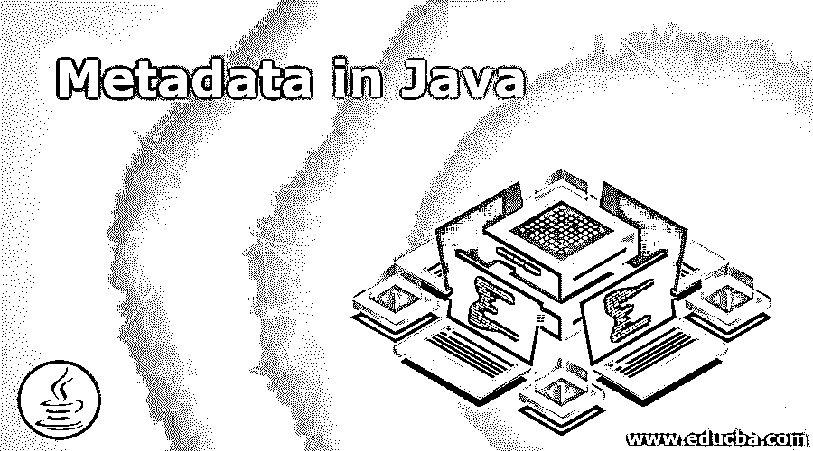
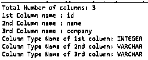
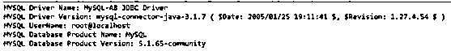

# Java 中的元数据

> 原文：<https://www.educba.com/metadata-in-java/>




## Java 元数据简介

Java 中定义为关于数据的数据的元数据称为“元数据”。元数据也被认为是关于用户所需信息的文档。这是数据仓库的一个重要方面。

**实时示例:**图书馆目录、内容表、关于个人数据的数据项(个人体重、个人行走等)。)，等等。

<small>网页开发、编程语言、软件测试&其他</small>

**由以下内容组成的元数据:**

*   系统及其组件的描述和位置。
*   它还有数据和最终用户视图的名称、定义、内容和结构。
*   权威数据的标识。
*   集成和转换规则用于填充数据。
*   订户的订阅信息。
*   用于分析数据使用和性能。

### 为什么元数据是必要的？

它提供了诸如表格数据、图书馆目录等内容的相关信息。和结构。

#### 元数据的类型

有 3 种类型的元数据

*   **运行元数据**
*   **提取和转换元数据**
*   **最终用户元数据**

**1。运营元数据:**运营元数据，拥有运营数据源的所有信息。在为数据仓库从源系统中选择信息时，我们将划分记录，组合来自不同来源的文档的因素，并处理多种编码方案和字段长度。当我们向最终用户交付信息时，我们必须能够返回到源数据集。

**2。提取和转换元数据:**提取和转换元数据包括关于从源系统中删除数据的数据。这些是数据提取的提取方法、提取频率和业务规则，属于提取和转换元数据。

**3。最终用户元数据:**最终用户元数据是数据仓库的导航图。实际上，它使最终用户能够从数据仓库中找到数据。

### 元数据在 Java 中是如何工作的？

Java 元数据基于提供给它的数据工作。它给出了关于数据的信息。

**语法:**

```
class Metadata{
public static void main(String args[]){
try{
//load required database class
//creating database metadata class
DatabaseMetaData metaData=con.getMetaData();
//display the metadata of the table content
System.out.println(metaData.getDriverName());
System.out.println(metaData.getDriverVersion());
System.out.println(metaData.getUserName());
System.out.println(metaData.getDatabaseProductName());
System.out.println(metaData.getDatabaseProductVersion());
con.close();
}catch(Exception e){ System.out.println(e);}
}
}
```

**Note:** Before getting into the example you must need MySQL database and mysql-connector jar.

### 用 Java 实现元数据的例子

以下是 Java 中元数据的示例:

#### 示例 1–结果集元数据

**代码:**

```
import java.sql.*;//importing sql package
public class A {//Creating class
//main method for run the application
public static void main(String args[]) {
try {
//loading my sql driver
Class.forName("com.mysql.jdbc.Driver");
//get the connection by providing database, user name and password
Connection connection = DriverManager.getConnection("jdbc:mysql://localhost:3306/test", "root", "root");
//select the all from employee table
PreparedStatement preparedStatement = connection.prepareStatement("select * from employee");
//executing the query
ResultSet resultSet = preparedStatement.executeQuery();
//Create result meta data for get the meta data of table
ResultSetMetaData resultSetMetaData = resultSet.getMetaData();
//Displaying meta data of employee table
System.out.println("Total Number of columns: " + resultSetMetaData.getColumnCount());
System.out.println("1st Column name : " + resultSetMetaData.getColumnName(1));
System.out.println("2nd Column name : " + resultSetMetaData.getColumnName(2));
System.out.println("3rd Column name : " + resultSetMetaData.getColumnName(3));
System.out.println("Column Type Name of 1st column: " + resultSetMetaData.getColumnTypeName(1));
System.out.println("Column Type Name of 2nd column: " + resultSetMetaData.getColumnTypeName(2));
System.out.println("Column Type Name of 3rd column: " + resultSetMetaData.getColumnTypeName(3));
connection.close();
} catch (Exception e) {
System.out.println(e);
}
}
}
```

**输出:**




#### 示例 2–数据库元数据

**代码:**

```
import java.sql.*;//importing sql package
public class A {//Creating class
//main method for run the application
public static void main(String args[]) {
try {
//loading my sql driver
Class.forName("com.mysql.jdbc.Driver");
//get the connection by providing database, user name and password
Connection connection = DriverManager.getConnection("jdbc:mysql://localhost:3306/test","root", "root");
//select the all from employee table
PreparedStatement preparedStatement = connection.prepareStatement("select * from employee");
//executing the query
preparedStatement.executeQuery();
//Create databse result set meta data for get the meta data of databse of mysql
DatabaseMetaData databaseMetaData=connection.getMetaData();
//Displaying meta data of mysql table
System.out.println("MYSQL Driver Name: "+databaseMetaData.getDriverName());
System.out.println("MYSQL Driver Version: "+databaseMetaData.getDriverVersion());
System.out.println("MYSQL UserName: "+databaseMetaData.getUserName());
System.out.println("MYSQL Database Product Name:"+databaseMetaData.getDatabaseProductName());
System.out.println("MYSQL Database Product Version: "+databaseMetaData.getDatabaseProductVersion());
connection.close();
} catch (Exception e) {
System.out.println(e);
}
}
}
```

**输出:**




#### 示例 3–用于提取表名的数据库元数据

**代码:**

```
import java.sql.*;//importing sql package
public class A {// Creating class
// main method for run the application
public static void main(String args[]) {
try {
// loading my sql driver
Class.forName("com.mysql.jdbc.Driver");
// get the connection by providing database, user name and password
Connection connection = DriverManager.getConnection("jdbc:mysql://localhost:3306/test", "root", "root");
// Create databse result set meta data for get the meta data of
// databse of mysql
DatabaseMetaData dbmd = connection.getMetaData();
String table[] = { "VIEW" };
ResultSet resultSet = dbmd.getTables(null, null, null, table);
// iterating number table names from database of mysql
while (resultSet.next()) {
System.out.println("Table name is: "+resultSet.getString(3));
}
connection.close();
} catch (Exception e) {
System.out.println(e);
}
}
}
```

**输出:**


### 结论

Java 中的元数据是用来了解关于数据的数据。这意味着例如表字段名称、字段数据类型、字段数据类型长度、数据库表名称、特定数据库中存在的数据库数量等。

### 推荐文章

这是一本 Java 元数据指南。在这里，我们讨论 Java 中的元数据及其不同类型的介绍，以及示例和代码实现。您也可以浏览我们推荐的其他文章，了解更多信息——

1.  [具有特征的 Java 8 收集器](https://www.educba.com/java-8-collectors/)
2.  Java 中的对象类是如何工作的？
3.  [Java 目录(示例)](https://www.educba.com/java-directories/)
4.  [Java 重画简介](https://www.educba.com/repaint-in-java/)


