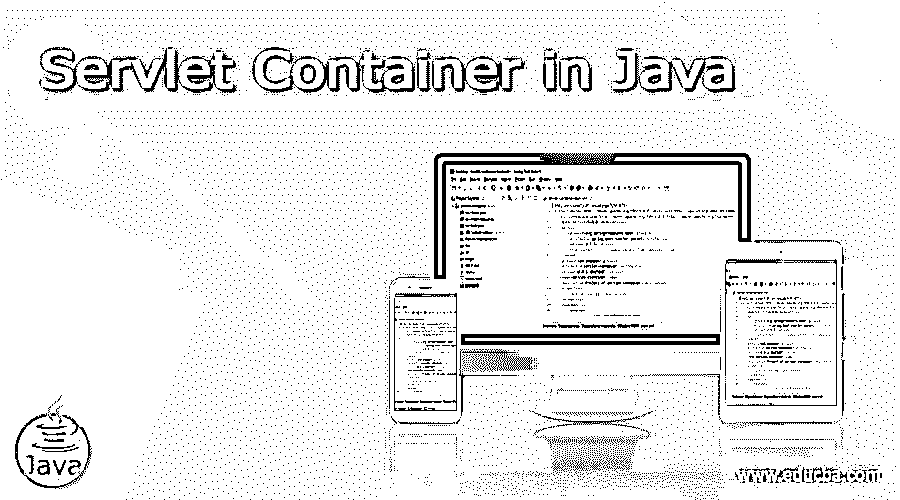
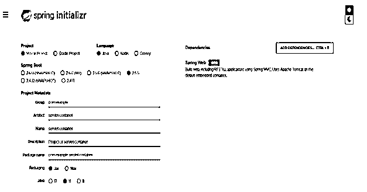
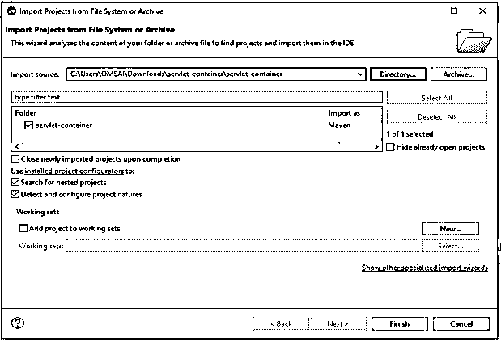
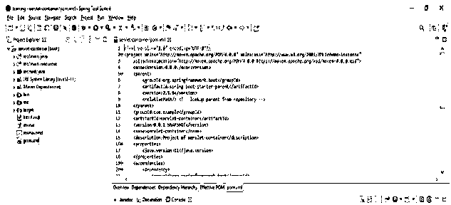
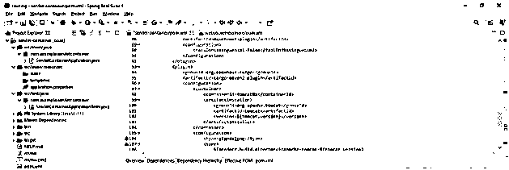
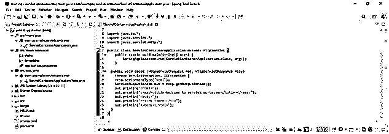
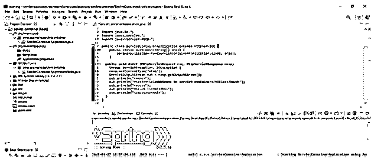

# Java 中的 Servlet 容器

> 原文：<https://www.educba.com/servlet-container-in-java/>




## Java 中 Servlet 容器的定义

java 中的 Servlet 容器为 java 和 j2ee 应用程序提供了运行时环境，基本上，客户端只会从 web 服务器请求静态网页，如果我们想读取网页作为输入，那么我们需要在我们的应用程序中使用 servlet 容器。它是运行在指定进程中的服务器的一部分。java 中有三种 servlet 容器步骤，即进程内、独立和进程外。它在应用程序的生命周期管理中执行许多操作。

### java 中的 servlet 容器是什么？

*   我们可以在服务器端动态生成网页。基本上，servlet 容器只不过是与 servlet 交互的 web 服务器部分。
*   servlet 容器用于管理 java 组件的生命周期。此外，servlet 容器用于管理 java servlet 的生命周期。
*   众所周知，servlet 容器是 web 服务器的一部分。下面是如下状态。

1)进程内
2)进程外
3)独立

<small>网页开发、编程语言、软件测试&其他</small>

*   servlet 容器的第一个进程是独立的；它基本上是一个基于 java 的服务器，其中包含 web 服务器，这是单一代码的一个组成部分。servlet 容器的一个例子是 tomcat 服务器的运行。
*   servlet 容器的第二个状态是进程，这个进程在 servlet 容器中与 web 服务器分开，因为在 web 服务器上运行不同的程序。进程状态 servlet 容器的例子是在 JBOSS 服务器内部运行的 tomcat。
*   servlet 容器的第三种状态是进程外，在这种状态下，servlet 容器和 web 服务器是在不同进程中运行的不同程序。

### java 中 servlet 容器是如何工作的？

*   为了执行 servlet 代码，我们需要 servlet 容器。它运行在 java 虚拟机之上。
*   众所周知，没有 java 虚拟机我们就无法执行 java 代码，所以使用 java 虚拟机我们就可以运行 servlet 容器。
*   Servlet 容器独立运行，或者不使用 web 服务器也能运行。
*   Servlet 容器组件是基于 java 的组件。它只不过是编译好的可执行程序。
*   主要用途是初始化和加载 servlet。它是 java 服务器页面和 servlet 技术的实现。
*   基本上，servlet 容器将加载 servlet 类并调用方法名作为 init，Servlet 容器第一次调用这个方法。
*   我们在 servlet 容器中为每个方法调用 init 方法来构造实例的 servlet 请求。
*   在调用 init 方法和构造 servlet 请求之后，我们调用方法名作为 servlet 服务来传递 servlet 请求和 servlet 响应。
*   关闭 servlet 类后，它将调用 destroy 方法来卸载服务器类。

### Web 服务器处理请求

*   Web 服务器就是用来响应来自互联网的客户请求的软件和硬件。
*   java web 服务器的主要工作是显示网站的内容。Web 服务器也支持简单邮件传输协议。
*   HTTP 服务器正在理解 URL 和 HTTP。Web 服务器就是用来存储 web 服务器文件和其他与 web 服务器相关的文件的计算机。
*   网络服务器用于发送和接收电子邮件。Web 服务器也用于 FTP(文件传输协议)协议来上传和下载文件。
*   我们还可以使用 web 服务器在互联网上发布和构建我们的应用程序的网页。
*   执行 web 服务器和容器 web 服务器之间的通信是使用 servlet 的容器提供的插件。
*   它将管理 servlet 容器的生命周期，其中包含方法调用、对象创建、销毁和管理对象。

### 责任

*   使用 servlet 容器，通过使用 web 容器来处理和解析方法和生命周期实例。servlet 容器中的 web 容器将提供池化管理的便利。
*   它为浏览器和客户端提供媒体和内部 servlet 通信支持。
*   java 中的 Servlet 容器为每个新请求创建一个新线程，因此它将支持多线程概念。Servlet 将为每个请求初始化，并且它将为每个请求共享一次性内存。
*   它还支持 JSP。每个 servlet 容器 java 应用程序都是使用 JSP 编译的。
*   基本上，servlet 容器负责将 JSP 转换成 servlet，并负责维护它。

### Servlet 容器示例

以下步骤显示 servlet 容器如下。

#### 1)使用 spring 初始化器创建项目模板

group–com。示例
工件名称–servlet-container
名称–servlet-container
描述–servlet-container
包名称–com。example.servlet-container
打包–Jar
Java–11
依赖项–spring web。



#### 2)生成项目后，提取文件并使用 spring 工具套件打开该项目




#### 3)使用 spring 工具套件打开项目后，检查项目及其文件




#### 4)添加依赖项–

**代码:**

```
<artifactInstaller> -- Start of artifactInstaller tab.
<groupId>org.apache.tomcat</groupId> -- Start and end of groupid tag.
<artifactId>tomcat</artifactId> -- Start and end of artifactid tag.
<version>${tomcat.version}</version> -- Start and end of version tag.
</artifactInstaller> -- End of artifactInstaller tab.
```




#### 5)创建主 java 类

**代码:**

```
public class ServletContainerApplication extends HttpServlet {
public void doGet (HttpServletRequest req, HttpServletResponse resp)
throws ServletException, IOException {
resp.setContentType ("html");
ServletOutputStream out = resp.getOutputStream ();
out.println ("<html>");
out.println ("<head><title>Welcome to servlet container</title></head>");
out.println ("<body>");
out.println ("<h1>Hi There!</h1>");
out.println ("</body></html>");
}
}
```




#### 6)运行应用程序–




### 结论

Servlet 容器只不过是一个持续运行的程序，管理特定组件的生命周期。java 中有三种 servlet 容器步骤，即进程内、独立和进程外。使用网站域名访问 Web 服务器。

### 推荐文章

这是 Java 中 Servlet 容器的指南。这里我们讨论一下定义，java 中的 servlet 容器是什么？java 中的 servlet 容器如何工作？代码实现示例。您也可以看看以下文章，了解更多信息–

1.  [Java XML 解析器](https://www.educba.com/java-xml-parser/)
2.  [settimeout Java](https://www.educba.com/settimeout-java/)
3.  [Java 测试私有方法](https://www.educba.com/java-testing-private-methods/)
4.  [AVL 树 java](https://www.educba.com/avl-tree-java/)


