# Java 中的数字模式

> 原文：<https://www.educba.com/number-patterns-in-java/>

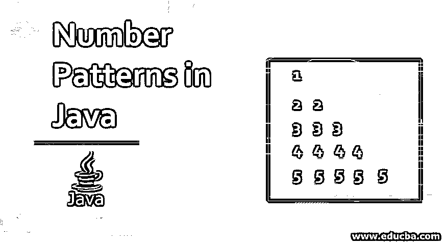


## Java 中的数字模式介绍

对于新生来说，数字模式是面试问题的一部分，因为它提供了一个很好的头脑风暴会议来分析一个人的创造力和创新能力。解决更多的模式显示逻辑和数学能力。在 java 中使用所有这些条件循环和语法来形成不同的模式确实是一个好方法。它有助于即兴优化的技能，并有助于发展逻辑和分析能力。它可以用任何字符或符号代替。如果你学会了数字模式，你可以用 java 来构建任何模式。

### 数字模式的顶级示例

在这里，我们将学习如何面对一些好的数字模式。让我们用例子和代码实现来看看 java 中一些好的数字模式，下面将详细解释:

<small>网页开发、编程语言、软件测试&其他</small>

#### 示例#1

**代码:**

```
import java.util.Scanner;
public class Pattern1 {
public static void main (String [] args) {
Scanner scanner = new Scanner(System.in);
System.out.println("Enter the number of rows ");
int rows = scanner.nextInt();
System.out.println("Printing Pattern");
for (int i = 1; i <= rows; i++)
{
for (int j = 1; j <= i; j++)
{
System.out.print(j + " ");
}
System.out.println();
}
}
}
```

**输出:**

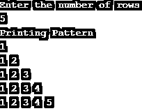


#### 实施例 2

**代码:**

```
import java.util.Scanner;
public class Pattern2 {
public static void main (String [] args) {
{
Scanner scanner = new Scanner(System.in);
System.out.println("Enter the number of rows");
int rows = scanner.nextInt();
System.out.println("Printing Pattern");
for (int i = 1; i <= rows; i++)
{
for (int j = 1; j <= i; j++)
{
System.out.print(i + " ");
}
System.out.println();
}
}
}
}
```

**输出:**

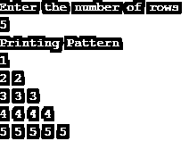


#### 实施例 3

**代码:**

```
import java.util.Scanner;
public class Pattern_3 {
public static void main (String [] args) {
Scanner scanner = new Scanner(System.in);
System.out.println("Enter the number of rows");
int rows = scanner.nextInt();
System.out.println("Printing Pattern");
for (int i = 1; i <= rows; i++)
{
for (int j = 1; j <= i; j++)
{
System.out.print(j + " ");
}
System.out.println();
}
for (int i = rows; i >= 1; i--)
{
for (int j = 1; j < i; j++)
{
System.out.print(j + " ");
}
System.out.println();
}
}
}
```

**输出:**

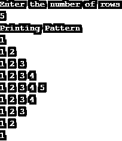


#### 实施例 4

**代码:**

```
import java.util.Scanner;
public class Pattern4 {
public static void main(String[] args) {
Scanner scanner = new Scanner(System.in);
System.out.println("Enter the number of rows");
int rows = scanner.nextInt();
System.out.println("Printing Pattern");
for (int i = rows; i >= 1; i--)
{
for (int j = 1; j <= i; j++)
{
System.out.print(j + " ");
}
System.out.println();
}
for (int i = 1; i <= rows; i++)
{
for (int j = 1; j <= i; j++)
{
System.out.print(j + " ");
}
System.out.println();
}
}
}
```

**输出:**

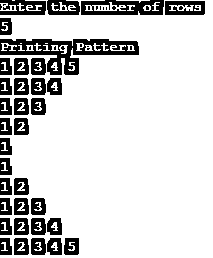


#### 实施例 5

**代码:**

```
import java.util.Scanner;
public class Pattern5 {
public static void main(String [] args) {
Scanner scanner = new Scanner(System.in);
System.out.println("Enter the number of rows");
int rows = scanner.nextInt();
System.out.println("Printing Pattern");
for (int i = rows; i >= 1; i--)
{
for (int j = i; j >= 1; j--)
{
System.out.print(j + " ");
}
System.out.println();
}
for (int i = 1; i <= rows; i++)
{
for (int j = i; j >= 1; j--)
{
System.out.print(j + " ");
}
System.out.println();
}
}
}
```

**输出**:

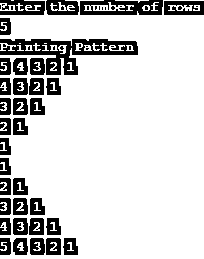


#### 实施例 6

**代码:**

```
import java.util.Scanner;
public class Pattern6 {
public static void main(String[] args) {
Scanner scanner = new Scanner(System.in);
System.out.println("Enter the number of rows ");
int rows = scanner. nextInt();
System.out.println("Printing Pattern");
for (int i = 1; i <= rows; i++)
{
for (int j = rows; j > i; j--)
{
System.out.print(" ");
}
for (int k = 1; k <= i; k++)
{
System.out.print(k + " ");
}
System.out.println();
}
}
}
```

**输出:**


#### 实施例 7

**代码:**

```
import java.util.Scanner;
public class Pattern7 {
public static void main (String [] args)
{
Scanner scanner = new Scanner (System.in);
System.out.println("Enter the number of rows ");
int rows = scanner.nextInt();
System.out.println("Printing Pattern");
for (int i = 1; i <= rows; i++)
{
for (int j = rows; j >= i; j--)
{
System.out.print(j + " ");
}
System.out.println();
}
}
}
```

**输出:**

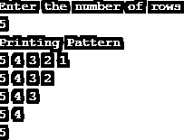


#### 实施例 8

**代码:**

```
import java.util.Scanner;
public class Pattern8 {
public static void main (String[] args)
{
Scanner scanner = new Scanner (System.in);
System.out.println("Enter the number of rows");
int rows = scanner.nextInt();
System.out.println("Printing Pattern");
for (int i = rows; i >= 1; i--)
{
for (int j = rows; j >= i; j--)
{
System.out.print(j + " ");
}
System.out.println();
}
}
}
```

**输出:**

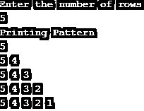


#### 实施例 9

**代码:**

```
import java.util.Scanner;
public class Pattern9
{
public static void main(String[] args)
{
Scanner scanner = new Scanner(System.in);
System.out.println("Enter the number of rows");
int rows = scanner.nextInt();
System.out.println("Printing Pattern ");
for (int i = rows; i >= 1; i--)
{
for (int j = 1; j <= i; j++)
{
System.out.print(j + " ");
}
System.out.println();
}
}
}
```

**输出:**

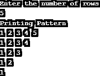


#### 实施例#10

**代码:**

```
import java.util.Scanner;
public class Pattern10
{
public static void main(String [] args)
{
Scanner scanner = new Scanner(System.in);
System.out.println("Enter the number of rows");
int rows = scanner.nextInt();
int k = 1;
System.out.println("Printing Pattern");
for (int i = 1; i <= rows; i++)
{
for (int j = 1; j <= i; j++)
{
System.out.print(k + " ");
k++;
}
System.out.println();
}
}
}
```

**输出:**

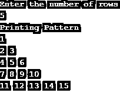


#### 实施例 11

**代码:**

```
import java.util.Scanner;
public class Pattern11
{
public static void main(String[] args)
{
Scanner scanner = new Scanner (System.in);
System.out.println("Enter number of rows");
int rows = scanner.nextInt();
System.out.println("Printing Pattern");
for (int i = 1; i <= rows; i++)
{
for (int j = i; j >= 1; j--)
{
System.out.print(j + " ");
}
System.out.println();
}
}
}
```

**输出:**

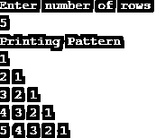


#### 实施例#12

**代码:**

```
import java.util.Scanner;
public class Pattern12
{
public static void main(String[] args)
{
Scanner scanner = new Scanner(System.in);
System.out.println("Enter the number of rows");
int rows = scanner.nextInt();
System.out.println("Pattern Printing");
for (int i = 1; i <= rows; i++)
{
int temp = i;
for (int j = i; j >= 1; j--)
{
System.out.print(temp + " ");
temp = temp + rows;
}
System.out.println();
}
}
}
```

**输出:**

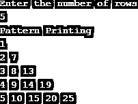


#### 实施例#13

**代码:**

```
import java.util.Scanner;
public class Pattern13
{
public static void main(String[] args)
{
Scanner scanner = new Scanner(System.in);
System.out.println("Enter the number of rows");
int rows = scanner.nextInt();
System.out.println("Pattern Printing");
for (int i = 1; i <= rows; i++)
{
for (int j = rows; j > i; j--)
{
System.out.print(" ");
}
int temp= 1;
for (int k = 1; k <= i; k++)
{
System.out.print(temp + " ");
temp = temp * (i - k) / (k);
}
System.out.println();
}
}
}
```

**输出:**

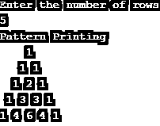


#### 实施例#14

**代码:**

```
import java.util.Scanner;
public class Pattern14
{
public static void main(String[] args)
{
Scanner scanner = new Scanner(System.in);
System.out.println("Enter number of rows");
int rows = scanner.nextInt();
System.out.println("Pattern Printing");
for (int i = 1; i <= rows; i++)
{
for (int j = 1; j <= i; j++)
{
System.out.print(j + " ");
}
for (int k = i - 1; k >= 1; k--)
{
System.out.print(k + " ");
}
System.out.println();
}
}
}
```

**输出:**

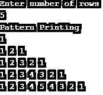


### 结论

解决数字模式或任何设计模式可以提高一个人的分析和逻辑构建能力。在更大的领域中，它提供了如何创建和满足项目需求的概述，以及如何有效地自信地处理它。

### 推荐文章

这是 Java 中数字模式的指南。这里我们讨论 java 中数字模式的介绍和前 14 个例子，以及它的代码实现。你也可以看看下面的文章来了解更多-

1.  [JavaFX FileChooser](https://www.educba.com/javafx-filechooser/)
2.  [Java 中的正则表达式](https://www.educba.com/regular-expressions-in-java/)
3.  [JavaFX 按钮](https://www.educba.com/javafx-button/)
4.  [Java 布尔函数](https://www.educba.com/java-booleans/)


