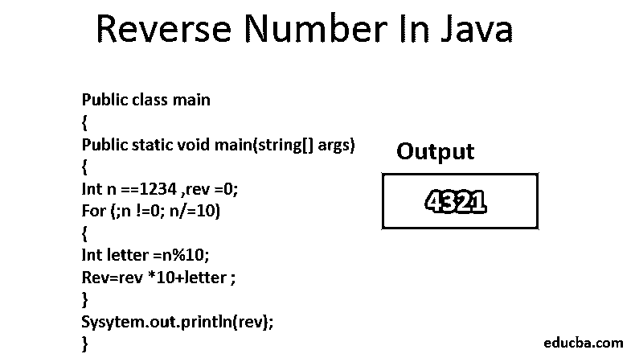

# Java 中的反向数字

> 原文：<https://www.educba.com/reverse-number-in-java/>




## Java 中的反数概述

Java 是一种通用的、健壮的、基于类的、面向对象的编程语言，具有尽可能少的依赖性。在我们讨论在 java 中反转一个特定的数字之前，让我们先了解一下在任何语言中反转一个数字是什么意思，为什么它是相关的，以及它的用途和应用。反转一个数意味着如果一个数是 n 位数，那么该数的单位值将变成第 n 位数，十位数将变成第(n-1)位值，依此类推。在本文中会看到对 java 中反数的详细解释。

### 理解 Java 中的逆数逻辑

为了进一步理解这个概念，我们需要借助一个例子。假设这个数是 120，那么这个数是 3 位数，包含个位值、十位值和百位值。现在，当我们在 java 中应用反转数字的逻辑时，那么单位数字，即 0，将成为我们的百位数，1 将成为我们的单位数字，而 2 将保持原样。因此，获得的新数字将是 021，这将是 120 的倒数。在每一种[编程语言中，要编写的逻辑或程序或多或少都是相似的，因此](https://www.educba.com/what-is-a-programming-language/)用 java 阅读这个逻辑应该不成问题。

<small>网页开发、编程语言、软件测试&其他</small>

现在，让我们讨论一下倒数的相关性，以及我们为什么真的需要它。有时需要取出数字的[回文。如果你是编程新手，不熟悉回文的概念，那么回文就是即使反转也不变的数字。例如，数字 5885 是 5885 的回文。因此，必须获取所有包含回文数字的值或记录，并且需要在 java 中使用反转数字。](https://www.educba.com/palindrome-in-java/)

### 寻找相反的数字

下面就让我们借助 java 中各种倒数的例子来理解一下。
但首先让我们了解一下数字反转背后的算法。

#### 算法

1.  输入一个数值。
2.  取另一个变量，将其初始化为 0。
3.  放置 while 循环的条件，直到数值> 0。
4.  将另一个变量乘以 10
5.  取出数值的余数
6.  将步骤 4 和 5 的结果相加，并将它们存储在另一个变量中
7.  将实际数值除以 10
8.  关闭循环并返回值

### 例子

以下是不同的例子:

#### while 循环

在这种情况下，为了在 java 中找出一个数的倒数，我们使用了一个 while 循环，这是一个预处理循环。此处的条件与>运算符的使用有关，其中检查与值大于 0 的数字有关。

**代码:**

```
public class Main
{
public static void main(String[] args) {
int num=569;
int r_num=0;
while(num>0)
{
r_num=(r_num*10)+(num%10);
num=num/10;
}
System.out.println(r_num);
}
}
```

**输出:**


#### Do-while 循环

在这个程序中，编译器将至少扫描一次代码，一旦条件匹配就进行迭代。这是 do-while 循环和 while 循环的基本区别。这是一个后置条件循环，而 while 循环是一个预处理循环。

**代码:**

```
public class Main
{
public static void main(String[] args) {
int num=569;
int r_num=0;
do
{
r_num=(r_num*10)+(num%10);
num=num/10;
} while(num>0);
System.out.println(r_num);
}
}
```

**输出:**


#### 递归方法

**代码:**

```
class main{
public static void main(String[] args) throws IOException
{
int num, c = 0, n1;
num = 569
n1 = num;
while(n1 > 0)
{
c++;
n1 = n1 / 10;
}
Rev_Rec obj = new Rev_Rec();
int x = obj.reverse(num, c);
System.out.println("Reversal of a number is:"+x);
}
int reverse(int a, int len)
{
if(len == 1)
{
return a;
}
else
{
int b = a % 10;
a = a / 10;
return (int) ((b * pow(10, len - 1)) + reverse(a, --len));
}
}
}
```

**输出:**


#### While 循环

在这种情况下，为了在 java 中找出一个数的倒数，我们使用了一个 while 循环，这是一个预处理循环。这里的条件和使用有关！=运算符，其中检查与值不等于 0 的数字相关。

**代码:**

```
public class Main
{
public static void main(String[] args) {
int num=569;
int r_num=0;
while(num!=0)
{
r_num=(r_num*10)+(num%10);
num=num/10;
}
System.out.println(r_num);
}
}
```

**输出:**


### Java 中如何求反数？

在这一节中，我们将读到在 Java 中寻找一个数的倒数的另一种方法。这将在 for 循环的帮助下完成，它是另一种循环结构，就像我们上面研究的 while 循环一样。for 循环通常用在我们知道迭代次数的地方。

**代码:**

```
public class Main
{
public static void main(String[] args) {
int n = 123, rev = 0;
for(;n != 0; n /= 10) {
int letter = n % 10;
rev = rev * 10 + letter;
}
System.out.println(rev);
}
}
```

**输出:**


这里，在这篇博文中，我们已经了解了 Java 中的逆数以及如何求一个数的逆数。我们还研究了求反数的各种应用和用法。根据需要，这可以有多种用途。同样的代码可以有其他的编写方式，在这篇文章中有解释。这是寻找一个数的倒数的最佳和最广泛使用的方法。在每种编程语言中，反转一个数字的方法几乎是相同的；因此，一旦你知道了程序的逻辑，用其他语言实现这个解决方案将会非常容易。我希望你喜欢我们的文章。请继续关注我们的博客，获取更多文章。

### 推荐文章

这是一个 Java 中的倒数指南。在这里，我们讨论了在 Java 中寻找倒数的基本概念，并给出了各种例子和输出。您也可以看看以下文章，了解更多信息–

1.  [反转 C++中的数字](https://www.educba.com/reverse-number-in-c-plus-plus/)
2.  [反转 C 中的数字](https://www.educba.com/reverse-number-in-c/)
3.  [Java 中的递归](https://www.educba.com/recursion-in-java/)
4.  [Python 中的反数](https://www.educba.com/reverse-number-in-python/)


