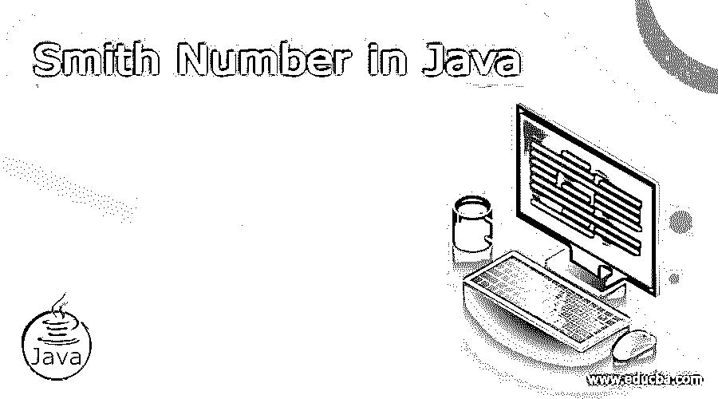
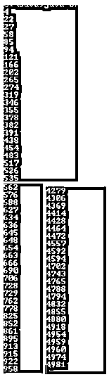

# Java 中的史密斯数

> 原文：<https://www.educba.com/smith-number-in-java/>




## Java 史密斯数的定义

在 Java 中，我们有一种不同的功能；史密斯号码是提供给用户的一种功能。基本上，史密斯数只不过是一个合数(在数系中它的基数是 10)，它的所有数字之和等于它的所有质因数(不包括 1)的所有数字之和，这就是所谓的史密斯数。史密斯数的另一个名字是笑话数。根据定义，我们可以说，所有的素数如果满足条件，都是自然排除的。通常史密斯数是根据用户要求和问题陈述的一些要求在数学中使用的数字系统的一个非常基本的子字段。

### 史密斯数背后的逻辑

现在我们来看看史密斯数背后是什么逻辑如下。

<small>网页开发、编程语言、软件测试&其他</small>

史密斯数的逻辑非常简单，让我们考虑下面的数，然后我们将很容易理解如下的逻辑。

例如:假设我们需要检查给定的号码是否是史密斯号码。

给定的数字是:95

首先，我们需要找出 95 的质因数是 19 和 5 (5，19)

现在找出 9 + 5 = 14 的数字之和

质因数之和是 5 + 1 + 9 = 15

现在比较两个结果，看到这里 14 不等于 15。所以给定的数不是质数。

让我们考虑另一个数字如下。

给定数量:58

首先找出 58 = 2 和 29 的质因数

质因数之和= 2 + 2 +9 = 13

给定数字的和= 5 + 8 = 13

现在比较两个结果，这里两个结果相同，或者我们可以说相等。所以我们可以说给定的数就是史密斯数。

这是史密斯数背后非常简单的逻辑，我们只需要比较素数阶乘和与位数和。如果两个和相等，则给定的数是史密斯数，否则该数不是史密斯数。

### 如何用 Java 查史密斯数？

现在让我们看看如何在 java 中检查一个给定的数字是否是 smith，如下所示。

在上述观点中，我们已经讨论了史密斯数的不同例子。现在让我们来看看寻找史密斯数的不同步骤，如下所示。

1.首先，我们需要初始化或从用户那里读取数字。

2.之后，我们需要找到给定数字的数字总和。

3.接下来，我们需要找到一个给定数字的质因数。

4.现在计算质因数的位数之和。

5.现在比较给定数字的位数总和与质因数的位数总和。

形容词（adjective 的缩写）如果两个和相等，那么我们可以说给定的数就是史密斯数。

b.否则，我们可以认为给定的数不是史密斯数，因为和是不同的。

因此，上述步骤对用 Java 实现史密斯数程序是有用的。

### 例子

现在让我们看看 java 中史密斯数的不同例子，以便更好地理解。

#### 示例#1

**代码:**

```
import java.util.*;
public class Smith_Num
{
static int F_Sum_P_Fact(int no)
{
int j=2, add=0;
while(no>1)
{
if(no%j==0)
{
add=add+F_S_Digit(j);
no=no/j;
}
else
{
do
{
j++;
}
while(!isPrime(j));
}
}
return add;
}
static int F_S_Digit(int no)
{
int sum=0;
while(no>0)
{
sum=sum+no%10;
no=no/10;
}
return sum;
}
static boolean isPrime(int j)
{
boolean b=true;
int d=2;
while(d<Math.sqrt(j))
{
if(j%d==0)
{
b=false;
}
d++;
}
return b;
}
public static void main(String args[])
{
Scanner s_c = new Scanner(System.in);
System.out.print("Enter a number: ");
int no=s_c.nextInt();
int x = F_S_Digit(no);
int y = F_Sum_P_Fact(no);
System.out.println("addition of digit = "+x);
System.out.println("addition of prime factors digits is = "+y);
if(x==y)
System.out.print("The user enterd number is smith number.");
else
System. out.print("The user entered number is not smith number.");
}
}
```

**解释**

在上面的程序中，我们尝试用 java 实现史密斯数程序。这里，我们首先创建了素数因子的数字和的函数；类似地，我们还创建了函数来查找给定数字的数字总和，如上面的程序所示。之后，我们创建了一个函数，通过使用布尔函数来检查给定的数是否是质数。然后，我们编写主函数，在主函数中，我们接受来自用户的数字，并调用我们已经创建的所有函数，比较两个和。如果总和相等，则将给定的数字打印为史密斯数，如果总和不相等，则打印给定的数字不是史密斯数。我们用下面的截图来说明上面程序的最终输出。

#### 实施例 2

下面我们再看一个例子。

**代码:**

```
import java.util.*;
public class Smith_Num_2
{
static List<Integer> F_P_Fact(int no)
{
List<Integer> output = new ArrayList<>();
for (int j = 2; no % j == 0; no = no/j)
output.add(j);
for (int j = 3; j* j <= no; j=j+2)
{
while (no % j == 0)
{
output.add(j);
no = no/j;
}
}
if (no != 1)
output.add(no);
return output;
}
static int S_Digit(int no)
{
int s= 0;
while (no > 0)
{
s =s+(no % 10);
no = no/10;
}
return s;
}
public static void main(String args[])
{
for (int no = 1; no < 5000; no++)
{
List<Integer> Fact = F_P_Fact(no);
if (Fact.size() > 1)
{
int s = S_Digit(no);
for (int fa : Fact)
s =s-S_Digit(fa);
if (s == 0)
System.out.println(no);
}
}
}
}
```

**解释**

在上面的例子中，我们试图找出 5000 以内的所有史密斯数，如图所示。我们用下面的截图来说明上面程序的最终输出。




### 结论

我们希望从这篇文章中你学会 java 中的史密斯数。从上面的文章中，我们学习了史密斯数的基本逻辑，我们也看到了史密斯数的不同例子。从这篇文章中，我们了解了如何以及何时在 java 中使用史密斯数。

### 推荐文章

这是一个用 Java 编写的史密斯数指南。这里我们讨论一下定义，如何在 Java 中查史密斯数？代码实现示例。您也可以看看以下文章，了解更多信息–

1.  [Java 中的排序字符串](https://www.educba.com/sort-string-in-java/)
2.  [Java 中的 Shell 排序](https://www.educba.com/shell-sort-in-java/)
3.  [Java 中的 Servlet](https://www.educba.com/servlet-in-java/)
4.  [跳过列表 Java](https://www.educba.com/skip-list-java/)


