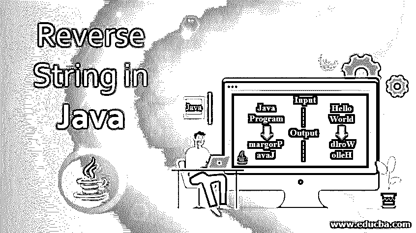
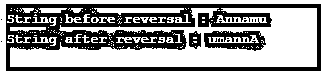
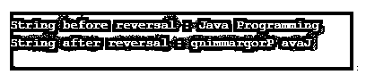
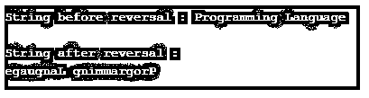
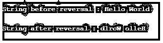
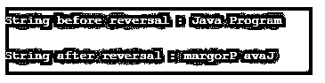

# Java 中的反向字符串

> 原文：<https://www.educba.com/reverse-string-in-java/>




## Java 中的反向字符串介绍

字符串是一个字符序列，它是 Java 中的一个对象。在 Java 中，可以对 String 对象执行多种操作。常用的操作之一是字符串反转。反转的字符串称为反向字符串。例如，“HAPPY”字符串可以反过来表示为“YPPAH”。同样,' LUCKY '字符串反过来也可以写成' YKCUL'。

### Java 中反向字符串背后的逻辑

有几种方法可以反转字符串。对于每种方法，将使用单独的函数和循环。尽管方法不同，串的反转背后的基本过程几乎相似，下面将提到:

<small>网页开发、编程语言、软件测试&其他</small>

*   用代码或用户输入来输入字符串。
*   从最后一个位置开始获取字符串的字符，并将它们存储在任何变量中。
*   显示最终输出。

### 如何在 Java 中使用各种方法反转字符串？

有几种方法来执行串的反转。

*   使用 StringBuffer 或 StringBuilder
*   使用 charAt()方法
*   使用 ArrayList 对象
*   使用反向迭代
*   使用递归

让我们详细研究一下每一个问题。

#### 1.使用 StringBuffer 或 StringBuilder 反转字符串的程序

**代码:**

```
//Java program to Reverse a String using StringBuffer
//class
public class ReverseStringExample{
//main method
public static void main(String[] args) {
//string
String str1 = "Annamu";
//reversed string will be stored in <u>rev</u> variable
String rev = new StringBuffer(str1).reverse().toString();
//print string before reverse
System.out.println("\nString before reversal : "+str1);
//print string after reverse
System.out.println("String after reversal : "+rev);
}
}
```

**输出:**


这里，作为输入给出的字符串将使用 StringBuffer 进行缓冲，并使用 reverse()方法进行反转。一旦缓冲区反转，它将在 toString()方法的帮助下转换为字符串。

类似地，StringBuilder 也可以用来代替 StringBuffer，这将在下面的程序中解释。

使用 StringBuilder 反转字符串的 Java 程序。

**代码:**

```
//class
public class ReverseStringExample{
//main method
public static void main(String[] args) {
//string
String str1 = "Annamu";
//reversed string will be stored in <u>rev</u> variable
String rev = new StringBuilder(str1).reverse().toString();
//print string before reverse
System.*out*.println("\nString before reversal : "+str1);
//print string after reverse
System.*out*.println("String after reversal : "+rev);
}
}
```

**输出:**




这里也可以看到，即使使用了 StringBuilder，字符串也是颠倒的。

#### 2.使用 charAt()方法反转字符串的程序

**代码:**

```
//class
public class ReverseStringExample{
//main method
public static void main(String[] args) {
//string
String str1 = "Java Programming";
//reversed string will be stored in reverseS variable
String reverseS = "";
//length of string will be stored in <u>len</u>
int len=str1.length();
for(int i=len-1;i>=0;i--)
reverseS = reverseS + str1.charAt(i);
//print string before reverse
System.*out*.println("\nString before reversal : "+str1);
//print string after reverse
System.*out*.println("String after reversal : "+ reverseS);
}
}
```

**输出:**




在这个程序中，输入的字符串字符将在 for 循环的帮助下从最后一个位置开始存储在 reverseS 变量中。一旦存储了所有字符，将显示反转的字符串。

#### 3.使用 ArrayList 对象反转字符串的程序

**代码:**

```
import java.util.ArrayList;
import java.util.Collections;
import java.util.List;
import java.util.ListIterator;
//class
public class ReverseStringExample{
//main method
public static void main(String[] args) {
//string
String str1 = "Programming Language";
//conversion of input string to character array
char ch[]=str1.toCharArray();
//add character array to object of the ArrayList
List<Character> obj = new ArrayList<>();
for (char c: ch)
obj.add(c);
//pass the object of arraylist to collections
Collections.*reverse*(obj);
//create objecct of listiterator to iterate on list
ListIterator objli = obj.listIterator();
//print string before reversal
System.*out*.println("\nString before reversal : "+ str1);
System.*out*.println("\nString after reversal : ");
while (objli.hasNext())
System.out.print(objli.next());
}
}
```

**输出:**




在这个程序中，输入字符串的字符将被存储在 ArrayList 对象中。在集合中 reverse()方法的帮助下，它被反转。一旦反转，迭代器遍历列表并打印反转的字符串。

#### 4.使用反向迭代来反转字符串的程序

**代码:**

```
import java.util.ArrayList;
import java.util.Collections;
import java.util.List;
import java.util.ListIterator;
//class
public class ReverseStringExample{
//main method
public static void main(String[] args) {
//string
String str1 = "Hello World";
//conversion of input string to character array
char ch[]=str1.toCharArray();
//reversed string will be stored in reverseS variable
String reverseS = "";
//For loop for reversal of a string
for(int i=ch.length-1;i>=0;i--)
{
reverseS+=ch[i];
}
//print string before reversal
System.*out*.println("\nString before reversal : "+ str1);
System.*out*.println("\nString after reversal : " +reverseS);
}
}
```

**输出:**




同样在这个程序中，输入字符串的字符将在 for 循环的帮助下从最后一个位置开始存储在 reverseS 变量中。一旦存储了所有字符，将显示反转的字符串。

#### 5.使用递归反转字符串的程序

**代码:**

```
//class
public class ReverseStringExample{
//function reversal
String rev(String str1) {
//if length of the string is zero, return null
if(str1.length() == 0)
{
return " ";
}
//else return the character obtained on following method
return str1.charAt(str1.length()-1) + rev(str1.substring(0,str1.length()-1));
}
public static void main(String[ ] args)
{
// create object of class
ReverseStringExample r=new ReverseStringExample();
//input string
String str1 = "Java Program";
//print string before reversal
System.*out*.println("\nString before reversal : "+ str1);
//print string after reversal
System.*out*.println("\nString after reversal : " + r.rev(str1));
}
```

**输出:**




在这个程序中，创建了一个递归函数，它检查字符串的长度，并基于此对其进行反转。

### 结论

字符串反转是字符串的最常见的操作之一，适用于不同的情况。在这个文档中，算法、方法、实现等几个方面。涵盖了字符串的反转。

### 推荐文章

这是一个在 Java 中反转字符串的指南。这里我们讨论介绍，逻辑，如何使用各种方法在 Java 中反转一个字符串。您也可以看看以下文章，了解更多信息–

1.  [在 PHP 中反转字符串](https://www.educba.com/reverse-string-in-php/)
2.  [在 JavaScript 中反转字符串](https://www.educba.com/reverse-string-in-javascript/)
3.  [在 C++中反转字符串](https://www.educba.com/reverse-string-in-c-plus-plus/)
4.  [在 C#中反转字符串](https://www.educba.com/reverse-string-in-c-sharp/)


