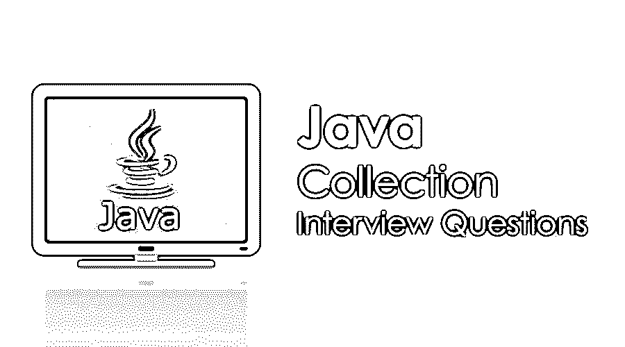

# Java 集合面试问题

> 原文：<https://www.educba.com/java-collection-interview-questions/>

## Java 集合面试问题介绍

如果是找 Java 集合相关的工作，需要准备 2022 年 Java 集合面试题。根据不同的职位描述，每次面试都是不同的。在这里，我们准备了重要的 Java 合集面试问答，帮助你面试成功。

java 集合框架是正确学习核心 Java 的关键章节之一。这是因为 Java 集合包含了很多 java.util 包下的接口和类。所有这些接口和类在任何基于 java 的应用程序中都有巨大的用途。这篇 2022 Java 集合面试问题的文章将呈现 10 个最重要和最常被问到的 Java 集合面试问题。

<small>网页开发、编程语言、软件测试&其他</small>

### 第 1 部分–Java 集合面试问题(基础)

第一部分涵盖了基本的 Java 集合面试问题和答案。

#### Q1。近几年来，Java 已经推出了一个不同的版本。对于 Java 来说，集合框架总是一个突出的包，所以 Java 的每个版本都有一些关键特性，特别是在集合框架上。请解释一下 Java 8 版本的集合框架有哪些新特性？

**答案:**

Java 8 版本已经带来了 Java 集合框架中的一些关键或主要变化:

*   【Java 的流 API:用于支持一些顺序和并行处理。
*   **引入专门针对迭代器接口的 for each 方法:**这是当开发人员要使用迭代器从任何集合接口获取数据时的默认方法之一。Java 8 引入了 Lambda 表达式的关键特性之一，因为它的参数；在迭代器接口上使用将非常容易。
*   **杂集 API:** 框架杂集的情况下引入了很多方法。方法是为每个剩余的，替换所有的，计算机，合并专门引入一个迭代器接口。

#### Q2。详细说明在 Java 应用中使用的 Java 集合框架。提供更多关于 Java 应用程序中集合框架所提供的确切好处的细节？

**答案:**

从 java 引入这个包的那天起，集合框架就是一个备受关注的包。最初，它只持有一些遗留接口，如 Vector、Hashtable、Stack 和 Array，这些接口在 java 的漫长发展过程中已经过时了。java 上层版本引入了许多非常面向特性的接口，并为任何种类的 java 编程提供了一些关键角色。实现和定义这些接口的算法对于任何 Java 开发人员在执行的任何时候都非常有用。Java Collection 已经与这些方法一起工作了很长时间，并且提供了许多并发集合类来确保各种操作的线程安全。

收集框架的优势定义如下:

*   通过实现定义的集合类减少了开发工作量。
*   代码质量一直在提高，包括性能。
*   代码维护的工作量一直在减少。
*   提高代码的可重用性并维护适当的互操作性。

#### Q3。解释从 Java 4 版本开始使用集合接口和类，使用集合框架通用版本的好处？

**答案:**

Java 1.5 附带了一些关键的功能，特别是在集合框架中，它增强了一些通用接口的遗留特性。它介绍了一些在编译时实际提供 ClassCastException 的方法。最初，相同的异常在运行时出现，没有任何先前的定义。但在编译的情况下，永远无法识别。如果开发人员提到一个集合接口对象类型，它将永远不会接受任何其他引用。如果开发人员错误地做了同样的事情，那么它将在编译时抛出 ClasCastExpection。

#### Q4。在现有 java 应用程序的集合框架设计的情况下，已经定义了许多接口。请解释集合框架中可用的一些流行的关键接口，并解释使用它们的效用？

**答案:**

下面定义了一些关键接口，这些接口可用于收集框架:

*   **集合:**是整个集合层次结构的根接口之一。从开发的角度来看，它实际上包含了一组可用的对象，称为元素。通常，这个集合接口的任何类型的直接实现对于 Java 平台都是不可用的。
*   **Set:** 其中一个关键集合接口扩展了集合接口，不包含任何重复元素。
*   **List:** 其中一个有序集合扩展了集合接口，接受重复元素，这是 set 和 List 的关键区别。
*   **Map:** Map 也是一个用键值对保存数据的接口。它从不包含任何重复的键值。

#### Q5。集合框架是否能够扩展 Java 核心包中两个非常关键的接口，一个是可克隆的，另一个是可序列化的？请解释你对上述问题的回答的一些细节？

**答案:**

在集合接口上克隆和序列化是不可能的，因为集合接口可以有多个接口。因此，在那些特定的接口上，存在一些复制值或唯一值的可能性。所以克隆或序列化是不可能的。但是为一些公共接口定义了一些特定的方法，这些接口可以使用自己的克隆方法来实现这一点。

### 第 2 部分–Java 集合面试问题(高级)

现在让我们来看看高级 Java 集合面试问答。

#### Q6。在集合框架中，开发者经常使用的一个关键接口叫做 Map。不幸的是，但令人惊讶的是，Map 接口没有直接扩展集合框架。你能解释一下为什么没有延期吗？

**答案:**

map 接口是集合框架的关键接口之一，但是它从不扩展集合接口，因为 Map 总是以键值对的形式维护数据，这从不确保存储多个元素，这是集合框架的关键特性之一。

#### Q7。迭代器是集合框架中经常使用的重要接口之一。请解释它什么时候有用，它的确切用途是什么？

**答案:**

迭代器是迭代任何活动集合中可用数据的流行接口之一。每个集合都有一个特定的方法名迭代器，它返回迭代器对象的引用。两个关键方法有 Next 和 Next，确保获取最后一行并使用相同的。

#### Q8。集合框架中用于从集合中读取和使用数据的两个关键接口是迭代器和枚举器。请详细解释集合框架中可用的循环方法之间的区别？

**答案:**

枚举是关键的迭代特性之一，特别是用于遗留类。这是因为它总是比普通的迭代器接口快得多。但是迭代器使用起来总是更安全，因为它确保了迭代集合对象的线程安全。

#### Q9。集合框架的每个接口都包含一个特定的方法调用 add，用于在接口中添加一些组件值。但是在迭代器接口的例子中，没有任何类型的 add 方法，你能解释为什么没有吗？

**答案:**

迭代器接口主要用于对任何活动集合持有的数据进行迭代。因此，它不会添加任何类型的元素，也不会对迭代顺序提供任何保证。

#### Q10。解释集合框架的两个关键接口 Iterator 和 ListIterator 的区别？

**答案:**

Iterator 和 Listiterator 都用于迭代集合数据，并帮助开发人员处理多个集合元素。

*   迭代器适用于所有集合，但 ListIteraot 仅适用于列表接口。
*   迭代器只能保证向前遍历，但是 Listiterator 也可以向前和向后遍历。

### 推荐文章

这是 Java 集合面试问题指南。这里我们列出了最有用的 10 组面试问题，这样求职者就能轻松应对面试。您也可以阅读以下文章，了解更多信息——

1.  [活动目录面试问题](https://www.educba.com/active-directory-interview-questions/)
2.  [Oracle PL/SQL 面试问题](https://www.educba.com/oracle-pl-sql-interview-questions/)
3.  [多线程面试问题 C++](https://www.educba.com/multithreading-interview-questions-c-plus-plus/)
4.  [网络技术面试问题](https://www.educba.com/web-technology-interview-questions/)

